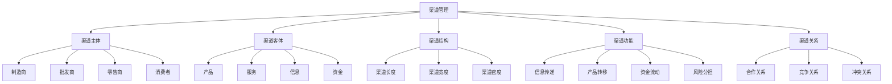
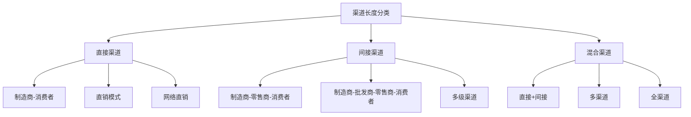
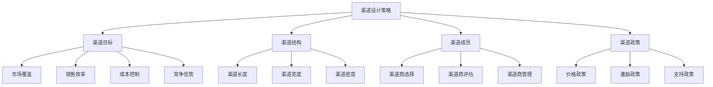
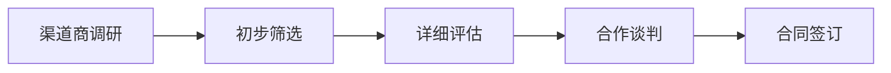
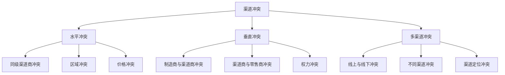
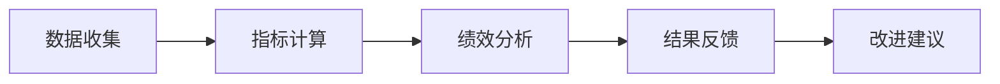

# 渠道管理

## 渠道管理概述

### 定义与本质
**渠道管理**：企业通过建立、维护和优化销售渠道，实现产品从生产者到消费者的有效传递，提升销售效率和市场覆盖的管理活动。

### 渠道要素模型

## 渠道理论

### 渠道理论发展
| 理论 | 代表人物 | 核心观点 | 应用价值 |
|------|----------|----------|----------|
| **渠道结构理论** | 斯特恩 | 渠道结构设计 | 渠道架构基础 |
| **渠道行为理论** | 斯特恩 | 渠道成员行为 | 渠道关系管理 |
| **渠道冲突理论** | 斯特恩 | 渠道冲突管理 | 冲突解决策略 |
| **渠道权力理论** | 斯特恩 | 渠道权力分配 | 权力平衡策略 |

### 渠道类型
#### 1. 按渠道长度分类

#### 2. 按渠道宽度分类
| 渠道类型 | 特点 | 优势 | 劣势 | 适用场景 |
|----------|------|------|------|----------|
| **密集分销** | 渠道密度高、覆盖面广 | 市场覆盖广、便利性强 | 控制难度大、成本高 | 日用品、快速消费品 |
| **选择性分销** | 渠道密度适中、质量可控 | 控制力强、成本适中 | 覆盖面有限 | 耐用品、品牌产品 |
| **独家分销** | 渠道密度低、排他性强 | 控制力强、品牌形象好 | 覆盖面小、风险集中 | 奢侈品、专业产品 |

### 渠道功能
#### 1. 基本功能
- **信息传递**：市场信息、产品信息传递
- **产品转移**：产品从生产者到消费者转移
- **资金流动**：资金在渠道中的流动
- **风险分担**：渠道风险的分担

#### 2. 增值功能
- **产品加工**：产品包装、分装、组装
- **仓储物流**：产品储存、运输、配送
- **销售服务**：销售咨询、售后服务
- **市场开发**：市场开拓、客户开发

## 渠道策略

### 1. 渠道设计策略
#### 策略要素

#### 设计原则
- **市场导向**：以市场需求为导向
- **效率优先**：追求渠道效率最大化
- **成本控制**：控制渠道成本
- **风险控制**：控制渠道风险

### 2. 渠道选择策略
#### 选择标准
| 标准类型 | 具体内容 | 权重 | 评估方法 |
|----------|----------|------|----------|
| **市场覆盖** | 覆盖范围、覆盖质量 | 高 | 市场调研、数据分析 |
| **销售能力** | 销售团队、销售经验 | 高 | 业绩分析、能力评估 |
| **财务状况** | 资金实力、信用状况 | 中 | 财务分析、信用调查 |
| **合作意愿** | 合作态度、配合程度 | 中 | 沟通交流、合作历史 |

#### 选择流程

### 3. 渠道激励策略
#### 激励类型
- **经济激励**：返利、奖金、提成
- **非经济激励**：培训、支持、荣誉
- **长期激励**：股权、期权、长期合作
- **短期激励**：促销、活动、奖励

#### 激励原则
- **公平性**：激励公平合理
- **有效性**：激励效果明显
- **可持续性**：激励可持续
- **成本效益**：成本效益平衡

### 4. 渠道控制策略
#### 控制类型
- **事前控制**：准入控制、标准控制
- **事中控制**：过程控制、行为控制
- **事后控制**：结果控制、绩效控制

#### 控制方法
- **合同控制**：合同条款控制
- **价格控制**：价格政策控制
- **区域控制**：区域划分控制
- **品牌控制**：品牌形象控制

## 渠道关系管理

### 关系类型
#### 1. 合作关系
- **战略合作**：长期战略合作关系
- **业务合作**：具体业务合作关系
- **技术合作**：技术交流合作关系
- **市场合作**：市场开发合作关系

#### 2. 竞争关系
- **渠道竞争**：渠道间竞争关系
- **产品竞争**：产品间竞争关系
- **价格竞争**：价格竞争关系
- **服务竞争**：服务竞争关系

#### 3. 冲突关系

### 冲突管理
#### 1. 冲突预防
- **明确职责**：明确各方职责
- **建立规则**：建立合作规则
- **沟通机制**：建立沟通机制
- **监督机制**：建立监督机制

#### 2. 冲突解决
- **协商解决**：通过协商解决
- **调解解决**：通过调解解决
- **仲裁解决**：通过仲裁解决
- **法律解决**：通过法律解决

#### 3. 冲突转化
- **竞争转化**：将冲突转化为竞争
- **合作转化**：将冲突转化为合作
- **创新转化**：将冲突转化为创新
- **价值转化**：将冲突转化为价值

## 渠道绩效管理

### 绩效指标
#### 1. 销售指标
| 指标类型 | 具体指标 | 计算方法 | 评估意义 |
|----------|----------|----------|----------|
| **销售额** | 渠道销售额 | 实际销售额 | 销售贡献度 |
| **销售增长率** | 销售增长幅度 | (当期-上期)/上期×100% | 销售增长趋势 |
| **市场份额** | 渠道市场份额 | 渠道销售额/总销售额×100% | 市场地位 |
| **客户数量** | 渠道客户数量 | 实际客户数量 | 客户覆盖度 |

#### 2. 效率指标
- **渠道效率**：渠道运营效率
- **库存周转**：库存周转率
- **资金周转**：资金周转率
- **人员效率**：人员工作效率

#### 3. 质量指标
- **客户满意度**：客户满意度
- **服务质量**：服务质量水平
- **品牌形象**：品牌形象维护
- **合规性**：合规经营情况

### 绩效评估
#### 1. 评估方法
- **定量评估**：数据统计分析
- **定性评估**：主观评价分析
- **对比评估**：横向纵向对比
- **综合评估**：多维度综合评估

#### 2. 评估流程

## 渠道发展趋势

### 数字化趋势
#### 趋势特征
- **数字化渠道**：数字化渠道建设
- **数据驱动**：数据驱动渠道管理
- **智能化**：智能化渠道运营
- **个性化**：个性化渠道服务

#### 实施要点
- 数字化工具应用
- 数据收集分析
- 智能化系统建设
- 个性化服务提供

### 全渠道趋势
#### 趋势特征
- **线上线下融合**：O2O模式
- **全渠道统一**：统一渠道管理
- **渠道协同**：渠道间协同
- **体验一致**：一致的用户体验

#### 实施要点
- 线上线下整合
- 全渠道策略统一
- 渠道协同机制
- 用户体验优化

### 可持续发展趋势
#### 趋势特征
- **绿色渠道**：环保渠道建设
- **社会责任**：社会责任承担
- **可持续发展**：可持续发展战略
- **价值共创**：价值共创模式

#### 实施要点
- 绿色渠道建设
- 社会责任实践
- 可持续发展战略
- 价值共创模式

## 渠道管理案例

### 成功案例：苹果渠道管理
#### 管理策略
- **直营+授权**：直营店+授权店模式
- **体验优先**：用户体验优先
- **品牌统一**：品牌形象统一
- **服务标准**：服务标准统一

#### 实施要点
- 直营店建设
- 授权店管理
- 用户体验优化
- 品牌形象维护

#### 成功因素
- 强大的品牌影响力
- 优质的产品体验
- 统一的品牌形象
- 完善的服务体系

### 失败案例：渠道管理失败
#### 问题分析
- 渠道冲突严重
- 管理标准不一
- 服务质量参差
- 品牌形象受损

#### 改进建议
- 解决渠道冲突
- 统一管理标准
- 提升服务质量
- 维护品牌形象

## 实践应用

### 渠道管理实施步骤
1. **渠道分析**：分析渠道现状
2. **渠道设计**：设计渠道结构
3. **渠道选择**：选择渠道成员
4. **渠道建设**：建设渠道体系
5. **渠道管理**：管理渠道运营
6. **渠道优化**：优化渠道效率
7. **绩效评估**：评估渠道绩效
8. **持续改进**：持续改进优化

### 渠道管理最佳实践
- **战略导向**：以战略为导向
- **市场导向**：以市场为导向
- **效率优先**：追求效率最大化
- **关系管理**：重视关系管理
- **持续优化**：持续优化改进

---

**相关链接**：
- [[01-广告策略|广告策略]]
- [[02-公关策略|公关策略]]
- [[03-促销策略|促销策略]]
- [[05-零售营销|零售营销]]
- [[03-营销理论框架/01-经典营销理论/01-4P营销理论|4P营销理论]]
