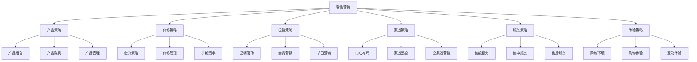
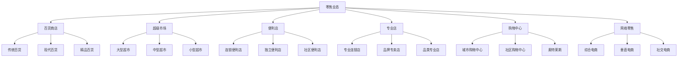
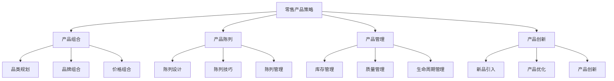
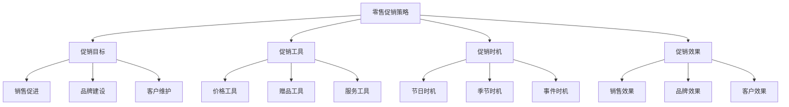

# 零售营销

## 零售营销概述

### 定义与本质
**零售营销**：零售商通过产品组合、价格策略、促销活动、服务体验等方式，吸引消费者购买，实现销售目标的营销活动。

### 零售营销要素

## 零售理论

### 零售理论发展
| 理论 | 代表人物 | 核心观点 | 应用价值 |
|------|----------|----------|----------|
| **零售轮转理论** | 麦克奈尔 | 零售业态轮转发展 | 零售业态选择 |
| **零售生命周期理论** | 戴维森 | 零售业态生命周期 | 零售战略规划 |
| **零售进化理论** | 吉斯特 | 零售业态进化发展 | 零售创新策略 |
| **零售环境理论** | 霍华德 | 零售环境影响 | 零售环境分析 |

### 零售业态分类
#### 1. 按经营方式分类

#### 2. 按服务方式分类
| 业态类型 | 特点 | 优势 | 劣势 | 适用场景 |
|----------|------|------|------|----------|
| **自助服务** | 消费者自主选择 | 成本低、效率高 | 服务体验差 | 标准化产品 |
| **有限服务** | 部分服务提供 | 成本适中、体验较好 | 服务不全面 | 一般消费品 |
| **完全服务** | 全方位服务提供 | 体验好、满意度高 | 成本高、效率低 | 高端产品 |

### 零售环境分析
#### 1. 宏观环境
- **经济环境**：经济发展水平、消费能力
- **社会环境**：人口结构、消费习惯
- **技术环境**：技术进步、数字化发展
- **政策环境**：政策支持、法规要求

#### 2. 微观环境
- **消费者**：消费需求、消费行为
- **供应商**：供应商关系、供应链管理
- **竞争对手**：竞争格局、竞争策略
- **内部环境**：企业资源、企业能力

## 零售营销策略

### 1. 产品策略
#### 策略要素

#### 实施要点
- **产品组合**：合理的产品组合
- **产品陈列**：有效的产品陈列
- **产品管理**：科学的产品管理
- **产品创新**：持续的产品创新

### 2. 价格策略
#### 策略类型
- **成本导向定价**：基于成本定价
- **竞争导向定价**：基于竞争定价
- **需求导向定价**：基于需求定价
- **价值导向定价**：基于价值定价

#### 定价方法
| 定价方法 | 特点 | 适用场景 | 实施要点 |
|----------|------|----------|----------|
| **成本加成法** | 成本+利润 | 标准化产品 | 成本控制、利润设定 |
| **竞争定价法** | 参考竞争价格 | 竞争激烈产品 | 竞争分析、价格调整 |
| **需求定价法** | 基于需求弹性 | 差异化产品 | 需求分析、弹性测算 |
| **价值定价法** | 基于价值感知 | 高价值产品 | 价值分析、感知提升 |

### 3. 促销策略
#### 促销类型
- **价格促销**：折扣、降价、特价
- **赠品促销**：买赠、满赠、抽奖
- **会员促销**：会员价、积分、专享
- **节日促销**：节日特价、节日活动

#### 促销策略

### 4. 服务策略
#### 服务类型
- **售前服务**：咨询、体验、试用
- **售中服务**：导购、包装、支付
- **售后服务**：退换货、维修、保养

#### 服务策略
- **服务标准化**：服务流程标准化
- **服务个性化**：个性化服务提供
- **服务创新**：服务方式创新
- **服务质量**：服务质量提升

### 5. 体验策略
#### 体验要素
- **购物环境**：店面环境、氛围营造
- **购物流程**：购物流程优化
- **互动体验**：互动活动、体验项目
- **情感体验**：情感连接、情感共鸣

#### 体验策略
- **环境设计**：购物环境设计
- **流程优化**：购物流程优化
- **互动设计**：互动体验设计
- **情感设计**：情感体验设计

## 零售营销实施

### 门店营销
#### 1. 门店布局
- **动线设计**：顾客动线设计
- **区域划分**：功能区域划分
- **陈列布局**：产品陈列布局
- **环境营造**：购物环境营造

#### 2. 门店运营
- **人员管理**：员工管理、培训
- **库存管理**：库存控制、补货
- **销售管理**：销售目标、销售技巧
- **客户管理**：客户关系、客户服务

### 全渠道营销
#### 1. 线上线下融合
- **O2O模式**：线上线下融合
- **全渠道统一**：统一营销策略
- **数据共享**：渠道数据共享
- **体验一致**：一致的用户体验

#### 2. 数字化营销
- **数字化工具**：数字化营销工具
- **数据分析**：营销数据分析
- **精准营销**：精准目标营销
- **个性化服务**：个性化服务提供

### 会员营销
#### 1. 会员体系
- **会员等级**：会员等级设计
- **会员权益**：会员权益设计
- **积分机制**：积分获取和使用
- **会员服务**：会员专属服务

#### 2. 会员运营
- **会员获取**：新会员获取
- **会员维护**：会员关系维护
- **会员激活**：沉睡会员激活
- **会员价值**：会员价值提升

## 零售营销案例

### 成功案例：宜家零售营销
#### 营销策略
- **体验营销**：体验式购物
- **价格策略**：性价比策略
- **产品策略**：产品组合策略
- **服务策略**：自助服务策略

#### 实施要点
- 体验式购物环境
- 性价比产品策略
- 丰富产品组合
- 自助服务模式

#### 成功因素
- 独特的购物体验
- 优质的产品质量
- 合理的价格策略
- 完善的服务体系

### 失败案例：零售营销失败
#### 问题分析
- 产品策略不当
- 价格策略失误
- 服务体验差
- 营销策略混乱

#### 改进建议
- 优化产品策略
- 调整价格策略
- 提升服务体验
- 统一营销策略

## 零售营销趋势

### 数字化趋势
#### 趋势特征
- **数字化门店**：数字化门店建设
- **智能零售**：智能化零售运营
- **数据驱动**：数据驱动营销
- **个性化服务**：个性化服务提供

#### 实施要点
- 数字化工具应用
- 智能化系统建设
- 数据收集分析
- 个性化服务设计

### 体验化趋势
#### 趋势特征
- **体验营销**：体验式营销
- **场景营销**：场景化营销
- **社交营销**：社交化营销
- **内容营销**：内容化营销

#### 实施要点
- 体验设计优化
- 场景营销创新
- 社交传播利用
- 内容创作提升

### 可持续发展趋势
#### 趋势特征
- **绿色零售**：环保零售理念
- **社会责任**：社会责任承担
- **可持续发展**：可持续发展战略
- **价值共创**：价值共创模式

#### 实施要点
- 绿色理念融入
- 社会责任实践
- 可持续发展战略
- 价值共创模式

## 实践应用

### 零售营销实施步骤
1. **市场分析**：分析零售市场
2. **策略制定**：制定营销策略
3. **门店设计**：设计门店布局
4. **产品管理**：管理产品组合
5. **价格策略**：制定价格策略
6. **促销活动**：策划促销活动
7. **服务优化**：优化服务质量
8. **效果评估**：评估营销效果

### 零售营销最佳实践
- **顾客导向**：以顾客为中心
- **体验优先**：体验优先策略
- **数据驱动**：数据驱动决策
- **持续创新**：持续创新改进
- **价值创造**：价值创造导向

---

**相关链接**：
- [[01-广告策略|广告策略]]
- [[02-公关策略|公关策略]]
- [[03-促销策略|促销策略]]
- [[04-渠道管理|渠道管理]]
- [[03-营销理论框架/01-经典营销理论/01-4P营销理论|4P营销理论]]
