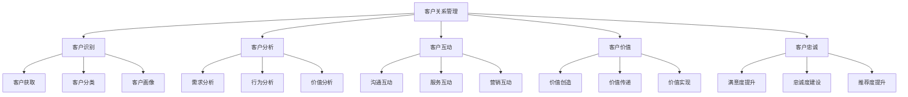
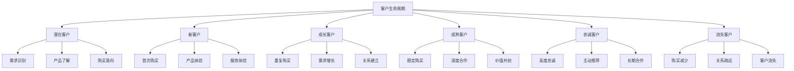
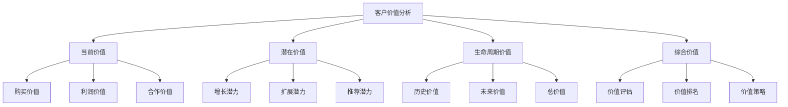
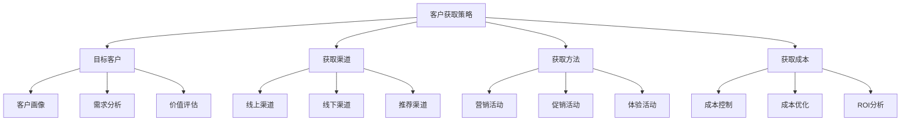
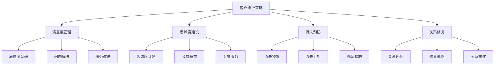
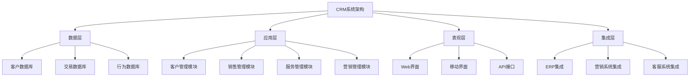
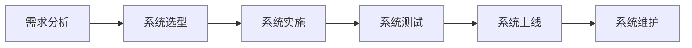

# 客户关系管理

## 客户关系管理概述

### 定义与本质
**客户关系管理（CRM）**：通过系统性的方法和技术，建立、维护和优化与客户的关系，提升客户满意度和忠诚度，实现企业价值最大化的管理活动。

### CRM要素模型

## CRM理论

### CRM理论发展
| 理论 | 代表人物 | 核心观点 | 应用价值 |
|------|----------|----------|----------|
| **关系营销理论** | 贝里 | 建立长期客户关系 | CRM理论基础 |
| **客户价值理论** | 伍德拉夫 | 客户价值创造和传递 | 价值管理基础 |
| **客户忠诚理论** | 奥利弗 | 客户忠诚度建设 | 忠诚度管理基础 |
| **客户生命周期理论** | 德怀尔 | 客户生命周期管理 | 生命周期管理基础 |

### 客户生命周期
#### 生命周期阶段

### 客户价值模型
#### 1. 客户价值构成
| 价值类型 | 内容 | 重要性 | 管理重点 |
|----------|------|--------|----------|
| **经济价值** | 购买金额、利润贡献 | 高 | 价值提升 |
| **推荐价值** | 推荐新客户、口碑传播 | 中 | 推荐激励 |
| **信息价值** | 需求信息、市场信息 | 中 | 信息收集 |
| **合作价值** | 深度合作、价值共创 | 高 | 合作深化 |

#### 2. 客户价值分析

## CRM策略

### 1. 客户获取策略
#### 策略要素

#### 实施要点
- **目标客户定位**：精准定位目标客户
- **多渠道获取**：多渠道客户获取
- **成本效益优化**：优化获取成本效益
- **质量保证**：保证客户质量

### 2. 客户发展策略
#### 策略类型
- **交叉销售**：相关产品推荐
- **向上销售**：高端产品推荐
- **深度销售**：深度需求挖掘
- **扩展销售**：新需求开发

#### 实施要点
- **需求挖掘**：深度挖掘客户需求
- **产品推荐**：精准产品推荐
- **价值提升**：提升客户价值
- **关系深化**：深化客户关系

### 3. 客户维护策略
#### 维护类型
- **主动维护**：主动客户维护
- **被动维护**：被动客户维护
- **预防维护**：预防客户流失
- **恢复维护**：恢复流失客户

#### 维护策略

### 4. 客户价值提升策略
#### 提升方法
- **产品升级**：产品功能升级
- **服务升级**：服务质量升级
- **体验升级**：用户体验升级
- **价值升级**：价值主张升级

#### 实施要点
- **价值分析**：分析客户价值
- **提升计划**：制定提升计划
- **实施执行**：执行提升计划
- **效果评估**：评估提升效果

## CRM系统

### 系统架构
#### 1. 技术架构

#### 2. 功能模块
- **客户管理**：客户信息管理
- **销售管理**：销售过程管理
- **服务管理**：客户服务管理
- **营销管理**：营销活动管理

### 系统实施
#### 1. 实施步骤

#### 2. 实施要点
- **需求分析**：深入分析业务需求
- **系统选型**：选择合适系统
- **实施管理**：有效实施管理
- **培训支持**：提供培训支持

## CRM实施

### 实施策略
#### 1. 分阶段实施
- **第一阶段**：基础功能实施
- **第二阶段**：高级功能实施
- **第三阶段**：集成功能实施
- **第四阶段**：优化功能实施

#### 2. 实施管理
- **项目管理**：有效项目管理
- **变更管理**：变更管理控制
- **质量管理**：实施质量管理
- **风险管理**：实施风险管理

### 成功因素
#### 1. 内部因素
| 因素类型 | 具体内容 | 重要性 | 影响程度 |
|----------|----------|--------|----------|
| **高层支持** | 高层领导支持 | 高 | 直接影响 |
| **员工参与** | 员工积极参与 | 高 | 直接影响 |
| **流程优化** | 业务流程优化 | 中 | 间接影响 |
| **数据质量** | 数据质量保证 | 中 | 间接影响 |

#### 2. 外部因素
- **系统供应商**：系统供应商支持
- **实施顾问**：实施顾问指导
- **技术支持**：技术支持服务
- **培训服务**：培训服务提供

## CRM案例

### 成功案例：亚马逊CRM
#### 策略特点
- **数据驱动**：数据驱动客户管理
- **个性化服务**：个性化客户服务
- **全渠道整合**：全渠道客户整合
- **持续优化**：持续系统优化

#### 实施要点
- 数据收集分析
- 个性化推荐
- 全渠道整合
- 持续优化改进

#### 成功因素
- 强大的技术实力
- 丰富的数据资源
- 个性化服务能力
- 持续创新精神

### 失败案例：CRM实施失败
#### 问题分析
- 需求分析不足
- 系统选型不当
- 实施管理不力
- 用户接受度低

#### 改进建议
- 深入需求分析
- 合理系统选型
- 加强实施管理
- 提高用户接受度

## CRM趋势

### 数字化趋势
#### 趋势特征
- **AI驱动**：AI驱动客户管理
- **大数据**：大数据客户分析
- **云计算**：云计算CRM系统
- **移动化**：移动化CRM应用

#### 实施要点
- AI技术应用
- 大数据分析
- 云计算部署
- 移动化开发

### 智能化趋势
#### 趋势特征
- **智能推荐**：智能产品推荐
- **智能客服**：智能客户服务
- **智能分析**：智能数据分析
- **智能预测**：智能行为预测

#### 实施要点
- 智能推荐系统
- 智能客服系统
- 智能分析工具
- 智能预测模型

## 实践应用

### CRM实施步骤
1. **需求分析**：分析业务需求
2. **系统选型**：选择CRM系统
3. **实施规划**：制定实施计划
4. **系统实施**：实施CRM系统
5. **系统测试**：测试系统功能
6. **系统上线**：系统正式上线
7. **培训支持**：提供培训支持
8. **持续优化**：持续优化改进

### CRM最佳实践
- **客户中心**：以客户为中心
- **数据驱动**：数据驱动决策
- **流程优化**：优化业务流程
- **持续改进**：持续改进优化
- **价值创造**：创造客户价值

---

**相关链接**：
- [[02-客户生命周期管理|客户生命周期管理]]
- [[03-客户价值分析|客户价值分析]]
- [[04-客户忠诚度管理|客户忠诚度管理]]
- [[03-营销理论框架/02-战略营销理论/01-关系营销理论|关系营销理论]]
- [[06-营销效果评估/02-数据分析/01-营销数据分析|营销数据分析]]
