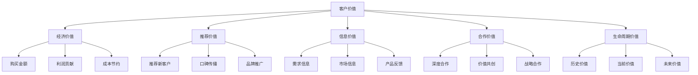
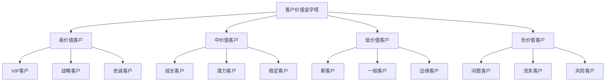
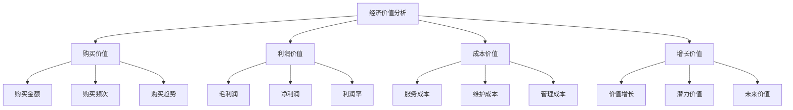
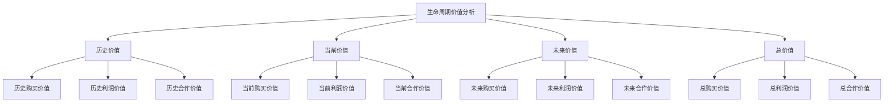
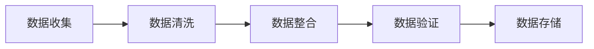

# 客户价值分析

## 客户价值分析概述

### 定义与本质
**客户价值分析**：通过系统性的方法和技术，分析客户的经济价值、推荐价值、信息价值和合作价值，为客户管理决策提供数据支持的分析活动。

### 客户价值构成

## 客户价值理论

### 价值理论发展
| 理论 | 代表人物 | 核心观点 | 应用价值 |
|------|----------|----------|----------|
| **客户价值理论** | 伍德拉夫 | 客户价值创造和传递 | 价值管理基础 |
| **价值主张理论** | 奥斯特瓦德 | 价值主张设计 | 价值创造基础 |
| **价值共创理论** | 普拉哈拉德 | 客户价值共创 | 合作价值基础 |
| **客户生命周期价值理论** | 德怀尔 | 客户生命周期价值 | 长期价值基础 |

### 价值分析模型
#### 1. 客户价值金字塔

#### 2. RFM分析模型
| 维度 | 含义 | 计算方法 | 分析意义 |
|------|------|----------|----------|
| **R (Recency)** | 最近购买时间 | 距离上次购买的天数 | 客户活跃度 |
| **F (Frequency)** | 购买频次 | 一定时间内的购买次数 | 客户忠诚度 |
| **M (Monetary)** | 购买金额 | 一定时间内的购买金额 | 客户价值度 |

### 价值分析方法
#### 1. 定量分析方法
- **统计分析**：描述性统计分析
- **回归分析**：回归关系分析
- **聚类分析**：客户聚类分析
- **预测分析**：价值预测分析

#### 2. 定性分析方法
- **深度访谈**：客户深度访谈
- **焦点小组**：焦点小组讨论
- **专家评估**：专家评估分析
- **案例研究**：案例研究分析

## 客户价值分析

### 1. 经济价值分析
#### 分析维度

#### 分析指标
| 指标类型 | 具体指标 | 计算方法 | 分析意义 |
|----------|----------|----------|----------|
| **购买指标** | 总购买金额、平均购买金额 | 统计计算 | 客户购买能力 |
| **利润指标** | 总利润、平均利润、利润率 | 利润计算 | 客户利润贡献 |
| **成本指标** | 服务成本、维护成本 | 成本计算 | 客户服务成本 |
| **增长指标** | 价值增长率、潜力价值 | 趋势分析 | 客户价值趋势 |

#### 分析应用
- **客户分层**：基于经济价值客户分层
- **资源配置**：基于价值配置资源
- **策略制定**：制定差异化策略
- **效果评估**：评估管理效果

### 2. 推荐价值分析
#### 分析维度
- **推荐数量**：推荐新客户数量
- **推荐质量**：推荐客户质量
- **推荐效果**：推荐转化效果
- **推荐价值**：推荐产生的价值

#### 分析指标
| 指标类型 | 具体指标 | 计算方法 | 分析意义 |
|----------|----------|----------|----------|
| **推荐数量** | 推荐客户数、推荐成功率 | 统计计算 | 推荐活跃度 |
| **推荐质量** | 推荐客户价值、转化率 | 质量评估 | 推荐质量水平 |
| **推荐效果** | 推荐转化率、推荐价值 | 效果计算 | 推荐效果评估 |
| **推荐价值** | 推荐产生的总价值 | 价值计算 | 推荐价值贡献 |

#### 分析应用
- **推荐激励**：设计推荐激励措施
- **推荐管理**：管理推荐活动
- **推荐优化**：优化推荐效果
- **推荐价值**：评估推荐价值

### 3. 信息价值分析
#### 分析维度
- **需求信息**：客户需求信息
- **市场信息**：市场趋势信息
- **产品信息**：产品反馈信息
- **竞争信息**：竞争环境信息

#### 分析指标
| 指标类型 | 具体指标 | 计算方法 | 分析意义 |
|----------|----------|----------|----------|
| **信息质量** | 信息准确性、完整性 | 质量评估 | 信息价值水平 |
| **信息数量** | 信息提供量、信息频率 | 统计计算 | 信息贡献度 |
| **信息效果** | 信息应用效果、决策支持 | 效果评估 | 信息应用价值 |
| **信息价值** | 信息产生的总价值 | 价值计算 | 信息价值贡献 |

#### 分析应用
- **信息收集**：收集客户信息
- **信息分析**：分析信息价值
- **信息应用**：应用信息决策
- **信息管理**：管理信息资产

### 4. 合作价值分析
#### 分析维度
- **合作深度**：合作深度程度
- **合作广度**：合作范围广度
- **合作创新**：合作创新价值
- **合作战略**：战略合作价值

#### 分析指标
| 指标类型 | 具体指标 | 计算方法 | 分析意义 |
|----------|----------|----------|----------|
| **合作深度** | 合作项目数、合作金额 | 深度评估 | 合作深度水平 |
| **合作广度** | 合作领域数、合作范围 | 广度评估 | 合作广度水平 |
| **合作创新** | 创新项目数、创新价值 | 创新评估 | 合作创新价值 |
| **合作战略** | 战略合作价值、长期价值 | 战略评估 | 战略合作价值 |

#### 分析应用
- **合作策略**：制定合作策略
- **合作管理**：管理合作关系
- **合作优化**：优化合作效果
- **合作价值**：评估合作价值

### 5. 生命周期价值分析
#### 分析维度

#### 分析指标
| 指标类型 | 具体指标 | 计算方法 | 分析意义 |
|----------|----------|----------|----------|
| **历史价值** | 历史总价值、历史平均价值 | 历史统计 | 历史价值贡献 |
| **当前价值** | 当前年度价值、当前趋势 | 当前分析 | 当前价值水平 |
| **未来价值** | 预测价值、潜力价值 | 预测分析 | 未来价值潜力 |
| **总价值** | 生命周期总价值、价值排名 | 综合计算 | 客户总价值 |

#### 分析应用
- **价值预测**：预测客户未来价值
- **价值管理**：管理客户生命周期价值
- **价值优化**：优化客户价值结构
- **价值决策**：基于价值做出决策

## 价值分析工具

### 分析工具
#### 1. 统计分析工具
- **Excel**：基础统计分析
- **SPSS**：专业统计分析
- **R语言**：高级统计分析
- **Python**：数据科学分析

#### 2. 可视化工具
- **Tableau**：数据可视化
- **Power BI**：商业智能分析
- **Echarts**：图表可视化
- **D3.js**：交互式可视化

#### 3. 机器学习工具
- **Scikit-learn**：机器学习库
- **TensorFlow**：深度学习框架
- **PyTorch**：深度学习框架
- **XGBoost**：梯度提升算法

### 分析平台
#### 1. 商业智能平台
- **SAP BI**：企业级BI平台
- **Oracle BI**：Oracle BI平台
- **IBM Cognos**：IBM BI平台
- **Microsoft BI**：微软BI平台

#### 2. 客户分析平台
- **Salesforce Analytics**：Salesforce分析平台
- **HubSpot Analytics**：HubSpot分析平台
- **Adobe Analytics**：Adobe分析平台
- **Google Analytics**：Google分析平台

## 价值分析实施

### 实施步骤
#### 1. 数据准备

#### 2. 分析执行
- **描述性分析**：基础统计分析
- **探索性分析**：数据探索分析
- **预测性分析**：价值预测分析
- **规范性分析**：决策支持分析

#### 3. 结果应用
- **报告生成**：分析报告生成
- **决策支持**：决策支持提供
- **策略制定**：策略制定支持
- **效果评估**：效果评估支持

### 实施管理
#### 1. 项目管理
- **项目规划**：分析项目规划
- **进度控制**：项目进度控制
- **质量控制**：分析质量控制
- **风险管理**：项目风险管理

#### 2. 数据管理
- **数据质量**：数据质量管理
- **数据安全**：数据安全管理
- **数据治理**：数据治理管理
- **数据生命周期**：数据生命周期管理

## 价值分析案例

### 成功案例：亚马逊客户价值分析
#### 分析策略
- **数据驱动**：数据驱动价值分析
- **个性化**：个性化价值分析
- **实时分析**：实时价值分析
- **预测分析**：预测价值分析

#### 实施要点
- 大数据收集分析
- 个性化推荐算法
- 实时价值监测
- 预测模型应用

#### 成功因素
- 强大的技术实力
- 丰富的数据资源
- 先进的分析算法
- 持续的技术创新

### 失败案例：价值分析失败
#### 问题分析
- 数据质量差
- 分析方法不当
- 分析结果不准确
- 应用效果差

#### 改进建议
- 提升数据质量
- 改进分析方法
- 提高分析准确性
- 改善应用效果

## 价值分析趋势

### 数字化趋势
#### 趋势特征
- **大数据分析**：大数据价值分析
- **实时分析**：实时价值分析
- **云端分析**：云端价值分析
- **移动分析**：移动价值分析

#### 实施要点
- 大数据技术应用
- 实时分析系统
- 云端分析平台
- 移动分析应用

### 智能化趋势
#### 趋势特征
- **AI分析**：人工智能价值分析
- **机器学习**：机器学习价值分析
- **深度学习**：深度学习价值分析
- **自动化分析**：自动化价值分析

#### 实施要点
- AI技术应用
- 机器学习算法
- 深度学习模型
- 自动化分析系统

## 实践应用

### 价值分析实施步骤
1. **需求分析**：分析分析需求
2. **数据准备**：准备分析数据
3. **方法选择**：选择分析方法
4. **分析执行**：执行价值分析
5. **结果验证**：验证分析结果
6. **报告生成**：生成分析报告
7. **结果应用**：应用分析结果
8. **效果评估**：评估分析效果

### 价值分析最佳实践
- **数据质量**：保证数据质量
- **方法科学**：采用科学方法
- **结果准确**：确保结果准确
- **应用有效**：有效应用结果
- **持续改进**：持续改进优化

---

**相关链接**：
- [[01-客户关系管理|客户关系管理]]
- [[02-客户生命周期管理|客户生命周期管理]]
- [[04-客户忠诚度管理|客户忠诚度管理]]
- [[06-营销效果评估/02-数据分析/01-营销数据分析|营销数据分析]]
- [[06-营销效果评估/02-数据分析/02-客户数据分析|客户数据分析]]
