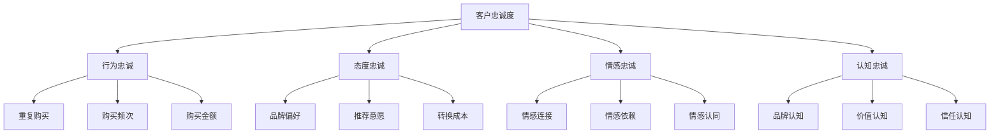
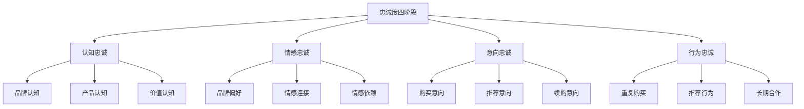
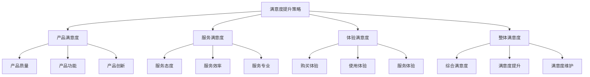
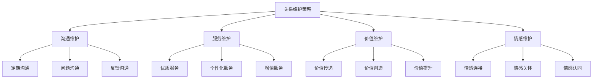
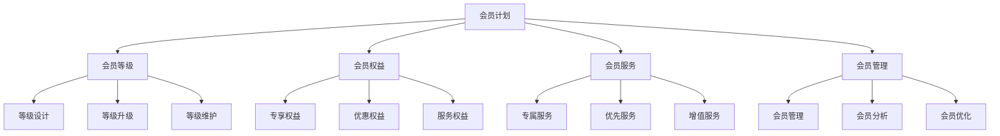
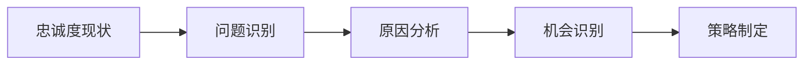

# 客户忠诚度管理

## 客户忠诚度概述

### 定义与本质
**客户忠诚度管理**：通过系统性的策略和方法，建立、维护和提升客户对企业的忠诚度，实现客户长期价值最大化的管理活动。

### 忠诚度构成要素

## 忠诚度理论

### 理论发展
| 理论 | 代表人物 | 核心观点 | 应用价值 |
|------|----------|----------|----------|
| **客户忠诚理论** | 奥利弗 | 忠诚度四阶段模型 | 忠诚度建设基础 |
| **关系营销理论** | 贝里 | 关系建立和维护 | 关系管理基础 |
| **客户满意度理论** | 奥利弗 | 满意度与忠诚度关系 | 满意度管理基础 |
| **转换成本理论** | 波特 | 转换成本对忠诚度影响 | 忠诚度维护基础 |

### 忠诚度层次模型
#### 1. 奥利弗四阶段模型

#### 2. 忠诚度类型
| 忠诚度类型 | 特征 | 驱动因素 | 管理策略 |
|------------|------|----------|----------|
| **价格忠诚** | 价格敏感、转换容易 | 价格优势 | 价格策略 |
| **便利忠诚** | 便利性导向、习惯性购买 | 便利性 | 便利性提升 |
| **品牌忠诚** | 品牌偏好、情感连接 | 品牌价值 | 品牌建设 |
| **关系忠诚** | 关系依赖、转换成本高 | 关系价值 | 关系维护 |

### 忠诚度影响因素
#### 1. 内部因素
- **产品质量**：产品质量水平
- **服务质量**：服务质量水平
- **品牌形象**：品牌形象认知
- **客户体验**：客户体验质量

#### 2. 外部因素
- **竞争环境**：竞争激烈程度
- **市场环境**：市场变化趋势
- **社会文化**：社会文化影响
- **经济环境**：经济环境变化

## 忠诚度管理策略

### 1. 满意度提升策略
#### 策略要素

#### 实施要点
- **质量保证**：保证产品质量
- **服务优化**：优化服务质量
- **体验提升**：提升客户体验
- **满意度监测**：持续监测满意度

### 2. 价值创造策略
#### 策略类型
- **产品价值**：产品价值创造
- **服务价值**：服务价值创造
- **体验价值**：体验价值创造
- **关系价值**：关系价值创造

#### 价值创造方法
| 方法类型 | 具体内容 | 实施要点 | 预期效果 |
|----------|----------|----------|----------|
| **产品创新** | 产品功能创新、产品设计创新 | 持续创新、用户参与 | 产品价值提升 |
| **服务升级** | 服务内容升级、服务方式升级 | 服务标准化、个性化 | 服务价值提升 |
| **体验优化** | 购买体验、使用体验、服务体验 | 体验设计、体验管理 | 体验价值提升 |
| **关系深化** | 合作关系、情感关系、信任关系 | 关系维护、关系发展 | 关系价值提升 |

### 3. 关系维护策略
#### 维护类型
- **主动维护**：主动关系维护
- **被动维护**：被动关系维护
- **预防维护**：预防关系恶化
- **恢复维护**：恢复受损关系

#### 维护策略

### 4. 转换成本策略
#### 成本类型
- **经济成本**：转换的经济成本
- **时间成本**：转换的时间成本
- **学习成本**：转换的学习成本
- **关系成本**：转换的关系成本

#### 策略实施
- **成本提高**：提高转换成本
- **价值锁定**：锁定客户价值
- **关系绑定**：绑定客户关系
- **习惯培养**：培养使用习惯

## 忠诚度计划

### 计划类型
#### 1. 积分计划
| 计划特点 | 实施要点 | 优势 | 劣势 |
|----------|----------|------|------|
| **积分获取** | 购买积分、行为积分 | 简单易理解 | 同质化严重 |
| **积分使用** | 积分兑换、积分抵扣 | 激励效果明显 | 成本控制难 |
| **积分管理** | 积分有效期、积分规则 | 管理相对简单 | 差异化不足 |

#### 2. 会员计划

#### 3. 推荐计划
- **推荐奖励**：推荐新客户奖励
- **推荐管理**：推荐活动管理
- **推荐效果**：推荐效果评估
- **推荐优化**：推荐计划优化

### 计划设计
#### 1. 设计原则
- **公平性**：计划公平合理
- **激励性**：有效激励客户
- **可持续性**：计划可持续
- **差异化**：差异化设计

#### 2. 设计要素
- **目标设定**：明确计划目标
- **规则设计**：设计参与规则
- **奖励设计**：设计奖励机制
- **管理设计**：设计管理机制

## 忠诚度测量

### 测量指标
#### 1. 行为指标
| 指标类型 | 具体指标 | 计算方法 | 分析意义 |
|----------|----------|----------|----------|
| **购买行为** | 重复购买率、购买频次 | 统计计算 | 行为忠诚度 |
| **推荐行为** | 推荐率、推荐成功率 | 行为统计 | 推荐忠诚度 |
| **续购行为** | 续购率、续购周期 | 行为分析 | 续购忠诚度 |
| **合作行为** | 合作深度、合作广度 | 行为评估 | 合作忠诚度 |

#### 2. 态度指标
- **品牌偏好**：品牌偏好程度
- **推荐意愿**：推荐意愿强度
- **转换意愿**：转换意愿程度
- **满意度**：客户满意度水平

#### 3. 情感指标
- **情感连接**：情感连接强度
- **情感依赖**：情感依赖程度
- **情感认同**：情感认同水平
- **情感忠诚**：情感忠诚程度

### 测量方法
#### 1. 定量测量
- **问卷调查**：忠诚度问卷调查
- **行为分析**：客户行为分析
- **数据分析**：忠诚度数据分析
- **统计测量**：统计方法测量

#### 2. 定性测量
- **深度访谈**：客户深度访谈
- **焦点小组**：焦点小组讨论
- **专家评估**：专家评估分析
- **案例研究**：案例研究分析

## 忠诚度管理实施

### 实施步骤
#### 1. 现状分析

#### 2. 策略实施
- **满意度提升**：实施满意度提升策略
- **价值创造**：实施价值创造策略
- **关系维护**：实施关系维护策略
- **忠诚度计划**：实施忠诚度计划

#### 3. 效果评估
- **指标监测**：监测忠诚度指标
- **效果评估**：评估管理效果
- **策略调整**：调整管理策略
- **持续优化**：持续优化改进

### 实施管理
#### 1. 组织管理
- **组织架构**：建立管理组织
- **职责分工**：明确职责分工
- **协调机制**：建立协调机制
- **激励机制**：建立激励机制

#### 2. 流程管理
- **管理流程**：设计管理流程
- **执行流程**：设计执行流程
- **监控流程**：设计监控流程
- **优化流程**：设计优化流程

## 忠诚度管理案例

### 成功案例：星巴克忠诚度管理
#### 管理策略
- **会员体系**：完善的会员体系
- **个性化服务**：个性化服务提供
- **体验优化**：持续体验优化
- **关系维护**：积极关系维护

#### 实施要点
- 会员等级设计
- 个性化推荐
- 体验持续优化
- 关系积极维护

#### 成功因素
- 强大的品牌影响力
- 优质的产品体验
- 完善的会员体系
- 持续的服务创新

### 失败案例：忠诚度管理失败
#### 问题分析
- 计划设计不当
- 执行管理不力
- 效果评估缺失
- 持续优化不足

#### 改进建议
- 优化计划设计
- 加强执行管理
- 完善效果评估
- 持续优化改进

## 忠诚度管理趋势

### 数字化趋势
#### 趋势特征
- **数字化管理**：数字化忠诚度管理
- **数据驱动**：数据驱动管理
- **智能化**：智能化管理工具
- **个性化**：个性化管理策略

#### 实施要点
- 数字化工具应用
- 数据收集分析
- 智能化系统建设
- 个性化策略制定

### 体验化趋势
#### 趋势特征
- **体验营销**：体验式忠诚度管理
- **情感连接**：情感连接强化
- **价值共创**：价值共创模式
- **社区建设**：客户社区建设

#### 实施要点
- 体验设计优化
- 情感连接强化
- 价值共创模式
- 社区建设管理

## 实践应用

### 忠诚度管理实施步骤
1. **现状分析**：分析忠诚度现状
2. **策略制定**：制定管理策略
3. **计划设计**：设计忠诚度计划
4. **实施执行**：执行管理策略
5. **效果监测**：监测管理效果
6. **策略调整**：调整管理策略
7. **持续优化**：持续优化改进
8. **经验总结**：总结管理经验

### 忠诚度管理最佳实践
- **客户中心**：以客户为中心
- **价值导向**：价值创造导向
- **关系维护**：积极关系维护
- **持续创新**：持续创新改进
- **数据驱动**：数据驱动决策

---

**相关链接**：
- [[01-客户关系管理|客户关系管理]]
- [[02-客户生命周期管理|客户生命周期管理]]
- [[03-客户价值分析|客户价值分析]]
- [[03-营销理论框架/02-战略营销理论/01-关系营销理论|关系营销理论]]
- [[06-营销效果评估/02-数据分析/02-客户数据分析|客户数据分析]]
