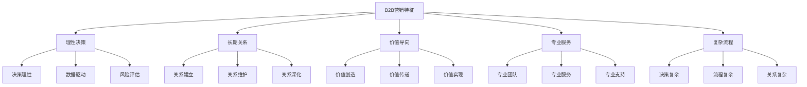
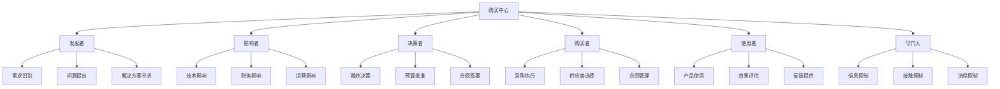

# B2B营销策略

## B2B营销概述

### 定义与本质
**B2B营销**：企业对企业营销，是指企业向其他企业销售产品或服务的营销活动，强调理性决策、长期关系和价值创造。

### B2B营销特征


## B2B营销理论

### 理论发展
| 理论 | 代表人物 | 核心观点 | 应用价值 |
|------|----------|----------|----------|
| **关系营销理论** | 贝里 | 建立长期客户关系 | B2B营销基础 |
| **价值营销理论** | 伍德拉夫 | 客户价值创造和传递 | 价值营销基础 |
| **解决方案营销理论** | 科特勒 | 提供整体解决方案 | 解决方案营销 |
| **客户成功理论** | 德鲁克 | 客户成功即企业成功 | 客户成功营销 |

### B2B购买决策模型
#### 1. 购买中心模型


#### 2. 购买决策流程
| 阶段 | 特征 | 目标 | 关键活动 | 营销重点 |
|------|------|------|----------|----------|
| **需求识别** | 问题识别、需求产生 | 明确需求 | 需求调研、问题分析 | 需求激发 |
| **信息收集** | 信息搜索、方案比较 | 收集信息 | 信息搜索、供应商调研 | 信息提供 |
| **方案评估** | 方案比较、供应商评估 | 选择方案 | 方案评估、供应商比较 | 方案展示 |
| **购买决策** | 最终选择、合同签署 | 完成购买 | 决策制定、合同签署 | 决策支持 |
| **购后评价** | 使用效果、满意度评估 | 效果评估 | 效果评估、满意度调研 | 服务支持 |

## B2B营销策略

### 1. 目标市场策略
#### 市场细分
```mermaid
graph TD
    A[B2B市场细分] --> B[行业细分]
    A --> C[企业规模细分]
    A --> D[地理细分]
    A --> E[行为细分]
    
    B --> B1[制造业]
    B --> B2[服务业]
    B --> B3[金融业]
    B --> B4[政府机构]
    
    C --> C1[大型企业]
    C --> C2[中型企业]
    C --> C3[小型企业]
    C --> C4[初创企业"]
    
    D --> D1[国内市场]
    D --> D2[国际市场"]
    D --> D3[区域市场"]
    D --> D4[本地市场"]
    
    E --> E1[购买行为"]
    E --> E2[使用行为"]
    E --> E3[决策行为"]
    E --> E4[关系行为"]
```

#### 目标市场选择
- **市场评估**：评估细分市场吸引力
- **竞争分析**：分析市场竞争状况
- **资源匹配**：匹配企业资源能力
- **战略选择**：选择目标市场策略

### 2. 价值主张策略
#### 价值主张类型
| 类型 | 特点 | 适用场景 | 实施要点 |
|------|------|----------|----------|
| **成本领先** | 低成本、高效率 | 价格敏感市场 | 成本控制、效率提升 |
| **差异化** | 独特价值、竞争优势 | 价值敏感市场 | 创新驱动、价值创造 |
| **专业化** | 专业服务、深度合作 | 专业需求市场 | 专业能力、深度服务 |
| **解决方案** | 整体方案、一站式服务 | 复杂需求市场 | 方案设计、集成服务 |

#### 价值主张设计
```mermaid
graph TD
    A[价值主张设计] --> B[客户需求分析]
    A --> C[竞争分析]
    A --> D[价值创造]
    A --> E[价值传递]
    
    B --> B1[需求识别"]
    B --> B2[需求分析"]
    B --> B3[需求优先级"]
    B --> B4[需求变化趋势"]
    
    C --> C1[竞争对手分析"]
    C --> C2[竞争策略分析"]
    C --> C3[竞争优势分析"]
    C --> C4[竞争威胁分析"]
    
    D --> D1[价值创造"]
    D --> D2[价值创新"]
    D --> D3[价值优化"]
    D --> D4[价值保护"]
    
    E --> E1[价值沟通"]
    E --> E2[价值展示"]
    E --> E3[价值实现"]
    E --> E4[价值验证"]
```

### 3. 渠道策略
#### 渠道类型
- **直接渠道**：直销、电话销售、网络销售
- **间接渠道**：代理商、经销商、系统集成商
- **混合渠道**：直接+间接、多渠道组合
- **数字渠道**：官网、电商平台、社交媒体

#### 渠道策略
```mermaid
graph TD
    A[B2B渠道策略] --> B[渠道设计]
    A --> C[渠道选择"]
    A --> D[渠道管理"]
    A --> E[渠道优化"]
    
    B --> B1[渠道结构设计"]
    B --> B2[渠道功能设计"]
    B --> B3[渠道关系设计"]
    B --> B4[渠道政策设计"]
    
    C --> C1[渠道商评估"]
    C --> C2[渠道商选择"]
    C --> C3[渠道商合作"]
    C --> C4[渠道商激励"]
    
    D --> D1[渠道商管理"]
    D --> D2[渠道冲突管理"]
    D --> D3[渠道绩效管理"]
    D --> D4[渠道关系管理"]
    
    E --> E1[渠道效率优化"]
    E --> E2[渠道成本优化"]
    E --> E3[渠道覆盖优化"]
    E --> E4[渠道服务优化"]
```

### 4. 定价策略
#### 定价方法
| 方法 | 特点 | 适用场景 | 实施要点 |
|------|------|----------|----------|
| **成本加成法** | 成本+利润 | 标准化产品 | 成本控制、利润设定 |
| **价值定价法** | 基于客户价值 | 差异化产品 | 价值分析、价值传递 |
| **竞争定价法** | 参考竞争价格 | 竞争激烈市场 | 竞争分析、价格调整 |
| **谈判定价法** | 协商确定价格 | 大客户、复杂项目 | 谈判技巧、价值沟通 |

#### 定价策略
- **产品定价**：产品价格策略
- **服务定价**：服务价格策略
- **项目定价**：项目价格策略
- **合同定价**：合同价格策略

## B2B营销实施

### 1. 营销组织
#### 组织架构
```mermaid
graph TD
    A[B2B营销组织] --> B[营销管理层]
    A --> C[市场开发部]
    A --> D[销售管理部]
    A --> E[客户服务部"]
    A --> F[营销支持部"]
    
    B --> B1[营销总监"]
    B --> B2[市场经理"]
    B --> B3[销售经理"]
    B --> B4[客户经理"]
    
    C --> C1[市场调研"]
    C --> C2[市场策划"]
    C --> C3[品牌推广"]
    C --> C4[活动策划"]
    
    D --> D1[销售团队"]
    D --> D2[渠道管理"]
    D --> D3[客户开发"]
    D --> D4[销售支持"]
    
    E --> E1[客户服务"]
    E --> E2[技术支持"]
    E --> E3[售后服务"]
    E --> E4[客户成功"]
    
    F --> F1[营销工具"]
    F --> F2[数据分析"]
    F --> F3[培训支持"]
    F --> F4[后勤支持"]
```

#### 团队建设
- **人员招聘**：招聘专业营销人员
- **培训发展**：培训和发展团队
- **激励机制**：建立激励机制
- **绩效管理**：绩效管理和评估

### 2. 营销流程
#### 销售流程
```mermaid
graph LR
    A[线索获取] --> B[线索筛选"]
    B --> C[需求确认"]
    C --> D[方案设计"]
    D --> E[商务谈判"]
    E --> F[合同签署"]
    F --> G[项目实施"]
    G --> H[客户成功"]
```

#### 客户管理流程
- **客户开发**：新客户开发流程
- **客户维护**：现有客户维护流程
- **客户服务**：客户服务流程
- **客户成功**：客户成功管理流程

### 3. 营销工具
#### 营销自动化工具
- **CRM系统**：客户关系管理系统
- **营销自动化**：营销自动化平台
- **销售工具**：销售管理工具
- **分析工具**：营销分析工具

#### 内容营销工具
- **内容管理**：内容管理系统
- **内容创作**：内容创作工具
- **内容分发**：内容分发平台
- **内容分析**：内容效果分析

## B2B营销案例

### 成功案例：Salesforce B2B营销
#### 营销策略
- **客户成功导向**：以客户成功为核心
- **数据驱动营销**：数据驱动营销决策
- **内容营销**：优质内容营销
- **社区营销**：构建用户社区

#### 实施要点
- 客户成功理念
- 数据化营销
- 内容营销策略
- 社区建设运营

#### 成功因素
- 强大的产品力
- 客户成功理念
- 数据驱动能力
- 社区运营能力

### 失败案例：B2B营销失败
#### 问题分析
- 目标市场不明确
- 价值主张不清晰
- 渠道策略不当
- 客户服务不足

#### 改进建议
- 明确目标市场
- 清晰价值主张
- 优化渠道策略
- 提升客户服务

## B2B营销趋势

### 数字化趋势
#### 趋势特征
- **数字化营销**：数字化营销转型
- **营销自动化**：营销流程自动化
- **数据驱动**：数据驱动营销决策
- **个性化营销**：个性化营销策略

#### 实施要点
- 数字化工具应用
- 营销自动化系统
- 数据收集分析
- 个性化策略制定

### 客户成功趋势
#### 趋势特征
- **客户成功导向**：以客户成功为核心
- **价值共创**：与客户价值共创
- **长期合作**：建立长期合作关系
- **生态合作**：构建合作生态

#### 实施要点
- 客户成功理念
- 价值共创模式
- 长期关系建设
- 生态合作构建

## 实践应用

### B2B营销实施步骤
1. **市场分析**：分析B2B市场
2. **目标市场**：选择目标市场
3. **价值主张**：设计价值主张
4. **营销策略**：制定营销策略
5. **组织建设**：建设营销组织
6. **流程设计**：设计营销流程
7. **工具选择**：选择营销工具
8. **实施执行**：执行营销策略

### B2B营销最佳实践
- **客户中心**：以客户为中心
- **价值导向**：价值创造导向
- **关系营销**：重视关系营销
- **数据驱动**：数据驱动决策
- **持续创新**：持续创新改进

---

**相关链接**：
- [[02-企业采购行为分析|企业采购行为分析]]
- [[03-销售团队管理|销售团队管理]]
- [[04-客户关系维护|客户关系维护]]
- [[03-营销理论框架/02-战略营销理论/01-关系营销理论|关系营销理论]]
- [[05-营销执行实施/03-客户管理/01-客户关系管理|客户关系管理]]
