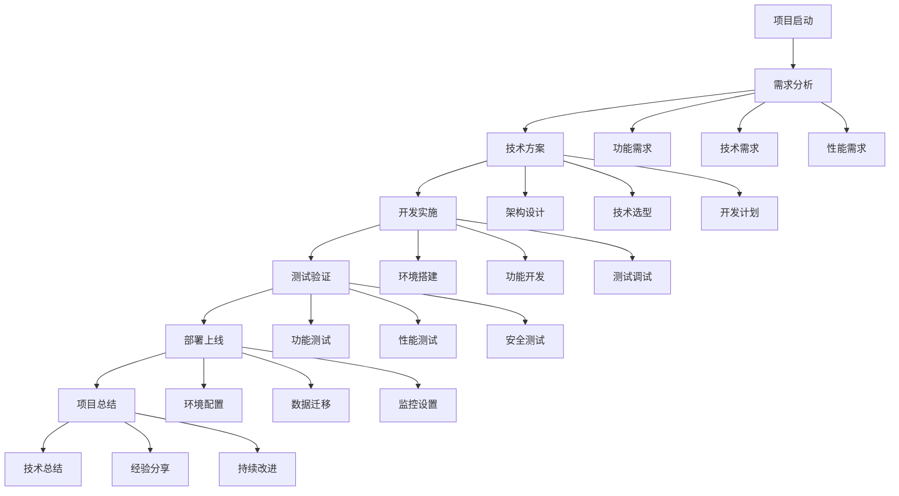

# WordPress项目实战

## 🎯 项目实战总览

通过实际项目练习，将理论知识转化为实践能力。每个项目都设计为递进式学习，从简单到复杂，逐步提升开发技能。

## 📊 项目难度等级

| 等级 | 项目类型 | 技术难度 | 时间投入 | 学习目标 |
|------|----------|----------|----------|----------|
| 🌱 入门级 | 基础网站 | ⭐⭐ | 1-2周 | 环境搭建、基础操作 |
| 🌿 初级 | 定制主题 | ⭐⭐⭐ | 2-3周 | 模板开发、样式定制 |
| 🌳 中级 | 功能插件 | ⭐⭐⭐⭐ | 3-4周 | 插件开发、数据库操作 |
| 🌲 高级 | 企业应用 | ⭐⭐⭐⭐⭐ | 4-6周 | 架构设计、性能优化 |
| 🌴 专家级 | 大型项目 | ⭐⭐⭐⭐⭐ | 6-8周 | 团队协作、技术领导 |

## 🚀 项目实战路径

### 第一阶段：入门级项目

#### 项目1：个人博客网站
**项目目标**: 搭建一个功能完整的个人博客网站

**技术栈**:
- WordPress基础安装
- 主题选择和定制
- 插件配置
- 基础SEO优化

**学习重点**:
- [[01-基础认知层/02-环境搭建/本地开发环境|环境搭建]]
- [[01-基础认知层/03-基础操作/内容管理基础|内容管理]]
- [[02-核心理解层/02-模板系统/模板层次结构|模板系统]]

**项目要求**:
- [ ] 完成WordPress安装配置
- [ ] 选择合适的主题并定制
- [ ] 配置必要的插件
- [ ] 创建博客内容
- [ ] 优化网站性能

**交付物**:
- 完整的博客网站
- 项目文档
- 学习总结

**时间安排**: 1-2周

---

#### 项目2：企业官网
**项目目标**: 为企业创建一个专业的官网

**技术栈**:
- 自定义主题开发
- 页面模板设计
- 联系表单集成
- 多语言支持

**学习重点**:
- [[03-应用开发层/01-前端开发/主题开发基础|主题开发]]
- [[03-应用开发层/01-前端开发/响应式设计|响应式设计]]
- [[03-应用开发层/02-后端开发/自定义文章类型|自定义文章类型]]

**项目要求**:
- [ ] 设计企业官网结构
- [ ] 开发自定义主题
- [ ] 创建页面模板
- [ ] 集成联系表单
- [ ] 实现响应式设计

**交付物**:
- 企业官网
- 主题源码
- 设计文档
- 用户手册

**时间安排**: 2-3周

---

### 第二阶段：初级项目

#### 项目3：电商网站
**项目目标**: 使用WooCommerce创建电商网站

**技术栈**:
- WooCommerce配置
- 支付系统集成
- 库存管理
- 订单处理

**学习重点**:
- [[03-应用开发层/02-后端开发/插件开发基础|插件开发]]
- [[03-应用开发层/03-高级功能/REST API开发|REST API]]
- [[04-精通创新层/02-性能优化/数据库优化|数据库优化]]

**项目要求**:
- [ ] 配置WooCommerce
- [ ] 集成支付系统
- [ ] 实现库存管理
- [ ] 优化购物流程
- [ ] 配置物流系统

**交付物**:
- 电商网站
- 配置文档
- 用户培训材料
- 运营手册

**时间安排**: 3-4周

---

#### 项目4：会员系统
**项目目标**: 开发会员制网站系统

**技术栈**:
- 用户权限管理
- 会员等级系统
- 内容访问控制
- 支付集成

**学习重点**:
- [[03-应用开发层/02-后端开发/用户权限系统|用户权限系统]]
- [[03-应用开发层/02-后端开发/自定义字段|自定义字段]]
- [[04-精通创新层/03-部署运维/安全加固|安全加固]]

**项目要求**:
- [ ] 设计会员等级系统
- [ ] 实现内容访问控制
- [ ] 集成支付系统
- [ ] 开发会员管理后台
- [ ] 实现邮件通知系统

**交付物**:
- 会员系统
- 管理后台
- 用户手册
- 技术文档

**时间安排**: 3-4周

---

### 第三阶段：中级项目

#### 项目5：多站点管理
**项目目标**: 构建WordPress多站点网络

**技术栈**:
- WordPress Multisite
- 域名管理
- 用户权限控制
- 主题插件管理

**学习重点**:
- [[03-应用开发层/03-高级功能/多站点管理|多站点管理]]
- [[04-精通创新层/03-部署运维/服务器配置|服务器配置]]
- [[05-生态扩展层/01-工具生态/开发工具|开发工具]]

**项目要求**:
- [ ] 配置WordPress Multisite
- [ ] 设置域名管理
- [ ] 实现用户权限控制
- [ ] 开发主题插件管理
- [ ] 优化多站点性能

**交付物**:
- 多站点网络
- 管理工具
- 配置文档
- 运维手册

**时间安排**: 4-5周

---

#### 项目6：API集成项目
**项目目标**: 开发第三方API集成系统

**技术栈**:
- REST API开发
- 第三方API集成
- 数据同步机制
- 错误处理

**学习重点**:
- [[04-精通创新层/01-现代交互/Headless WordPress|Headless WordPress]]
- [[04-精通创新层/01-现代交互/SPA集成|SPA集成]]
- [[04-精通创新层/02-性能优化/缓存策略|缓存策略]]

**项目要求**:
- [ ] 设计API架构
- [ ] 开发API接口
- [ ] 集成第三方服务
- [ ] 实现数据同步
- [ ] 优化API性能

**交付物**:
- API系统
- 集成文档
- 测试用例
- 性能报告

**时间安排**: 4-5周

---

### 第四阶段：高级项目

#### 项目7：性能优化项目
**项目目标**: 优化大型WordPress网站性能

**技术栈**:
- 数据库优化
- 缓存策略
- CDN配置
- 监控系统

**学习重点**:
- [[04-精通创新层/02-性能优化/数据库优化|数据库优化]]
- [[04-精通创新层/02-性能优化/缓存策略|缓存策略]]
- [[04-精通创新层/02-性能优化/性能监控|性能监控]]

**项目要求**:
- [ ] 分析性能瓶颈
- [ ] 优化数据库查询
- [ ] 配置缓存系统
- [ ] 设置CDN
- [ ] 建立监控体系

**交付物**:
- 优化方案
- 性能报告
- 监控系统
- 运维文档

**时间安排**: 5-6周

---

#### 项目8：大型企业应用
**项目目标**: 开发企业级WordPress应用

**技术栈**:
- 微服务架构
- 负载均衡
- 数据库集群
- 自动化部署

**学习重点**:
- [[04-精通创新层/03-部署运维/自动化部署|自动化部署]]
- [[05-生态扩展层/02-最佳实践/团队协作|团队协作]]
- [[05-生态扩展层/02-最佳实践/代码规范|代码规范]]

**项目要求**:
- [ ] 设计系统架构
- [ ] 实现负载均衡
- [ ] 配置数据库集群
- [ ] 建立CI/CD流程
- [ ] 实现监控告警

**交付物**:
- 企业应用
- 架构文档
- 部署脚本
- 运维手册

**时间安排**: 6-8周

---

## 🎯 项目实战策略

### 项目选择原则
1. **循序渐进**: 从简单项目开始，逐步增加难度
2. **实用性强**: 选择有实际应用价值的项目
3. **技术覆盖**: 确保项目覆盖主要技术点
4. **时间合理**: 根据学习时间安排项目规模

### 项目实施流程

### 项目评估标准

#### 技术评估
- **代码质量**: 代码规范、注释完整、结构清晰
- **功能实现**: 功能完整、逻辑正确、用户体验好
- **性能表现**: 响应速度快、资源占用合理、扩展性好
- **安全防护**: 数据安全、权限控制、漏洞防护

#### 学习评估
- **知识掌握**: 相关技术点掌握程度
- **问题解决**: 独立解决问题的能力
- **创新思维**: 技术方案创新性
- **持续学习**: 学习新技术的主动性

## 📚 项目资源

### 开发工具
- **代码编辑器**: VS Code、PhpStorm
- **版本控制**: Git、GitHub
- **项目管理**: Trello、Asana
- **设计工具**: Figma、Sketch

### 测试工具
- **功能测试**: Selenium、Cypress
- **性能测试**: GTmetrix、PageSpeed Insights
- **安全测试**: WPScan、Nessus
- **代码分析**: SonarQube、PHPStan

### 部署工具
- **容器化**: Docker、Kubernetes
- **自动化**: Jenkins、GitLab CI
- **监控**: New Relic、Datadog
- **备份**: UpdraftPlus、BackWPup

## 🔗 相关链接

- [[学习地图|学习地图]]
- [[技能树|技能树]]
- [[学习检查清单|学习检查清单]]
- [[学习计划模板|学习计划模板]]

---

**下一步**: 选择适合的项目开始[[学习计划模板|实战练习]]
