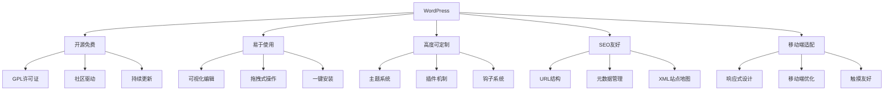
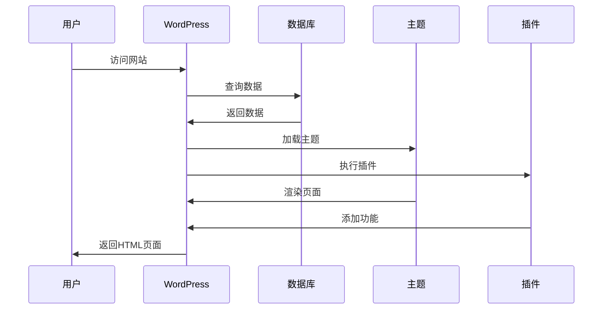

# WordPress是什么

## 🎯 核心概念

WordPress是一个基于PHP和MySQL的开源内容管理系统(CMS)，最初设计用于博客发布，现已发展成为功能强大的网站构建平台。

## 📊 WordPress核心特性

## 🏗️ WordPress架构概述

### 技术架构
- **后端语言**: PHP 7.4+
- **数据库**: MySQL 5.6+ / MariaDB 10.1+
- **Web服务器**: Apache / Nginx
- **前端技术**: HTML5, CSS3, JavaScript
- **版本控制**: Git

### 核心组件
| 组件 | 功能 | 重要性 |
|------|------|--------|
| 核心文件 | WordPress基础功能 | ⭐⭐⭐⭐⭐ |
| 主题系统 | 网站外观和布局 | ⭐⭐⭐⭐⭐ |
| 插件机制 | 功能扩展 | ⭐⭐⭐⭐⭐ |
| 钩子系统 | 代码扩展点 | ⭐⭐⭐⭐ |
| 数据库 | 内容存储 | ⭐⭐⭐⭐⭐ |

## 🌐 WordPress应用场景

### 主要应用类型
- [ ] **博客网站**
  - 个人博客
  - 企业博客
  - 新闻网站
  - 内容发布平台

- [ ] **企业官网**
  - 公司官网
  - 产品展示
  - 服务介绍
  - 联系页面

- [ ] **电商网站**
  - 在线商店
  - 产品目录
  - 购物车
  - 支付系统

- [ ] **社区网站**
  - 论坛
  - 社交网络
  - 会员系统
  - 用户互动

- [ ] **教育网站**
  - 在线课程
  - 学习管理系统
  - 知识库
  - 培训平台

### 适用行业
| 行业 | 应用场景 | 优势 |
|------|----------|------|
| 媒体出版 | 新闻网站、博客 | 内容管理强大 |
| 电子商务 | 在线商店 | 插件生态丰富 |
| 教育培训 | 在线学习 | 用户管理完善 |
| 企业服务 | 官网、内网 | 定制化程度高 |
| 非营利组织 | 宣传网站 | 成本低、易维护 |

## 💡 WordPress核心价值

### 对开发者的价值
- [ ] **快速开发**
  - 丰富的API接口
  - 完善的开发文档
  - 活跃的社区支持
  - 成熟的开发工具

- [ ] **技术学习**
  - 现代Web技术栈
  - 最佳实践示例
  - 开源代码学习
  - 技能提升平台

- [ ] **商业机会**
  - 主题开发
  - 插件开发
  - 定制服务
  - 技术支持

### 对用户的价值
- [ ] **易用性**
  - 无需编程知识
  - 可视化操作界面
  - 丰富的模板选择
  - 详细的使用教程

- [ ] **成本效益**
  - 免费开源
  - 低维护成本
  - 快速部署
  - 可扩展性强

- [ ] **功能丰富**
  - 内容管理
  - 用户系统
  - SEO优化
  - 安全防护

## 🔄 WordPress工作流程

### 请求处理流程

### 内容发布流程
1. **内容创建**: 在后台创建文章或页面
2. **内容编辑**: 使用编辑器编辑内容
3. **内容保存**: 保存到数据库
4. **内容发布**: 发布到前台显示
5. **内容管理**: 后续编辑和管理

## 📈 WordPress发展历程

### 重要里程碑
| 年份 | 版本 | 重要特性 |
|------|------|----------|
| 2003 | 0.7 | 首次发布 |
| 2004 | 1.0 | 插件系统 |
| 2005 | 1.5 | 主题系统 |
| 2008 | 2.7 | 后台重构 |
| 2010 | 3.0 | 多站点支持 |
| 2012 | 3.4 | 主题定制器 |
| 2015 | 4.2 | REST API |
| 2018 | 5.0 | Gutenberg编辑器 |
| 2020 | 5.5 | 自动更新 |
| 2022 | 6.0 | 全站编辑 |

### 技术演进
- **早期**: 简单的博客系统
- **发展期**: 功能丰富的CMS
- **成熟期**: 完整的网站平台
- **现代期**: 无头CMS和现代Web技术

## 🎯 WordPress学习路径

### 初学者路径
1. **基础操作** → [[01-基础认知层/03-基础操作/仪表盘导航|仪表盘导航]]
2. **内容管理** → [[01-基础认知层/03-基础操作/内容管理基础|内容管理基础]]
3. **主题定制** → [[03-应用开发层/01-前端开发/主题开发基础|主题开发基础]]

### 开发者路径
1. **架构理解** → [[02-核心理解层/01-架构原理/文件结构详解|文件结构详解]]
2. **模板开发** → [[02-核心理解层/02-模板系统/模板层次结构|模板层次结构]]
3. **插件开发** → [[03-应用开发层/02-后端开发/插件开发基础|插件开发基础]]

### 专家路径
1. **性能优化** → [[04-精通创新层/02-性能优化/数据库优化|数据库优化]]
2. **架构设计** → [[04-精通创新层/03-部署运维/服务器配置|服务器配置]]
3. **技术领导** → [[05-生态扩展层/02-最佳实践/团队协作|团队协作]]

## 🔗 相关概念

### 核心概念
- [[01-基础认知层/01-概念理解/WordPress生态|WordPress生态]]
- [[01-基础认知层/01-概念理解/WordPress发展历程|WordPress发展历程]]
- [[01-基础认知层/01-概念理解/版本差异对比|版本差异对比]]

### 技术概念
- [[02-核心理解层/01-架构原理/文件结构详解|文件结构详解]]
- [[02-核心理解层/01-架构原理/数据库结构|数据库结构]]
- [[02-核心理解层/01-架构原理/请求处理流程|请求处理流程]]

### 开发概念
- [[03-应用开发层/01-前端开发/主题开发基础|主题开发基础]]
- [[03-应用开发层/02-后端开发/插件开发基础|插件开发基础]]
- [[03-应用开发层/03-高级功能/Gutenberg区块开发|Gutenberg区块开发]]

## 📚 学习资源

### 官方资源
- [WordPress官网](https://wordpress.org/)
- [WordPress Codex](https://codex.wordpress.org/)
- [WordPress Developer Handbook](https://developer.wordpress.org/)

### 社区资源
- [WordPress中文社区](https://cn.wordpress.org/)
- [WordPress.tv](https://wordpress.tv/)
- [WPBeginner](https://www.wpbeginner.com/)

### 学习工具
- [[90-快速参考/函数速查表|函数速查表]]
- [[90-快速参考/模板标签速查|模板标签速查]]
- [[90-快速参考/钩子速查表|钩子速查表]]

---

**下一步**: 了解[[01-基础认知层/01-概念理解/WordPress生态|WordPress生态]]系统
