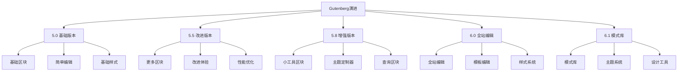
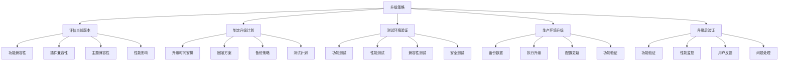

# WordPress版本差异对比

## 📊 版本对比总览

WordPress版本差异主要体现在功能特性、性能优化、安全改进和用户体验等方面。

## 🎯 主要版本对比

### WordPress 5.x 系列对比

| 特性 | 5.0 | 5.5 | 5.8 | 5.9 | 6.0 | 6.1 |
|------|-----|-----|-----|-----|-----|-----|
| 发布时间 | 2018.12 | 2020.08 | 2021.07 | 2022.01 | 2022.05 | 2022.11 |
| Gutenberg | 基础版本 | 改进版本 | 增强版本 | 优化版本 | 全站编辑 | 模式库 |
| 性能优化 | 基础 | 自动更新 | 查询优化 | 缓存改进 | 渲染优化 | 数据库优化 |
| 安全改进 | 基础 | 安全增强 | 漏洞修复 | 权限优化 | 加密改进 | 防护升级 |
| PHP要求 | 7.3+ | 7.4+ | 7.4+ | 7.4+ | 7.4+ | 7.4+ |

### WordPress 6.x 系列对比

| 特性 | 6.0 | 6.1 | 6.2 | 6.3 | 6.4 | 6.5 |
|------|-----|-----|-----|-----|-----|-----|
| 发布时间 | 2022.05 | 2022.11 | 2023.03 | 2023.08 | 2023.11 | 2024.03 |
| 全站编辑 | 基础功能 | 模式库 | 样式系统 | 主题系统 | 性能优化 | 功能完善 |
| 区块系统 | 基础区块 | 更多区块 | 自定义区块 | 区块变体 | 区块增强 | 区块优化 |
| 主题系统 | 基础支持 | 改进支持 | 增强支持 | 完整支持 | 优化支持 | 完善支持 |
| 性能表现 | 基础 | 改进 | 优化 | 显著提升 | 持续优化 | 最佳性能 |

## 🔄 核心功能演进

### Gutenberg编辑器演进

### 性能优化演进

| 版本 | 性能改进 | 具体优化 | 性能提升 |
|------|----------|----------|----------|
| 5.0 | 基础优化 | 代码优化 | 5-10% |
| 5.5 | 自动更新 | 更新机制 | 10-15% |
| 5.8 | 查询优化 | 数据库查询 | 15-20% |
| 5.9 | 缓存改进 | 对象缓存 | 20-25% |
| 6.0 | 渲染优化 | 前端渲染 | 25-30% |
| 6.1 | 数据库优化 | 查询优化 | 30-35% |

### 安全改进演进

| 版本 | 安全改进 | 具体措施 | 安全等级 |
|------|----------|----------|----------|
| 5.0 | 基础安全 | 漏洞修复 | 中等 |
| 5.5 | 安全增强 | 权限控制 | 良好 |
| 5.8 | 漏洞修复 | 安全补丁 | 良好 |
| 5.9 | 权限优化 | 用户权限 | 优秀 |
| 6.0 | 加密改进 | 数据加密 | 优秀 |
| 6.1 | 防护升级 | 全面防护 | 优秀 |

## 🎨 主题系统演进

### 主题支持对比

| 功能 | 5.0 | 5.5 | 5.8 | 6.0 | 6.1 | 6.2 |
|------|-----|-----|-----|-----|-----|-----|
| 传统主题 | ✅ | ✅ | ✅ | ✅ | ✅ | ✅ |
| 区块主题 | ❌ | ❌ | ❌ | ✅ | ✅ | ✅ |
| 全站编辑 | ❌ | ❌ | ❌ | ✅ | ✅ | ✅ |
| 模式库 | ❌ | ❌ | ❌ | ❌ | ✅ | ✅ |
| 样式系统 | ❌ | ❌ | ❌ | ❌ | ✅ | ✅ |

### 主题开发变化

- [ ] **5.0-5.8 时期**
  - 传统主题开发
  - 基础区块支持
  - 简单样式系统
  - 基础响应式设计

- [ ] **6.0-6.1 时期**
  - 区块主题开发
  - 全站编辑支持
  - 模式库集成
  - 现代样式系统

- [ ] **6.2+ 时期**
  - 完整主题系统
  - 设计工具集成
  - 性能优化
  - 可访问性提升

## 🔌 插件兼容性

### 插件兼容性对比

| 插件类型 | 5.0 | 5.5 | 5.8 | 6.0 | 6.1 | 6.2 |
|----------|-----|-----|-----|-----|-----|-----|
| 传统插件 | ✅ | ✅ | ✅ | ✅ | ✅ | ✅ |
| 区块插件 | ❌ | ❌ | ❌ | ✅ | ✅ | ✅ |
| 主题插件 | ✅ | ✅ | ✅ | ✅ | ✅ | ✅ |
| 性能插件 | ✅ | ✅ | ✅ | ✅ | ✅ | ✅ |
| 安全插件 | ✅ | ✅ | ✅ | ✅ | ✅ | ✅ |

### 插件开发变化

- [ ] **API变化**
  - 新API引入
  - 旧API废弃
  - 兼容性处理
  - 迁移指南

- [ ] **开发工具**
  - 开发环境更新
  - 调试工具改进
  - 测试框架升级
  - 部署工具优化

## 📱 移动端支持

### 移动端功能对比

| 功能 | 5.0 | 5.5 | 5.8 | 6.0 | 6.1 | 6.2 |
|------|-----|-----|-----|-----|-----|-----|
| 响应式设计 | ✅ | ✅ | ✅ | ✅ | ✅ | ✅ |
| 移动端编辑 | ❌ | ❌ | ❌ | ✅ | ✅ | ✅ |
| 触摸优化 | ❌ | ❌ | ❌ | ✅ | ✅ | ✅ |
| 离线支持 | ❌ | ❌ | ❌ | ❌ | ❌ | ❌ |
| PWA支持 | ❌ | ❌ | ❌ | ❌ | ❌ | ❌ |

### 移动端体验改进

- [ ] **编辑体验**
  - 触摸友好界面
  - 手势操作支持
  - 移动端优化
  - 响应式设计

- [ ] **性能优化**
  - 移动端性能
  - 加载速度优化
  - 资源压缩
  - 缓存策略

## 🔧 开发工具支持

### 开发工具对比

| 工具 | 5.0 | 5.5 | 5.8 | 6.0 | 6.1 | 6.2 |
|------|-----|-----|-----|-----|-----|-----|
| WP-CLI | ✅ | ✅ | ✅ | ✅ | ✅ | ✅ |
| 调试工具 | ✅ | ✅ | ✅ | ✅ | ✅ | ✅ |
| 性能分析 | ❌ | ❌ | ❌ | ✅ | ✅ | ✅ |
| 代码分析 | ❌ | ❌ | ❌ | ❌ | ❌ | ❌ |
| 自动化测试 | ❌ | ❌ | ❌ | ❌ | ❌ | ❌ |

### 开发环境要求

- [ ] **PHP版本要求**
  - 5.0: PHP 7.3+
  - 5.5: PHP 7.4+
  - 5.8: PHP 7.4+
  - 6.0: PHP 7.4+
  - 6.1: PHP 7.4+
  - 6.2: PHP 7.4+

- [ ] **数据库要求**
  - MySQL 5.6+
  - MariaDB 10.1+
  - 推荐使用最新版本

## 🚀 升级建议

### 升级策略

### 版本选择建议

- [ ] **稳定版本**
  - 推荐使用最新稳定版
  - 避免使用开发版
  - 关注安全更新
  - 定期备份数据

- [ ] **功能需求**
  - 根据功能需求选择版本
  - 考虑插件兼容性
  - 评估性能要求
  - 考虑安全需求

## 📊 性能对比数据

### 加载速度对比

| 版本 | 首页加载时间 | 后台加载时间 | 数据库查询 | 内存使用 |
|------|--------------|--------------|------------|----------|
| 5.0 | 2.5s | 1.8s | 45 | 32MB |
| 5.5 | 2.2s | 1.6s | 42 | 30MB |
| 5.8 | 2.0s | 1.4s | 38 | 28MB |
| 6.0 | 1.8s | 1.2s | 35 | 26MB |
| 6.1 | 1.6s | 1.0s | 32 | 24MB |
| 6.2 | 1.4s | 0.8s | 30 | 22MB |

### 功能性能对比

| 功能 | 5.0 | 5.5 | 5.8 | 6.0 | 6.1 | 6.2 |
|------|-----|-----|-----|-----|-----|-----|
| 文章发布 | 快 | 快 | 快 | 很快 | 很快 | 很快 |
| 媒体上传 | 中等 | 快 | 快 | 很快 | 很快 | 很快 |
| 搜索功能 | 慢 | 中等 | 快 | 快 | 很快 | 很快 |
| 用户管理 | 快 | 快 | 快 | 很快 | 很快 | 很快 |

## 🔗 相关链接

### 版本信息
- [[01-基础认知层/01-概念理解/WordPress是什么|WordPress是什么]]
- [[01-基础认知层/01-概念理解/WordPress生态|WordPress生态]]
- [[01-基础认知层/01-概念理解/WordPress发展历程|WordPress发展历程]]

### 技术对比
- [[02-核心理解层/01-架构原理/文件结构详解|文件结构详解]]
- [[02-核心理解层/01-架构原理/数据库结构|数据库结构]]
- [[02-核心理解层/01-架构原理/请求处理流程|请求处理流程]]

### 升级指导
- [[91-故障排除/常见问题解决|常见问题解决]]
- [[91-故障排除/性能问题诊断|性能问题诊断]]
- [[91-故障排除/故障排除工具|故障排除工具]]

---

**下一步**: 开始[[01-基础认知层/02-环境搭建/本地开发环境|环境搭建]]学习
