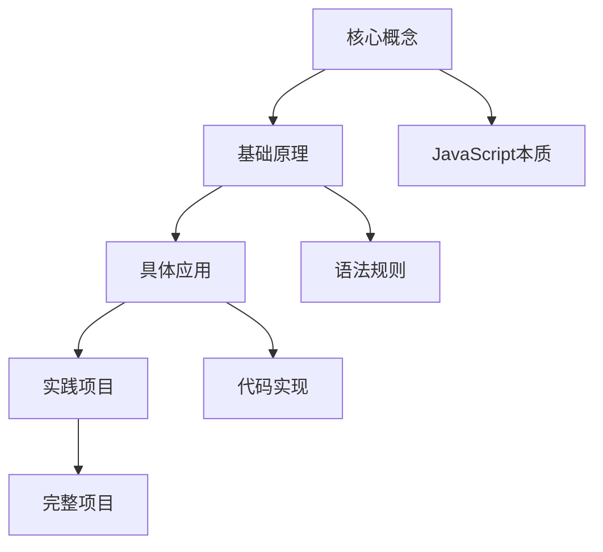
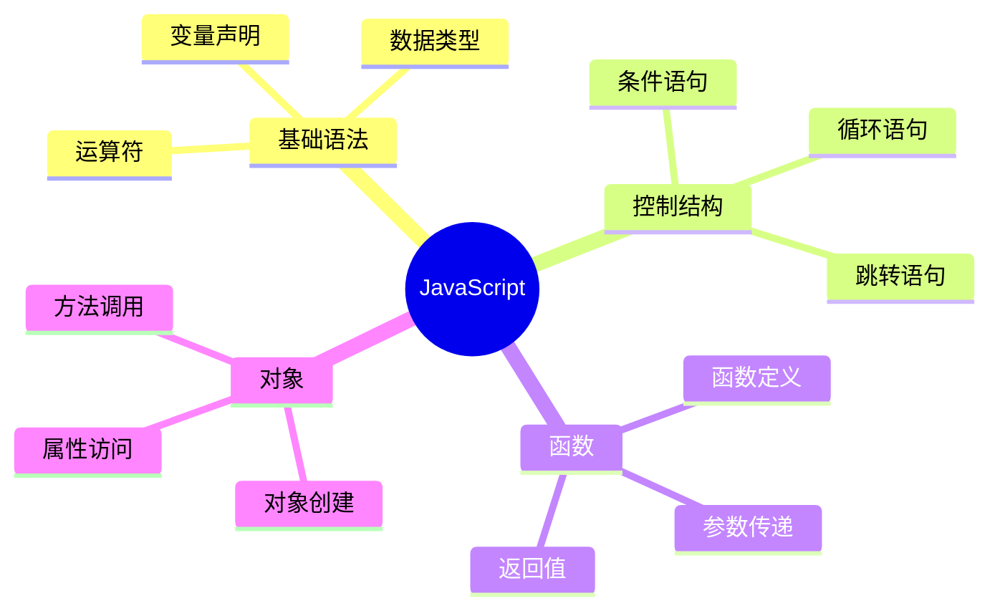

# JavaScript学习建议

## INTJ学习者特点分析

### 优势特征
- **结构化思维**: 善于构建知识体系
- **深度思考**: 喜欢深入理解概念本质
- **独立学习**: 偏好自主探索和发现
- **系统规划**: 擅长制定长期学习计划

### 学习偏好
- **理论先行**: 先理解概念再实践
- **逻辑清晰**: 需要清晰的因果关系
- **深度优先**: 追求深度而非广度
- **自主控制**: 喜欢掌控学习节奏

## 学习策略建议

### 1. 金字塔学习法


**实施步骤**:
1. **顶层理解**: 先掌握JavaScript的核心概念和设计理念
2. **中层构建**: 理解语法规则和运行机制
3. **底层实践**: 通过具体代码实现验证理解
4. **项目整合**: 将知识整合到完整项目中

### 2. 费曼学习法应用

#### 第一步：选择概念
- 选择要学习的JavaScript概念
- 确保概念边界清晰

#### 第二步：教学他人
- 用简单的语言解释概念
- 避免使用专业术语
- 用类比和比喻帮助理解

#### 第三步：识别盲点
- 记录解释不清楚的地方
- 回到原始材料重新学习
- 直到能够流畅解释

#### 第四步：简化表达
- 用最简单的语言重新组织
- 创建自己的理解框架
- 建立概念间的联系

### 3. 刻意练习策略

#### 目标设定
- **短期目标**: 每周掌握1-2个核心概念
- **中期目标**: 每月完成一个实践项目
- **长期目标**: 成为JavaScript专家

#### 练习方法
1. **分解练习**: 将复杂概念分解为小步骤
2. **重复练习**: 反复练习直到自动化
3. **反馈循环**: 通过代码运行获得即时反馈
4. **挑战升级**: 逐步增加练习难度

## 学习环境优化

### 开发环境配置
```javascript
// 推荐开发工具链
const devTools = {
  editor: "VS Code",           // 代码编辑器
  browser: "Chrome DevTools",  // 浏览器调试
  node: "Node.js",            // 运行环境
  package: "npm/yarn",        // 包管理
  version: "Git"              // 版本控制
};
```

### 学习资源组织
- **官方文档**: MDN Web Docs
- **在线练习**: CodePen, JSFiddle
- **交互学习**: freeCodeCamp, Codecademy
- **深度阅读**: JavaScript高级程序设计

## 学习节奏控制

### 每日学习计划
| 时间段 | 学习内容 | 学习方式 | 时间分配 |
|--------|----------|----------|----------|
| 上午 | 理论学习 | 阅读文档 | 1-2小时 |
| 下午 | 实践练习 | 编写代码 | 2-3小时 |
| 晚上 | 总结反思 | 笔记整理 | 30分钟 |

### 每周学习计划
- **周一**: 新概念学习
- **周二-周四**: 深入理解和实践
- **周五**: 项目实践
- **周末**: 总结和复习

## 知识巩固方法

### 1. 概念地图


### 2. 代码示例库
- 为每个概念创建代码示例
- 包含基础用法和高级技巧
- 添加详细注释说明

### 3. 问题解决记录
- 记录学习过程中遇到的问题
- 分析问题原因和解决方案
- 建立个人知识库

## 学习效果评估

### 自我评估标准
1. **概念理解**: 能否用简单语言解释概念
2. **代码实现**: 能否独立编写相关代码
3. **问题解决**: 能否解决实际开发问题
4. **知识迁移**: 能否将知识应用到新场景

### 定期检查点
- **每周**: 回顾本周学习内容
- **每月**: 评估学习进度和效果
- **每季度**: 调整学习策略和方法

## 相关链接
- [[00-学习指南/01-学习路径图]] - 学习路径规划
- [[00-学习指南/02-知识体系总览]] - 知识体系架构
- [[00-学习指南/04-进度跟踪]] - 进度管理工具
- [[00-学习指南/05-学习检查清单]] - 学习检查标准
