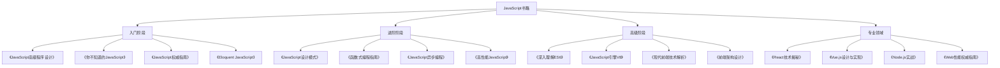

# 推荐书籍

## 书籍分类

### 学习阶段


### 书籍对比
| 书名 | 作者 | 难度 | 特点 | 适用人群 |
|------|------|------|------|----------|
| 《JavaScript高级程序设计》 | Nicholas C. Zakas | 中等 | 全面系统、实例丰富 | 有一定基础的开发者 |
| 《你不知道的JavaScript》 | Kyle Simpson | 中等 | 深入原理、概念清晰 | 想深入理解JavaScript的开发者 |
| 《Eloquent JavaScript》 | Marijn Haverbeke | 入门 | 通俗易懂、实践性强 | 编程初学者 |
| 《JavaScript权威指南》 | David Flanagan | 高级 | 权威全面、参考价值高 | 有经验的开发者 |

## 入门阶段

### 《JavaScript高级程序设计》
```javascript
// 1. 核心内容
const bookContent = {
    "基础语法": {
        "变量声明": "var、let、const的区别和使用场景",
        "数据类型": "基本类型和引用类型的深入理解",
        "函数": "函数声明、表达式、箭头函数",
        "对象": "对象创建、属性访问、方法定义"
    },
    "DOM操作": {
        "节点操作": "创建、插入、删除、替换节点",
        "事件处理": "事件流、事件委托、自定义事件",
        "样式操作": "内联样式、类名操作、计算样式",
        "表单处理": "表单验证、数据收集、提交处理"
    },
    "BOM操作": {
        "窗口对象": "窗口大小、位置、打开关闭",
        "历史记录": "前进后退、状态管理",
        "定时器": "setTimeout、setInterval的使用",
        "本地存储": "localStorage、sessionStorage"
    },
    "高级特性": {
        "闭包": "闭包的形成、作用、应用场景",
        "原型链": "原型对象、原型链、继承",
        "异步编程": "回调函数、Promise、async/await",
        "模块化": "CommonJS、AMD、ES6模块"
    }
};

// 2. 学习重点
const learningPoints = {
    "基础概念": [
        "理解JavaScript的执行环境",
        "掌握变量提升和作用域",
        "熟悉数据类型和类型转换",
        "掌握函数的各种形式"
    ],
    "实践技能": [
        "熟练操作DOM元素",
        "处理各种事件",
        "实现表单验证",
        "使用本地存储"
    ],
    "高级特性": [
        "理解闭包的应用",
        "掌握原型和继承",
        "熟练使用异步编程",
        "了解模块化开发"
    ]
};

// 3. 代码示例
// 闭包应用
function createCounter() {
    let count = 0;
    return function() {
        return ++count;
    };
}

const counter = createCounter();
console.log(counter()); // 1
console.log(counter()); // 2

// 原型链继承
function Animal(name) {
    this.name = name;
}

Animal.prototype.speak = function() {
    console.log(`${this.name} makes a sound`);
};

function Dog(name, breed) {
    Animal.call(this, name);
    this.breed = breed;
}

Dog.prototype = Object.create(Animal.prototype);
Dog.prototype.constructor = Dog;

Dog.prototype.speak = function() {
    console.log(`${this.name} barks`);
};
```

### 《你不知道的JavaScript》
```javascript
// 1. 核心概念
const coreConcepts = {
    "作用域和闭包": {
        "词法作用域": "JavaScript的作用域是词法作用域",
        "函数作用域": "函数创建作用域，块级作用域",
        "提升": "变量和函数声明提升",
        "闭包": "函数能够访问外部作用域的变量"
    },
    "this和对象原型": {
        "this绑定": "this的四种绑定规则",
        "对象": "对象字面量、属性描述符",
        "原型": "原型链、原型继承",
        "类": "ES6类的语法糖本质"
    },
    "类型和语法": {
        "类型系统": "JavaScript的动态类型系统",
        "类型转换": "显式和隐式类型转换",
        "语法": "语句和表达式的区别",
        "运算符": "运算符优先级和结合性"
    }
};

// 2. 深入理解
const deepUnderstanding = {
    "作用域链": `
        function outer() {
            var a = 1;
            function inner() {
                console.log(a); // 可以访问外部变量
            }
            return inner;
        }
        
        const fn = outer();
        fn(); // 1
    `,
    "this绑定": `
        // 默认绑定
        function foo() {
            console.log(this.a);
        }
        var a = 2;
        foo(); // 2
        
        // 隐式绑定
        var obj = {
            a: 2,
            foo: foo
        };
        obj.foo(); // 2
        
        // 显式绑定
        foo.call(obj); // 2
        foo.apply(obj); // 2
        
        // new绑定
        function Bar(a) {
            this.a = a;
        }
        var bar = new Bar(3);
        console.log(bar.a); // 3
    `,
    "原型链": `
        function Foo() {}
        Foo.prototype.bar = function() {
            console.log('bar');
        };
        
        var obj = new Foo();
        obj.bar(); // 'bar'
        
        // 原型链查找
        console.log(obj.__proto__ === Foo.prototype); // true
        console.log(Foo.prototype.__proto__ === Object.prototype); // true
    `
};

// 3. 学习建议
const learningSuggestions = {
    "理解原理": "不要只记住语法，要理解背后的原理",
    "实践验证": "通过代码验证书中的概念",
    "深入思考": "思考为什么JavaScript这样设计",
    "对比学习": "与其他语言对比，理解差异"
};
```

### 《Eloquent JavaScript》
```javascript
// 1. 学习路径
const learningPath = {
    "基础语法": {
        "变量和值": "理解JavaScript的基本数据类型",
        "程序结构": "条件语句、循环、函数",
        "函数": "函数定义、调用、参数、返回值",
        "数据结构": "对象、数组、字符串操作"
    },
    "函数式编程": {
        "高阶函数": "函数作为参数和返回值",
        "闭包": "函数和变量的作用域",
        "递归": "递归思维和实现",
        "函数组合": "将简单函数组合成复杂功能"
    },
    "异步编程": {
        "回调函数": "处理异步操作的传统方式",
        "Promise": "更优雅的异步处理",
        "async/await": "同步语法的异步编程",
        "事件循环": "理解JavaScript的执行机制"
    },
    "项目实践": {
        "DOM操作": "创建交互式网页",
        "事件处理": "响应用户操作",
        "数据可视化": "使用Canvas绘制图表",
        "网络请求": "与服务器通信"
    }
};

// 2. 实践项目
const practiceProjects = {
    "计算器": "实现一个简单的计算器",
    "待办事项": "创建任务管理应用",
    "图片轮播": "实现图片轮播组件",
    "数据可视化": "绘制简单的图表"
};

// 3. 代码示例
// 高阶函数
function map(array, transform) {
    let mapped = [];
    for (let element of array) {
        mapped.push(transform(element));
    }
    return mapped;
}

function filter(array, test) {
    let passed = [];
    for (let element of array) {
        if (test(element)) {
            passed.push(element);
        }
    }
    return passed;
}

// 使用示例
let numbers = [1, 2, 3, 4, 5];
let doubled = map(numbers, n => n * 2);
let evens = filter(numbers, n => n % 2 === 0);

// 递归
function factorial(n) {
    if (n === 0) {
        return 1;
    } else {
        return n * factorial(n - 1);
    }
}

// 异步编程
async function fetchData(url) {
    try {
        const response = await fetch(url);
        const data = await response.json();
        return data;
    } catch (error) {
        console.error('Error:', error);
        throw error;
    }
}
```

## 进阶阶段

### 《JavaScript设计模式》
```javascript
// 1. 设计模式分类
const designPatterns = {
    "创建型模式": {
        "单例模式": "确保一个类只有一个实例",
        "工厂模式": "创建对象的接口",
        "建造者模式": "构建复杂对象",
        "原型模式": "通过克隆创建对象"
    },
    "结构型模式": {
        "适配器模式": "接口转换",
        "装饰器模式": "动态添加功能",
        "外观模式": "简化接口",
        "代理模式": "控制对象访问"
    },
    "行为型模式": {
        "观察者模式": "对象间的一对多依赖",
        "策略模式": "算法的封装和切换",
        "命令模式": "将请求封装为对象",
        "迭代器模式": "顺序访问集合元素"
    }
};

// 2. 常用模式实现
const patternImplementations = {
    "单例模式": `
        class Singleton {
            constructor() {
                if (Singleton.instance) {
                    return Singleton.instance;
                }
                Singleton.instance = this;
                return this;
            }
        }
        
        const instance1 = new Singleton();
        const instance2 = new Singleton();
        console.log(instance1 === instance2); // true
    `,
    "观察者模式": `
        class Subject {
            constructor() {
                this.observers = [];
            }
            
            addObserver(observer) {
                this.observers.push(observer);
            }
            
            removeObserver(observer) {
                const index = this.observers.indexOf(observer);
                if (index > -1) {
                    this.observers.splice(index, 1);
                }
            }
            
            notify(data) {
                this.observers.forEach(observer => observer.update(data));
            }
        }
        
        class Observer {
            update(data) {
                console.log('Received:', data);
            }
        }
        
        const subject = new Subject();
        const observer = new Observer();
        subject.addObserver(observer);
        subject.notify('Hello World');
    `,
    "策略模式": `
        class Strategy {
            execute() {
                throw new Error('Strategy must implement execute method');
            }
        }
        
        class AddStrategy extends Strategy {
            execute(a, b) {
                return a + b;
            }
        }
        
        class MultiplyStrategy extends Strategy {
            execute(a, b) {
                return a * b;
            }
        }
        
        class Calculator {
            constructor(strategy) {
                this.strategy = strategy;
            }
            
            setStrategy(strategy) {
                this.strategy = strategy;
            }
            
            calculate(a, b) {
                return this.strategy.execute(a, b);
            }
        }
        
        const calculator = new Calculator(new AddStrategy());
        console.log(calculator.calculate(2, 3)); // 5
        
        calculator.setStrategy(new MultiplyStrategy());
        console.log(calculator.calculate(2, 3)); // 6
    `
};

// 3. 学习重点
const learningFocus = {
    "理解模式": "理解每个模式的意图和适用场景",
    "实现模式": "能够用JavaScript实现各种模式",
    "应用模式": "在实际项目中应用设计模式",
    "组合模式": "学会组合使用多种模式"
};
```

### 《函数式编程指南》
```javascript
// 1. 函数式编程概念
const functionalConcepts = {
    "纯函数": {
        "定义": "相同输入总是产生相同输出，无副作用",
        "特点": "可预测、可测试、可缓存",
        "示例": "数学函数、字符串处理函数"
    },
    "不可变性": {
        "定义": "数据一旦创建就不能被修改",
        "好处": "避免副作用、简化状态管理",
        "实现": "使用不可变数据结构"
    },
    "高阶函数": {
        "定义": "接受函数作为参数或返回函数",
        "应用": "map、filter、reduce等",
        "优势": "代码复用、抽象层次高"
    },
    "函数组合": {
        "定义": "将简单函数组合成复杂功能",
        "原则": "单一职责、可组合性",
        "实现": "管道操作、函数链"
    }
};

// 2. 函数式编程实践
const functionalPractice = {
    "纯函数示例": `
        // 纯函数
        function add(a, b) {
            return a + b;
        }
        
        // 非纯函数
        let counter = 0;
        function increment() {
            return ++counter; // 有副作用
        }
        
        // 纯函数版本
        function incrementPure(count) {
            return count + 1;
        }
    `,
    "不可变数据": `
        // 可变操作
        const arr = [1, 2, 3];
        arr.push(4); // 修改原数组
        
        // 不可变操作
        const newArr = [...arr, 4]; // 创建新数组
        
        // 对象不可变
        const obj = { a: 1, b: 2 };
        const newObj = { ...obj, c: 3 }; // 创建新对象
    `,
    "函数组合": `
        // 简单函数
        const add = (a, b) => a + b;
        const multiply = (a, b) => a * b;
        const square = x => x * x;
        
        // 函数组合
        const compose = (f, g) => x => f(g(x));
        const pipe = (f, g) => x => g(f(x));
        
        // 使用组合
        const addAndSquare = compose(square, add);
        console.log(addAndSquare(2, 3)); // 25
        
        // 管道操作
        const process = pipe(
            x => x + 1,
            x => x * 2,
            x => x - 1
        );
        console.log(process(5)); // 11
    `,
    "高阶函数": `
        // 自定义map函数
        function map(array, fn) {
            return array.reduce((acc, item) => {
                acc.push(fn(item));
                return acc;
            }, []);
        }
        
        // 自定义filter函数
        function filter(array, predicate) {
            return array.reduce((acc, item) => {
                if (predicate(item)) {
                    acc.push(item);
                }
                return acc;
            }, []);
        }
        
        // 使用示例
        const numbers = [1, 2, 3, 4, 5];
        const doubled = map(numbers, x => x * 2);
        const evens = filter(numbers, x => x % 2 === 0);
    `
};

// 3. 函数式库
const functionalLibraries = {
    "Ramda": "函数式编程工具库",
    "Lodash/FP": "Lodash的函数式版本",
    "Immutable.js": "不可变数据结构",
    "RxJS": "响应式编程库"
};
```

## 高级阶段

### 《深入理解ES6》
```javascript
// 1. ES6新特性
const es6Features = {
    "let和const": {
        "块级作用域": "let和const具有块级作用域",
        "暂时性死区": "变量声明前不能使用",
        "不允许重复声明": "同一作用域内不能重复声明",
        "const的不可变性": "const声明的变量不能重新赋值"
    },
    "箭头函数": {
        "语法简洁": "更简洁的函数语法",
        "this绑定": "箭头函数不绑定this",
        "不能作为构造函数": "不能使用new调用",
        "没有arguments": "使用剩余参数代替"
    },
    "解构赋值": {
        "数组解构": "从数组中提取值",
        "对象解构": "从对象中提取属性",
        "默认值": "解构时可以设置默认值",
        "嵌套解构": "解构嵌套的数据结构"
    },
    "模板字符串": {
        "多行字符串": "支持多行文本",
        "变量插值": "使用${}插入变量",
        "标签模板": "自定义模板处理函数",
        "原始字符串": "获取模板的原始形式"
    }
};

// 2. ES6+特性实现
const es6Implementations = {
    "类语法": `
        class Animal {
            constructor(name) {
                this.name = name;
            }
            
            speak() {
                console.log(\`\${this.name} makes a sound\`);
            }
        }
        
        class Dog extends Animal {
            constructor(name, breed) {
                super(name);
                this.breed = breed;
            }
            
            speak() {
                console.log(\`\${this.name} barks\`);
            }
        }
        
        const dog = new Dog('Buddy', 'Golden Retriever');
        dog.speak(); // Buddy barks
    `,
    "模块系统": `
        // math.js
        export const add = (a, b) => a + b;
        export const subtract = (a, b) => a - b;
        export default class Calculator {
            constructor() {
                this.result = 0;
            }
            
            add(value) {
                this.result += value;
                return this;
            }
            
            getResult() {
                return this.result;
            }
        }
        
        // main.js
        import Calculator, { add, subtract } from './math.js';
        
        const calc = new Calculator();
        console.log(calc.add(5).add(3).getResult()); // 8
        console.log(add(2, 3)); // 5
    `,
    "Promise和async/await": `
        // Promise
        function fetchData(url) {
            return new Promise((resolve, reject) => {
                fetch(url)
                    .then(response => response.json())
                    .then(data => resolve(data))
                    .catch(error => reject(error));
            });
        }
        
        // async/await
        async function getData(url) {
            try {
                const response = await fetch(url);
                const data = await response.json();
                return data;
            } catch (error) {
                console.error('Error:', error);
                throw error;
            }
        }
        
        // 使用示例
        getData('/api/users')
            .then(users => console.log(users))
            .catch(error => console.error(error));
    `,
    "生成器和迭代器": `
        // 生成器函数
        function* numberGenerator() {
            yield 1;
            yield 2;
            yield 3;
        }
        
        const gen = numberGenerator();
        console.log(gen.next().value); // 1
        console.log(gen.next().value); // 2
        console.log(gen.next().value); // 3
        
        // 迭代器
        const iterable = {
            [Symbol.iterator]() {
                let count = 0;
                return {
                    next() {
                        if (count < 3) {
                            return { value: ++count, done: false };
                        }
                        return { done: true };
                    }
                };
            }
        };
        
        for (const value of iterable) {
            console.log(value); // 1, 2, 3
        }
    `
};

// 3. 学习重点
const advancedLearning = {
    "理解原理": "理解ES6特性背后的原理",
    "实践应用": "在实际项目中应用ES6特性",
    "性能考虑": "了解不同特性的性能影响",
    "兼容性": "处理浏览器兼容性问题"
};
```

### 《现代前端技术解析》
```javascript
// 1. 前端技术栈
const frontendStack = {
    "构建工具": {
        "Webpack": "模块打包器，支持代码分割",
        "Vite": "基于ESM的快速构建工具",
        "Rollup": "ES模块打包器",
        "Parcel": "零配置构建工具"
    },
    "框架生态": {
        "React": "组件化UI库",
        "Vue": "渐进式框架",
        "Angular": "全功能框架",
        "Svelte": "编译时框架"
    },
    "状态管理": {
        "Redux": "可预测的状态容器",
        "Vuex": "Vue的状态管理",
        "MobX": "响应式状态管理",
        "Zustand": "轻量级状态管理"
    },
    "工程化": {
        "TypeScript": "类型安全的JavaScript",
        "ESLint": "代码质量检查",
        "Prettier": "代码格式化",
        "Jest": "测试框架"
    }
};

// 2. 技术选型
const technologySelection = {
    "项目规模": {
        "小型项目": "Vue + Vite + Pinia",
        "中型项目": "React + Webpack + Redux",
        "大型项目": "Angular + TypeScript + NgRx"
    },
    "团队经验": {
        "新手团队": "Vue + 官方工具链",
        "有经验团队": "React + 自定义工具链",
        "企业团队": "Angular + 企业级工具"
    },
    "性能要求": {
        "高性能": "Svelte + Vite",
        "平衡性能": "React + Webpack",
        "开发效率": "Vue + Vite"
    }
};

// 3. 最佳实践
const bestPractices = {
    "代码组织": {
        "模块化": "按功能组织代码",
        "组件化": "可复用的UI组件",
        "服务化": "业务逻辑分离",
        "工具化": "通用工具函数"
    },
    "性能优化": {
        "代码分割": "按需加载代码",
        "懒加载": "延迟加载资源",
        "缓存策略": "合理使用缓存",
        "压缩优化": "减少文件大小"
    },
    "开发体验": {
        "热重载": "快速开发反馈",
        "类型检查": "编译时错误检查",
        "代码格式化": "统一的代码风格",
        "自动化测试": "保证代码质量"
    }
};
```

## 专业领域

### 《React技术揭秘》
```javascript
// 1. React核心概念
const reactConcepts = {
    "虚拟DOM": {
        "概念": "JavaScript对象表示DOM结构",
        "优势": "提高渲染性能",
        "实现": "Diff算法和批量更新",
        "优化": "key属性和shouldComponentUpdate"
    },
    "组件生命周期": {
        "挂载阶段": "constructor、render、componentDidMount",
        "更新阶段": "render、componentDidUpdate",
        "卸载阶段": "componentWillUnmount",
        "错误处理": "componentDidCatch"
    },
    "状态管理": {
        "本地状态": "useState、useReducer",
        "全局状态": "Context、Redux",
        "状态提升": "将状态提升到公共父组件",
        "状态持久化": "localStorage、sessionStorage"
    },
    "Hooks": {
        "useState": "管理组件状态",
        "useEffect": "处理副作用",
        "useContext": "使用Context",
        "useMemo": "缓存计算结果"
    }
};

// 2. React实践
const reactPractice = {
    "组件设计": `
        // 函数组件
        function Button({ children, onClick, variant = 'primary' }) {
            return (
                <button 
                    className={\`btn btn-\${variant}\`}
                    onClick={onClick}
                >
                    {children}
                </button>
            );
        }
        
        // 自定义Hook
        function useCounter(initialValue = 0) {
            const [count, setCount] = useState(initialValue);
            
            const increment = useCallback(() => {
                setCount(prev => prev + 1);
            }, []);
            
            const decrement = useCallback(() => {
                setCount(prev => prev - 1);
            }, []);
            
            return { count, increment, decrement };
        }
        
        // 使用自定义Hook
        function Counter() {
            const { count, increment, decrement } = useCounter(0);
            
            return (
                <div>
                    <span>{count}</span>
                    <Button onClick={increment}>+</Button>
                    <Button onClick={decrement}>-</Button>
                </div>
            );
        }
    `,
    "性能优化": `
        // 使用React.memo
        const ExpensiveComponent = React.memo(function({ data }) {
            return (
                <div>
                    {data.map(item => (
                        <div key={item.id}>{item.name}</div>
                    ))}
                </div>
            );
        });
        
        // 使用useMemo
        function ExpensiveCalculation({ items }) {
            const expensiveValue = useMemo(() => {
                return items.reduce((sum, item) => sum + item.value, 0);
            }, [items]);
            
            return <div>Total: {expensiveValue}</div>;
        }
        
        // 使用useCallback
        function Parent({ items }) {
            const [count, setCount] = useState(0);
            
            const handleClick = useCallback(() => {
                console.log('Button clicked');
            }, []);
            
            return (
                <div>
                    <button onClick={() => setCount(count + 1)}>
                        Count: {count}
                    </button>
                    <Child onClick={handleClick} />
                </div>
            );
        }
    `,
    "状态管理": `
        // Context API
        const ThemeContext = createContext();
        
        function ThemeProvider({ children }) {
            const [theme, setTheme] = useState('light');
            
            const toggleTheme = useCallback(() => {
                setTheme(prev => prev === 'light' ? 'dark' : 'light');
            }, []);
            
            return (
                <ThemeContext.Provider value={{ theme, toggleTheme }}>
                    {children}
                </ThemeContext.Provider>
            );
        }
        
        function useTheme() {
            const context = useContext(ThemeContext);
            if (!context) {
                throw new Error('useTheme must be used within ThemeProvider');
            }
            return context;
        }
        
        // 使用Context
        function ThemedButton() {
            const { theme, toggleTheme } = useTheme();
            
            return (
                <button 
                    className={\`btn btn-\${theme}\`}
                    onClick={toggleTheme}
                >
                    Toggle Theme
                </button>
            );
        }
    `
};

// 3. 学习重点
const reactLearning = {
    "理解原理": "理解React的工作原理和设计思想",
    "实践项目": "通过实际项目掌握React开发",
    "性能优化": "学会优化React应用性能",
    "生态工具": "掌握React生态系统工具"
};
```

### 《Vue.js设计与实现》
```javascript
// 1. Vue核心概念
const vueConcepts = {
    "响应式系统": {
        "原理": "基于Proxy的响应式系统",
        "依赖收集": "收集依赖关系",
        "派发更新": "通知依赖更新",
        "批量更新": "异步更新机制"
    },
    "组件系统": {
        "组件定义": "组件选项和组合式API",
        "组件通信": "props、emit、provide/inject",
        "组件生命周期": "创建、挂载、更新、销毁",
        "组件复用": "mixins、slots、directives"
    },
    "模板编译": {
        "模板语法": "插值、指令、事件",
        "编译过程": "模板解析、优化、代码生成",
        "虚拟DOM": "VNode和Diff算法",
        "渲染函数": "render函数和JSX"
    },
    "生态系统": {
        "Vue Router": "路由管理",
        "Vuex/Pinia": "状态管理",
        "Vue CLI": "项目脚手架",
        "Vite": "构建工具"
    }
};

// 2. Vue实践
const vuePractice = {
    "组合式API": `
        // 组合式API
        import { ref, computed, onMounted } from 'vue';
        
        export default {
            setup() {
                const count = ref(0);
                const doubleCount = computed(() => count.value * 2);
                
                const increment = () => {
                    count.value++;
                };
                
                onMounted(() => {
                    console.log('Component mounted');
                });
                
                return {
                    count,
                    doubleCount,
                    increment
                };
            }
        }
        
        // 使用<script setup>
        <script setup>
        import { ref, computed } from 'vue';
        
        const count = ref(0);
        const doubleCount = computed(() => count.value * 2);
        
        const increment = () => {
            count.value++;
        };
        </script>
        
        <template>
            <div>
                <p>Count: {{ count }}</p>
                <p>Double: {{ doubleCount }}</p>
                <button @click="increment">Increment</button>
            </div>
        </template>
    `,
    "状态管理": `
        // Pinia状态管理
        import { defineStore } from 'pinia';
        
        export const useCounterStore = defineStore('counter', {
            state: () => ({
                count: 0
            }),
            
            getters: {
                doubleCount: (state) => state.count * 2
            },
            
            actions: {
                increment() {
                    this.count++;
                },
                
                decrement() {
                    this.count--;
                }
            }
        });
        
        // 在组件中使用
        <script setup>
        import { useCounterStore } from '@/stores/counter';
        
        const counterStore = useCounterStore();
        </script>
        
        <template>
            <div>
                <p>Count: {{ counterStore.count }}</p>
                <p>Double: {{ counterStore.doubleCount }}</p>
                <button @click="counterStore.increment">+</button>
                <button @click="counterStore.decrement">-</button>
            </div>
        </template>
    `,
    "自定义指令": `
        // 自定义指令
        const vFocus = {
            mounted(el) {
                el.focus();
            }
        };
        
        // 使用指令
        <input v-focus />
        
        // 带参数的自定义指令
        const vColor = {
            mounted(el, binding) {
                el.style.color = binding.value;
            },
            updated(el, binding) {
                el.style.color = binding.value;
            }
        };
        
        // 使用带参数的指令
        <p v-color="'red'">Red text</p>
    `
};

// 3. 学习重点
const vueLearning = {
    "理解原理": "理解Vue的响应式原理和编译过程",
    "实践应用": "通过项目实践掌握Vue开发",
    "性能优化": "学会优化Vue应用性能",
    "生态工具": "掌握Vue生态系统工具"
};
```

## 学习建议

### 学习路径
1. **入门阶段**
   - 选择一本入门书籍
   - 掌握基础语法和概念
   - 完成基础练习项目

2. **进阶阶段**
   - 深入学习JavaScript原理
   - 学习设计模式和最佳实践
   - 完成复杂项目

3. **高级阶段**
   - 学习现代JavaScript特性
   - 掌握前端工程化
   - 深入研究框架原理

4. **专业领域**
   - 选择专业方向深入学习
   - 掌握相关工具和生态
   - 参与开源项目

### 学习方法
1. **理论与实践结合**
   - 边学边练
   - 完成书中的示例
   - 自己实现类似功能

2. **项目驱动学习**
   - 选择实际项目
   - 应用所学知识
   - 解决实际问题

3. **持续学习**
   - 关注技术发展
   - 阅读技术博客
   - 参与技术社区

### 推荐阅读顺序
1. 《Eloquent JavaScript》- 入门
2. 《JavaScript高级程序设计》- 系统学习
3. 《你不知道的JavaScript》- 深入理解
4. 《JavaScript设计模式》- 进阶实践
5. 《深入理解ES6》- 现代特性
6. 选择专业方向书籍深入学习

## 相关链接
- [[06-资源工具/03-学习资源/02-视频教程]] - 视频教程
- [[06-资源工具/03-学习资源/03-技术博客]] - 技术博客
- [[06-资源工具/03-学习资源/04-开源项目]] - 开源项目
- [[00-学习指南/01-学习路径图]] - 学习路径图
