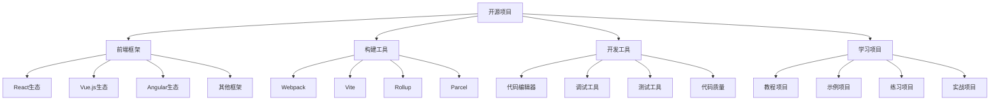

# 开源项目

## 项目分类

### 项目类型


### 项目特点
| 类型 | 特点 | 学习价值 | 适用人群 |
|------|------|----------|----------|
| 框架项目 | 功能完整、架构清晰 | 学习框架设计和实现 | 有经验的开发者 |
| 工具项目 | 功能专一、代码精炼 | 学习工具开发技巧 | 工具开发者 |
| 学习项目 | 结构简单、注释详细 | 学习基础概念和实现 | 初学者 |
| 实战项目 | 功能复杂、贴近实际 | 学习项目开发经验 | 中级开发者 |

## 前端框架

### React生态
```javascript
// 1. 核心项目
const reactProjects = {
    "React核心": {
        "react": "React核心库，组件化UI库",
        "react-dom": "React DOM渲染器",
        "react-reconciler": "React协调器，Fiber架构核心",
        "scheduler": "React调度器，任务调度系统"
    },
    "状态管理": {
        "redux": "可预测的状态容器",
        "mobx": "响应式状态管理",
        "zustand": "轻量级状态管理",
        "jotai": "原子化状态管理"
    },
    "路由管理": {
        "react-router": "React路由库",
        "reach-router": "可访问性路由库",
        "wouter": "轻量级路由库",
        "navi": "声明式路由库"
    },
    "UI组件库": {
        "ant-design": "企业级UI设计语言",
        "material-ui": "Material Design组件库",
        "chakra-ui": "模块化组件库",
        "headless-ui": "无样式组件库"
    }
};

// 2. 学习重点
const reactLearningPoints = {
    "核心概念": [
        "组件化思想",
        "虚拟DOM原理",
        "Fiber架构",
        "Hooks机制"
    ],
    "状态管理": [
        "状态提升",
        "Context API",
        "Redux模式",
        "状态持久化"
    ],
    "性能优化": [
        "组件优化",
        "渲染优化",
        "代码分割",
        "懒加载"
    ],
    "最佳实践": [
        "组件设计",
        "代码组织",
        "测试策略",
        "部署优化"
    ]
};

// 3. 推荐项目
const recommendedReactProjects = {
    "初学者": [
        "react-tutorial",
        "react-basic-examples",
        "react-hooks-examples",
        "react-context-examples"
    ],
    "进阶者": [
        "react-advanced-patterns",
        "react-performance-optimization",
        "react-testing-strategies",
        "react-architecture-patterns"
    ],
    "专家级": [
        "react-internals",
        "react-fiber-architecture",
        "react-reconciler-deep-dive",
        "react-performance-profiling"
    ]
};
```

### Vue.js生态
```javascript
// 1. 核心项目
const vueProjects = {
    "Vue核心": {
        "vue": "Vue.js核心库",
        "vue-router": "Vue.js官方路由",
        "vuex": "Vue.js状态管理",
        "pinia": "Vue.js状态管理库"
    },
    "构建工具": {
        "vite": "下一代前端构建工具",
        "vue-cli": "Vue.js官方脚手架",
        "nuxt": "Vue.js全栈框架",
        "quasar": "Vue.js跨平台框架"
    },
    "UI组件库": {
        "element-plus": "Element Plus组件库",
        "ant-design-vue": "Ant Design Vue组件库",
        "vuetify": "Material Design组件库",
        "naive-ui": "Vue 3组件库"
    },
    "开发工具": {
        "vue-devtools": "Vue.js开发者工具",
        "vue-test-utils": "Vue.js测试工具",
        "vue-loader": "Vue.js单文件组件加载器",
        "vue-template-compiler": "Vue.js模板编译器"
    }
};

// 2. 学习重点
const vueLearningPoints = {
    "核心概念": [
        "响应式系统",
        "组件系统",
        "模板编译",
        "虚拟DOM"
    ],
    "组合式API": [
        "setup函数",
        "响应式API",
        "生命周期钩子",
        "依赖注入"
    ],
    "生态系统": [
        "Vue Router",
        "Pinia状态管理",
        "Vite构建工具",
        "Nuxt全栈框架"
    ],
    "最佳实践": [
        "组件设计",
        "代码组织",
        "性能优化",
        "测试策略"
    ]
};

// 3. 推荐项目
const recommendedVueProjects = {
    "初学者": [
        "vue-basic-examples",
        "vue-composition-api-examples",
        "vue-router-examples",
        "vuex-examples"
    ],
    "进阶者": [
        "vue-advanced-patterns",
        "vue-performance-optimization",
        "vue-testing-strategies",
        "vue-architecture-patterns"
    ],
    "专家级": [
        "vue-internals",
        "vue-reactivity-system",
        "vue-compiler-deep-dive",
        "vue-performance-profiling"
    ]
};
```

### 构建工具
```javascript
// 1. 构建工具项目
const buildTools = {
    "Webpack": {
        "webpack": "模块打包器",
        "webpack-cli": "Webpack命令行工具",
        "webpack-dev-server": "开发服务器",
        "html-webpack-plugin": "HTML插件"
    },
    "Vite": {
        "vite": "快速构建工具",
        "vite-plugin-vue": "Vue插件",
        "vite-plugin-react": "React插件",
        "vite-plugin-legacy": "兼容性插件"
    },
    "Rollup": {
        "rollup": "ES模块打包器",
        "rollup-plugin-typescript": "TypeScript插件",
        "rollup-plugin-babel": "Babel插件",
        "rollup-plugin-terser": "代码压缩插件"
    },
    "Parcel": {
        "parcel": "零配置构建工具",
        "parcel-bundler": "Parcel打包器",
        "parcel-plugin-typescript": "TypeScript插件",
        "parcel-plugin-vue": "Vue插件"
    }
};

// 2. 学习重点
const buildToolLearningPoints = {
    "配置理解": [
        "入口和输出配置",
        "加载器和插件",
        "开发和生产环境",
        "代码分割策略"
    ],
    "性能优化": [
        "构建速度优化",
        "输出文件优化",
        "缓存策略",
        "并行构建"
    ],
    "插件开发": [
        "插件架构",
        "钩子函数",
        "资源处理",
        "代码转换"
    ],
    "最佳实践": [
        "项目结构",
        "配置管理",
        "错误处理",
        "调试技巧"
    ]
};

// 3. 推荐项目
const recommendedBuildProjects = {
    "初学者": [
        "webpack-basic-config",
        "vite-simple-project",
        "rollup-basic-setup",
        "parcel-hello-world"
    ],
    "进阶者": [
        "webpack-advanced-config",
        "vite-plugin-development",
        "rollup-plugin-creation",
        "parcel-optimization"
    ],
    "专家级": [
        "webpack-internals",
        "vite-source-code-analysis",
        "rollup-core-architecture",
        "parcel-performance-optimization"
    ]
};
```

## 开发工具

### 代码编辑器
```javascript
// 1. 编辑器项目
const codeEditors = {
    "VS Code": {
        "vscode": "Visual Studio Code编辑器",
        "vscode-extensions": "VS Code扩展开发",
        "vscode-themes": "VS Code主题开发",
        "vscode-snippets": "VS Code代码片段"
    },
    "Sublime Text": {
        "sublime-text": "Sublime Text编辑器",
        "sublime-packages": "Sublime包开发",
        "sublime-themes": "Sublime主题开发",
        "sublime-snippets": "Sublime代码片段"
    },
    "Atom": {
        "atom": "Atom编辑器",
        "atom-packages": "Atom包开发",
        "atom-themes": "Atom主题开发",
        "atom-snippets": "Atom代码片段"
    },
    "Vim/Neovim": {
        "neovim": "Neovim编辑器",
        "vim-plugins": "Vim插件开发",
        "vim-themes": "Vim主题开发",
        "vim-snippets": "Vim代码片段"
    }
};

// 2. 学习重点
const editorLearningPoints = {
    "扩展开发": [
        "扩展架构",
        "API使用",
        "命令和快捷键",
        "UI组件"
    ],
    "主题开发": [
        "主题结构",
        "颜色配置",
        "语法高亮",
        "图标主题"
    ],
    "代码片段": [
        "片段语法",
        "变量和占位符",
        "条件逻辑",
        "多光标支持"
    ],
    "插件生态": [
        "插件管理",
        "依赖处理",
        "版本控制",
        "发布流程"
    ]
};

// 3. 推荐项目
const recommendedEditorProjects = {
    "初学者": [
        "vscode-hello-world-extension",
        "sublime-simple-package",
        "atom-basic-package",
        "vim-basic-plugin"
    ],
    "进阶者": [
        "vscode-advanced-extension",
        "sublime-complex-package",
        "atom-feature-rich-package",
        "vim-advanced-plugin"
    ],
    "专家级": [
        "vscode-language-server",
        "sublime-language-support",
        "atom-language-grammar",
        "vim-completion-engine"
    ]
};
```

### 测试工具
```javascript
// 1. 测试工具项目
const testingTools = {
    "单元测试": {
        "jest": "JavaScript测试框架",
        "mocha": "JavaScript测试框架",
        "jasmine": "JavaScript测试框架",
        "vitest": "快速测试框架"
    },
    "E2E测试": {
        "cypress": "端到端测试框架",
        "playwright": "跨浏览器测试框架",
        "puppeteer": "Chrome自动化工具",
        "selenium": "Web自动化工具"
    },
    "测试工具": {
        "testing-library": "测试工具库",
        "enzyme": "React测试工具",
        "vue-test-utils": "Vue测试工具",
        "karma": "测试运行器"
    },
    "覆盖率工具": {
        "istanbul": "代码覆盖率工具",
        "nyc": "Istanbul命令行工具",
        "c8": "V8覆盖率工具",
        "jest-coverage": "Jest覆盖率报告"
    }
};

// 2. 学习重点
const testingLearningPoints = {
    "测试策略": [
        "测试金字塔",
        "测试类型选择",
        "测试覆盖率",
        "测试维护"
    ],
    "测试编写": [
        "测试用例设计",
        "断言使用",
        "模拟和存根",
        "异步测试"
    ],
    "测试工具": [
        "测试框架选择",
        "测试工具配置",
        "测试环境搭建",
        "测试数据管理"
    ],
    "最佳实践": [
        "测试命名",
        "测试组织",
        "测试隔离",
        "测试性能"
    ]
};

// 3. 推荐项目
const recommendedTestingProjects = {
    "初学者": [
        "jest-basic-examples",
        "cypress-simple-tests",
        "testing-library-examples",
        "mocha-basic-setup"
    ],
    "进阶者": [
        "jest-advanced-patterns",
        "cypress-complex-scenarios",
        "playwright-cross-browser",
        "testing-library-advanced"
    ],
    "专家级": [
        "jest-internals",
        "cypress-custom-commands",
        "playwright-automation",
        "testing-library-custom-matchers"
    ]
};
```

## 学习项目

### 教程项目
```javascript
// 1. 教程项目类型
const tutorialProjects = {
    "基础教程": {
        "javascript-basics": "JavaScript基础教程项目",
        "html-css-basics": "HTML/CSS基础教程项目",
        "dom-manipulation": "DOM操作教程项目",
        "ajax-fetch": "AJAX和Fetch教程项目"
    },
    "框架教程": {
        "react-tutorial": "React教程项目",
        "vue-tutorial": "Vue.js教程项目",
        "angular-tutorial": "Angular教程项目",
        "svelte-tutorial": "Svelte教程项目"
    },
    "工具教程": {
        "webpack-tutorial": "Webpack教程项目",
        "vite-tutorial": "Vite教程项目",
        "typescript-tutorial": "TypeScript教程项目",
        "eslint-tutorial": "ESLint教程项目"
    },
    "实战教程": {
        "todo-app": "待办事项应用教程",
        "blog-system": "博客系统教程",
        "e-commerce": "电商网站教程",
        "chat-app": "聊天应用教程"
    }
};

// 2. 学习重点
const tutorialLearningPoints = {
    "概念理解": [
        "核心概念掌握",
        "工作原理理解",
        "最佳实践学习",
        "常见问题解决"
    ],
    "实践技能": [
        "代码编写能力",
        "问题调试能力",
        "项目构建能力",
        "工具使用能力"
    ],
    "项目经验": [
        "项目规划能力",
        "代码组织能力",
        "团队协作能力",
        "版本控制能力"
    ],
    "持续学习": [
        "学习资源获取",
        "技术趋势跟踪",
        "社区参与能力",
        "知识分享能力"
    ]
};

// 3. 推荐项目
const recommendedTutorialProjects = {
    "初学者": [
        "javascript-basics-tutorial",
        "html-css-practice",
        "dom-manipulation-examples",
        "simple-calculator"
    ],
    "进阶者": [
        "react-advanced-tutorial",
        "vue-composition-api",
        "typescript-practice",
        "webpack-optimization"
    ],
    "专家级": [
        "react-internals-tutorial",
        "vue-source-code-analysis",
        "advanced-typescript",
        "custom-webpack-plugin"
    ]
};
```

### 示例项目
```javascript
// 1. 示例项目类型
const exampleProjects = {
    "UI组件": {
        "button-component": "按钮组件示例",
        "modal-component": "模态框组件示例",
        "form-component": "表单组件示例",
        "table-component": "表格组件示例"
    },
    "功能模块": {
        "authentication": "身份认证模块",
        "file-upload": "文件上传模块",
        "image-gallery": "图片画廊模块",
        "search-filter": "搜索过滤模块"
    },
    "完整应用": {
        "portfolio-website": "作品集网站",
        "weather-app": "天气应用",
        "recipe-app": "食谱应用",
        "task-manager": "任务管理器"
    },
    "技术演示": {
        "performance-demo": "性能优化演示",
        "accessibility-demo": "可访问性演示",
        "responsive-demo": "响应式设计演示",
        "animation-demo": "动画效果演示"
    }
};

// 2. 学习重点
const exampleLearningPoints = {
    "代码质量": [
        "代码规范",
        "注释文档",
        "错误处理",
        "性能优化"
    ],
    "设计模式": [
        "组件设计",
        "状态管理",
        "数据流设计",
        "架构模式"
    ],
    "用户体验": [
        "界面设计",
        "交互设计",
        "响应式设计",
        "可访问性"
    ],
    "技术实现": [
        "API集成",
        "数据处理",
        "状态管理",
        "路由管理"
    ]
};

// 3. 推荐项目
const recommendedExampleProjects = {
    "初学者": [
        "simple-calculator",
        "todo-list-app",
        "weather-widget",
        "image-slider"
    ],
    "进阶者": [
        "advanced-dashboard",
        "real-time-chat",
        "e-commerce-cart",
        "data-visualization"
    ],
    "专家级": [
        "micro-frontend-architecture",
        "real-time-collaboration",
        "advanced-animations",
        "performance-optimization"
    ]
};
```

## 实战项目

### 企业级项目
```javascript
// 1. 企业级项目特点
const enterpriseProjects = {
    "架构设计": {
        "微前端架构": "大型应用的微前端解决方案",
        "模块化设计": "可维护的模块化架构",
        "状态管理": "复杂应用的状态管理",
        "性能优化": "大规模应用的性能优化"
    },
    "技术栈": {
        "前端框架": "React/Vue/Angular选择",
        "构建工具": "Webpack/Vite/Rollup配置",
        "测试策略": "单元测试/集成测试/E2E测试",
        "部署方案": "CI/CD/容器化/云部署"
    },
    "开发流程": {
        "代码规范": "ESLint/Prettier/TypeScript",
        "版本控制": "Git工作流/分支策略",
        "代码审查": "Pull Request/代码审查",
        "文档管理": "API文档/组件文档"
    },
    "质量保证": {
        "代码质量": "静态分析/代码覆盖率",
        "性能监控": "性能指标/错误监控",
        "安全审计": "安全扫描/漏洞检测",
        "用户体验": "可用性测试/用户反馈"
    }
};

// 2. 学习重点
const enterpriseLearningPoints = {
    "架构思维": [
        "系统设计能力",
        "技术选型能力",
        "扩展性设计",
        "维护性考虑"
    ],
    "工程化能力": [
        "构建工具配置",
        "自动化流程",
        "质量保证体系",
        "部署运维"
    ],
    "团队协作": [
        "代码规范统一",
        "开发流程规范",
        "沟通协作能力",
        "知识分享能力"
    ],
    "问题解决": [
        "复杂问题分析",
        "技术方案设计",
        "性能问题优化",
        "安全风险控制"
    ]
};

// 3. 推荐项目
const recommendedEnterpriseProjects = {
    "初学者": [
        "simple-crm-system",
        "basic-e-commerce",
        "content-management-system",
        "user-management-system"
    ],
    "进阶者": [
        "micro-frontend-platform",
        "real-time-dashboard",
        "advanced-e-commerce",
        "collaborative-editor"
    ],
    "专家级": [
        "large-scale-spa",
        "real-time-analytics",
        "enterprise-portal",
        "multi-tenant-saas"
    ]
};
```

### 开源贡献
```javascript
// 1. 贡献方式
const contributionWays = {
    "代码贡献": {
        "Bug修复": "修复项目中的Bug",
        "功能开发": "开发新功能",
        "性能优化": "优化项目性能",
        "代码重构": "重构代码结构"
    },
    "文档贡献": {
        "README更新": "更新项目说明文档",
        "API文档": "编写API文档",
        "教程文档": "编写使用教程",
        "翻译文档": "翻译项目文档"
    },
    "社区贡献": {
        "问题回答": "回答社区问题",
        "代码审查": "审查Pull Request",
        "功能讨论": "参与功能讨论",
        "用户支持": "提供用户支持"
    },
    "其他贡献": {
        "测试用例": "编写测试用例",
        "示例代码": "提供使用示例",
        "工具开发": "开发相关工具",
        "推广宣传": "推广开源项目"
    }
};

// 2. 贡献流程
const contributionProcess = {
    "项目选择": [
        "选择感兴趣的项目",
        "了解项目背景",
        "阅读贡献指南",
        "加入社区讨论"
    ],
    "环境搭建": [
        "Fork项目仓库",
        "克隆到本地",
        "安装依赖",
        "运行测试"
    ],
    "开发贡献": [
        "创建功能分支",
        "编写代码",
        "添加测试",
        "更新文档"
    ],
    "提交贡献": [
        "提交Pull Request",
        "等待代码审查",
        "根据反馈修改",
        "合并到主分支"
    ]
};

// 3. 学习价值
const contributionValue = {
    "技术提升": [
        "代码质量提升",
        "技术视野拓展",
        "问题解决能力",
        "团队协作能力"
    ],
    "职业发展": [
        "开源经验积累",
        "技术影响力提升",
        "职业网络建立",
        "就业竞争力增强"
    ],
    "社区参与": [
        "技术社区参与",
        "知识分享能力",
        "领导力培养",
        "社会责任意识"
    ]
};
```

## 学习建议

### 项目选择
1. **根据水平选择**
   - 初学者：选择简单易懂的项目
   - 有经验者：选择有挑战性的项目
   - 专家级：选择复杂的企业级项目

2. **根据兴趣选择**
   - 选择自己感兴趣的技术领域
   - 选择有实际应用价值的项目
   - 选择有活跃社区的项目

3. **根据目标选择**
   - 学习新技术：选择技术演示项目
   - 提升技能：选择实战项目
   - 职业发展：选择企业级项目

### 学习方法
1. **系统化学习**
   - 从项目结构开始理解
   - 逐步深入核心功能
   - 理解设计思路和架构

2. **实践驱动**
   - 边看边实践
   - 修改代码验证理解
   - 尝试添加新功能

3. **社区参与**
   - 参与项目讨论
   - 提交Issue和PR
   - 分享学习心得

### 贡献建议
1. **从小做起**
   - 从文档贡献开始
   - 修复简单的Bug
   - 逐步参与核心开发

2. **持续学习**
   - 关注项目更新
   - 学习新技术
   - 提升代码质量

3. **建立声誉**
   - 保持高质量的贡献
   - 积极参与社区讨论
   - 帮助其他贡献者

## 相关链接
- [[06-资源工具/03-学习资源/01-推荐书籍]] - 推荐书籍
- [[06-资源工具/03-学习资源/02-视频教程]] - 视频教程
- [[06-资源工具/03-学习资源/03-技术博客]] - 技术博客
- [[00-学习指南/01-学习路径图]] - 学习路径图
