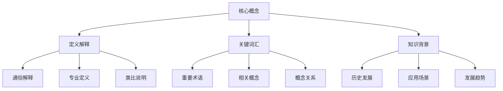

# 学习笔记模板

## 🎯 学习目标
- 建立系统化的学习笔记框架
- 掌握高效的知识管理方法
- 学会使用Obsidian的链接和标签系统
- 形成知识体系化的思维习惯

## 📚 学习笔记框架

### 知识金字塔模型


### 笔记结构模板

```markdown
---
tags: [学习标签, 知识分类]
status: [学习状态] # learning/completed/reviewing
difficulty: [难度等级] # beginner/intermediate/advanced
created: [创建日期]
updated: [更新日期]
---

# [主题名称]

## 📋 学习概览
- **学习目标**: 明确要掌握什么
- **前置知识**: 需要什么基础
- **预计用时**: 学习时间规划
- **重点难点**: 核心挑战识别

## 🎯 核心概念
### [概念1] - 基础认知
- **定义**: 是什么
- **特征**: 有什么特点
- **应用**: 如何运用

### [概念2] - 深入理解
- **原理**: 为什么这样
- **机制**: 如何工作
- **关系**: 与什么相关

## 💡 关键洞察
### 重要发现
- 学习过程中的重要发现和感悟

### 思维突破
- 思维方式的变化和突破

### 实践应用
- 实际应用的想法和计划

## 📝 学习记录
### 学习过程
- [日期] - 学习内容的记录

### 问题解决
- 遇到的问题和解决过程

### 知识关联
- 与已有知识的连接

## 🔗 知识网络
### 相关链接
- [[相关知识点1]]
- [[相关知识点2]]
- [[相关知识点3]]

### 学习路径
- ← [[前置知识点]]
- → [[后续知识点]]

### 实践应用
- [[实践项目1]]
- [[实践项目2]]
```

## 📖 学习阶段模板

### 基础认知阶段模板
```markdown
---
tags: [基础学习]
status: learning
level: beginner
---

# [知识点] - 基础认知

## 📚 基本概念
### 什么是[概念]
- **简单定义**: ...
- **通俗理解**: ...
- **生活类比**: ...

### 核心特征
- 特征1: ...
- 特征2: ...
- 特征3: ...

## 🎨 应用示例
### 基础示例
```php
// [具体代码示例]
```

### 理解要点
- 需要注意的要点1
- 需要注意的要点2

## 🤔 自我测试
### 理解检查
1. [概念]的本质是什么？
2. 为什么需要[概念]？
3. 如何区分[概念]与其他概念？

### 记忆技巧
- 记忆要点1
- 记忆要点2

## 🔗 知识连接
- [[前置概念]]
- → [[深入概念]]

---
**学习记录**:
- **[日期]**: 开始学习
- **[日期]**: 完成理解测试
- **[日期]**: 准备深入学习
```

### 理解应用阶段模板
```markdown
---
tags: [深入学习, 实践应用]
status: learning
level: intermediate
---

# [知识点] - 理解应用

## 🔍 深入理解
### 工作原理
- **核心机制**: ...
- **实现原理**: ...
- **设计思想**: ...

### 使用场景
| 场景 | 优势 | 限制 | 适用条件 |
|------|------|------|----------|
| 场景1 | ... | ... | ... |
| 场景2 | ... | ... | ... |

## 💻 代码实践
### 核心实现
```php
<?php
// [核心代码实现]
?>
```

### 编程要点
- 编程要点1
- 编程要点2

## 🎯 实战项目
### 项目应用
**项目**: [项目名称]
**目标**: 应用[知识点]解决实际问题
**实现步骤**:
1. 步骤1
2. 步骤2
3. 步骤3

### 问题解决
**问题**: ... 
**思考过程**: ...
**解决方案**: ...
**经验总结**: ...

## 🔄 知识迁移
### 相似概念对比
- [概念A] vs [概念B]
- [概念C] vs [概念D]

### 应用扩展
- 可以在...场景中使用
- 可以结合...一起使用

## 🔗 深化路径
- ← [[基础概念]]
- 当前: [[应用概念]]
- → [[高级概念]]
```

### 掌握精通阶段模板
```markdown
---
tags: [深度掌握, 专家级别]
status: completed
level: advanced
---

# [知识点] - 掌握精通

## 🎓 深度掌握
### 系统理解
- **系统视角**: 在整个知识体系中的位置
- **内在联系**: 与其他概念的内在关系
- **发展趋势**: 技术发展方向和未来

### 专家级洞察
- 关键洞察1
- 关键洞察2
- 应用场景的深度分析

## 🛠️ 高级应用
### 复杂场景实现
```php
<?php
// [高级代码实现]
class AdvancedImplementation {
    // 高级实现...
}
?>
```

### 性能优化
- 优化点1
- 优化点2

### 最佳实践
- 实践1
- 实践2

## 🏆 专家能力
### 问题诊断
**高级问题**: 复杂环境下的问题
**诊断思路**: 系统性分析
**解决方案**: 最优解决方案

### 设计决策
**场景**: 需要做出设计选择的情况
**考虑因素**: 多维度权衡
**决策理由**: 基于什么做出决定

## 📈 知识输出
### 教学他人
- 如何向新手解释
- 如何向专家讨论

### 技术突破
- 自我优化思路
- 创新应用想法

## 🔗 专家网络
- [[相关专家知识]]
- [[前沿技术]]
- [[最佳实践]]
```

## 📊 学习进度管理

### 学习进度追踪模板
```markdown
---
tags: [进度管理]
status: tracking
---

# [主题] - 学习进度追踪

## 📅 时间规划
- **开始时间**: ...
- **计划完成**: ...
- **实际进度**: ...

## 📋 学习清单
### 理论学习
- [ ] 基础概念理解
- [ ] 原理机制学习
- [ ] 技术要点掌握

### 实践练习
- [ ] 基础代码练习
- [ ] 项目应用实践
- [ ] 问题解决练习

### 能力测试
- [ ] 自我测试通过
- [ ] 实践项目完成
- [ ] 理解解释能力

## 📊 掌握程度评估
| 知识维度 | 当前水平 | 目标水平 | 达成度 |
|---------|----------|----------|--------|
| 理论理解 | ★★☆ | ★★★★ | 50% |
| 实践应用 | ★☆☆ | ★★★☆ | 25% |
| 深度应用 | ★☆☆ | ★★★ | 20% |

## 🔄 学习反馈
### 本周收获
- 收获1
- 收获2

### 遇到困难
- 困难1
- 困难2

### 改进计划
- 改进措施1
- 改进措施2
```

## 🧠 知识管理技巧

### 费曼学习法在笔记中的应用
```markdown
# [概念] - 费曼学习法应用

## 1️⃣ 选择概念
- **选择**: [要学习的核心概念]
- **记录**: 在学习笔记中的位置

## 2️⃣ 教授他人
### 用简单语言解释
- **我的解释**: ...（用自己的话）
- **关键点**: ...（最核心的部分）

### 想象教学场景
- **听众**: 假设要向谁解释
- **场景**: 在什么场合下解释
- **目标**: 希望对方掌握到什么程度

## 3️⃣ 识别盲点
- **理解不清之处**: ...
- **无法解释的概念**: ...
- **容易混淆的地方**: ...

## 4️⃣ 重新学习
- **盲点1**: 重新学习计划
- **盲点2**: 重新学习计划
- **验证方式**: 如何确认理解

## 🔗 费曼循环
- ← [[步骤1-选择概念]]
- ← [[步骤2-教授他人]]  
- → [[步骤3-识别盲点]]
- → [[步骤4-重新学习]]
```

### Obsidian链接技巧
```markdown
# Obsidian链接使用技巧

## 🔗 双向链接体系
### 概念链接
- [[概念A]] - 核心概念的核心链接
- [[概念A#特定部分]] - 链接到具体部分
- [[概念A#特定部分^具体段落]] - 链接到具体段落

### 关系链接
- [[概念A]] ←→ [[概念B]] # 双向关系
- [[概念A]] → [[概念B]] → [[概念C]] # 学习路径
- 见 [[概念A]] 的详细说明 # 引用关系

## 🏷️ 标签系统
### 标签层次结构
- #学习/PHP/基础 # 主题标签
- #状态/学习中 # 状态标签  
- #难度/初级 # 难度标签
- #项目/应用实践 # 项目标签

### 标签使用原则
- **扁平化**: 避免过深嵌套
- **可复用**: 标签可以重复使用
- **具体化**: 标签足够具体便于筛选
```

## 📈 复习和回顾

### 定期复习模板
```markdown
# [主题] - 学习回顾

## 📅 复习日程
- **首次学习**: [日期]
- **第一次复习**: [日期] (1天后)
- **第二次复习**: [日期] (1周后)
- **第三次复习**: [日期] (1个月后)
- **深度回顾**: [日期] (根据需要)

## ✅ 复习检查清单
### 概念检查
- [ ] 能用自己的话解释[核心概念]
- [ ] 能举例说明[核心概念]的应用
- [ ] 能区分[核心概念]与其他概念

### 应用检查  
- [ ] 能独立完成基础应用
- [ ] 能处理常见问题
- [ ] 能优化和改进应用

### 深度检查
- [ ] 理解核心机制原理
- [ ] 能设计复杂应用场景
- [ ] 能向他人解释和教学

## 🔄 遗忘曲线应对
### 遗忘规律
- Day 1: 忘记 ___
- Day 7: 忘记 ___
- Day 30: 忘记 ___

### 复习策略
- **密集复习**: 学习后1天内的主动复习
- **间隔复习**: 1周后、1月后的回顾
- **应用复习**: 通过实际项目加深记忆
```

## 🎯 刻意练习模板

### 技能练习计划
```markdown
# [技能] - 刻意练习计划

## 🎯 练习目标
- **主要目标**: 掌握[具体技能]
- **测试标准**: 能够[具体的测试要求]
- **时间安排**: [总共需要的时间]

## 📋 练习清单
### 基础练习
- [ ] 任务1: [具体要求]
- [ ] 任务2: [具体要求]  
- [ ] 任务3: [具体要求]

### 进阶练习
- [ ] 挑战1: [进阶要求]
- [ ] 挑战2: [进阶要求]
- [ ] 挑战3: [进阶要求]

### 创造性练习
- [ ] 创新1: [创新任务]
- [ ] 创新2: [创新任务]

## 📊 进步追踪
### 第一周
- **完成情况**: ...
- **发现的问题**: ...
- **改进计划**: ...

### 第二周  
- **完成情况**: ...
- **能力提升:** ...
- **下阶段重点**: ...

## 🔄 反馈循环
### 即时反馈
- **自我评估**: [评分标准]
- **问题识别**: [识别方法]

### 延后反馈
- **结果评估**: [评估标准]
- **调整改进**: [改进措施]
```

## 🎓 学习总结

### 学习心得模板
```markdown
# [主题] - 学习总结

## 🏆 学习成果
### 知识收获
- 学会了[知识点1]
- 理解了[知识点2]  
- 掌握了[知识点3]

### 能力提升
- **编程能力**: 从...到...
- **思维能力**: 从...到...
- **解决问题能力**: 从...到...

## 💡 关键洞察
### 重要发现
- 发现1: ...
- 发现2: ...

### 思维突破
- 打破了[思维局限]
- 形成了[新的思维方式]

## 🚀 应用规划
### 短期应用
- 在[项目1]中应用
- 解决[问题1]

### 长期发展
- 深入学习[方向1]
- 扩展到[相关领域]

## 🙏 学习感悟
### 学习体会
- 感触1
- 感触2

### 给未来学习者的建议
- 建议1
- 建议2
```

## 🔗 相关链接
- [[00-学习导航/01-学习路径图|学习路径图]]
- [[00-学习导航/03-学习进度追踪|学习进度追踪]]
- [[98-学习工具/02-调试技巧集|调试技巧集]]
- [[01-基础认知层/语言特性与运行环境/01-PHP语言特性|PHP语言特性]]
- [[02-核心理解层/面向对象编程/01-类与对象基础|面向对象基础]]
