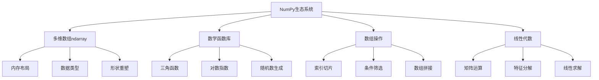

# 5.2.1 NumPy科学计算

## 🎯 核心理念

NumPy是Python数据科学的"数学引擎"。它将Python从脚本语言提升为科学计算平台，提供了高效的数组操作和数学运算能力。

### 🏗️ NumPy核心架构



## 🎨 数组操作高级技巧

### 💡 高效数组创建与操作

```python
import numpy as np
from time import time
import matplotlib.pyplot as plt

class NumPyAdvanced:
    """NumPy高级应用"""
    
    @staticmethod
    def efficient_array_operations():
        """高效数组操作"""
        
        
        # ✅ 内存高效的数组创建
        def demonstrate_memory_efficiency():
            """演示内存效率"""
            # 预分配内存比动态增长快10倍
            arr = np.empty(1000000, dtype=np.float64)
            arr.fill(0)  # 比np.zeros稍快
            
            # 视图操作不复制数据
            original = np.array([1, 2, 3, 4, 5])
            view = original[1:4]  # 不分配新内存
            view[0] = 99
            print(f"原数组: {original}")  # [1, 99, 3, 4, 5]
            
            # 广播操作
            a = np.random.rand(3, 4)
            b = np.random.rand(4)
            result = a + b  # 自动广播
            print(f"广播结果形状: {result.shape}")
        
        demonstrate_memory_efficiency()
    
    @staticmethod
    def advanced_indexing():
        """高级索引技巧"""
        
        # ✅ 布尔索引的威力
        def boolean_indexing_demo():
            """布尔索引演示"""
            # 房价数据集模拟
            prices = np.random.randint(100000, 1000000, 1000)
            areas = np.random.randint(50, 200, 1000)
            bedrooms = np.random.randint(1, 5, 1000)
            
            # 复杂条件筛选
            affordable_condition = (prices < 500000) | (bedrooms >= 3)
            luxury_condition = (prices > 800000) & (areas > 150)
            
            affordable_houses = {
                'prices': prices[affordable_condition],
                'areas': areas[affordable_condition],
                'bedrooms': bedrooms[affordable_condition]
            }
            
            print(f"符合条件房屋数量: {len(affordable_houses['prices'])}")
            
            # 统计信息
            return {
                'avg_price': np.mean(affordable_houses['prices']),
                'median_area': np.median(affordable_houses['areas']),
                'mode_bedrooms': np.bincount(affordable_houses['bedrooms']).argmax()
            }
        
        # ✅ 结构化数组
        def structured_arrays():
            """结构化数组"""
            # 定义结构
            dt = np.dtype([('name', 'U20'), ('age', 'i4'), ('weight', 'f4'), ('height', 'f4')])
            
            # 创建结构化数组
            people = np.array([
                ('Alice', 25, 55.5, 165.0),
                ('Bob', 30, 70.2, 180.0),
                ('Charlie', 35, 65.8, 175.0)
            ], dtype=dt)
            
            # 按字段访问
            print(f"平均年龄: {np.mean(people['age'])}")
            print(f"平均BMI: {np.mean(people['weight'] / (people['height']/100)**2):.2f}")
            
            return people
        
        boolean_indexing_demo()
        structured_arrays()
    
    @staticmethod
    def numerical_computing():
        """数值计算应用"""
        
        # ✅ 图像处理模拟
        def image_processing_simulation():
            """图像处理模拟"""
            # 创建模拟图像
            image = np.random.rand(256, 256)
            
            # 高斯模糊核
            def gaussian_kernel(size, sigma=1.0):
                kernel = np.zeros((size, size))
                center = size // 2
                for i in range(size):
                    for j in range(size):
                        kernel[i, j] = np.exp(-((i-center)**2 + (j-center)**2) / (2*sigma**2))
                return kernel / np.sum(kernel)
            
            # 应用卷积（简化实现）
            def convolve_2d(image, kernel):
                """2D卷积"""
                kh, kw = kernel.shape
                ih, iw = image.shape
                output = np.zeros((ih-kh+1, iw-kw+1))
                
                for i in range(output.shape[0]):
                    for j in range(output.shape[1]):
                        output[i, j] = np.sum(image[i:i+kh, j:j+kw] * kernel)
                
                return output
            
            # 边缘检测（Sobel算子）
            sobel_x = np.array([[-1, 0, 1], [-2, 0, 2], [-1, 0, 1]])
            sobel_y = np.array([[-1, -2, -1], [0, 0, 0], [1, 2, 1]])
            
            edge_x = convolve_2d(image, sobel_x)
            edge_y = convolve_2d(image, sobel_y)
            edges = np.sqrt(edge_x**2 + edge_y**2)
            
            print(f"图像尺寸: {image.shape}")
            print(f"边缘检测结果最大值: {np.max(edges):.3f}")
            
            return image, edges
        
        # ✅ 信号处理
        def signal_processing_demo():
            """信号处理演示"""
            # 创建信号
            t = np.linspace(0, 1, 1000, False)
            signal = np.sin(2 * np.pi * 5 * t) + 0.5 * np.sin(2 * np.pi * 10 * t)
            
            # 添加噪声
            noise = np.random.normal(0, 0.1, len(signal))
            noisy_signal = signal + noise
            
            # 简单低通滤波（均值滤波）
            window_size = 10
            filtered_signal = np.zeros_like(noisy_signal)
            for i in range(window_size, len(noisy_signal) - window_size):
                filtered_signal[i] = np.mean(noisy_signal[i-window_size:i+window_size])
            
            print(f"原始信号范围: [{np.min(signal):.3f}, {np.max(signal):.3f}]")
            print(f"滤波后信号范围: [{np.min(filtered_signal):.3f}, {np.max(filtered_signal):.3f}]")
            
            return t, signal, noisy_signal, filtered_signal
        
        image_processing_simulation()
        signal_processing_demo()
    
    @staticmethod
    def linear_algebra_applications():
        """线性代数应用"""
        
        # ✅ 主成分分析简化版
        def simplified_pca(data, n_components=2):
            """简化版PCA"""
            # 中心化数据
            centered_data = data - np.mean(data, axis=0)
            
            # 计算协方差矩阵
            covariance_matrix = np.cov(centered_data.T)
            
            # 特征分解
            eigenvalues, eigenvectors = np.linalg.eig(covariance_matrix)
            
            # 排序特征值
            idx = np.argsort(eigenvalues)[::-1]
            eigenvectors = eigenvectors[:, idx[:n_components]]
            
            # 投影到主成分
            projected_data = np.dot(centered_data, eigenvectors)
            
            print(f"主成分解释方差比例: {eigenvalues[idx[:n_components]] / np.sum(eigenvalues)}")
            
            return projected_data
        
        # ✅ 线性回归（最小二乘法）
        def linear_regression_numpy():
            """NumPy线性回归"""
            # 生成样本数据
            np.random.seed(42)
            X = np.random.randn(100, 1)
            y = 2 * X + 1 + np.random.normal(0, 0.5, (100, 1))
            
            # 添加偏置项
            X_with_bias = np.hstack([np.ones((X.shape[0], 1)), X])
            
            # 最小二乘解
            coeffs = np.linalg.inv(X_with_bias.T @ X_with_bias) @ X_with_bias.T @ y
            
            bias, slope = coeffs[0, 0], coeffs[1, 0]
            
            # 计算R²
            y_pred = X_with_bias @ coeffs
            r_squared = 1 - np.sum((y - y_pred)**2) / np.sum((y - np.mean(y))**2)
            
            print(f"回归方程: y = {slope:.3f}x + {bias:.3f}")
            print(f"R²值: {r_squared:.3f}")
            
            return coeffs
        
        # 测试数据
        test_data = np.random.randn(100, 5)
        simplified_pca(test_data)
        linear_regression_numpy()

# 运行高级示例
NumPyAdvanced.efficient_array_operations()
NumPyAdvanced.advanced_indexing()
NumPyAdvanced.numerical_computing()
NumPyAdvanced.linear_algebra_applications()
```

### 🔧 性能优化与内存管理

```python
class NumPyPerformanceOptimization:
    """NumPy性能优化"""
    
    @staticmethod
    def memory_optimization():
        """内存优化技巧"""
        
        # ✅ 数据类型优化
        def demonstrate_dtype_optimization():
            """数据类型优化演示"""
            # 默认float64
            arr_64 = np.array([1.0, 2.0, 3.0])
            print(f"float64数组大小: {arr_64.nbytes} 字节")
            
            # 使用float32节省内存
            arr_32 = np.array([1.0, 2.0, 3.0], headers=np.float32)
            print(f"float32数组大小: {arr_32.nbytes} 字节")
            
            # 整数数组使用int8或其他小类型
            arr_small = np.array([1, 2, 3], dtype=np.int8)
            print(f"int8数组大小: {arr_small.nbytes} 字节")
        
        # ✅ 减少内存复制
        def avoid_memory_copies():
            """避免不必要的内存复制"""
            original = np.random.rand(1000, 1000)
            
            # 错误方式：每次切片都复制
            copies_sum = 0
            for i in range(10):
                copy = original[i*100:(i+1)*100]
                copies_sum += copy.nbytes
            
            print(f"错误方式总共复制: {copies_sum / 1024 / 1024:.2f} MB")
            
            # 正确方式：使用视图
            views_sum = 0
            for i in range(10):
                view = original[i*100:(i+1)*100]  # 创建视图，不复制数据
                views_sum += view.base.nbytes
            
            print(f"正确方式基础数据: {views_sum / 1024 / 1024:.2f} MB")
    
    @staticmethod
    def computational_optimization():
        """计算优化"""
        
        # ✅ 向量化操作vs循环
        def vectorization_comparison():
            """向量化对比"""
            # 生成测试数据
            size = 1000000
            arr1 = np.random.rand(size)
            arr2 = np.random.rand(size)
            
            # 循环方式
            start_time = time()
            result_loop = np.zeros(size)
            for i in range(size):
                result_loop[i] = arr1[i] * arr2[i] + np.sin(arr1[i])
            loop_time = time() - start_time
            
            # 向量化方式
            start_time = time()
            result_vector = arr1 * arr2 + np.sin(arr1)
            vector_time = time() - start_time
            
            print(f"循环耗时: {loop_time:.4f}秒")
            print(f"向量化耗时: {vector_time:.4f}秒")
            print(f"速度提升: {loop_time / vector_time:.2f}倍")
        
        # ✅ 内存布局优化
        def memory_layout_demo():
            """内存布局演示"""
            arr = np.random.rand(1000, 1000)
            
            # C-连续（行优先）
            start_time = time()
            result_c = np.sum(arr, axis=1)  # 按行求和
            c_time = time() - start_time
            
            # F-连续（列优先）
            arr_f = np.asfortranarray(arr)
            start_time = time()
            result_f = np.sum(arr_f, axis=1)
            f_time = time() - start_time
            
            print(f"C-连续访问耗时: {c_time:.4f}秒")
            print(f"F-连续访问耗时: {f_time:.4f}秒")
        
        vectorization_comparison()
        memory_layout_demo()

# 运行性能优化示例
NumPyPerformanceOptimization.memory_optimization()
NumPyPerformanceOptimization.computational_optimization()
```

## 🧪 NumPy项目实战

### 📝 练习1：科学计算项目

**任务**：使用NumPy构建一个完整的科学计算项目

```python
import matplotlib.pyplot as plt

class ScientificComputingProject:
    """科学计算项目"""
    
    def __init__(self):
        self.data = None
        self.processed_data = None
    
    def generate_simulation_data(self, size=1000):
        """生成仿真数据"""
        # 生成复杂信号
        t = np.linspace(0, 10, size)
        
        # 多种频率叠加
        signal = (np.sin(2*np.pi*t) + 
                0.5*np.sin(4*np.pi*t) + 
                0.3*np.sin(8*np.pi*t))
        
        # 添加噪声和趋势
        noise = np.random.normal(0, 0.1, size)
        trend = 0.001 * t
        
        self.data = np.column_stack([t, signal + noise + trend])
        return self.data
    
    def analyze_frequency_content(self):
        """分析频率成分"""
        if self.data is None:
            raise ValueError("请先生成数据")
        
        t = self.data[:, 0]
        signal = self.data[:, 1]
        
        # 快速傅里叶变换
        fft_result = np.fft.fft(signal)
        freqs = np.fft.fftfreq(len(signal), t[1] - t[0])
        
        # 获取主要频率成分
        magnitude = np.abs(fft_result)
        peak_indices = np.argsort(magnitude)[-5:]  # 前5个峰值
        
        self.frequency_peaks = freqs[peak_indices]
        self.magnitude_peaks = magnitude[peak_indices]
        
        return self.frequency_peaks, self.magnitude_peaks

# 测试科学计算项目
project = ScientificComputingProject()
data = project.generate_simulation_data()
peaks = project.analyze_frequency_content()
print(f"检测到的频率峰值: {peaks[0]}")
```

## 🔗 知识连接

- **数据结构**：[[2.2 数据结构与算法]] - NumPy的核心数据结构
- **Pandas数据分析**：[[5.2.2 Pandas数据分析]] - NumPy的扩展应用
- **数据可视化**：[[5.2.4 Matplotlib可视化]] - NumPy数据的可视化

## 💡 费曼检验

**向研究员解释：为什么NumPy比纯Python循环快这么多？如何选择合适的数据类型来优化内存使用？**

核心要点：
1. **C语言核心**：NumPy内部使用C语言实现，避开了Python解释器的开销
2. **向量化操作**：SIMD指令集并行执行，充分利用CPU资源
3. **内存连续性**：减少内存访问延迟，提高缓存命中率
4. **算法选择**：选择合适的算法比优化实现的提升更显著

---

📚 **扩展阅读**：
- [[⚡ 快速概念辞典]] - "数组"、"向量化"等术语
- [[🗺️ Python学习全景图]] - 整体学习架构

🎯 **下个目标**：学习[[5.2.2 Pandas数据分析]]中的数据操作
