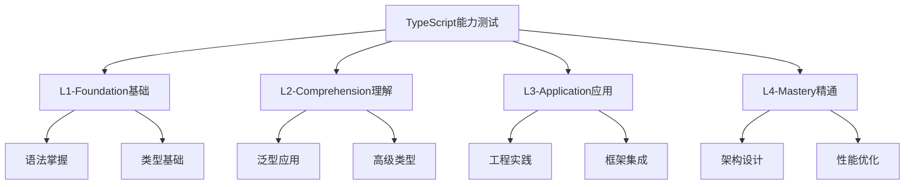

# TypeScript 分层能力测试

## 🎯 测试框架概览

### 📊 测试层级划分



## 📚 L1 Foundation - 基础能力测试

### 🎯 L1.1 语法掌握测试

**测试题1: 类型注解**
```typescript
// 任务：为以下函数添加正确的类型注解
function processData(input) {
    return {
        original: input,
        processed: String(input).toUpperCase(),
        length: String(input).length
    };
}

// 期望：
function processData(input: unknown) {
    return {
        original: input,
        processed: string,
        length: number
    };
}
```

**测试题2: 接口设计**
```typescript
// 任务：设计电商购物车接口
interface ShoppingCart {
    // 补充完整的购物车接口定义
}
```

### 🎯 L1.2 基础类型测试

**测试题3: 联合类型**
```typescript
// 任务：实现一个状态管理函数
type ValidStatus = 'loading' | 'success' | 'error';
function handleStatus(status: ValidStatus): string {
    // 使用 switch 语句实现状态处理
}
```

## 💡 L2 Comprehension - 理解能力测试

### 🎯 L2.1 泛型应用测试

**测试题4: 泛型函数**
```typescript
// 任务：实现一个类型安全的缓存类
class Cache<T> {
    // 实现 get, set, has, clear 方法
    // 要求：所有操作都是类型安全的
}
```

**测试题5: 条件类型**
```typescript
// 任务：实现工具类型
type DeepReadonly<T> = // 递归将所有属性设为只读
type Optional<T, K extends keyof T> = // 使指定属性可选
```

### 🎯 L2.2 高级类型测试

**测试题6: 映射类型**
```typescript
// 任务：实现高级映射类型
type PickByType<T, U> = // 根据值类型挑选属性
type ChangeFieldType<T, K, U> = // 更改字段类型
```

## 🚀 L3 Application - 应用能力测试

### 🎯 L3.1 工程实践测试

**测试题7: 模块设计**
```typescript
// 任务：设计一个用户管理系统模块
// 包含：用户接口、服务类、验证器、类型定义
namespace UserManagement {
    // 实现完整的用户管理系统
}
```

**测试题8: 错误处理**
```typescript
// 任务：实现类型安全的错误处理
class Result<T, E = Error> {
    // 实现类似 Result<T, E> 的错误处理模式
    // 包含 success, error, map, flatMap 方法
}
```

### 🎯 L3.2 框架集成测试

**测试题9: React Hook类型安全**
```typescript
// 任务：实现类型安全的自定义Hook
function useApiCall<T>(
    url: string,
    config?: RequestInit
): {
    data: T | null;
    loading: boolean;
    error: string | null;
    refetch: () => Promise<void>;
} {
    // 实现完整的API调用Hook
}
```

## 🎖️ L4 Mastery - 精通能力测试

### 🎯 L4.1 架构设计测试

**测试题10: 设计模式实现**
```typescript
// 任务：实现观察者模式的事件系统
interface EventEmitter<T> {
    // 设计一个完全类型安全的事件系统
    // 包含：订阅、取消订阅、触发、批量操作
}

class TypedEventEmitter<T> implements EventEmitter<T> {
    // 实现完整的事件系统
}
```

**测试题11: 多项目管理**
```typescript
// 任务：设计微前端架构的类型系统
interface MicrofrontendArchitecture {
    // 定义主应用、子应用、通信机制的类型
    // 确保类型安全的应用间通信
}
```

### 🎯 L4.2 性能优化测试

**测试题12: 编译器优化**
```typescript
// 任务：优化以下代码的编译性能
// 要求：减少类型计算复杂度，提升编译速度

// 原始代码（可能存在问题）
type ComplexUnion<T> = T extends string ? 
    T extends 'a' ? 'type_a' :
    T extends 'b' ? 'type_b' : 'unknown_string' :
T extends number ? 
    T extends 0 ? 'zero' :
    T extends 1 ? 'one' : 'unknown_number' : 'unknown';
```

## 📊 评分标准

### 🎯 L1 Foundation (40分)
- **语法准确度**: 10分
- **类型注解**: 10分  
- **基础理解**: 10分
- **编程习惯**: 10分

### 💡 L2 Comprehension (30分)
- **泛型应用**: 10分
- **类型设计**: 10分
- **模式识别**: 10分

### 🚀 L3 Application (20分)
- **工程实践**: 10分
- **框架集成**: 10分

### 🎖️ L4 Mastery (10分)
- **架构设计**: 5分
- **性能优化**: 5分

## 🔍 自测建议

1. **循序渐进**: 按L1→L4顺序完成测试
2. **时间控制**: 每层测试建议30-45分钟
3. **重点复习**: 根据错误重点复习对应知识点
4. **实践验证**: 所有代码都应该实际运行测试

---
*💡 通过分层测试，准确评估自己在TypeScript学习路径上的位置，制定针对性的学习计划*
