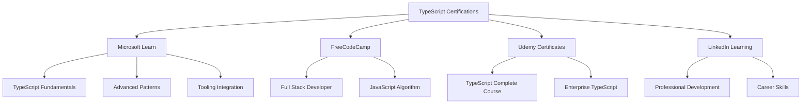

# TypeScript 认证考试预备指南

## 🎯 TypeScript 认证概览

### 📊 主流认证体系



## 🔧 TypeScript Fundamentals 认证

### 💡 基础知识要点

```typescript
// 1. Type System Fundamentals - 类型系统基础
// Type Compatibility - 类型兼容性

// Structural Typing - 结构类型
interface NamedValue {
    name: string;
}

interface Point2D {
    x: number;
    y: number;
}

// NamedValue 和 Point2D 在结构上兼容
function processNamedValue(value: NamedValue): void {
    console.log(value.name);
}

const point: Point2D = { x: 10, y: 20 };
processNamedValue(point); // ✅ OK: TypeScript allows this

// Duck Typing - 鸭子类型
interface HasLength {
    length: number;
}

function printLength(obj: HasLength): void {
    console.log(`Length: ${obj.length}`);
}

const arr = [1, 2, 3];
const str = "hello";
printLength(arr); // ✅ OK
printLength(str); // ✅ OK

// Array 和 String 都有 length 属性，因此兼容 HasLength

// Type Guard Functions - 类型守护函数
function isString(value: unknown): value is string {
    return typeof value === "string";
}

function isNumberArray(value: unknown): value is number[] {
    return Array.isArray(value) && value.every(item => typeof item === "number");
}

// Usage
function processValue(value: unknown): string {
    if (isString(value)) {
        return value.toUpperCase(); // TypeScript knows this is string
    }
    
    if (isNumberArray(value)) {
        return value.join(", "); // TypeScript knows this is number[]
    }
    
    return String(value);
}

// 2. Generic Programming - 泛型编程
// Basic Generics - 基础泛型
function identity<T>(arg: T): T {
    return arg;
}

function firstElement<T>(arr: T[]): T | undefined {
    return arr[0];
}

function createPair<T, U>(first: T, second: U): [T, U] {
    return [first, second];
}

// Generic Constraints - 泛型约束
interface Lengthwise {
    length: number;
}

function loggingIdentity<T extends Lengthwise>(arg: T): T {
    console.log(arg.length); // 现在我们知道 arg 有 length 属性
    return arg;
}

// loggingIdentity(3); // ❌ Error: Argument of type 'number' is not assignable to parameter of type 'Lengthwise'
loggingIdentity("hello"); // ✅ OK
loggingIdentity([1, 2, 3]); // ✅ OK

// Keyof and Indexed Access Types - keyof 和索引访问类型
interface Person {
    name: string;
    age: number;
    email: string;
}

type PersonKeys = keyof Person; // "name" | "age" | "email"
type PersonName = Person["name"]; // string
type PersonAge = Person["age"]; // number

function getProperty<T, K extends keyof T>(obj: T, key: K): T[K] {
    return obj[key];
}

const person: Person = { name: "Alice", age: 30, email: "alice@example.com" };
const name = getProperty(person, "name"); // Type is string
const age = getProperty(person, "age"); // Type is number

// Conditional Types - 条件类型
type ApiResponse<T> = T extends string ? string[] : number[];

type StringResponse = ApiResponse<string>; // string[]
type NumberResponse = ApiResponse<number>; // number[]

// NonNullable utility type implementation
type NonNullable<T> = T extends null | undefined ? never : T;

type OptionalString = string | null | undefined;
type RequiredString = NonNullable<OptionalString>; // string

// Multiple Conditional Types - 多条件类型
type TypeName<T> = 
    T extends string ? "string" :
    T extends number ? "number" :
    T extends boolean ? "boolean" :
    T extends undefined ? "undefined" :
    T extends null ? "null" :
    T extends Function ? "function" :
    "object";

type StringTypeName = TypeName<string>; // "string"
type NumberTypeName = TypeName<number>; // "number"
type ObjectTypeName = TypeName<Date>; // "object"

// 3. Advanced Type Manipulation - 高级类型操作
// Mapped Types - 映射类型
type Readonly<T> = {
    readonly [P in keyof T]: T[P];
};

type Partial<T> = {
    [P in keyof T]?: T[P];
};

type Required<T> = {
    [P in keyof T]-?: T[P];
};

type Pick<T, K extends keyof T> = {
    [P in K]: T[P];
};

type Omit<T, K extends keyof T> = Pick<T, Exclude<keyof T, K>>;

// Example usage
interface User {
    id: string;
    name: string;
    email?: string;
    age: number;
}

type ReadonlyUser = Readonly<User>;
type PartialUser = Partial<User>;
type UserName = Pick<User, "name">;
type UserWithoutAge = Omit<User, "age">;

// Template Literal Types - 模板字面量类型
type EventName<T extends string> = `on_${T}`;

type ClickEvent = EventName<"click">; // "on_click"
type MouseEvent = EventName<"mousemove">; // "on_mousemove"

// Infer and Conditional Types - Infer 和条件类型
type ReturnType<T> = T extends (...args: any[]) => infer R ? R : never;

function getString(): string {
    return "hello";
}

function getNumber(): number {
    return 42;
}

type GetStringReturn = ReturnType<typeof getString>; // string
type GetNumberReturn = ReturnType<typeof getNumber>; // number

// Utility Types Practice - 实用工具类型练习
type DeepReadonly<T> = {
    readonly [P in keyof T]: T[P] extends object ? DeepReadonly<T[P]> : T[P];
};

type DeepPartial<T> = {
    [P in keyof T]?: T[P] extends object ? DeepPartial<T[P]> : T[P];
};

interface NestedObject {
    level1: {
        level2: {
            value: string;
        };
    };
}

type DeepReadonlyNested = DeepReadonly<NestedObject>;
type DeepPartialNested = DeepPartial<NestedObject>;

// 4. Module Systems - 模块系统
// ES6 Modules - ES6 模块

// math.ts
export interface Calculator {
    add(a: number, b: number): number;
    multiply(a: number, b: number): number;
}

export class BasicCalculator implements Calculator {
    add(a: number, b: number): number {
        return a + b;
    }
    
    multiply(a: number, b: number): number {
        return a * b;
    }
}

export function createCalculator(): Calculator {
    return new BasicCalculator();
}

// Default export
export default class AdvancedCalculator extends BasicCalculator {
    divide(a: number, b: number): number {
        if (b === 0) throw new Error("Division by zero");
        return a / b;
    }
    
    power(base: number, exponent: number): number {
        return Math.pow(base, exponent);
    }
}
```

### 🎪 TypeScript 高级特性认证

```typescript
// 1. Utility Types Mastery - 实用工具类型精通

// Custom Utility Types - 自定义工具类型
type Nullable<T> = T | null;
type Optional<T> = T | undefined;
type NonNullable<T> = T extends null | undefined ? never : T;

type Writable<T> = {
    -readonly [P in keyof T]: T[P];
};

type StrictEnum<T> = {
    readonly [K in keyof T]-?: string;
};

type ConstructorParameters<T> = T extends readonly new(...args: infer Params) => any ? Params : never;

// Example usage
class Animal {
    constructor(public name: string, public age: number) {}
}

type AnimalParams = ConstructorParameters<typeof Animal>; // [string, number]

// 2. Advanced Generics - 高级泛型
// Higher-order Functions - 高阶函数
type Func<T extends any[], R> = (...args: T) => R;

function compose<T1, T2, R>(
    f: Func<[T1], T2>,
    g: Func<[T2], R>
): Func<[T1], R> {
    return (x: T1) => g(f(x));
}

function compose3<T1, T2, T3, T4>(
    f: Func<[T1], T2>,
    g: Func<[T2], T3>,
    h: Func<[T3], T4>
): Func<[T1], T4> {
    return compose(compose(f, g), h);
}

// Monadic programming pattern
interface Monad<T> {
    map<U>(f: (value: T) => U): Monad<U>;
    flatMap<U>(f: (value: T) => Monad<U>): Monad<U>;
}

class Maybe<T> implements Monad<T> {
    constructor(private value: T | null) {}
    
    static from<T>(value: T | null): Maybe<T> {
        return new Maybe(value);
    }
    
    map<U>(f: (value: T) => U): Maybe<U> {
        return this.value !== null ? Maybe.from(f(this.value)) : Maybe.from<U>(null);
    }
    
    flatMap<U>(f: (value: T) => Maybe<U>): Maybe<U> {
        return this.value !== null ? f(this.value) : Maybe.from<U>(null);
    }
    
    getValue(): T | null {
        return this.value;
    }
    
    isPresent(): boolean {
        return this.value !== null;
    }
}

// Usage
function parseInteger(str: string): Maybe<number> {
    const num = parseInt(str, 10);
    return isNaN(num) ? Maybe.from<number>(null) : Maybe.from(num);
}

function increment(x: number): number {
    return x + 1;
}

function double(x: number): number {
    return x * 2;
}

const result = Maybe.from("42")
    .flatMap(parseInteger)
    .map(increment)
    .map(double);

console.log(result.getValue()); // 86

// 3. Advanced Pattern Matching - 高级模式匹配

// Type-level programming patterns
type UnionToIntersection<U> = 
    (U extends any ? (k: U) => void : never) extends (k: infer I) => void ? I : never;

type UnionToTuple<T> = UnionToIntersection<
    T extends any ? () => T : never
> extends () => infer R ? R : never;

type LastOf<T> = UnionToIntersection<
    T extends any ? () => T : never
> extends () => infer R ? R : never;

type MyUnion = 'a' | 'b' | 'c';
type UnionAsTuple = UnionToTuple<MyUnion>;

// Phantom Types Pattern - 幻象类型模式
interface Brand<T, BrandTag> {
    readonly _brand: BrandTag;
}

type UserId = string & Brand<string, 'UserId'>;
type ProductId = string & Brand<string, 'ProductId'>;

function createUserId(value: string): UserId {
    return value as UserId;
}

function createProductId(value: string): ProductId {
    return value as ProductId;
}

function getUserById(id: UserId): void {
    console.log(`Getting user with id: ${id}`);
}

function getProductById(id: ProductId): void {
    console.log(`Getting product with id: ${id}`);
}

// Type-safe operations
const userId = createUserId("user-123");
const productId = createProductId("product-456");

getUserById(userId);    // ✅ OK
getProductById(productId); // ✅ OK
// getUserById(productId);   // ❌ Error: Argument of type 'ProductId' is not assignable to parameter of type 'UserId'

// 4. Decorator Patterns - 装饰器模式
// Method decorators
function LogMethod(target: any, propertyKey: string | symbol, descriptor: PropertyDescriptor) {
    const originalMethod = descriptor.value;
    
    descriptor.value = function(...args: any[]) {
        console.log(`Calling method ${String(propertyKey)} with arguments:`, args);
        const result = originalMethod.apply(this, args);
        console.log(`Method ${String(propertyKey)} returned:`, result);
        return result;
    };
    
    return descriptor;
}

function Cache(target: any, propertyKey: string | symbol, descriptor: PropertyDescriptor) {
    const originalMethod = descriptor.value;
    const cache = new Map();
    
    descriptor.value = function(key: string, ...args: any[]) {
        if (cache.has(key)) {
            console.log(`Cache hit for key: ${key}`);
            return cache.get(key);
        }
        
        console.log(`Cache miss for key: ${key}`);
        const result = originalMethod.apply(this, args);
        cache.set(key, result);
        return result;
    };
    
    return descriptor;
}

// Class decorators
function Singleton<T extends { new(...args: any[]): {} }>(constructor: T) {
    let instance: InstanceType<T>;
    
    return class extends constructor {
        constructor(...args: any[]) {
            super(...args);
            if (instance) {
                return instance;
            }
            instance = this;
        }
    };
}

@Singleton
class DatabaseConnection {
    constructor(public url: string) {
        console.log(`Connecting to database: ${url}`);
    }
    
    @LogMethod
    execute(query: string, params: any[] = []): any[] {
        console.log(`Executing query: ${query}`);
        return [];
    }
    
    @Cache
    @LogMethod
    fetchUser(userId: string): any {
        console.log(`Fetching user: ${userId}`);
        return { id: userId, name: "Alice" };
    }
}

// 5. Advanced Error Handling - 高级错误处理
// Result Pattern
type Result<T, E = Error> = Success<T> | Failure<E>;

interface Success<T> {
    readonly success: true;
    readonly data: T;
}

interface Failure<E> {
    readonly success: false;
    readonly error: E;
}

class ResultFactory {
    static success<T>(data: T): Success<T> {
        return { success: true, data };
    }
    
    static failure<E>(error: E): Failure<E> {
        return { success: false, error };
    }
    
    static map<T, U, E>(
        result: Result<T, E>,
        mapper: (data: T) => U
    ): Result<U, E> {
        if (result.success) {
            try {
                return ResultFactory.success(mapper(result.data));
            } catch (error) {
                return ResultFactory.failure(error as E);
            }
        }
        return ResultFactory.failure(result.error);
    }
    
    static flatMap<T, U, E>(
        result: Result<T, E>,
        mapper: (data: T) => Result<U, E>
    ): Result<U, E> {
        if (result.success) {
            return mapper(result.data);
        }
        return ResultFactory.failure(result.error);
    }
}

// Usage examples
function parseJSON(json: string): Result<any, Error> {
    try {
        return ResultFactory.success(JSON.parse(json));
    } catch (error) {
        return ResultFactory.failure(error as Error);
    }
}

function validateUser(data: any): Result<User, Error> {
    if (typeof data.name !== 'string' || !data.name.trim()) {
        return ResultFactory.failure(new Error('Name is required'));
    }
    
    if (typeof data.email !== 'string' || !data.email.includes('@')) {
        return ResultFactory.failure(new Error('Valid email is required'));
    }
    
    return ResultFactory.success({
        name: data.name.trim(),
        email: data.email.trim()
    });
}

type User = {
    name: string;
    email: string;
};

// Pipeline of operations
const jsonString = '{"name": "Alice", "email": "alice@example.com"}';
const result = ResultFactory.flatMap(
    parseJSON(jsonString),
    validateUser
);

if (result.success) {
    console.log('User created:', result.data);
} else {
    console.error('Error:', result.error.message);
}
```

## 🚀 认证考试练习题

### 🔄 实战编程题

```typescript
// Practice Exercise 1: Advanced Type System Manipulation
// 练习 1: 高级类型系统操作

// 问题：创建一个类型安全的缓存系统
interface CacheConfig<T> {
    maxSize?: number;
    ttl?: number; // Time to live in milliseconds
}

interface CacheEntry<T> {
    value: T;
    timestamp: number;
    hits: number;
}

class TypeSafeCache<T extends Record<string, any>> {
    private cache = new Map<keyof T, CacheEntry<T[keyof T]>>();
    private maxSize: number;
    private ttl: number;
    
    constructor(config: CacheConfig<T> = {}) {
        this.maxSize = config.maxSize ?? 100;
        this.ttl = config.ttl ?? 300000; // 5 minutes
    }
    
    set<K extends keyof T>(key: K, value: T[K]): void {
        // 检查缓存大小
        if (this.cache.size >= this.maxSize && !this.cache.has(key)) {
            this.evictLeastUsed();
        }
        
        this.cache.set(key, {
            value,
            timestamp: Date.now(),
            hits: 0
        });
    }
    
    get<K extends keyof T>(key: K): T[K] | undefined {
        const entry = this.cache.get(key);
        
        if (!entry) {
            return undefined;
        }
        
        // 检查TTL
        if (Date.now() - entry.timestamp > this.ttl) {
            this.cache.delete(key);
            return undefined;
        }
        
        // 增加命中计数
        entry.hits++;
        return entry.value;
    }
    
    has<K extends keyof T>(key: K): boolean {
        return this.get(key) !== undefined;
    }
    
    clear(): void {
        this.cache.clear();
    }
    
    size(): number {
        return this.cache.size;
    }
    
    private evictLeastUsed(): void {
        let minHits = Infinity;
        let keyToEvict: keyof T | undefined;
        
        for (const [key, entry] of this.cache) {
            if (entry.hits < minHits) {
                minHits = entry.hits;
                keyToEvict = key;
            }
        }
        
        if (keyToEvict !== undefined) {
            this.cache.delete(keyToEvict);
        }
    }
    
    // 获取缓存统计信息
    getStats(): { size: number; hitRate: number; entries: Array<{key: string; hits: number; age: number}> } {
        let totalHits = 0;
        const now = Date.now();
        const entries: Array<{key: string; hits: number; age: number}> = [];
        
        for (const [key, entry] of this.cache) {
            totalHits += entry.hits;
            entries.push({
                key: String(key),
                hits: entry.hits,
                age: now - entry.timestamp
            });
        }
        
        return {
            size: this.cache.size,
            hitRate: totalHits / Math.max(this.cache.size, 1),
            entries: entries.sort((a, b) => b.hits - a.hits)
        };
    }
}

// Practice Exercise 2: Generic Algorithm Implementation
// 练习 2: 泛型算法实现

// 问题：实现一个类型安全的二叉树
interface TreeNode<T> {
    value: T;
    left?: TreeNode<T>;
    right?: TreeNode<T>;
}

class BinarySearchTree<T> {
    private root?: TreeNode<T>;
    
    constructor(private comparator: (a: T, b: T) => number) {}
    
    insert(value: T): void {
        this.root = this.insertNode(this.root, value);
    }
    
    private insertNode(node: TreeNode<T> | undefined, value: T): TreeNode<T> {
        if (!node) {
            return { value };
        }
        
        const comparison = this.comparator(value, node.value);
        
        if (comparison < 0) {
            node.left = this.insertNode(node.left, value);
        } else if (comparison > 0) {
            node.right = this.insertNode(node.right, value);
        }
        
        return node;
    }
    
    search(value: T): TreeNode<T> | undefined {
        return this.searchNode(this.root, value);
    }
    
    private searchNode(node: TreeNode<T> | undefined, value: T): TreeNode<T> | undefined {
        if (!node) {
            return undefined;
        }
        
        const comparison = this.comparator(value, node.value);
        
        if (comparison === 0) {
            return node;
        } else if (comparison < 0) {
            return this.searchNode(node.left, value);
        } else {
            return this.searchNode(node.right, value);
        }
    }
    
    // 中序遍历
    inorderTraversal(): T[] {
        const result: T[] = [];
        this.inorderTraversalHelper(this.root, result);
        return result;
    }
    
    private inorderTraversalHelper(node: TreeNode<T> | undefined, result: T[]): void {
        if (node) {
            this.inorderTraversalHelper(node.left, result);
            result.push(node.value);
            this.inorderTraversalHelper(node.right, result);
        }
    }
    
    // 前序遍历
    preorderTraversal(): T[] {
        const result: T[] = [];
        this.preorderTraversalHelper(this.root, result);
        return result;
    }
    
    private preorderTraversalHelper(node: TreeNode<T> | undefined, result: T[]): void {
        if (node) {
            result.push(node.value);
            this.preorderTraversalHelper(node.left, result);
            this.preorderTraversalHelper(node.right, result);
        }
    }
    
    // 删除节点
    delete(value: T): boolean {
        const originalRoot = this.root;
        this.root = this.deleteNode(this.root, value);
        return this.root !== originalRoot;
    }
    
    private deleteNode(node: TreeNode<T> | undefined, value: T): TreeNode<T> | undefined {
        if (!node) {
            return undefined;
        }
        
        const comparison = this.comparator(value, node.value);
        
        if (comparison < 0) {
            node.left = this.deleteNode(node.left, value);
        } else if (comparison > 0) {
            node.right = this.deleteNode(node.right, value);
        } else {
            // 找到要删除的节点
            if (!node.left) {
                return node.right;
            } else if (!node.right) {
                return node.left;
            } else {
                // 节点有两个子节点，找到右子树的最小值
                const minNode = this.findMin(node.right);
                node.value = minNode.value;
                node.right = this.deleteNode(node.right, minNode.value);
            }
        }
        
        return node;
    }
    
    private findMin(node: TreeNode<T>): TreeNode<T> {
        while (node.left) {
            node = node.left;
        }
        return node;
    }
    
    height(): number {
        return this.heightHelper(this.root);
    }
    
    private heightHelper(node: TreeNode<T> | undefined): number {
        if (!node) {
            return -1;
        }
        
        return Math.max(
            this.heightHelper(node.left),
            this.heightHelper(node.right)
        ) + 1;
    }
    
    size(): number {
        return this.sizeHelper(this.root);
    }
    
    private sizeHelper(node: TreeNode<T> | undefined): number {
        if (!node) {
            return 0;
        }
        
        return 1 + this.sizeHelper(node.left) + this.sizeHelper(node.right);
    }
}

// Practice Exercise 3: Advanced TypeScript Patterns
// 练习 3: 高级 TypeScript 模式

// 问题：实现一个类型安全的命令模式
type CommandHandler<TCommand, TResult> = (command: TCommand) => Promise<TResult>;

interface CommandDispatcher {
    handle<TCommand, TResult>(
        command: TCommand,
        handler: CommandHandler<TCommand, TResult>
    ): Promise<TResult>;
}

class TypeSafeCommandDispatcher implements CommandDispatcher {
    private handlers = new Map<string, Function>();
    
    async handle<TCommand, TResult>(
        command: TCommand,
        handler: CommandHandler<TCommand, TResult>
    ): Promise<TResult> {
        const commandType = this.getCommandType(command);
        
        // 注册处理器
        this.handlers.set(commandType, handler);
        
        try {
            const result = await handler(command);
            return result;
        } catch (error) {
            console.error(`Error handling command ${commandType}:`, error);
            throw error;
        }
    }
    
    private getCommandType(command: any): string {
        return command.constructor.name;
    }
}

// 示例命令定义
interface CreateUserCommand {
    readonly type: 'CREATE_USER';
    name: string;
    email: string;
}

interface UpdateUserCommand {
    readonly type: 'UPDATE_USER';
    id: string;
    updates: Partial<{ name: string; email: string }>;
}

interface DeleteUserCommand {
    readonly type: 'DELETE_USER';
    id: string;
}

// 命令处理器
class UserCommandHandler {
    constructor(private dispatcher: CommandDispatcher) {}
    
    async handleCreateUser(command: CreateUserCommand): Promise<User> {
        // 验证业务规则
        this.validateCreateUser(command);
        
        // 创建用户
        const user = await this.createUser(command.name, command.email);
        
        // 记录日志
        console.log(`User created: ${user.id}`);
        
        return user;
    }
    
    async handleUpdateUser(command: UpdateUserCommand): Promise<User> {
        const user = await this.updateUser(command.id, command.updates);
        console.log(`User updated: ${user.id}`);
        return user;
    }
    
    async handleDeleteUser(command: DeleteUserCommand): Promise<void> {
        await this.deleteUser(command.id);
        console.log(`User deleted: ${command.id}`);
    }
    
    private validateCreateUser(command: CreateUserCommand): void {
        if (!command.name.trim()) {
            throw new Error('Invalid name');
        }
        
        if (!command.email.includes('@')) {
            throw new Error('Invalid email');
        }
    }
    
    private async createUser(name: string, email: string): Promise<User> {
        return {
            id: crypto.randomUUID(),
            name,
            email,
            createdAt: new Date()
        };
    }
    
    private async updateUser(id: string, updates: Partial<{ name: string; email: string }>): Promise<User> {
        // 实际实现会从数据库更新
        return {
            id,
            name: updates.name ?? 'Updated User',
            email: updates.email ?? 'updated@example.com',
            createdAt: new Date()
        };
    }
    
    private async deleteUser(id: string): Promise<void> {
        // 实际实现会从数据库删除
        console.log(`Deleting user ${id}`);
    }
}

interface User {
    id: string;
    name: string;
    email: string;
    createdAt: Date;
}

// Exam Practice Questions
// 考试练习题

// Question 1: Type Intersection and Union
// 问题 1: 类型交集和联合

type A = { a: string };
type B = { b: number };
type C = { c: boolean };

type ABC = A & B & C; // { a: string; b: number; c: boolean }
type AB_or_C = (A & B) | C; // { a: string; b: number } | { c: boolean }

// Question 2: Template Literal Types
// 问题 2: 模板字面量类型

type HTTP_METHOD = 'GET' | 'POST' | 'PUT' | 'DELETE';
type API_ENDPOINT = `/api/v1/${string}`;
type FULL_ENDPOINT = `${HTTP_METHOD} ${API_ENDPOINT}`;

// 验证答案
type TestEndpoint = FULL_ENDPOINT; // "GET /api/v1/users" | "POST /api/v1/users" | etc.

// Question 3: Conditional Types
// 问题 3: 条件类型

type ReturnTypePromise<T> = T extends (...args: any[]) => Promise<infer R> ? R : never;

async function asyncFunction(): Promise<string> {
    return "async result";
}

type AsyncResult = ReturnTypePromise<typeof asyncFunction>; // string

// Exam Tips and Strategies
// 考试技巧和策略

/*
1. Master TypeScript Fundamentals:
   - Understand structural typing vs nominal typing
   - Know primitive types and their behavior
   - Grasp function signature compatibility

2. Advanced Type Features:
   - Study utility types thoroughly
   - Practice mapped types and conditional types
   - Understand template literal types

3. Generic Programming:
   - Master constraints and variance
   - Understand higher-order type operations
   - Practice generic function design

4. Real-world Application:
   - Study design patterns with TypeScript
   - Understand module systems
   - Know compiler options and their effects

5. Best Practices:
   - Write maintainable type definitions
   - Use strict mode effectively
   - Understand performance implications
*/
```

### 🔗 相关深入学习

- [[01-Quick-Check快速检查]] - 知识快速检查
- [[02-Level-Tests分层测试]] - 分层能力测试
- [[01-Exercises练习题]] - 实践练习题集

---
*💡 TypeScript 认证需要全面掌握语言特性和最佳实践，系统性的练习和深入理解是关键*
