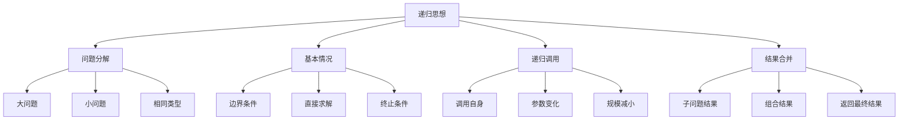

# 🧠 递归思想

## 🎯 核心定义

**递归**是一种解决问题的方法，它将问题分解为更小的相同类型的子问题，直到子问题足够简单可以直接解决。

### 🔍 本质理解
递归 = 问题分解 + 基本情况 + 递归调用



---

## 🏗️ 递归的基本结构

### 📋 递归三要素

#### 1️⃣ 基本情况（Base Case）
- **定义**：递归的终止条件
- **作用**：防止无限递归
- **示例**：`if (n <= 1) return n;`

#### 2️⃣ 递归关系（Recursive Relation）
- **定义**：大问题与小问题的关系
- **作用**：定义问题分解方式
- **示例**：`fib(n) = fib(n-1) + fib(n-2)`

#### 3️⃣ 递归调用（Recursive Call）
- **定义**：函数调用自身
- **作用**：解决子问题
- **示例**：`return fibonacci(n-1) + fibonacci(n-2);`

### 🎯 递归模板

```cpp
ReturnType recursiveFunction(Parameters) {
    // 1. 基本情况检查
    if (baseCase) {
        return baseResult;
    }
    
    // 2. 问题分解
    SubProblem1 = recursiveFunction(modifiedParams1);
    SubProblem2 = recursiveFunction(modifiedParams2);
    
    // 3. 结果合并
    return combineResults(SubProblem1, SubProblem2);
}
```

---

## 📚 经典递归示例

### 🔢 斐波那契数列

#### 🎯 问题描述
计算第n个斐波那契数：F(n) = F(n-1) + F(n-2)，其中F(0)=0, F(1)=1

#### 💻 递归实现
```cpp
int fibonacci(int n) {
    // 基本情况
    if (n <= 1) {
        return n;
    }
    
    // 递归关系
    return fibonacci(n - 1) + fibonacci(n - 2);
}
```

#### 📊 递归树分析
```
fib(4)
├── fib(3)
│   ├── fib(2)
│   │   ├── fib(1) = 1
│   │   └── fib(0) = 0
│   └── fib(1) = 1
└── fib(2)
    ├── fib(1) = 1
    └── fib(0) = 0
```

#### ⚡ 时间复杂度分析
- **时间复杂度**：O(2ⁿ) - 指数级
- **空间复杂度**：O(n) - 递归栈深度
- **问题**：存在大量重复计算

### 🌳 二叉树遍历

#### 🎯 前序遍历
```cpp
void preOrder(TreeNode* root) {
    // 基本情况
    if (root == nullptr) {
        return;
    }
    
    // 访问根节点
    cout << root->val << " ";
    
    // 递归遍历左子树
    preOrder(root->left);
    
    // 递归遍历右子树
    preOrder(root->right);
}
```

#### 🎯 中序遍历
```cpp
void inOrder(TreeNode* root) {
    // 基本情况
    if (root == nullptr) {
        return;
    }
    
    // 递归遍历左子树
    inOrder(root->left);
    
    // 访问根节点
    cout << root->val << " ";
    
    // 递归遍历右子树
    inOrder(root->right);
}
```

#### 🎯 后序遍历
```cpp
void postOrder(TreeNode* root) {
    // 基本情况
    if (root == nullptr) {
        return;
    }
    
    // 递归遍历左子树
    postOrder(root->left);
    
    // 递归遍历右子树
    postOrder(root->right);
    
    // 访问根节点
    cout << root->val << " ";
}
```

### 🔍 二分查找（递归版）

#### 💻 递归实现
```cpp
int binarySearch(int arr[], int left, int right, int target) {
    // 基本情况
    if (left > right) {
        return -1;  // 未找到
    }
    
    int mid = left + (right - left) / 2;
    
    // 基本情况
    if (arr[mid] == target) {
        return mid;  // 找到目标
    }
    
    // 递归关系
    if (arr[mid] > target) {
        return binarySearch(arr, left, mid - 1, target);
    } else {
        return binarySearch(arr, mid + 1, right, target);
    }
}
```

#### 📊 复杂度分析
- **时间复杂度**：O(log n)
- **空间复杂度**：O(log n) - 递归栈深度

---

## 🎯 递归类型分类

### 📊 递归分类表

| 递归类型 | 特点 | 示例 | 时间复杂度 |
|----------|------|------|------------|
| **线性递归** | 每次递归调用一次 | 阶乘、斐波那契 | O(n) |
| **二分递归** | 每次递归调用两次 | 二叉树遍历、归并排序 | O(log n) |
| **多重递归** | 每次递归调用多次 | 汉诺塔、全排列 | O(kⁿ) |
| **尾递归** | 递归调用在最后 | 尾递归优化 | O(1)空间 |

### 🔄 线性递归
```cpp
int factorial(int n) {
    if (n <= 1) return 1;           // 基本情况
    return n * factorial(n - 1);     // 线性递归
}
```

### 🌳 二分递归
```cpp
int maxDepth(TreeNode* root) {
    if (root == nullptr) return 0;   // 基本情况
    int leftDepth = maxDepth(root->left);   // 左子树递归
    int rightDepth = maxDepth(root->right); // 右子树递归
    return max(leftDepth, rightDepth) + 1;  // 合并结果
}
```

### 🎯 尾递归优化
```cpp
// 普通递归
int factorial(int n) {
    if (n <= 1) return 1;
    return n * factorial(n - 1);
}

// 尾递归优化
int factorialTail(int n, int acc = 1) {
    if (n <= 1) return acc;
    return factorialTail(n - 1, n * acc);
}
```

---

## ⚡ 递归优化策略

### 🔄 记忆化递归

#### 📊 问题分析
递归算法存在重复计算问题，可以通过记忆化优化：

```cpp
// 未优化的斐波那契
int fibonacci(int n) {
    if (n <= 1) return n;
    return fibonacci(n - 1) + fibonacci(n - 2);
}

// 记忆化优化
int fibonacciMemo(int n, vector<int>& memo) {
    if (n <= 1) return n;
    
    if (memo[n] != -1) {
        return memo[n];  // 直接返回已计算的结果
    }
    
    memo[n] = fibonacciMemo(n - 1, memo) + fibonacciMemo(n - 2, memo);
    return memo[n];
}
```

#### 📈 性能对比
| 方法 | 时间复杂度 | 空间复杂度 | 性能评价 |
|------|------------|------------|----------|
| **普通递归** | O(2ⁿ) | O(n) | ⭐ 很差 |
| **记忆化递归** | O(n) | O(n) | ⭐⭐⭐⭐ 很好 |
| **迭代方法** | O(n) | O(1) | ⭐⭐⭐⭐⭐ 优秀 |

### 🔄 动态规划转换

#### 📊 自底向上方法
```cpp
int fibonacciDP(int n) {
    if (n <= 1) return n;
    
    int dp[n + 1];
    dp[0] = 0;
    dp[1] = 1;
    
    for (int i = 2; i <= n; i++) {
        dp[i] = dp[i - 1] + dp[i - 2];
    }
    
    return dp[n];
}
```

---

## 🎯 递归应用场景

### 📋 适用场景

#### ✅ 适合递归的问题
1. **问题可以分解为相同类型的子问题**
2. **子问题规模逐渐减小**
3. **存在明确的基本情况**
4. **子问题之间相对独立**

#### ❌ 不适合递归的问题
1. **问题无法分解为子问题**
2. **子问题规模不减小**
3. **没有明确的基本情况**
4. **子问题之间有复杂依赖**

### 🎯 典型应用

#### 🌳 树形结构处理
- **二叉树遍历**：前序、中序、后序
- **树的深度计算**：递归计算子树深度
- **路径查找**：递归搜索路径

#### 🔍 搜索问题
- **深度优先搜索**：递归实现DFS
- **回溯算法**：递归尝试所有可能
- **组合问题**：递归生成组合

#### 📊 数学问题
- **阶乘计算**：n! = n × (n-1)!
- **幂运算**：aⁿ = a × aⁿ⁻¹
- **最大公约数**：gcd(a,b) = gcd(b, a%b)

---

## 🧠 学习策略

### 📚 理解层次

#### 🔴 认识层次
- 知道递归的基本概念
- 了解递归的三要素
- 识别递归的应用场景

#### 🟡 理解层次
- 理解递归的工作原理
- 掌握递归的分析方法
- 分析递归的优缺点

#### 🟢 应用层次
- 能设计递归算法
- 会分析递归复杂度
- 能优化递归性能

#### 🔵 创新层次
- 能设计复杂递归
- 会转换递归为迭代
- 能组合多种递归思想

### 🎯 学习建议

1. **从简单到复杂**：阶乘 → 斐波那契 → 树遍历 → 复杂递归
2. **理论与实践结合**：理解原理 + 代码实现
3. **对比学习**：递归 vs 迭代的优缺点
4. **应用驱动**：从实际问题出发学习递归

### 🔍 调试技巧

#### 📊 递归调试方法
1. **添加日志**：打印递归调用信息
2. **可视化递归树**：画出递归调用过程
3. **检查基本情况**：确保递归能正确终止
4. **验证递归关系**：确保问题分解正确

```cpp
int fibonacciDebug(int n, int depth = 0) {
    // 添加缩进显示递归深度
    for (int i = 0; i < depth; i++) {
        cout << "  ";
    }
    cout << "fib(" << n << ")" << endl;
    
    if (n <= 1) {
        for (int i = 0; i < depth; i++) {
            cout << "  ";
        }
        cout << "return " << n << endl;
        return n;
    }
    
    int result = fibonacciDebug(n - 1, depth + 1) + 
                 fibonacciDebug(n - 2, depth + 1);
    
    for (int i = 0; i < depth; i++) {
        cout << "  ";
    }
    cout << "return " << result << endl;
    return result;
}
```

---

## 🔗 相关链接

### 📖 深入学习
- [[02-分治策略|分治策略]]
- [[03-贪心算法|贪心算法]]
- [[04-动态规划思想|动态规划思想]]

### 🛠️ 实践应用
- [[03-层次宇宙/01-树形基础/02-树的遍历算法|树遍历算法]]
- [[04-算法武器库/01-搜索技术/02-二分搜索算法|二分搜索算法]]
- [[04-算法武器库/02-排序艺术/03-归并排序详解|归并排序算法]]

### 🎯 检测学习
- [[00-学习枢纽/📋-知识点检测清单|知识点检测清单]]
- [[00-学习枢纽/📊-学习进度跟踪|学习进度跟踪]]

---
*💡 递归是计算机科学的核心思想，掌握递归思维是解决复杂问题的关键！*
