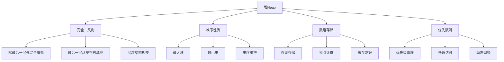

# ⛰️ 堆Heap基础

## 🎯 核心定义

**堆（Heap）**是一种特殊的完全二叉树，满足堆序性质：父节点的值总是大于（或小于）其子节点的值。

### 🔍 本质理解
堆 = 完全二叉树 + 堆序性质 + 数组存储 + 优先队列



---

## 🏗️ 堆的基本性质

### 📊 性质分析表

| 性质 | 描述 | 数学表达 | 应用 |
|------|------|----------|------|
| **完全二叉树** | 除最后一层外完全填充 | 结构规整 | 数组存储 |
| **堆序性质** | 父节点值≥子节点值（最大堆） | parent ≥ children | 优先级维护 |
| **数组存储** | 用数组表示完全二叉树 | index计算 | 高效访问 |
| **动态调整** | 插入删除后维护堆序 | 堆化操作 | 保持性质 |

### 🎯 堆的类型

#### 📊 按堆序分类
| 类型 | 定义 | 特点 | 应用 |
|------|------|------|------|
| **最大堆** | 父节点值≥子节点值 | 根节点最大 | 优先队列 |
| **最小堆** | 父节点值≤子节点值 | 根节点最小 | 优先队列 |
| **双端堆** | 支持最大最小操作 | 复杂结构 | 特殊应用 |

#### 📊 按实现分类
| 类型 | 特点 | 时间复杂度 | 应用场景 |
|------|------|------------|----------|
| **二叉堆** | 每个节点最多2个子节点 | 插入删除O(log n) | 一般优先队列 |
| **二项堆** | 多个二项树组成 | 合并O(log n) | 可合并优先队列 |
| **斐波那契堆** | 最复杂的堆结构 | 插入O(1) | 高级算法 |

---

## 💻 堆的实现

### 🔧 数组存储

#### 📋 索引关系
```cpp
template<typename T>
class MaxHeap {
private:
    T* data;           // 数据数组
    int capacity;      // 数组容量
    int size;          // 实际大小
    
public:
    MaxHeap(int capacity) : capacity(capacity), size(0) {
        data = new T[capacity];
    }
    
    ~MaxHeap() {
        delete[] data;
    }
    
    // 获取父节点索引
    int getParent(int index) const {
        if (index <= 0) return -1;
        return (index - 1) / 2;
    }
    
    // 获取左子节点索引
    int getLeftChild(int index) const {
        int leftChild = 2 * index + 1;
        return leftChild < size ? leftChild : -1;
    }
    
    // 获取右子节点索引
    int getRightChild(int index) const {
        int rightChild = 2 * index + 2;
        return rightChild < size ? rightChild : -1;
    }
    
    // 交换两个元素
    void swap(int i, int j) {
        T temp = data[i];
        data[i] = data[j];
        data[j] = temp;
    }
};
```

#### 🎯 堆化操作

##### 📋 上浮操作（向上堆化）
```cpp
template<typename T>
void MaxHeap<T>::heapifyUp(int index) {
    if (index <= 0) return;
    
    int parent = getParent(index);
    if (parent >= 0 && data[index] > data[parent]) {
        swap(index, parent);
        heapifyUp(parent);
    }
}
```

##### 📋 下沉操作（向下堆化）
```cpp
template<typename T>
void MaxHeap<T>::heapifyDown(int index) {
    int largest = index;
    int left = getLeftChild(index);
    int right = getRightChild(index);
    
    // 找到最大的节点
    if (left != -1 && data[left] > data[largest]) {
        largest = left;
    }
    
    if (right != -1 && data[right] > data[largest]) {
        largest = right;
    }
    
    // 如果最大节点不是当前节点，交换并继续堆化
    if (largest != index) {
        swap(index, largest);
        heapifyDown(largest);
    }
}
```

### 🔧 堆的基本操作

#### 📋 插入操作
```cpp
template<typename T>
void MaxHeap<T>::insert(const T& value) {
    if (size >= capacity) {
        throw std::overflow_error("Heap is full");
    }
    
    // 在数组末尾插入新元素
    data[size] = value;
    size++;
    
    // 向上堆化维护堆序
    heapifyUp(size - 1);
}
```

#### 📋 删除操作
```cpp
template<typename T>
T MaxHeap<T>::extractMax() {
    if (size <= 0) {
        throw std::underflow_error("Heap is empty");
    }
    
    // 保存最大值
    T maxValue = data[0];
    
    // 将最后一个元素移到根节点
    data[0] = data[size - 1];
    size--;
    
    // 向下堆化维护堆序
    if (size > 0) {
        heapifyDown(0);
    }
    
    return maxValue;
}
```

#### 📋 查看操作
```cpp
template<typename T>
T MaxHeap<T>::peek() const {
    if (size <= 0) {
        throw std::underflow_error("Heap is empty");
    }
    return data[0];
}
```

---

## 📊 堆排序算法

### 🎯 堆排序原理

#### 📋 算法步骤
1. **构建堆**：将数组构建成最大堆
2. **排序**：重复提取最大值并调整堆
3. **完成**：数组变为有序

#### 💻 实现代码
```cpp
template<typename T>
void heapSort(T arr[], int n) {
    // 1. 构建最大堆
    for (int i = n / 2 - 1; i >= 0; i--) {
        heapify(arr, n, i);
    }
    
    // 2. 逐个提取元素
    for (int i = n - 1; i > 0; i--) {
        // 将最大值移到末尾
        swap(arr[0], arr[i]);
        
        // 调整堆
        heapify(arr, i, 0);
    }
}

template<typename T>
void heapify(T arr[], int n, int i) {
    int largest = i;
    int left = 2 * i + 1;
    int right = 2 * i + 2;
    
    // 找到最大的节点
    if (left < n && arr[left] > arr[largest]) {
        largest = left;
    }
    
    if (right < n && arr[right] > arr[largest]) {
        largest = right;
    }
    
    // 如果最大节点不是当前节点，交换并继续堆化
    if (largest != i) {
        swap(arr[i], arr[largest]);
        heapify(arr, n, largest);
    }
}
```

#### 📊 复杂度分析
| 操作 | 时间复杂度 | 空间复杂度 | 说明 |
|------|------------|------------|------|
| **构建堆** | O(n) | O(1) | 自底向上构建 |
| **堆排序** | O(n log n) | O(1) | 原地排序 |
| **总体** | O(n log n) | O(1) | 稳定排序 |

---

## 🎯 优先队列

### 📋 优先队列定义

#### 🎯 基本概念
优先队列是一种数据结构，支持插入元素和提取优先级最高（或最低）的元素。

#### 📊 操作对比
| 操作 | 普通队列 | 优先队列 | 说明 |
|------|----------|----------|------|
| **插入** | O(1) | O(log n) | 优先队列需要维护顺序 |
| **删除** | O(1) | O(log n) | 优先队列需要找到最值 |
| **查看** | O(1) | O(1) | 优先队列直接查看根节点 |

### 🔧 优先队列实现

#### 📋 类定义
```cpp
template<typename T>
class PriorityQueue {
private:
    MaxHeap<T> heap;
    
public:
    PriorityQueue(int capacity) : heap(capacity) {}
    
    // 插入元素
    void enqueue(const T& value) {
        heap.insert(value);
    }
    
    // 删除优先级最高的元素
    T dequeue() {
        return heap.extractMax();
    }
    
    // 查看优先级最高的元素
    T peek() const {
        return heap.peek();
    }
    
    // 检查是否为空
    bool isEmpty() const {
        return heap.isEmpty();
    }
    
    // 获取大小
    int size() const {
        return heap.size();
    }
};
```

#### 🎯 应用示例
```cpp
class Task {
public:
    string name;
    int priority;
    
    Task(string n, int p) : name(n), priority(p) {}
    
    // 重载比较运算符
    bool operator>(const Task& other) const {
        return priority > other.priority;
    }
    
    bool operator<(const Task& other) const {
        return priority < other.priority;
    }
};

void taskScheduler() {
    PriorityQueue<Task> pq(100);
    
    // 添加任务
    pq.enqueue(Task("Task A", 5));
    pq.enqueue(Task("Task B", 3));
    pq.enqueue(Task("Task C", 8));
    pq.enqueue(Task("Task D", 1));
    
    // 按优先级执行任务
    while (!pq.isEmpty()) {
        Task task = pq.dequeue();
        cout << "Executing: " << task.name 
             << " (Priority: " << task.priority << ")" << endl;
    }
}
```

---

## 🎯 堆的应用场景

### 📋 典型应用

#### 🎯 任务调度
- **操作系统**：进程调度
- **任务队列**：优先级任务管理
- **资源分配**：按优先级分配资源

```cpp
class ProcessScheduler {
private:
    PriorityQueue<Process> readyQueue;
    
public:
    void addProcess(const Process& process) {
        readyQueue.enqueue(process);
    }
    
    Process getNextProcess() {
        if (readyQueue.isEmpty()) {
            throw std::runtime_error("No processes available");
        }
        return readyQueue.dequeue();
    }
    
    void schedule() {
        while (!readyQueue.isEmpty()) {
            Process process = getNextProcess();
            executeProcess(process);
        }
    }
};
```

#### 🔍 图算法
- **Dijkstra算法**：最短路径算法
- **Prim算法**：最小生成树算法
- **A*算法**：启发式搜索算法

```cpp
class DijkstraAlgorithm {
private:
    vector<vector<pair<int, int>>> graph;
    vector<int> distances;
    vector<bool> visited;
    
public:
    vector<int> findShortestPaths(int start) {
        int n = graph.size();
        distances.assign(n, INT_MAX);
        visited.assign(n, false);
        
        PriorityQueue<pair<int, int>> pq(n * n);
        distances[start] = 0;
        pq.enqueue({0, start});
        
        while (!pq.isEmpty()) {
            auto [dist, u] = pq.dequeue();
            
            if (visited[u]) continue;
            visited[u] = true;
            
            for (auto [v, weight] : graph[u]) {
                if (distances[u] + weight < distances[v]) {
                    distances[v] = distances[u] + weight;
                    pq.enqueue({distances[v], v});
                }
            }
        }
        
        return distances;
    }
};
```

#### 📊 数据流处理
- **Top K问题**：找出最大的K个元素
- **中位数维护**：动态维护数据流的中位数
- **滑动窗口**：滑动窗口的最大值

```cpp
class TopKElements {
private:
    MinHeap<int> minHeap;
    int k;
    
public:
    TopKElements(int k) : k(k), minHeap(k) {}
    
    void add(int value) {
        if (minHeap.size() < k) {
            minHeap.insert(value);
        } else if (value > minHeap.peek()) {
            minHeap.extractMin();
            minHeap.insert(value);
        }
    }
    
    vector<int> getTopK() {
        vector<int> result;
        while (!minHeap.isEmpty()) {
            result.push_back(minHeap.extractMin());
        }
        return result;
    }
};
```

---

## 🧠 学习策略

### 📚 理解层次

#### 🔴 认识层次
- 知道堆的基本概念
- 了解堆序性质
- 识别堆的应用场景

#### 🟡 理解层次
- 理解堆的结构特性
- 掌握堆化操作
- 分析堆的优缺点

#### 🟢 应用层次
- 能实现堆的基本操作
- 会选择合适的堆类型
- 能解决堆相关问题

#### 🔵 创新层次
- 能设计堆的变种
- 会优化堆操作
- 能组合堆与其他结构

### 🎯 学习建议

1. **从基础到高级**：基本概念 → 堆化操作 → 堆排序 → 应用场景
2. **理论与实践结合**：概念理解 + 代码实现
3. **对比学习**：最大堆 vs 最小堆的优缺点
4. **应用驱动**：从实际问题出发学习堆

### 🔍 常见错误

#### ❌ 常见错误
1. **索引计算错误**：父子节点索引计算错误
2. **堆序维护**：插入删除后忘记维护堆序
3. **边界处理**：数组越界访问
4. **逻辑错误**：混淆最大堆和最小堆

#### ✅ 最佳实践
1. **边界检查**：检查数组边界
2. **堆序维护**：及时维护堆序性质
3. **索引计算**：正确计算父子节点索引
4. **异常处理**：处理堆操作异常

---

## 🔗 相关链接

### 📖 深入学习
- [[02-优先队列实现|优先队列实现]]
- [[03-堆排序算法|堆排序算法]]
- [[04-堆的应用案例|堆的应用案例]]

### 🛠️ 实践应用
- [[03-层次宇宙/01-树形基础/01-树的基本概念|树的基本概念]]
- [[03-层次宇宙/02-二叉树王国/01-二叉树基础|二叉树基础]]
- [[04-算法武器库/02-排序艺术/01-排序算法总览|排序算法]]

### 🎯 检测学习
- [[00-学习枢纽/📋-知识点检测清单|知识点检测清单]]
- [[00-学习枢纽/📊-学习进度跟踪|学习进度跟踪]]

---
*💡 堆是优先队列的基础，掌握堆是理解高级算法的重要基础！*
