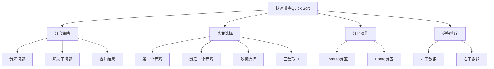

# 快速排序算法

## 📖 核心概念

**快速排序（Quick Sort）**是一种基于分治策略的高效排序算法。它选择一个基准元素（pivot），将数组分为两部分：小于基准的元素和大于基准的元素，然后递归地对这两部分进行排序。

### 🏗️ 快速排序的组成要素



## 🔍 快速排序分类

### 按基准选择策略分类

| 策略 | 时间复杂度 | 特点 | 适用场景 |
|------|------------|------|----------|
| **固定基准** | O(n²) 最坏 | 简单但可能退化 | 教学演示 |
| **随机基准** | O(n log n) 期望 | 避免最坏情况 | 一般应用 |
| **三数取中** | O(n log n) 平均 | 平衡性能 | 生产环境 |
| **自适应基准** | O(n log n) 平均 | 动态选择 | 特殊需求 |

### 按分区方法分类

| 方法 | 特点 | 优点 | 缺点 |
|------|------|------|------|
| **Lomuto分区** | 简单易懂 | 实现简单 | 交换次数多 |
| **Hoare分区** | 效率更高 | 交换次数少 | 实现复杂 |
| **三路分区** | 处理重复元素 | 避免重复元素问题 | 实现复杂 |

## 💻 快速排序基础实现

### Lomuto分区实现

```cpp
template<typename T>
class QuickSortLomuto {
private:
    vector<T>& arr;
    int size;
    
    // 交换两个元素
    void swap(int i, int j) {
        T temp = arr[i];
        arr[i] = arr[j];
        arr[j] = temp;
    }
    
    // Lomuto分区方法
    int partition(int low, int high) {
        T pivot = arr[high]; // 选择最后一个元素作为基准
        int i = low - 1;     // 小于基准的元素的索引
        
        for (int j = low; j < high; j++) {
            if (arr[j] <= pivot) {
                i++;
                swap(i, j);
            }
        }
        
        swap(i + 1, high); // 将基准放到正确位置
        return i + 1;
    }
    
    // 递归快速排序
    void quickSortRecursive(int low, int high) {
        if (low < high) {
            int pivotIndex = partition(low, high);
            
            // 递归排序基准左右两部分
            quickSortRecursive(low, pivotIndex - 1);
            quickSortRecursive(pivotIndex + 1, high);
        }
    }
    
public:
    QuickSortLomuto(vector<T>& array) : arr(array), size(array.size()) {}
    
    // 快速排序主函数
    void quickSort() {
        if (size <= 1) return;
        quickSortRecursive(0, size - 1);
    }
    
    // 获取排序结果
    const vector<T>& getSortedArray() const {
        return arr;
    }
    
    // 检查数组是否已排序
    bool isSorted() const {
        for (int i = 1; i < size; i++) {
            if (arr[i] < arr[i - 1]) {
                return false;
            }
        }
        return true;
    }
};
```

### Hoare分区实现

```cpp
template<typename T>
class QuickSortHoare {
private:
    vector<T>& arr;
    int size;
    
    void swap(int i, int j) {
        T temp = arr[i];
        arr[i] = arr[j];
        arr[j] = temp;
    }
    
    // Hoare分区方法
    int partition(int low, int high) {
        T pivot = arr[low]; // 选择第一个元素作为基准
        int i = low - 1;
        int j = high + 1;
        
        while (true) {
            // 从左边找到第一个大于等于基准的元素
            do {
                i++;
            } while (arr[i] < pivot);
            
            // 从右边找到第一个小于等于基准的元素
            do {
                j--;
            } while (arr[j] > pivot);
            
            // 如果两个指针相遇，返回分区点
            if (i >= j) {
                return j;
            }
            
            // 交换元素
            swap(i, j);
        }
    }
    
    void quickSortRecursive(int low, int high) {
        if (low < high) {
            int pivotIndex = partition(low, high);
            
            // 注意：Hoare分区返回的索引需要特殊处理
            quickSortRecursive(low, pivotIndex);
            quickSortRecursive(pivotIndex + 1, high);
        }
    }
    
public:
    QuickSortHoare(vector<T>& array) : arr(array), size(array.size()) {}
    
    void quickSort() {
        if (size <= 1) return;
        quickSortRecursive(0, size - 1);
    }
    
    const vector<T>& getSortedArray() const {
        return arr;
    }
};
```

## 🎯 快速排序优化实现

### 1. 三数取中优化

```cpp
template<typename T>
class OptimizedQuickSort {
private:
    vector<T>& arr;
    int size;
    
    void swap(int i, int j) {
        T temp = arr[i];
        arr[i] = arr[j];
        arr[j] = temp;
    }
    
    // 三数取中选择基准
    int medianOfThree(int low, int high) {
        int mid = low + (high - low) / 2;
        
        // 确保 arr[low] <= arr[mid] <= arr[high]
        if (arr[low] > arr[mid]) swap(low, mid);
        if (arr[mid] > arr[high]) swap(mid, high);
        if (arr[low] > arr[mid]) swap(low, mid);
        
        return mid; // 返回中位数的索引
    }
    
    // 优化的分区方法
    int partition(int low, int high) {
        // 使用三数取中选择基准
        int pivotIndex = medianOfThree(low, high);
        swap(pivotIndex, high); // 将基准移到末尾
        
        T pivot = arr[high];
        int i = low - 1;
        
        for (int j = low; j < high; j++) {
            if (arr[j] <= pivot) {
                i++;
                swap(i, j);
            }
        }
        
        swap(i + 1, high);
        return i + 1;
    }
    
    void quickSortRecursive(int low, int high) {
        if (low < high) {
            int pivotIndex = partition(low, high);
            quickSortRecursive(low, pivotIndex - 1);
            quickSortRecursive(pivotIndex + 1, high);
        }
    }
    
public:
    OptimizedQuickSort(vector<T>& array) : arr(array), size(array.size()) {}
    
    void quickSort() {
        if (size <= 1) return;
        quickSortRecursive(0, size - 1);
    }
    
    const vector<T>& getSortedArray() const {
        return arr;
    }
};
```

### 2. 三路分区（处理重复元素）

```cpp
template<typename T>
class ThreeWayQuickSort {
private:
    vector<T>& arr;
    int size;
    
    void swap(int i, int j) {
        T temp = arr[i];
        arr[i] = arr[j];
        arr[j] = temp;
    }
    
    // 三路分区方法
    pair<int, int> threeWayPartition(int low, int high) {
        T pivot = arr[low];
        int lt = low;     // arr[low..lt-1] < pivot
        int gt = high;    // arr[gt+1..high] > pivot
        int i = low + 1;  // arr[lt..i-1] = pivot
        
        while (i <= gt) {
            if (arr[i] < pivot) {
                swap(lt++, i++);
            } else if (arr[i] > pivot) {
                swap(i, gt--);
            } else {
                i++;
            }
        }
        
        return {lt, gt}; // 返回等于基准的元素的起始和结束索引
    }
    
    void quickSortRecursive(int low, int high) {
        if (low < high) {
            auto [lt, gt] = threeWayPartition(low, high);
            
            // 递归排序小于和大于基准的部分
            quickSortRecursive(low, lt - 1);
            quickSortRecursive(gt + 1, high);
        }
    }
    
public:
    ThreeWayQuickSort(vector<T>& array) : arr(array), size(array.size()) {}
    
    void quickSort() {
        if (size <= 1) return;
        quickSortRecursive(0, size - 1);
    }
    
    const vector<T>& getSortedArray() const {
        return arr;
    }
};
```

### 3. 混合排序（小数组优化）

```cpp
template<typename T>
class HybridQuickSort {
private:
    vector<T>& arr;
    int size;
    static const int INSERTION_THRESHOLD = 10;
    
    void swap(int i, int j) {
        T temp = arr[i];
        arr[i] = arr[j];
        arr[j] = temp;
    }
    
    // 插入排序（用于小数组）
    void insertionSort(int low, int high) {
        for (int i = low + 1; i <= high; i++) {
            T key = arr[i];
            int j = i - 1;
            
            while (j >= low && arr[j] > key) {
                arr[j + 1] = arr[j];
                j--;
            }
            arr[j + 1] = key;
        }
    }
    
    // 随机选择基准
    int randomPartition(int low, int high) {
        int randomIndex = low + rand() % (high - low + 1);
        swap(randomIndex, high);
        
        T pivot = arr[high];
        int i = low - 1;
        
        for (int j = low; j < high; j++) {
            if (arr[j] <= pivot) {
                i++;
                swap(i, j);
            }
        }
        
        swap(i + 1, high);
        return i + 1;
    }
    
    void quickSortRecursive(int low, int high) {
        if (low < high) {
            // 小数组使用插入排序
            if (high - low + 1 < INSERTION_THRESHOLD) {
                insertionSort(low, high);
                return;
            }
            
            int pivotIndex = randomPartition(low, high);
            quickSortRecursive(low, pivotIndex - 1);
            quickSortRecursive(pivotIndex + 1, high);
        }
    }
    
public:
    HybridQuickSort(vector<T>& array) : arr(array), size(array.size()) {
        srand(time(nullptr)); // 初始化随机数种子
    }
    
    void quickSort() {
        if (size <= 1) return;
        quickSortRecursive(0, size - 1);
    }
    
    const vector<T>& getSortedArray() const {
        return arr;
    }
};
```

### 4. 迭代版本（避免递归）

```cpp
template<typename T>
class IterativeQuickSort {
private:
    vector<T>& arr;
    int size;
    
    void swap(int i, int j) {
        T temp = arr[i];
        arr[i] = arr[j];
        arr[j] = temp;
    }
    
    int partition(int low, int high) {
        T pivot = arr[high];
        int i = low - 1;
        
        for (int j = low; j < high; j++) {
            if (arr[j] <= pivot) {
                i++;
                swap(i, j);
            }
        }
        
        swap(i + 1, high);
        return i + 1;
    }
    
public:
    IterativeQuickSort(vector<T>& array) : arr(array), size(array.size()) {}
    
    // 使用栈的迭代快速排序
    void quickSort() {
        if (size <= 1) return;
        
        stack<pair<int, int>> stk;
        stk.push({0, size - 1});
        
        while (!stk.empty()) {
            auto [low, high] = stk.top();
            stk.pop();
            
            if (low < high) {
                int pivotIndex = partition(low, high);
                
                // 将子数组范围压入栈
                stk.push({low, pivotIndex - 1});
                stk.push({pivotIndex + 1, high});
            }
        }
    }
    
    const vector<T>& getSortedArray() const {
        return arr;
    }
};
```

## 🔧 快速排序应用场景

### 1. 选择算法（快速选择）

```cpp
template<typename T>
class QuickSelect {
private:
    vector<T>& arr;
    int size;
    
    void swap(int i, int j) {
        T temp = arr[i];
        arr[i] = arr[j];
        arr[j] = temp;
    }
    
    int partition(int low, int high) {
        T pivot = arr[high];
        int i = low - 1;
        
        for (int j = low; j < high; j++) {
            if (arr[j] <= pivot) {
                i++;
                swap(i, j);
            }
        }
        
        swap(i + 1, high);
        return i + 1;
    }
    
    // 快速选择第k小的元素
    T quickSelectRecursive(int low, int high, int k) {
        if (low == high) {
            return arr[low];
        }
        
        int pivotIndex = partition(low, high);
        int leftSize = pivotIndex - low + 1;
        
        if (k == leftSize) {
            return arr[pivotIndex];
        } else if (k < leftSize) {
            return quickSelectRecursive(low, pivotIndex - 1, k);
        } else {
            return quickSelectRecursive(pivotIndex + 1, high, k - leftSize);
        }
    }
    
public:
    QuickSelect(vector<T>& array) : arr(array), size(array.size()) {}
    
    // 找到第k小的元素
    T findKthSmallest(int k) {
        if (k < 1 || k > size) {
            throw std::out_of_range("k is out of range");
        }
        return quickSelectRecursive(0, size - 1, k);
    }
    
    // 找到第k大的元素
    T findKthLargest(int k) {
        return findKthSmallest(size - k + 1);
    }
    
    // 找到中位数
    T findMedian() {
        if (size % 2 == 1) {
            return findKthSmallest(size / 2 + 1);
        } else {
            T mid1 = findKthSmallest(size / 2);
            T mid2 = findKthSmallest(size / 2 + 1);
            return (mid1 + mid2) / 2;
        }
    }
};
```

### 2. 外部快速排序

```cpp
template<typename T>
class ExternalQuickSort {
private:
    string inputFile;
    string outputFile;
    int bufferSize;
    
public:
    ExternalQuickSort(const string& input, const string& output, int buffer) 
        : inputFile(input), outputFile(output), bufferSize(buffer) {}
    
    // 外部快速排序
    void externalQuickSort() {
        // 第一阶段：将大文件分成小文件
        vector<string> tempFiles = createSortedRuns();
        
        // 第二阶段：多路归并
        mergeSortedRuns(tempFiles);
        
        // 清理临时文件
        for (const string& file : tempFiles) {
            remove(file.c_str());
        }
    }
    
private:
    // 创建排序后的运行文件
    vector<string> createSortedRuns() {
        vector<string> tempFiles;
        ifstream input(inputFile);
        int runCount = 0;
        
        while (!input.eof()) {
            vector<T> buffer;
            T value;
            
            // 读取缓冲区大小的数据
            for (int i = 0; i < bufferSize && input >> value; i++) {
                buffer.push_back(value);
            }
            
            if (!buffer.empty()) {
                // 对缓冲区进行快速排序
                QuickSortLomuto<T> quickSort(buffer);
                quickSort.quickSort();
                
                // 写入临时文件
                string tempFile = "temp_run_" + to_string(runCount++) + ".txt";
                ofstream output(tempFile);
                
                for (const T& val : buffer) {
                    output << val << " ";
                }
                
                output.close();
                tempFiles.push_back(tempFile);
            }
        }
        
        input.close();
        return tempFiles;
    }
    
    // 多路归并
    void mergeSortedRuns(const vector<string>& tempFiles) {
        ofstream output(outputFile);
        vector<ifstream> inputs;
        vector<T> currentValues;
        
        // 打开所有临时文件
        for (const string& file : tempFiles) {
            inputs.emplace_back(file);
            T value;
            if (inputs.back() >> value) {
                currentValues.push_back(value);
            } else {
                currentValues.push_back(numeric_limits<T>::max());
            }
        }
        
        // 使用最小堆进行多路归并
        priority_queue<pair<T, int>, vector<pair<T, int>>, greater<pair<T, int>>> minHeap;
        
        for (int i = 0; i < currentValues.size(); i++) {
            if (currentValues[i] != numeric_limits<T>::max()) {
                minHeap.push({currentValues[i], i});
            }
        }
        
        while (!minHeap.empty()) {
            auto [value, fileIndex] = minHeap.top();
            minHeap.pop();
            output << value << " ";
            
            if (inputs[fileIndex] >> currentValues[fileIndex]) {
                minHeap.push({currentValues[fileIndex], fileIndex});
            }
        }
        
        output.close();
        
        // 关闭所有输入文件
        for (auto& input : inputs) {
            input.close();
        }
    }
};
```

### 3. 并行快速排序

```cpp
template<typename T>
class ParallelQuickSort {
private:
    vector<T>& arr;
    int size;
    
    void swap(int i, int j) {
        T temp = arr[i];
        arr[i] = arr[j];
        arr[j] = temp;
    }
    
    int partition(int low, int high) {
        T pivot = arr[high];
        int i = low - 1;
        
        for (int j = low; j < high; j++) {
            if (arr[j] <= pivot) {
                i++;
                swap(i, j);
            }
        }
        
        swap(i + 1, high);
        return i + 1;
    }
    
    void quickSortRecursive(int low, int high) {
        if (low < high) {
            int pivotIndex = partition(low, high);
            
            // 并行处理左右两部分
            if (high - low > 1000) { // 只对大数组使用并行
                thread leftThread([this, low, pivotIndex]() {
                    quickSortRecursive(low, pivotIndex - 1);
                });
                
                thread rightThread([this, pivotIndex, high]() {
                    quickSortRecursive(pivotIndex + 1, high);
                });
                
                leftThread.join();
                rightThread.join();
            } else {
                quickSortRecursive(low, pivotIndex - 1);
                quickSortRecursive(pivotIndex + 1, high);
            }
        }
    }
    
public:
    ParallelQuickSort(vector<T>& array) : arr(array), size(array.size()) {}
    
    void parallelQuickSort() {
        if (size <= 1) return;
        quickSortRecursive(0, size - 1);
    }
    
    const vector<T>& getSortedArray() const {
        return arr;
    }
};
```

## ⚡ 复杂度分析

### 时间复杂度

| 情况 | 时间复杂度 | 说明 |
|------|------------|------|
| **最好情况** | O(n log n) | 每次分区都平衡 |
| **平均情况** | O(n log n) | 随机输入 |
| **最坏情况** | O(n²) | 每次分区都不平衡 |
| **优化后** | O(n log n) | 使用随机基准 |

### 空间复杂度

| 实现方式 | 空间复杂度 | 说明 |
|----------|------------|------|
| **递归版本** | O(log n) | 递归栈深度 |
| **迭代版本** | O(log n) | 显式栈空间 |
| **原地排序** | O(1) | 额外空间 |

### 性能特点

| 特点 | 描述 | 影响 |
|------|------|------|
| **稳定性** | 不稳定 | 相同元素的相对位置可能改变 |
| **原地性** | 原地排序 | 空间效率高 |
| **适应性** | 非自适应 | 性能与输入顺序有关 |
| **缓存性能** | 较好 | 局部性较好 |

## 🎓 学习要点总结

### 核心理解

1. **分治策略**：理解快速排序的分治思想
2. **分区操作**：掌握Lomuto和Hoare分区方法
3. **基准选择**：理解不同基准选择策略的影响
4. **递归过程**：掌握递归排序的实现

### 实践要点

1. **边界处理**：注意数组越界和空数组检查
2. **基准选择**：选择合适的基准避免最坏情况
3. **分区实现**：正确实现分区操作
4. **性能优化**：使用混合排序和随机化

### 应用思维

1. **选择算法**：理解快速选择的应用
2. **外部排序**：掌握外部快速排序的实现
3. **并行计算**：理解并行快速排序的优势
4. **算法选择**：根据数据特点选择合适的排序算法

---

**相关链接：**
- [[04-算法武器库/02-排序艺术/01-堆排序算法|堆排序算法]] - 基于堆的排序
- [[04-算法武器库/02-排序艺术/03-归并排序算法|归并排序算法]] - 稳定排序算法
- [[01-理论根基/04-算法思想/01-递归思想|递归思想]] - 分治策略基础
- [[04-算法武器库/04-动态规划/01-动态规划基础|动态规划基础]] - 另一种分治策略
