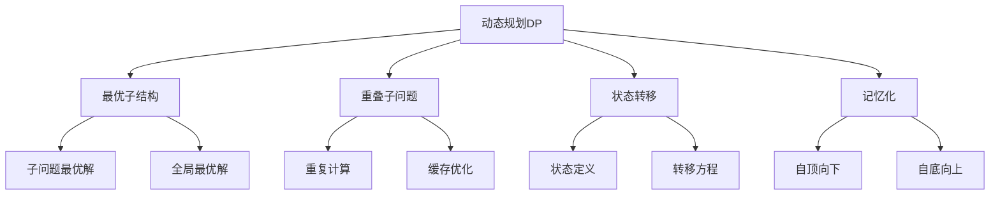

# 动态规划基础

## 📖 核心概念

**动态规划（Dynamic Programming, DP）**是一种通过把原问题分解为相对简单的子问题的方式求解复杂问题的方法。动态规划通常用于优化问题，通过存储子问题的解来避免重复计算，从而提高算法效率。

### 🏗️ 动态规划的组成要素



## 🔍 动态规划分类

### 按问题类型分类

| 问题类型 | 特点 | 典型问题 | 时间复杂度 |
|----------|------|----------|------------|
| **线性DP** | 一维状态 | 斐波那契、最长递增子序列 | O(n) |
| **区间DP** | 区间状态 | 矩阵链乘法、回文分割 | O(n³) |
| **树形DP** | 树结构状态 | 树的最大独立集 | O(n) |
| **状态压缩DP** | 位运算状态 | 旅行商问题 | O(n×2ⁿ) |

### 按实现方式分类

| 实现方式 | 优点 | 缺点 | 适用场景 |
|----------|------|------|----------|
| **递归+记忆化** | 直观易懂 | 栈溢出风险 | 小规模问题 |
| **迭代填表** | 空间可控 | 实现复杂 | 大规模问题 |
| **滚动数组** | 空间优化 | 实现复杂 | 空间受限 |

## 💻 动态规划基础实现

### 斐波那契数列

```cpp
class FibonacciDP {
private:
    vector<long long> memo;
    
public:
    FibonacciDP(int n) {
        memo.resize(n + 1, -1);
    }
    
    // 递归+记忆化（自顶向下）
    long long fibonacciMemo(int n) {
        if (n <= 1) return n;
        
        if (memo[n] != -1) {
            return memo[n];
        }
        
        memo[n] = fibonacciMemo(n - 1) + fibonacciMemo(n - 2);
        return memo[n];
    }
    
    // 迭代填表（自底向上）
    long long fibonacciIterative(int n) {
        if (n <= 1) return n;
        
        vector<long long> dp(n + 1);
        dp[0] = 0;
        dp[1] = 1;
        
        for (int i = 2; i <= n; i++) {
            dp[i] = dp[i - 1] + dp[i - 2];
        }
        
        return dp[n];
    }
    
    // 空间优化版本
    long long fibonacciOptimized(int n) {
        if (n <= 1) return n;
        
        long long prev2 = 0, prev1 = 1;
        
        for (int i = 2; i <= n; i++) {
            long long current = prev1 + prev2;
            prev2 = prev1;
            prev1 = current;
        }
        
        return prev1;
    }
    
    // 矩阵快速幂版本（O(log n)）
    long long fibonacciMatrix(int n) {
        if (n <= 1) return n;
        
        vector<vector<long long>> matrix = {{1, 1}, {1, 0}};
        matrix = matrixPower(matrix, n - 1);
        
        return matrix[0][0];
    }
    
private:
    vector<vector<long long>> matrixPower(vector<vector<long long>> base, int exp) {
        vector<vector<long long>> result = {{1, 0}, {0, 1}};
        
        while (exp > 0) {
            if (exp % 2 == 1) {
                result = matrixMultiply(result, base);
            }
            base = matrixMultiply(base, base);
            exp /= 2;
        }
        
        return result;
    }
    
    vector<vector<long long>> matrixMultiply(const vector<vector<long long>>& a, 
                                           const vector<vector<long long>>& b) {
        vector<vector<long long>> result(2, vector<long long>(2, 0));
        
        for (int i = 0; i < 2; i++) {
            for (int j = 0; j < 2; j++) {
                for (int k = 0; k < 2; k++) {
                    result[i][j] += a[i][k] * b[k][j];
                }
            }
        }
        
        return result;
    }
};
```

### 最长递增子序列

```cpp
class LongestIncreasingSubsequence {
private:
    vector<int> nums;
    
public:
    LongestIncreasingSubsequence(const vector<int>& numbers) : nums(numbers) {}
    
    // 基础DP解法
    int lengthOfLIS() {
        int n = nums.size();
        if (n == 0) return 0;
        
        vector<int> dp(n, 1);
        
        for (int i = 1; i < n; i++) {
            for (int j = 0; j < i; j++) {
                if (nums[j] < nums[i]) {
                    dp[i] = max(dp[i], dp[j] + 1);
                }
            }
        }
        
        return *max_element(dp.begin(), dp.end());
    }
    
    // 优化版本（二分查找）
    int lengthOfLISOptimized() {
        vector<int> tails;
        
        for (int num : nums) {
            auto it = lower_bound(tails.begin(), tails.end(), num);
            
            if (it == tails.end()) {
                tails.push_back(num);
            } else {
                *it = num;
            }
        }
        
        return tails.size();
    }
    
    // 获取LIS序列
    vector<int> getLIS() {
        int n = nums.size();
        if (n == 0) return {};
        
        vector<int> dp(n, 1);
        vector<int> prev(n, -1);
        
        for (int i = 1; i < n; i++) {
            for (int j = 0; j < i; j++) {
                if (nums[j] < nums[i] && dp[j] + 1 > dp[i]) {
                    dp[i] = dp[j] + 1;
                    prev[i] = j;
                }
            }
        }
        
        // 找到最长序列的末尾
        int maxLength = 0, endIndex = 0;
        for (int i = 0; i < n; i++) {
            if (dp[i] > maxLength) {
                maxLength = dp[i];
                endIndex = i;
            }
        }
        
        // 重构序列
        vector<int> lis;
        int current = endIndex;
        while (current != -1) {
            lis.push_back(nums[current]);
            current = prev[current];
        }
        
        reverse(lis.begin(), lis.end());
        return lis;
    }
    
    // 统计LIS数量
    int countLIS() {
        int n = nums.size();
        if (n == 0) return 0;
        
        vector<int> dp(n, 1);
        vector<int> count(n, 1);
        
        for (int i = 1; i < n; i++) {
            for (int j = 0; j < i; j++) {
                if (nums[j] < nums[i]) {
                    if (dp[j] + 1 > dp[i]) {
                        dp[i] = dp[j] + 1;
                        count[i] = count[j];
                    } else if (dp[j] + 1 == dp[i]) {
                        count[i] += count[j];
                    }
                }
            }
        }
        
        int maxLength = *max_element(dp.begin(), dp.end());
        int totalCount = 0;
        
        for (int i = 0; i < n; i++) {
            if (dp[i] == maxLength) {
                totalCount += count[i];
            }
        }
        
        return totalCount;
    }
};
```

## 🎯 动态规划高级应用

### 1. 最长公共子序列

```cpp
class LongestCommonSubsequence {
private:
    string text1, text2;
    
public:
    LongestCommonSubsequence(const string& t1, const string& t2) 
        : text1(t1), text2(t2) {}
    
    // 基础DP解法
    int lengthOfLCS() {
        int m = text1.length();
        int n = text2.length();
        
        vector<vector<int>> dp(m + 1, vector<int>(n + 1, 0));
        
        for (int i = 1; i <= m; i++) {
            for (int j = 1; j <= n; j++) {
                if (text1[i - 1] == text2[j - 1]) {
                    dp[i][j] = dp[i - 1][j - 1] + 1;
                } else {
                    dp[i][j] = max(dp[i - 1][j], dp[i][j - 1]);
                }
            }
        }
        
        return dp[m][n];
    }
    
    // 空间优化版本
    int lengthOfLCSOptimized() {
        int m = text1.length();
        int n = text2.length();
        
        if (m < n) {
            swap(text1, text2);
            swap(m, n);
        }
        
        vector<int> prev(n + 1, 0);
        vector<int> curr(n + 1, 0);
        
        for (int i = 1; i <= m; i++) {
            for (int j = 1; j <= n; j++) {
                if (text1[i - 1] == text2[j - 1]) {
                    curr[j] = prev[j - 1] + 1;
                } else {
                    curr[j] = max(prev[j], curr[j - 1]);
                }
            }
            swap(prev, curr);
        }
        
        return prev[n];
    }
    
    // 获取LCS序列
    string getLCS() {
        int m = text1.length();
        int n = text2.length();
        
        vector<vector<int>> dp(m + 1, vector<int>(n + 1, 0));
        
        for (int i = 1; i <= m; i++) {
            for (int j = 1; j <= n; j++) {
                if (text1[i - 1] == text2[j - 1]) {
                    dp[i][j] = dp[i - 1][j - 1] + 1;
                } else {
                    dp[i][j] = max(dp[i - 1][j], dp[i][j - 1]);
                }
            }
        }
        
        // 重构序列
        string lcs;
        int i = m, j = n;
        
        while (i > 0 && j > 0) {
            if (text1[i - 1] == text2[j - 1]) {
                lcs = text1[i - 1] + lcs;
                i--;
                j--;
            } else if (dp[i - 1][j] > dp[i][j - 1]) {
                i--;
            } else {
                j--;
            }
        }
        
        return lcs;
    }
    
    // 获取所有LCS
    vector<string> getAllLCS() {
        int m = text1.length();
        int n = text2.length();
        
        vector<vector<int>> dp(m + 1, vector<int>(n + 1, 0));
        
        for (int i = 1; i <= m; i++) {
            for (int j = 1; j <= n; j++) {
                if (text1[i - 1] == text2[j - 1]) {
                    dp[i][j] = dp[i - 1][j - 1] + 1;
                } else {
                    dp[i][j] = max(dp[i - 1][j], dp[i][j - 1]);
                }
            }
        }
        
        vector<string> allLCS;
        getAllLCSRecursive(m, n, "", dp, allLCS);
        
        return allLCS;
    }
    
private:
    void getAllLCSRecursive(int i, int j, string current, 
                           const vector<vector<int>>& dp, 
                           vector<string>& allLCS) {
        if (i == 0 || j == 0) {
            if (!current.empty()) {
                allLCS.push_back(current);
            }
            return;
        }
        
        if (text1[i - 1] == text2[j - 1]) {
            getAllLCSRecursive(i - 1, j - 1, text1[i - 1] + current, dp, allLCS);
        } else {
            if (dp[i - 1][j] == dp[i][j - 1]) {
                getAllLCSRecursive(i - 1, j, current, dp, allLCS);
                getAllLCSRecursive(i, j - 1, current, dp, allLCS);
            } else if (dp[i - 1][j] > dp[i][j - 1]) {
                getAllLCSRecursive(i - 1, j, current, dp, allLCS);
            } else {
                getAllLCSRecursive(i, j - 1, current, dp, allLCS);
            }
        }
    }
};
```

### 2. 编辑距离

```cpp
class EditDistance {
private:
    string word1, word2;
    
public:
    EditDistance(const string& w1, const string& w2) : word1(w1), word2(w2) {}
    
    // 基础DP解法
    int minDistance() {
        int m = word1.length();
        int n = word2.length();
        
        vector<vector<int>> dp(m + 1, vector<int>(n + 1, 0));
        
        // 初始化
        for (int i = 0; i <= m; i++) {
            dp[i][0] = i;
        }
        for (int j = 0; j <= n; j++) {
            dp[0][j] = j;
        }
        
        for (int i = 1; i <= m; i++) {
            for (int j = 1; j <= n; j++) {
                if (word1[i - 1] == word2[j - 1]) {
                    dp[i][j] = dp[i - 1][j - 1];
                } else {
                    dp[i][j] = 1 + min({dp[i - 1][j], dp[i][j - 1], dp[i - 1][j - 1]});
                }
            }
        }
        
        return dp[m][n];
    }
    
    // 空间优化版本
    int minDistanceOptimized() {
        int m = word1.length();
        int n = word2.length();
        
        if (m < n) {
            swap(word1, word2);
            swap(m, n);
        }
        
        vector<int> prev(n + 1);
        vector<int> curr(n + 1);
        
        for (int j = 0; j <= n; j++) {
            prev[j] = j;
        }
        
        for (int i = 1; i <= m; i++) {
            curr[0] = i;
            for (int j = 1; j <= n; j++) {
                if (word1[i - 1] == word2[j - 1]) {
                    curr[j] = prev[j - 1];
                } else {
                    curr[j] = 1 + min({prev[j], curr[j - 1], prev[j - 1]});
                }
            }
            swap(prev, curr);
        }
        
        return prev[n];
    }
    
    // 获取编辑操作序列
    vector<string> getEditOperations() {
        int m = word1.length();
        int n = word2.length();
        
        vector<vector<int>> dp(m + 1, vector<int>(n + 1, 0));
        
        // 初始化
        for (int i = 0; i <= m; i++) {
            dp[i][0] = i;
        }
        for (int j = 0; j <= n; j++) {
            dp[0][j] = j;
        }
        
        for (int i = 1; i <= m; i++) {
            for (int j = 1; j <= n; j++) {
                if (word1[i - 1] == word2[j - 1]) {
                    dp[i][j] = dp[i - 1][j - 1];
                } else {
                    dp[i][j] = 1 + min({dp[i - 1][j], dp[i][j - 1], dp[i - 1][j - 1]});
                }
            }
        }
        
        // 重构操作序列
        vector<string> operations;
        int i = m, j = n;
        
        while (i > 0 || j > 0) {
            if (i > 0 && j > 0 && word1[i - 1] == word2[j - 1]) {
                i--;
                j--;
            } else if (i > 0 && j > 0 && dp[i][j] == dp[i - 1][j - 1] + 1) {
                operations.push_back("替换 " + string(1, word1[i - 1]) + " -> " + string(1, word2[j - 1]));
                i--;
                j--;
            } else if (i > 0 && dp[i][j] == dp[i - 1][j] + 1) {
                operations.push_back("删除 " + string(1, word1[i - 1]));
                i--;
            } else if (j > 0 && dp[i][j] == dp[i][j - 1] + 1) {
                operations.push_back("插入 " + string(1, word2[j - 1]));
                j--;
            }
        }
        
        reverse(operations.begin(), operations.end());
        return operations;
    }
};
```

### 3. 矩阵链乘法

```cpp
class MatrixChainMultiplication {
private:
    vector<int> dimensions;
    
public:
    MatrixChainMultiplication(const vector<int>& dims) : dimensions(dims) {}
    
    // 计算最小乘法次数
    int minMultiplications() {
        int n = dimensions.size() - 1;
        if (n <= 1) return 0;
        
        vector<vector<int>> dp(n, vector<int>(n, 0));
        
        // 填充DP表
        for (int length = 2; length <= n; length++) {
            for (int i = 0; i <= n - length; i++) {
                int j = i + length - 1;
                dp[i][j] = INT_MAX;
                
                for (int k = i; k < j; k++) {
                    int cost = dp[i][k] + dp[k + 1][j] + 
                              dimensions[i] * dimensions[k + 1] * dimensions[j + 1];
                    dp[i][j] = min(dp[i][j], cost);
                }
            }
        }
        
        return dp[0][n - 1];
    }
    
    // 获取最优括号化方案
    string getOptimalParenthesization() {
        int n = dimensions.size() - 1;
        if (n <= 1) return "A0";
        
        vector<vector<int>> dp(n, vector<int>(n, 0));
        vector<vector<int>> split(n, vector<int>(n, 0));
        
        // 填充DP表和分割点
        for (int length = 2; length <= n; length++) {
            for (int i = 0; i <= n - length; i++) {
                int j = i + length - 1;
                dp[i][j] = INT_MAX;
                
                for (int k = i; k < j; k++) {
                    int cost = dp[i][k] + dp[k + 1][j] + 
                              dimensions[i] * dimensions[k + 1] * dimensions[j + 1];
                    if (cost < dp[i][j]) {
                        dp[i][j] = cost;
                        split[i][j] = k;
                    }
                }
            }
        }
        
        return getParenthesization(0, n - 1, split);
    }
    
    // 获取所有矩阵的乘法次数
    vector<vector<int>> getAllMultiplications() {
        int n = dimensions.size() - 1;
        vector<vector<int>> dp(n, vector<int>(n, 0));
        
        for (int length = 2; length <= n; length++) {
            for (int i = 0; i <= n - length; i++) {
                int j = i + length - 1;
                dp[i][j] = INT_MAX;
                
                for (int k = i; k < j; k++) {
                    int cost = dp[i][k] + dp[k + 1][j] + 
                              dimensions[i] * dimensions[k + 1] * dimensions[j + 1];
                    dp[i][j] = min(dp[i][j], cost);
                }
            }
        }
        
        return dp;
    }
    
private:
    string getParenthesization(int i, int j, const vector<vector<int>>& split) {
        if (i == j) {
            return "A" + to_string(i);
        }
        
        int k = split[i][j];
        string left = getParenthesization(i, k, split);
        string right = getParenthesization(k + 1, j, split);
        
        return "(" + left + " × " + right + ")";
    }
};
```

## ⚡ 复杂度分析

### 时间复杂度

| 问题类型 | 时间复杂度 | 说明 |
|----------|------------|------|
| **线性DP** | O(n) | 一维状态空间 |
| **二维DP** | O(m×n) | 二维状态空间 |
| **区间DP** | O(n³) | 三重循环 |
| **状态压缩DP** | O(n×2ⁿ) | 状态空间指数级 |

### 空间复杂度

| 实现方式 | 空间复杂度 | 说明 |
|----------|------------|------|
| **基础DP** | O(n) | 一维DP表 |
| **二维DP** | O(m×n) | 二维DP表 |
| **滚动数组** | O(n) | 空间优化 |
| **记忆化** | O(n) | 递归栈空间 |

### 性能特点

| 特点 | 描述 | 影响 |
|------|------|------|
| **最优性** | 保证最优解 | 适用于优化问题 |
| **重叠性** | 避免重复计算 | 提高效率 |
| **子结构** | 问题可分解 | 递归求解 |
| **记忆化** | 存储中间结果 | 空间换时间 |

## 🎓 学习要点总结

### 核心理解

1. **最优子结构**：理解子问题的最优解构成全局最优解
2. **重叠子问题**：识别重复计算的子问题
3. **状态转移**：掌握状态之间的转移关系
4. **边界条件**：正确设置初始状态

### 实践要点

1. **状态定义**：清晰定义DP状态的含义
2. **转移方程**：正确推导状态转移方程
3. **空间优化**：使用滚动数组优化空间
4. **路径重构**：从DP表重构最优解

### 应用思维

1. **问题识别**：识别适合DP的问题特征
2. **状态设计**：设计合适的状态表示
3. **优化策略**：选择合适的优化方法
4. **实际应用**：将DP应用到实际问题中

---

**相关链接：**
- [[01-理论根基/04-算法思想/01-递归思想|递归思想]] - 分治策略基础
- [[04-算法武器库/04-动态规划/02-背包问题|背包问题]] - 经典DP问题
- [[04-算法武器库/02-排序艺术/02-快速排序算法|快速排序算法]] - 分治策略应用
- [[04-算法武器库/02-排序艺术/03-归并排序算法|归并排序算法]] - 分治策略应用
