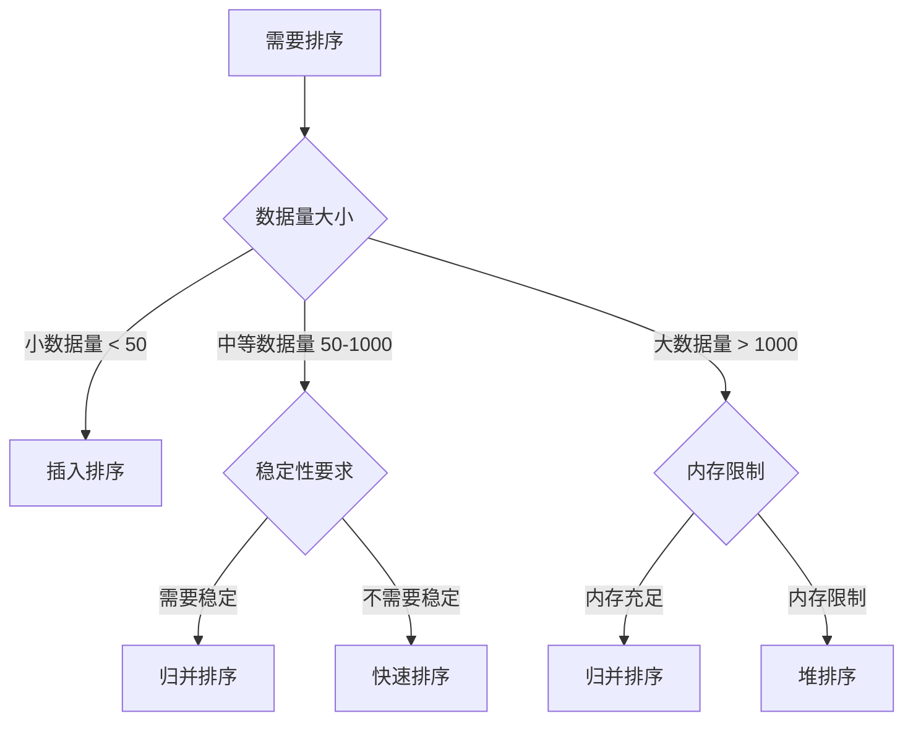
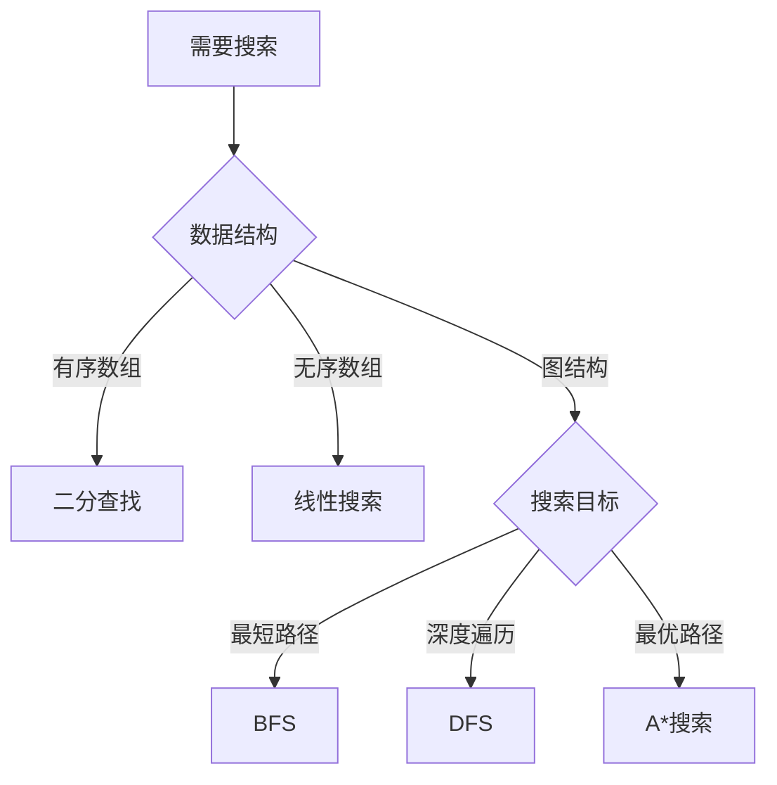
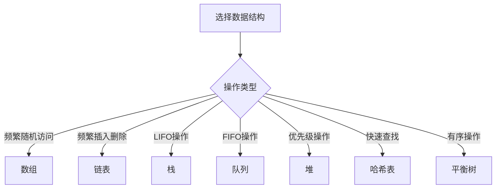

# 算法对比总表

## 📊 排序算法对比

| 算法 | 最好 | 平均 | 最坏 | 空间 | 稳定性 | 特点 | 适用场景 |
|------|------|------|------|------|--------|------|----------|
| 冒泡排序 | O(n) | O(n²) | O(n²) | O(1) | 稳定 | 简单易懂 | 教学演示 |
| 选择排序 | O(n²) | O(n²) | O(n²) | O(1) | 不稳定 | 交换次数少 | 小数据量 |
| 插入排序 | O(n) | O(n²) | O(n²) | O(1) | 稳定 | 小数据高效 | 小数据量 |
| 希尔排序 | O(n log n) | O(n^1.3) | O(n²) | O(1) | 不稳定 | 改进插入 | 中等数据量 |
| 归并排序 | O(n log n) | O(n log n) | O(n log n) | O(n) | 稳定 | 稳定排序 | 大数据量 |
| 快速排序 | O(n log n) | O(n log n) | O(n²) | O(log n) | 不稳定 | 平均最快 | 通用排序 |
| 堆排序 | O(n log n) | O(n log n) | O(n log n) | O(1) | 不稳定 | 原地排序 | 内存限制 |
| 计数排序 | O(n+k) | O(n+k) | O(n+k) | O(k) | 稳定 | 非比较排序 | 整数排序 |
| 基数排序 | O(d(n+k)) | O(d(n+k)) | O(d(n+k)) | O(n+k) | 稳定 | 非比较排序 | 多关键字 |
| 桶排序 | O(n+k) | O(n+k) | O(n²) | O(n+k) | 稳定 | 非比较排序 | 均匀分布 |

## 🔍 搜索算法对比

| 算法 | 时间复杂度 | 空间复杂度 | 特点 | 适用场景 |
|------|------------|------------|------|----------|
| 线性搜索 | O(n) | O(1) | 简单直接 | 无序数组 |
| 二分查找 | O(log n) | O(1) | 高效查找 | 有序数组 |
| 插值查找 | O(log log n) | O(1) | 均匀分布 | 均匀分布数据 |
| 斐波那契查找 | O(log n) | O(1) | 黄金分割 | 有序数组 |
| 深度优先搜索 | O(V+E) | O(V) | 深度优先 | 图遍历 |
| 广度优先搜索 | O(V+E) | O(V) | 广度优先 | 最短路径 |
| A*搜索 | O(b^d) | O(b^d) | 启发式 | 路径规划 |

## 🗺️ 图算法对比

### 最短路径算法
| 算法 | 时间复杂度 | 空间复杂度 | 特点 | 适用场景 |
|------|------------|------------|------|----------|
| Dijkstra | O(V²) | O(V) | 单源最短 | 非负权图 |
| Dijkstra+堆 | O(E log V) | O(V) | 单源最短 | 稀疏图 |
| Bellman-Ford | O(VE) | O(V) | 单源最短 | 负权图 |
| Floyd-Warshall | O(V³) | O(V²) | 多源最短 | 小规模图 |
| SPFA | O(VE) | O(V) | 单源最短 | 负权图 |

### 最小生成树算法
| 算法 | 时间复杂度 | 空间复杂度 | 特点 | 适用场景 |
|------|------------|------------|------|----------|
| Kruskal | O(E log E) | O(V) | 边排序 | 稀疏图 |
| Prim | O(V²) | O(V) | 点扩展 | 稠密图 |
| Prim+堆 | O(E log V) | O(V) | 点扩展 | 稀疏图 |

## 🧠 算法思想对比

| 思想 | 特点 | 适用问题 | 优缺点 | 经典问题 |
|------|------|----------|--------|----------|
| 递归分治 | 分而治之 | 可分解问题 | 简单但可能低效 | 归并排序、快速排序 |
| 贪心算法 | 局部最优 | 优化问题 | 简单但不一定最优 | 活动选择、霍夫曼编码 |
| 动态规划 | 记忆化 | 重叠子问题 | 复杂但最优 | 背包问题、最长子序列 |
| 回溯算法 | 尝试所有 | 搜索问题 | 完整但可能低效 | N皇后、全排列 |

## 📈 数据结构对比

### 线性结构
| 结构 | 访问 | 搜索 | 插入 | 删除 | 空间 | 特点 |
|------|------|------|------|------|------|------|
| 数组 | O(1) | O(n) | O(n) | O(n) | O(n) | 随机访问 |
| 链表 | O(n) | O(n) | O(1) | O(1) | O(n) | 动态大小 |
| 栈 | O(n) | O(n) | O(1) | O(1) | O(n) | LIFO |
| 队列 | O(n) | O(n) | O(1) | O(1) | O(n) | FIFO |

### 树形结构
| 结构 | 搜索 | 插入 | 删除 | 空间 | 特点 |
|------|------|------|------|------|------|
| 二叉搜索树 | O(log n) | O(log n) | O(log n) | O(n) | 有序 |
| 平衡树 | O(log n) | O(log n) | O(log n) | O(n) | 高度平衡 |
| 堆 | O(n) | O(log n) | O(log n) | O(n) | 优先级 |
| 字典树 | O(m) | O(m) | O(m) | O(ALPHABET_SIZE*N*M) | 字符串 |

### 图形结构
| 存储方式 | 空间复杂度 | 查询边 | 添加边 | 删除边 | 适用场景 |
|----------|------------|--------|--------|--------|----------|
| 邻接矩阵 | O(V²) | O(1) | O(1) | O(1) | 稠密图 |
| 邻接表 | O(V+E) | O(V) | O(1) | O(V) | 稀疏图 |
| 边列表 | O(E) | O(E) | O(1) | O(E) | 边操作频繁 |

## 🎯 算法选择指南

### 排序选择


### 搜索选择


### 数据结构选择


## 📊 性能对比图

### 时间复杂度对比
```mermaid
graph LR
    A[O(1)] --> B[O(log n)]
    B --> C[O(n)]
    C --> D[O(n log n)]
    D --> E[O(n²)]
    E --> F[O(n³)]
    F --> G[O(2ⁿ)]
```

### 空间复杂度对比
```mermaid
graph LR
    A[O(1)] --> B[O(log n)]
    B --> C[O(n)]
    C --> D[O(n log n)]
    D --> E[O(n²)]
```

## 🔍 实际应用场景

### 排序应用
- **数据库排序**：归并排序（稳定）
- **内存排序**：快速排序（高效）
- **外部排序**：归并排序（稳定）
- **实时排序**：堆排序（原地）

### 搜索应用
- **数据库查询**：二分查找
- **文件搜索**：线性搜索
- **路径规划**：A*搜索
- **网络爬虫**：BFS

### 图算法应用
- **社交网络**：最短路径
- **地图导航**：Dijkstra
- **网络拓扑**：最小生成树
- **任务调度**：拓扑排序

## 🎯 学习建议

### 掌握顺序
1. **基础排序**：冒泡、选择、插入
2. **高效排序**：快速、归并、堆
3. **搜索算法**：线性、二分、DFS、BFS
4. **图算法**：最短路径、最小生成树
5. **高级算法**：动态规划、贪心、回溯

### 练习重点
- **时间复杂度分析**：理解各种复杂度
- **空间复杂度分析**：理解空间使用
- **算法实现**：能够手写算法
- **算法选择**：根据场景选择算法
- **算法优化**：优化算法性能

## 🔗 相关链接
- [[01-学习路径图]] - 完整学习路径
- [[02-知识点索引]] - 知识点快速查找
- [[03-学习检查清单]] - 学习进度检查
- [[04-核心概念速查表]] - 核心概念快速查阅

