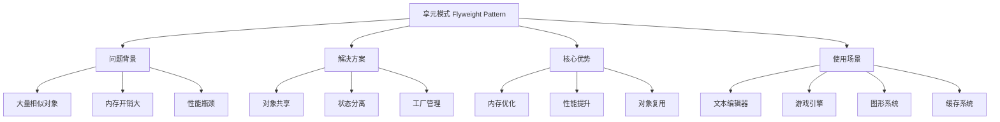
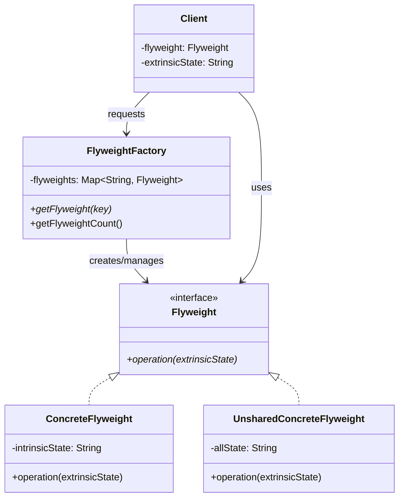

# 🪶 享元模式详解

[[04-结构型模式/06-组合模式]] ← [[04-结构型模式/08-桥接模式]]
## 🎯 享元模式概览

### 📊 模式基本信息



### 🎯 **定义与意图**
享元模式运用共享技术有效地支持大量细粒度的对象。通过共享相同的数据来减少内存使用，提高性能。

### 📋 **核心价值**
- **内存优化**: 通过共享相同数据减少内存占用
- **性能提升**: 减少对象创建和销毁的开销
- **对象复用**: 相同类型的对象可以共享内部状态
- **细粒度控制**: 支持大量细粒度对象的创建

## 🏗️ 享元模式结构

### 📊 **类图结构**



### 🎯 **角色职责**

#### **Flyweight (享元接口)**
- 声明一个接口，通过它可以接受并作用于外部状态

#### **ConcreteFlyweight (具体享元)**
- 实现Flyweight接口，并为内部状态增加存储空间
- 必须是可共享的，它存储的状态必须是内部的

#### **UnsharedConcreteFlyweight (非共享具体享元)**
- 并非所有的Flyweight子类都需要被共享
- 不强制共享，可以独立使用

#### **FlyweightFactory (享元工厂)**
- 创建并管理Flyweight对象
- 确保合理地共享Flyweight

## 💻 享元模式实现

### 🎯 **经典实现：文本编辑器**

```java
// ✅ 字符享元接口
public interface CharacterFlyweight {
    void display(int x, int y, String font, int size, String color);
    String getCharacter();
    FontMetrics getFontMetrics(String font, int size);
}

// ✅ 具体字符享元
public class CharacterFlyweightImpl implements CharacterFlyweight {
    private final char character;
    private final Map<String, FontMetrics> fontMetricsCache;
    
    public CharacterFlyweightImpl(char character) {
        this.character = character;
        this.fontMetricsCache = new ConcurrentHashMap<>();
    }
    
    @Override
    public void display(int x, int y, String font, int size, String color) {
        // ✅ 内部状态：字符本身
        // ✅ 外部状态：位置、字体、大小、颜色
        
        String fontKey = font + "_" + size;
        FontMetrics metrics = getFontMetrics(font, size);
        
        System.out.printf("显示字符 '%c' 在位置 (%d, %d), 字体: %s, 大小: %d, 颜色: %s%n",
                         character, x, y, font, size, color);
        
        // 模拟实际渲染
        renderCharacter(x, y, font, size, color, metrics);
    }
    
    @Override
    public String getCharacter() {
        return String.valueOf(character);
    }
    
    @Override
    public FontMetrics getFontMetrics(String font, int size) {
        String key = font + "_" + size;
        return fontMetricsCache.computeIfAbsent(key, k -> {
            // ✅ 模拟字体度量计算
            return new FontMetrics(font, size, calculateWidth(), calculateHeight());
        });
    }
    
    private void renderCharacter(int x, int y, String font, int size, String color, FontMetrics metrics) {
        // 模拟字符渲染逻辑
        // 在实际应用中，这里会调用图形API
    }
    
    private int calculateWidth() {
        // 根据字符类型计算宽度
        if (Character.isDigit(character)) {
            return 8; // 数字字符
        } else if (Character.isLetter(character)) {
            return character == 'i' || character == 'l' ? 6 : 10; // 字母字符
        } else {
            return 8; // 其他字符
        }
    }
    
    private int calculateHeight() {
        return 12; // 统一高度
    }
    
    // ✅ 享元对象标识
    @Override
    public boolean equals(Object obj) {
        if (this == obj) return true;
        if (obj == null || getClass() != obj.getClass()) return false;
        CharacterFlyweightImpl that = (CharacterFlyweightImpl) obj;
        return character == that.character;
    }
    
    @Override
    public int hashCode() {
        return Character.hashCode(character);
    }
}

// ✅ 字体度量类
public class FontMetrics {
    private final String font;
    private final int size;
    private final int width;
    private final int height;
    
    public FontMetrics(String font, int size, int width, int height) {
        this.font = font;
        this.size = size;
        this.width = width;
        this.height = height;
    }
    
    // Getters
    public String getFont() { return font; }
    public int getSize() { return size; }
    public int getWidth() { return width; }
    public int getHeight() { return height; }
}

// ✅ 字符享元工厂
public class CharacterFlyweightFactory {
    private final Map<Character, CharacterFlyweight> characterPool;
    private final AtomicInteger createdCount;
    private final AtomicInteger reusedCount;
    
    public CharacterFlyweightFactory() {
        this.characterPool = new ConcurrentHashMap<>();
        this.createdCount = new AtomicInteger(0);
        this.reusedCount = new AtomicInteger(0);
    }
    
    // ✅ 获取字符享元
    public CharacterFlyweight getCharacter(char character) {
        return characterPool.computeIfAbsent(character, c -> {
            createdCount.incrementAndGet();
            return new CharacterFlyweightImpl(c);
        });
    }
    
    // ✅ 批量获取字符享元
    public List<CharacterFlyweight> getCharacters(String text) {
        return text.chars()
            .mapToObj(c -> getCharacter((char) c))
            .collect(Collectors.toList());
    }
    
    // ✅ 预加载常用字符
    public void preloadCommonCharacters() {
        String commonChars = "abcdefghijklmnopqrstuvwxyzABCDEFGHIJKLMNOPQRSTUVWXYZ0123456789.,!? ";
        
        for (char c : commonChars.toCharArray()) {
            getCharacter(c);
        }
        
        System.out.println("预加载了 " + commonChars.length() + " 个常用字符");
    }
    
    // ✅ 统计信息
    public FlyweightStatistics getStatistics() {
        return FlyweightStatistics.builder()
            .totalCreated(createdCount.get())
            .totalReused(reusedCount.get())
            .poolSize(characterPool.size())
            .memorySaved(calculateMemorySaved())
            .build();
    }
    
    private long calculateMemorySaved() {
        // 估算节省的内存
        long singleObjectSize = 64; // 估算单个字符对象大小
        long totalObjects = createdCount.get() + reusedCount.get();
        long sharedObjects = characterPool.size();
        
        return (totalObjects - sharedObjects) * singleObjectSize;
    }
    
    // ✅ 清理不常用的字符
    public void cleanupUnusedCharacters() {
        // 在实际应用中，这里会实现LRU或其他清理策略
        System.out.println("清理未使用的字符享元");
    }
}

// ✅ 享元统计信息
public class FlyweightStatistics {
    private final int totalCreated;
    private final int totalReused;
    private final int poolSize;
    private final long memorySaved;
    
    private FlyweightStatistics(Builder builder) {
        this.totalCreated = builder.totalCreated;
        this.totalReused = builder.totalReused;
        this.poolSize = builder.poolSize;
        this.memorySaved = builder.memorySaved;
    }
    
    // Getters
    public int getTotalCreated() { return totalCreated; }
    public int getTotalReused() { return totalReused; }
    public int getPoolSize() { return poolSize; }
    public long getMemorySaved() { return memorySaved; }
    
    public static Builder builder() {
        return new Builder();
    }
    
    public static class Builder {
        private int totalCreated;
        private int totalReused;
        private int poolSize;
        private long memorySaved;
        
        public Builder totalCreated(int totalCreated) { this.totalCreated = totalCreated; return this; }
        public Builder totalReused(int totalReused) { this.totalReused = totalReused; return this; }
        public Builder poolSize(int poolSize) { this.poolSize = poolSize; return this; }
        public Builder memorySaved(long memorySaved) { this.memorySaved = memorySaved; return this; }
        
        public FlyweightStatistics build() { return new FlyweightStatistics(this); }
    }
}

// ✅ 文本编辑器
public class TextEditor {
    private final CharacterFlyweightFactory characterFactory;
    private final List<TextElement> textElements;
    private final Map<String, TextStyle> styleCache;
    
    public TextEditor() {
        this.characterFactory = new CharacterFlyweightFactory();
        this.textElements = new ArrayList<>();
        this.styleCache = new HashMap<>();
        
        // ✅ 预加载常用字符
        characterFactory.preloadCommonCharacters();
        
        // ✅ 预定义样式
        initializeStyles();
    }
    
    // ✅ 插入文本
    public void insertText(String text, int x, int y, TextStyle style) {
        List<CharacterFlyweight> characters = characterFactory.getCharacters(text);
        
        for (int i = 0; i < characters.size(); i++) {
            TextElement element = new TextElement(
                characters.get(i),
                x + i * style.getCharacterWidth(),
                y,
                style
            );
            textElements.add(element);
        }
        
        System.out.println("插入文本: " + text + " 在位置 (" + x + ", " + y + ")");
    }
    
    // ✅ 渲染文本
    public void render() {
        System.out.println("=== 文本编辑器渲染 ===");
        
        for (TextElement element : textElements) {
            element.render();
        }
        
        System.out.println("==================");
    }
    
    // ✅ 搜索文本
    public List<TextElement> searchText(String pattern) {
        return textElements.stream()
            .filter(element -> element.getCharacter().contains(pattern))
            .collect(Collectors.toList());
    }
    
    // ✅ 获取统计信息
    public void printStatistics() {
        FlyweightStatistics stats = characterFactory.getStatistics();
        
        System.out.println("=== 享元模式统计 ===");
        System.out.println("创建的字符对象: " + stats.getTotalCreated());
        System.out.println("重用的字符对象: " + stats.getTotalReused());
        System.out.println("享元池大小: " + stats.getPoolSize());
        System.out.println("节省的内存: " + stats.getMemorySaved() + " bytes");
        System.out.println("文本元素数量: " + textElements.size());
        System.out.println("==================");
    }
    
    private void initializeStyles() {
        styleCache.put("normal", new TextStyle("Arial", 12, "black", 8));
        styleCache.put("bold", new TextStyle("Arial", 12, "black", 8, true));
        styleCache.put("large", new TextStyle("Arial", 16, "black", 12));
        styleCache.put("red", new TextStyle("Arial", 12, "red", 8));
    }
    
    public TextStyle getStyle(String styleName) {
        return styleCache.get(styleName);
    }
}

// ✅ 文本元素（外部状态）
public class TextElement {
    private final CharacterFlyweight character;
    private final int x, y;
    private final TextStyle style;
    
    public TextElement(CharacterFlyweight character, int x, int y, TextStyle style) {
        this.character = character;
        this.x = x;
        this.y = y;
        this.style = style;
    }
    
    public void render() {
        character.display(x, y, style.getFont(), style.getSize(), style.getColor());
    }
    
    public String getCharacter() {
        return character.getCharacter();
    }
    
    // Getters
    public int getX() { return x; }
    public int getY() { return y; }
    public TextStyle getStyle() { return style; }
}

// ✅ 文本样式（外部状态）
public class TextStyle {
    private final String font;
    private final int size;
    private final String color;
    private final int characterWidth;
    private final boolean bold;
    
    public TextStyle(String font, int size, String color, int characterWidth) {
        this(font, size, color, characterWidth, false);
    }
    
    public TextStyle(String font, int size, String color, int characterWidth, boolean bold) {
        this.font = font;
        this.size = size;
        this.color = color;
        this.characterWidth = characterWidth;
        this.bold = bold;
    }
    
    // Getters
    public String getFont() { return font; }
    public int getSize() { return size; }
    public String getColor() { return color; }
    public int getCharacterWidth() { return characterWidth; }
    public boolean isBold() { return bold; }
}

// ✅ 客户端使用示例
public class TextEditorDemo {
    public static void main(String[] args) {
        TextEditor editor = new TextEditor();
        
        // ✅ 插入不同样式的文本
        editor.insertText("Hello", 0, 0, editor.getStyle("normal"));
        editor.insertText("World", 50, 0, editor.getStyle("bold"));
        editor.insertText("Java", 100, 0, editor.getStyle("large"));
        editor.insertText("Design Patterns", 0, 20, editor.getStyle("red"));
        
        // ✅ 渲染文本
        editor.render();
        
        // ✅ 搜索文本
        List<TextElement> searchResults = editor.searchText("o");
        System.out.println("包含'o'的文本元素数量: " + searchResults.size());
        
        // ✅ 显示统计信息
        editor.printStatistics();
        
        // ✅ 演示享元模式的优势
        System.out.println("\n=== 享元模式优势演示 ===");
        
        // 插入大量重复字符
        StringBuilder sb = new StringBuilder();
        for (int i = 0; i < 1000; i++) {
            sb.append("a");
        }
        
        editor.insertText(sb.toString(), 0, 50, editor.getStyle("normal"));
        editor.printStatistics();
        
        System.out.println("即使插入了1000个字符'a'，享元池中只有一个'a'对象！");
    }
}
```

### 🚀 **现代企业级实现：游戏引擎**

```java
// ✅ 游戏对象享元接口
public interface GameObjectFlyweight {
    void render(int x, int y, int rotation, String texture);
    void update(float deltaTime);
    String getType();
    BoundingBox getBoundingBox();
}

// ✅ 具体游戏对象享元
public class EnemyFlyweight implements GameObjectFlyweight {
    private final String enemyType;
    private final int baseHealth;
    private final int baseSpeed;
    private final String baseTexture;
    private final BoundingBox baseBoundingBox;
    
    public EnemyFlyweight(String enemyType, int baseHealth, int baseSpeed, String baseTexture) {
        this.enemyType = enemyType;
        this.baseHealth = baseHealth;
        this.baseSpeed = baseSpeed;
        this.baseTexture = baseTexture;
        this.baseBoundingBox = new BoundingBox(32, 32); // 默认大小
    }
    
    @Override
    public void render(int x, int y, int rotation, String texture) {
        // ✅ 内部状态：敌人类型、基础属性
        // ✅ 外部状态：位置、旋转、纹理变体
        
        System.out.printf("渲染敌人 %s 在位置 (%d, %d), 旋转: %d度, 纹理: %s%n",
                         enemyType, x, y, rotation, texture);
        
        // 模拟实际渲染
        renderEnemySprite(x, y, rotation, texture);
    }
    
    @Override
    public void update(float deltaTime) {
        // 敌人AI更新逻辑
        updateAI(deltaTime);
    }
    
    @Override
    public String getType() {
        return enemyType;
    }
    
    @Override
    public BoundingBox getBoundingBox() {
        return baseBoundingBox;
    }
    
    private void renderEnemySprite(int x, int y, int rotation, String texture) {
        // 模拟精灵渲染
    }
    
    private void updateAI(float deltaTime) {
        // 模拟AI更新
    }
    
    // ✅ 享元对象标识
    @Override
    public boolean equals(Object obj) {
        if (this == obj) return true;
        if (obj == null || getClass() != obj.getClass()) return false;
        EnemyFlyweight that = (EnemyFlyweight) obj;
        return Objects.equals(enemyType, that.enemyType);
    }
    
    @Override
    public int hashCode() {
        return Objects.hash(enemyType);
    }
}

// ✅ 游戏对象享元工厂
public class GameObjectFlyweightFactory {
    private final Map<String, GameObjectFlyweight> flyweightPool;
    private final Map<String, EnemyTemplate> enemyTemplates;
    
    public GameObjectFlyweightFactory() {
        this.flyweightPool = new ConcurrentHashMap<>();
        this.enemyTemplates = new HashMap<>();
        
        // ✅ 初始化敌人模板
        initializeEnemyTemplates();
    }
    
    // ✅ 获取敌人享元
    public GameObjectFlyweight getEnemyFlyweight(String enemyType) {
        return flyweightPool.computeIfAbsent(enemyType, type -> {
            EnemyTemplate template = enemyTemplates.get(type);
            if (template == null) {
                throw new IllegalArgumentException("未知的敌人类型: " + type);
            }
            
            return new EnemyFlyweight(
                template.getType(),
                template.getBaseHealth(),
                template.getBaseSpeed(),
                template.getBaseTexture()
            );
        });
    }
    
    // ✅ 批量创建敌人
    public List<GameObjectInstance> createEnemies(String enemyType, int count, List<Position> positions) {
        GameObjectFlyweight flyweight = getEnemyFlyweight(enemyType);
        
        return IntStream.range(0, Math.min(count, positions.size()))
            .mapToObj(i -> new GameObjectInstance(flyweight, positions.get(i)))
            .collect(Collectors.toList());
    }
    
    // ✅ 预加载常用敌人类型
    public void preloadCommonEnemies() {
        String[] commonTypes = {"zombie", "skeleton", "orc", "goblin"};
        
        for (String type : commonTypes) {
            getEnemyFlyweight(type);
        }
        
        System.out.println("预加载了 " + commonTypes.length + " 种敌人类型");
    }
    
    // ✅ 获取统计信息
    public FlyweightPoolStatistics getPoolStatistics() {
        return FlyweightPoolStatistics.builder()
            .poolSize(flyweightPool.size())
            .totalTemplates(enemyTemplates.size())
            .memoryUsage(calculateMemoryUsage())
            .build();
    }
    
    private long calculateMemoryUsage() {
        // 估算内存使用
        long flyweightSize = 200; // 估算单个享元对象大小
        return flyweightPool.size() * flyweightSize;
    }
    
    private void initializeEnemyTemplates() {
        enemyTemplates.put("zombie", new EnemyTemplate("zombie", 100, 50, "zombie_base.png"));
        enemyTemplates.put("skeleton", new EnemyTemplate("skeleton", 80, 70, "skeleton_base.png"));
        enemyTemplates.put("orc", new EnemyTemplate("orc", 150, 40, "orc_base.png"));
        enemyTemplates.put("goblin", new EnemyTemplate("goblin", 60, 90, "goblin_base.png"));
    }
}

// ✅ 游戏对象实例（外部状态）
public class GameObjectInstance {
    private final GameObjectFlyweight flyweight;
    private final Position position;
    private final int rotation;
    private final String textureVariant;
    private final Map<String, Object> instanceData;
    
    public GameObjectInstance(GameObjectFlyweight flyweight, Position position) {
        this.flyweight = flyweight;
        this.position = position;
        this.rotation = 0;
        this.textureVariant = "default";
        this.instanceData = new HashMap<>();
    }
    
    public GameObjectInstance(GameObjectFlyweight flyweight, Position position, int rotation, String textureVariant) {
        this.flyweight = flyweight;
        this.position = position;
        this.rotation = rotation;
        this.textureVariant = textureVariant;
        this.instanceData = new HashMap<>();
    }
    
    public void render() {
        flyweight.render(position.getX(), position.getY(), rotation, textureVariant);
    }
    
    public void update(float deltaTime) {
        flyweight.update(deltaTime);
    }
    
    public String getType() {
        return flyweight.getType();
    }
    
    public BoundingBox getBoundingBox() {
        return flyweight.getBoundingBox();
    }
    
    // Getters
    public Position getPosition() { return position; }
    public int getRotation() { return rotation; }
    public String getTextureVariant() { return textureVariant; }
    
    public void setInstanceData(String key, Object value) {
        instanceData.put(key, value);
    }
    
    public Object getInstanceData(String key) {
        return instanceData.get(key);
    }
}

// ✅ 游戏场景管理器
public class GameSceneManager {
    private final GameObjectFlyweightFactory flyweightFactory;
    private final List<GameObjectInstance> gameObjects;
    private final Map<String, List<GameObjectInstance>> objectsByType;
    
    public GameSceneManager() {
        this.flyweightFactory = new GameObjectFlyweightFactory();
        this.gameObjects = new ArrayList<>();
        this.objectsByType = new HashMap<>();
        
        // ✅ 预加载常用对象
        flyweightFactory.preloadCommonEnemies();
    }
    
    // ✅ 添加游戏对象
    public void addGameObject(String type, Position position) {
        GameObjectFlyweight flyweight = flyweightFactory.getEnemyFlyweight(type);
        GameObjectInstance instance = new GameObjectInstance(flyweight, position);
        
        gameObjects.add(instance);
        objectsByType.computeIfAbsent(type, k -> new ArrayList<>()).add(instance);
        
        System.out.println("添加游戏对象: " + type + " 在位置 " + position);
    }
    
    // ✅ 批量添加游戏对象
    public void addGameObjects(String type, List<Position> positions) {
        List<GameObjectInstance> instances = flyweightFactory.createEnemies(type, positions.size(), positions);
        
        gameObjects.addAll(instances);
        objectsByType.computeIfAbsent(type, k -> new ArrayList<>()).addAll(instances);
        
        System.out.println("批量添加 " + instances.size() + " 个 " + type + " 对象");
    }
    
    // ✅ 渲染所有对象
    public void renderAll() {
        System.out.println("=== 渲染游戏场景 ===");
        
        for (GameObjectInstance instance : gameObjects) {
            instance.render();
        }
        
        System.out.println("==================");
    }
    
    // ✅ 更新所有对象
    public void updateAll(float deltaTime) {
        for (GameObjectInstance instance : gameObjects) {
            instance.update(deltaTime);
        }
    }
    
    // ✅ 按类型获取对象
    public List<GameObjectInstance> getObjectsByType(String type) {
        return objectsByType.getOrDefault(type, Collections.emptyList());
    }
    
    // ✅ 获取统计信息
    public void printStatistics() {
        FlyweightPoolStatistics poolStats = flyweightFactory.getPoolStatistics();
        
        System.out.println("=== 游戏场景统计 ===");
        System.out.println("享元池大小: " + poolStats.getPoolSize());
        System.out.println("总对象数量: " + gameObjects.size());
        System.out.println("对象类型数量: " + objectsByType.size());
        System.out.println("内存使用: " + poolStats.getMemoryUsage() + " bytes");
        
        objectsByType.forEach((type, instances) -> 
            System.out.println("  " + type + ": " + instances.size() + " 个实例"));
        
        System.out.println("==================");
    }
}

// ✅ 辅助类
public class Position {
    private final int x, y;
    
    public Position(int x, int y) {
        this.x = x;
        this.y = y;
    }
    
    public int getX() { return x; }
    public int getY() { return y; }
    
    @Override
    public String toString() {
        return "(" + x + ", " + y + ")";
    }
}

public class BoundingBox {
    private final int width, height;
    
    public BoundingBox(int width, int height) {
        this.width = width;
        this.height = height;
    }
    
    public int getWidth() { return width; }
    public int getHeight() { return height; }
}

public class EnemyTemplate {
    private final String type;
    private final int baseHealth;
    private final int baseSpeed;
    private final String baseTexture;
    
    public EnemyTemplate(String type, int baseHealth, int baseSpeed, String baseTexture) {
        this.type = type;
        this.baseHealth = baseHealth;
        this.baseSpeed = baseSpeed;
        this.baseTexture = baseTexture;
    }
    
    // Getters
    public String getType() { return type; }
    public int getBaseHealth() { return baseHealth; }
    public int getBaseSpeed() { return baseSpeed; }
    public String getBaseTexture() { return baseTexture; }
}

public class FlyweightPoolStatistics {
    private final int poolSize;
    private final int totalTemplates;
    private final long memoryUsage;
    
    private FlyweightPoolStatistics(Builder builder) {
        this.poolSize = builder.poolSize;
        this.totalTemplates = builder.totalTemplates;
        this.memoryUsage = builder.memoryUsage;
    }
    
    // Getters
    public int getPoolSize() { return poolSize; }
    public int getTotalTemplates() { return totalTemplates; }
    public long getMemoryUsage() { return memoryUsage; }
    
    public static Builder builder() {
        return new Builder();
    }
    
    public static class Builder {
        private int poolSize;
        private int totalTemplates;
        private long memoryUsage;
        
        public Builder poolSize(int poolSize) { this.poolSize = poolSize; return this; }
        public Builder totalTemplates(int totalTemplates) { this.totalTemplates = totalTemplates; return this; }
        public Builder memoryUsage(long memoryUsage) { this.memoryUsage = memoryUsage; return this; }
        
        public FlyweightPoolStatistics build() { return new FlyweightPoolStatistics(this); }
    }
}
```

## 🔧 享元模式高级技巧

### 🎯 **缓存和池化策略**

```java
// ✅ 享元池管理器
public class FlyweightPoolManager {
    private final Map<String, FlyweightPool> pools;
    private final PoolConfiguration config;
    
    public FlyweightPoolManager(PoolConfiguration config) {
        this.pools = new ConcurrentHashMap<>();
        this.config = config;
    }
    
    // ✅ 获取享元池
    public <T extends Flyweight> FlyweightPool<T> getPool(String poolName, Class<T> flyweightClass) {
        return pools.computeIfAbsent(poolName, name -> 
            new FlyweightPool<>(name, flyweightClass, config));
    }
    
    // ✅ 清理所有池
    public void cleanupAllPools() {
        pools.values().forEach(FlyweightPool::cleanup);
    }
    
    // ✅ 获取全局统计
    public PoolManagerStatistics getGlobalStatistics() {
        return pools.values().stream()
            .map(FlyweightPool::getStatistics)
            .reduce(PoolManagerStatistics.empty(), PoolManagerStatistics::merge);
    }
}

// ✅ 享元池
public class FlyweightPool<T extends Flyweight> {
    private final String poolName;
    private final Class<T> flyweightClass;
    private final Map<String, T> pool;
    private final PoolConfiguration config;
    private final AtomicInteger createdCount;
    private final AtomicInteger reusedCount;
    
    public FlyweightPool(String poolName, Class<T> flyweightClass, PoolConfiguration config) {
        this.poolName = poolName;
        this.flyweightClass = flyweightClass;
        this.pool = new ConcurrentHashMap<>();
        this.config = config;
        this.createdCount = new AtomicInteger(0);
        this.reusedCount = new AtomicInteger(0);
    }
    
    // ✅ 获取享元
    public T getFlyweight(String key) {
        return pool.computeIfAbsent(key, k -> {
            createdCount.incrementAndGet();
            return createFlyweight(k);
        });
    }
    
    // ✅ 清理池
    public void cleanup() {
        if (pool.size() > config.getMaxPoolSize()) {
            // 实现LRU清理策略
            pool.entrySet().removeIf(entry -> 
                System.currentTimeMillis() - entry.getValue().getLastUsedTime() > config.getMaxIdleTime());
        }
    }
    
    private T createFlyweight(String key) {
        try {
            Constructor<T> constructor = flyweightClass.getDeclaredConstructor(String.class);
            return constructor.newInstance(key);
        } catch (Exception e) {
            throw new RuntimeException("创建享元失败: " + key, e);
        }
    }
    
    public PoolStatistics getStatistics() {
        return PoolStatistics.builder()
            .poolName(poolName)
            .poolSize(pool.size())
            .createdCount(createdCount.get())
            .reusedCount(reusedCount.get())
            .build();
    }
}
```

## 🚀 享元模式最佳实践

### 📋 **使用指南**

1. **设计原则**:
   - 明确区分内部状态和外部状态
   - 确保享元对象是不可变的
   - 使用工厂模式管理享元对象

2. **性能优化**:
   - 预加载常用享元对象
   - 实现享元池的清理策略
   - 监控享元池的使用情况

3. **内存管理**:
   - 定期清理不常用的享元对象
   - 设置享元池的大小限制
   - 使用弱引用避免内存泄漏

### ⚠️ **注意事项**

1. **状态分离**: 确保内部状态和外部状态正确分离
2. **线程安全**: 在多线程环境下确保享元对象的线程安全
3. **内存泄漏**: 避免享元池无限增长
4. **复杂性**: 不要为了优化而过度复杂化设计

## 📊 与其他模式的对比

| 对比维度 | 享元模式 | 单例模式 | 原型模式 |
|----------|----------|----------|----------|
| **目的** | 对象共享 | 全局唯一 | 对象复制 |
| **数量** | 多个共享 | 单个实例 | 多个副本 |
| **状态** | 分离内外 | 单一状态 | 独立状态 |
| **使用** | 大量细粒度 | 全局访问 | 快速创建 |

## 🔗 学习衔接

- **上一模式** ← [[组合模式]]
- **下一模式** → [[桥接模式]]
- **模式对比** → [[04-结构型模式/09-结构型模式对比表]]
- **游戏开发** → [[设计模式最佳实践秘典]]

---
**💡 享元模式精髓**: 享元模式就像一个图书馆，很多读者可以借阅同一本书，而不需要每个人都买一本。书的内容（内部状态）是共享的，但每个读者的阅读进度（外部状态）是不同的。这样既节省了资源，又满足了需求！
