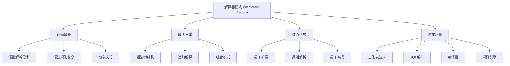
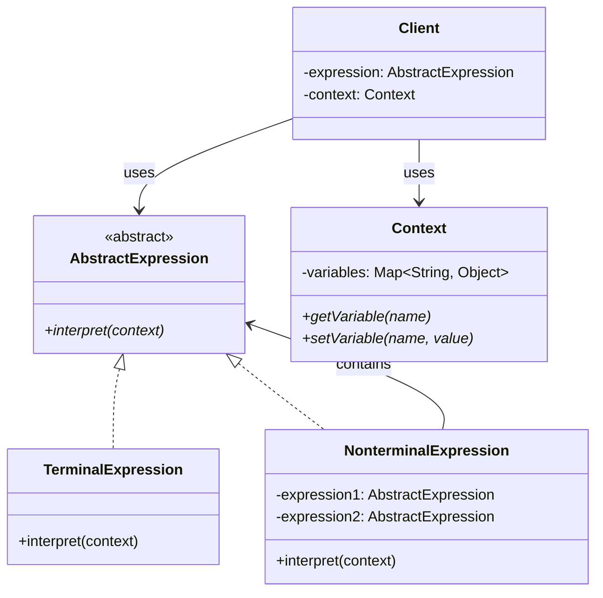

# 🔍 解释器模式详解

[[05-行为型模式/03-命令模式]] ← [[05-行为型模式/05-迭代器模式]]
## 🎯 解释器模式概览

### 📊 模式基本信息



### 🎯 **定义与意图**
解释器模式给定一个语言，定义它的文法表示，并定义一个解释器，这个解释器使用该表示来解释语言中的句子。

### 📋 **核心价值**
- **语言解析**: 将语言表达式转换为可执行的代码
- **语法树**: 使用树形结构表示语法规则
- **递归解释**: 通过递归方式解释复杂表达式
- **易于扩展**: 可以轻松添加新的语法规则

## 🏗️ 解释器模式结构

### 📊 **类图结构**



### 🎯 **角色职责**

#### **AbstractExpression (抽象表达式)**
- 声明一个抽象的解释操作，这个接口为抽象语法树中所有的节点所共享

#### **TerminalExpression (终结符表达式)**
- 实现与文法中的终结符相关联的解释操作
- 一个句子中的每个终结符需要该类的一个实例

#### **NonterminalExpression (非终结符表达式)**
- 为文法中的非终结符实现解释操作
- 对文法中的每一条规则都需要一个具体的非终结符表达式类

#### **Context (上下文)**
- 包含解释器之外的一些全局信息

## 💻 解释器模式实现

### 🎯 **经典实现：数学表达式计算器**

```java
// ✅ 抽象表达式接口
public interface Expression {
    int interpret(Map<String, Integer> context);
    String toString();
}

// ✅ 数字表达式（终结符）
public class NumberExpression implements Expression {
    private final int number;
    
    public NumberExpression(int number) {
        this.number = number;
    }
    
    @Override
    public int interpret(Map<String, Integer> context) {
        return number;
    }
    
    @Override
    public String toString() {
        return String.valueOf(number);
    }
}

// ✅ 变量表达式（终结符）
public class VariableExpression implements Expression {
    private final String variableName;
    
    public VariableExpression(String variableName) {
        this.variableName = variableName;
    }
    
    @Override
    public int interpret(Map<String, Integer> context) {
        Integer value = context.get(variableName);
        if (value == null) {
            throw new RuntimeException("变量 " + variableName + " 未定义");
        }
        return value;
    }
    
    @Override
    public String toString() {
        return variableName;
    }
}

// ✅ 加法表达式（非终结符）
public class AddExpression implements Expression {
    private final Expression left;
    private final Expression right;
    
    public AddExpression(Expression left, Expression right) {
        this.left = left;
        this.right = right;
    }
    
    @Override
    public int interpret(Map<String, Integer> context) {
        return left.interpret(context) + right.interpret(context);
    }
    
    @Override
    public String toString() {
        return "(" + left.toString() + " + " + right.toString() + ")";
    }
}

// ✅ 减法表达式（非终结符）
public class SubtractExpression implements Expression {
    private final Expression left;
    private final Expression right;
    
    public SubtractExpression(Expression left, Expression right) {
        this.left = left;
        this.right = right;
    }
    
    @Override
    public int interpret(Map<String, Integer> context) {
        return left.interpret(context) - right.interpret(context);
    }
    
    @Override
    public String toString() {
        return "(" + left.toString() + " - " + right.toString() + ")";
    }
}

// ✅ 乘法表达式（非终结符）
public class MultiplyExpression implements Expression {
    private final Expression left;
    private final Expression right;
    
    public MultiplyExpression(Expression left, Expression right) {
        this.left = left;
        this.right = right;
    }
    
    @Override
    public int interpret(Map<String, Integer> context) {
        return left.interpret(context) * right.interpret(context);
    }
    
    @Override
    public String toString() {
        return "(" + left.toString() + " * " + right.toString() + ")";
    }
}

// ✅ 除法表达式（非终结符）
public class DivideExpression implements Expression {
    private final Expression left;
    private final Expression right;
    
    public DivideExpression(Expression left, Expression right) {
        this.left = left;
        this.right = right;
    }
    
    @Override
    public int interpret(Map<String, Integer> context) {
        int rightValue = right.interpret(context);
        if (rightValue == 0) {
            throw new RuntimeException("除数不能为零");
        }
        return left.interpret(context) / rightValue;
    }
    
    @Override
    public String toString() {
        return "(" + left.toString() + " / " + right.toString() + ")";
    }
}

// ✅ 表达式解析器
public class ExpressionParser {
    private final Map<String, Integer> variables;
    
    public ExpressionParser() {
        this.variables = new HashMap<>();
    }
    
    // ✅ 解析表达式
    public Expression parse(String expression) {
        // 移除空格
        expression = expression.replaceAll("\\s+", "");
        
        // 使用递归下降解析器
        return parseExpression(expression);
    }
    
    private Expression parseExpression(String expression) {
        // 处理括号
        if (expression.startsWith("(") && expression.endsWith(")")) {
            return parseExpression(expression.substring(1, expression.length() - 1));
        }
        
        // 查找最低优先级的操作符
        int level = 0;
        for (int i = expression.length() - 1; i >= 0; i--) {
            char c = expression.charAt(i);
            
            if (c == ')') level++;
            else if (c == '(') level--;
            else if (level == 0 && (c == '+' || c == '-')) {
                String left = expression.substring(0, i);
                String right = expression.substring(i + 1);
                char operator = c;
                
                Expression leftExpr = parseExpression(left);
                Expression rightExpr = parseExpression(right);
                
                if (operator == '+') {
                    return new AddExpression(leftExpr, rightExpr);
                } else {
                    return new SubtractExpression(leftExpr, rightExpr);
                }
            }
        }
        
        // 查找乘除操作符
        level = 0;
        for (int i = expression.length() - 1; i >= 0; i--) {
            char c = expression.charAt(i);
            
            if (c == ')') level++;
            else if (c == '(') level--;
            else if (level == 0 && (c == '*' || c == '/')) {
                String left = expression.substring(0, i);
                String right = expression.substring(i + 1);
                char operator = c;
                
                Expression leftExpr = parseExpression(left);
                Expression rightExpr = parseExpression(right);
                
                if (operator == '*') {
                    return new MultiplyExpression(leftExpr, rightExpr);
                } else {
                    return new DivideExpression(leftExpr, rightExpr);
                }
            }
        }
        
        // 处理数字和变量
        if (isNumber(expression)) {
            return new NumberExpression(Integer.parseInt(expression));
        } else if (isVariable(expression)) {
            return new VariableExpression(expression);
        }
        
        throw new RuntimeException("无法解析表达式: " + expression);
    }
    
    private boolean isNumber(String str) {
        try {
            Integer.parseInt(str);
            return true;
        } catch (NumberFormatException e) {
            return false;
        }
    }
    
    private boolean isVariable(String str) {
        return str.matches("[a-zA-Z][a-zA-Z0-9]*");
    }
    
    // ✅ 设置变量值
    public void setVariable(String name, int value) {
        variables.put(name, value);
    }
    
    // ✅ 获取变量值
    public Integer getVariable(String name) {
        return variables.get(name);
    }
    
    // ✅ 获取所有变量
    public Map<String, Integer> getVariables() {
        return new HashMap<>(variables);
    }
    
    // ✅ 清空变量
    public void clearVariables() {
        variables.clear();
    }
}

// ✅ 表达式计算器
public class ExpressionCalculator {
    private final ExpressionParser parser;
    
    public ExpressionCalculator() {
        this.parser = new ExpressionParser();
    }
    
    // ✅ 计算表达式
    public int calculate(String expression) {
        Expression expr = parser.parse(expression);
        return expr.interpret(parser.getVariables());
    }
    
    // ✅ 计算带变量的表达式
    public int calculate(String expression, Map<String, Integer> variables) {
        // 设置变量
        variables.forEach(parser::setVariable);
        
        // 解析并计算
        Expression expr = parser.parse(expression);
        int result = expr.interpret(parser.getVariables());
        
        // 清空变量
        parser.clearVariables();
        
        return result;
    }
    
    // ✅ 验证表达式语法
    public boolean isValidExpression(String expression) {
        try {
            parser.parse(expression);
            return true;
        } catch (Exception e) {
            return false;
        }
    }
    
    // ✅ 获取表达式树
    public Expression getExpressionTree(String expression) {
        return parser.parse(expression);
    }
    
    // ✅ 批量计算
    public Map<String, Integer> calculateBatch(Map<String, String> expressions, Map<String, Integer> variables) {
        Map<String, Integer> results = new HashMap<>();
        
        for (Map.Entry<String, String> entry : expressions.entrySet()) {
            try {
                int result = calculate(entry.getValue(), variables);
                results.put(entry.getKey(), result);
            } catch (Exception e) {
                System.err.println("计算表达式失败: " + entry.getValue() + " - " + e.getMessage());
            }
        }
        
        return results;
    }
}

// ✅ 高级表达式功能
public class AdvancedExpressionCalculator extends ExpressionCalculator {
    
    // ✅ 计算表达式并返回详细信息
    public CalculationResult calculateWithDetails(String expression, Map<String, Integer> variables) {
        ExpressionParser parser = new ExpressionParser();
        variables.forEach(parser::setVariable);
        
        Expression expr = parser.parse(expression);
        int result = expr.interpret(parser.getVariables());
        
        return new CalculationResult(expression, expr.toString(), result, variables);
    }
    
    // ✅ 表达式优化
    public String optimizeExpression(String expression) {
        Expression expr = getExpressionTree(expression);
        return expr.toString();
    }
    
    // ✅ 表达式验证
    public ValidationResult validateExpression(String expression) {
        try {
            Expression expr = getExpressionTree(expression);
            return new ValidationResult(true, "表达式语法正确", expr.toString());
        } catch (Exception e) {
            return new ValidationResult(false, e.getMessage(), null);
        }
    }
}

// ✅ 计算结果类
public class CalculationResult {
    private final String originalExpression;
    private final String parsedExpression;
    private final int result;
    private final Map<String, Integer> variables;
    private final long calculationTime;
    
    public CalculationResult(String originalExpression, String parsedExpression, 
                            int result, Map<String, Integer> variables) {
        this.originalExpression = originalExpression;
        this.parsedExpression = parsedExpression;
        this.result = result;
        this.variables = new HashMap<>(variables);
        this.calculationTime = System.currentTimeMillis();
    }
    
    // Getters
    public String getOriginalExpression() { return originalExpression; }
    public String getParsedExpression() { return parsedExpression; }
    public int getResult() { return result; }
    public Map<String, Integer> getVariables() { return variables; }
    public long getCalculationTime() { return calculationTime; }
    
    @Override
    public String toString() {
        return String.format("表达式: %s\n解析后: %s\n结果: %d\n变量: %s", 
                           originalExpression, parsedExpression, result, variables);
    }
}

// ✅ 验证结果类
public class ValidationResult {
    private final boolean valid;
    private final String message;
    private final String parsedExpression;
    
    public ValidationResult(boolean valid, String message, String parsedExpression) {
        this.valid = valid;
        this.message = message;
        this.parsedExpression = parsedExpression;
    }
    
    // Getters
    public boolean isValid() { return valid; }
    public String getMessage() { return message; }
    public String getParsedExpression() { return parsedExpression; }
    
    @Override
    public String toString() {
        return String.format("验证结果: %s\n消息: %s\n解析表达式: %s", 
                           valid ? "通过" : "失败", message, parsedExpression);
    }
}

// ✅ 客户端使用示例
public class InterpreterPatternDemo {
    public static void main(String[] args) {
        ExpressionCalculator calculator = new ExpressionCalculator();
        AdvancedExpressionCalculator advancedCalculator = new AdvancedExpressionCalculator();
        
        // ✅ 基本计算
        System.out.println("=== 基本计算 ===");
        System.out.println("2 + 3 = " + calculator.calculate("2 + 3"));
        System.out.println("10 - 4 = " + calculator.calculate("10 - 4"));
        System.out.println("6 * 7 = " + calculator.calculate("6 * 7"));
        System.out.println("15 / 3 = " + calculator.calculate("15 / 3"));
        
        // ✅ 复杂表达式
        System.out.println("\n=== 复杂表达式 ===");
        System.out.println("(2 + 3) * 4 = " + calculator.calculate("(2 + 3) * 4"));
        System.out.println("10 / (2 + 3) = " + calculator.calculate("10 / (2 + 3)"));
        System.out.println("(1 + 2) * (3 + 4) = " + calculator.calculate("(1 + 2) * (3 + 4)"));
        
        // ✅ 带变量的计算
        System.out.println("\n=== 带变量的计算 ===");
        Map<String, Integer> variables = new HashMap<>();
        variables.put("x", 5);
        variables.put("y", 3);
        variables.put("z", 2);
        
        System.out.println("x + y = " + calculator.calculate("x + y", variables));
        System.out.println("x * y - z = " + calculator.calculate("x * y - z", variables));
        System.out.println("(x + y) * z = " + calculator.calculate("(x + y) * z", variables));
        
        // ✅ 高级功能
        System.out.println("\n=== 高级功能 ===");
        CalculationResult result = advancedCalculator.calculateWithDetails("x * y + z", variables);
        System.out.println(result);
        
        // ✅ 表达式验证
        System.out.println("\n=== 表达式验证 ===");
        ValidationResult validation = advancedCalculator.validateExpression("2 + 3 * 4");
        System.out.println(validation);
        
        ValidationResult invalidValidation = advancedCalculator.validateExpression("2 + + 3");
        System.out.println(invalidValidation);
        
        // ✅ 批量计算
        System.out.println("\n=== 批量计算 ===");
        Map<String, String> expressions = new HashMap<>();
        expressions.put("表达式1", "x + y");
        expressions.put("表达式2", "x * y - z");
        expressions.put("表达式3", "(x + y) * z");
        
        Map<String, Integer> batchResults = calculator.calculateBatch(expressions, variables);
        batchResults.forEach((name, result) -> 
            System.out.println(name + ": " + result));
        
        // ✅ 演示解释器模式的优势
        System.out.println("\n=== 解释器模式优势演示 ===");
        
        // 动态构建表达式
        Expression x = new VariableExpression("x");
        Expression y = new VariableExpression("y");
        Expression z = new VariableExpression("z");
        
        Expression dynamicExpr = new AddExpression(
            new MultiplyExpression(x, y),
            z
        );
        
        Map<String, Integer> context = new HashMap<>();
        context.put("x", 4);
        context.put("y", 5);
        context.put("z", 6);
        
        int dynamicResult = dynamicExpr.interpret(context);
        System.out.println("动态表达式 " + dynamicExpr.toString() + " = " + dynamicResult);
    }
}
```

### 🚀 **现代企业级实现：规则引擎**

```java
// ✅ 规则表达式接口
public interface RuleExpression {
    boolean evaluate(Map<String, Object> context);
    String getDescription();
    List<String> getRequiredFields();
}

// ✅ 条件表达式（终结符）
public class ConditionExpression implements RuleExpression {
    private final String field;
    private final String operator;
    private final Object value;
    
    public ConditionExpression(String field, String operator, Object value) {
        this.field = field;
        this.operator = operator;
        this.value = value;
    }
    
    @Override
    public boolean evaluate(Map<String, Object> context) {
        Object fieldValue = context.get(field);
        if (fieldValue == null) {
            return false;
        }
        
        switch (operator) {
            case "==":
                return Objects.equals(fieldValue, value);
            case "!=":
                return !Objects.equals(fieldValue, value);
            case ">":
                return compareNumbers(fieldValue, value) > 0;
            case ">=":
                return compareNumbers(fieldValue, value) >= 0;
            case "<":
                return compareNumbers(fieldValue, value) < 0;
            case "<=":
                return compareNumbers(fieldValue, value) <= 0;
            case "contains":
                return fieldValue.toString().contains(value.toString());
            case "startsWith":
                return fieldValue.toString().startsWith(value.toString());
            case "endsWith":
                return fieldValue.toString().endsWith(value.toString());
            default:
                throw new IllegalArgumentException("不支持的操作符: " + operator);
        }
    }
    
    private int compareNumbers(Object a, Object b) {
        if (a instanceof Number && b instanceof Number) {
            return Double.compare(((Number) a).doubleValue(), ((Number) b).doubleValue());
        }
        throw new IllegalArgumentException("无法比较非数字类型");
    }
    
    @Override
    public String getDescription() {
        return field + " " + operator + " " + value;
    }
    
    @Override
    public List<String> getRequiredFields() {
        return Collections.singletonList(field);
    }
}

// ✅ AND表达式（非终结符）
public class AndExpression implements RuleExpression {
    private final List<RuleExpression> expressions;
    
    public AndExpression(List<RuleExpression> expressions) {
        this.expressions = new ArrayList<>(expressions);
    }
    
    public AndExpression(RuleExpression... expressions) {
        this.expressions = Arrays.asList(expressions);
    }
    
    @Override
    public boolean evaluate(Map<String, Object> context) {
        return expressions.stream().allMatch(expr -> expr.evaluate(context));
    }
    
    @Override
    public String getDescription() {
        return expressions.stream()
            .map(RuleExpression::getDescription)
            .collect(Collectors.joining(" AND "));
    }
    
    @Override
    public List<String> getRequiredFields() {
        return expressions.stream()
            .flatMap(expr -> expr.getRequiredFields().stream())
            .distinct()
            .collect(Collectors.toList());
    }
}

// ✅ OR表达式（非终结符）
public class OrExpression implements RuleExpression {
    private final List<RuleExpression> expressions;
    
    public OrExpression(List<RuleExpression> expressions) {
        this.expressions = new ArrayList<>(expressions);
    }
    
    public OrExpression(RuleExpression... expressions) {
        this.expressions = Arrays.asList(expressions);
    }
    
    @Override
    public boolean evaluate(Map<String, Object> context) {
        return expressions.stream().anyMatch(expr -> expr.evaluate(context));
    }
    
    @Override
    public String getDescription() {
        return expressions.stream()
            .map(RuleExpression::getDescription)
            .collect(Collectors.joining(" OR "));
    }
    
    @Override
    public List<String> getRequiredFields() {
        return expressions.stream()
            .flatMap(expr -> expr.getRequiredFields().stream())
            .distinct()
            .collect(Collectors.toList());
    }
}

// ✅ NOT表达式（非终结符）
public class NotExpression implements RuleExpression {
    private final RuleExpression expression;
    
    public NotExpression(RuleExpression expression) {
        this.expression = expression;
    }
    
    @Override
    public boolean evaluate(Map<String, Object> context) {
        return !expression.evaluate(context);
    }
    
    @Override
    public String getDescription() {
        return "NOT (" + expression.getDescription() + ")";
    }
    
    @Override
    public List<String> getRequiredFields() {
        return expression.getRequiredFields();
    }
}

// ✅ 规则引擎
public class RuleEngine {
    private final Map<String, RuleExpression> rules;
    private final Map<String, Object> globalContext;
    
    public RuleEngine() {
        this.rules = new HashMap<>();
        this.globalContext = new HashMap<>();
    }
    
    // ✅ 添加规则
    public void addRule(String ruleName, RuleExpression expression) {
        rules.put(ruleName, expression);
        System.out.println("添加规则: " + ruleName + " - " + expression.getDescription());
    }
    
    // ✅ 执行规则
    public boolean executeRule(String ruleName, Map<String, Object> context) {
        RuleExpression rule = rules.get(ruleName);
        if (rule == null) {
            throw new IllegalArgumentException("规则不存在: " + ruleName);
        }
        
        // 合并全局上下文
        Map<String, Object> mergedContext = new HashMap<>(globalContext);
        mergedContext.putAll(context);
        
        boolean result = rule.evaluate(mergedContext);
        System.out.println("执行规则 " + ruleName + ": " + result);
        return result;
    }
    
    // ✅ 批量执行规则
    public Map<String, Boolean> executeRules(Map<String, Object> context) {
        Map<String, Boolean> results = new HashMap<>();
        
        for (Map.Entry<String, RuleExpression> entry : rules.entrySet()) {
            try {
                boolean result = executeRule(entry.getKey(), context);
                results.put(entry.getKey(), result);
            } catch (Exception e) {
                System.err.println("执行规则失败: " + entry.getKey() + " - " + e.getMessage());
                results.put(entry.getKey(), false);
            }
        }
        
        return results;
    }
    
    // ✅ 设置全局变量
    public void setGlobalVariable(String name, Object value) {
        globalContext.put(name, value);
    }
    
    // ✅ 获取规则信息
    public RuleInfo getRuleInfo(String ruleName) {
        RuleExpression rule = rules.get(ruleName);
        if (rule == null) {
            return null;
        }
        
        return new RuleInfo(ruleName, rule.getDescription(), rule.getRequiredFields());
    }
    
    // ✅ 获取所有规则信息
    public List<RuleInfo> getAllRuleInfo() {
        return rules.entrySet().stream()
            .map(entry -> new RuleInfo(entry.getKey(), entry.getValue().getDescription(), 
                                     entry.getValue().getRequiredFields()))
            .collect(Collectors.toList());
    }
}

// ✅ 规则信息类
public class RuleInfo {
    private final String name;
    private final String description;
    private final List<String> requiredFields;
    
    public RuleInfo(String name, String description, List<String> requiredFields) {
        this.name = name;
        this.description = description;
        this.requiredFields = new ArrayList<>(requiredFields);
    }
    
    // Getters
    public String getName() { return name; }
    public String getDescription() { return description; }
    public List<String> getRequiredFields() { return requiredFields; }
    
    @Override
    public String toString() {
        return String.format("规则: %s\n描述: %s\n必需字段: %s", 
                           name, description, requiredFields);
    }
}

// ✅ 规则构建器
public class RuleBuilder {
    private final List<RuleExpression> expressions;
    private final List<String> operators;
    
    public RuleBuilder() {
        this.expressions = new ArrayList<>();
        this.operators = new ArrayList<>();
    }
    
    // ✅ 添加条件
    public RuleBuilder condition(String field, String operator, Object value) {
        expressions.add(new ConditionExpression(field, operator, value));
        return this;
    }
    
    // ✅ 添加AND操作
    public RuleBuilder and() {
        operators.add("AND");
        return this;
    }
    
    // ✅ 添加OR操作
    public RuleBuilder or() {
        operators.add("OR");
        return this;
    }
    
    // ✅ 构建规则
    public RuleExpression build() {
        if (expressions.isEmpty()) {
            throw new IllegalStateException("没有表达式可以构建");
        }
        
        if (expressions.size() == 1) {
            return expressions.get(0);
        }
        
        // 构建表达式树
        RuleExpression result = expressions.get(0);
        
        for (int i = 1; i < expressions.size(); i++) {
            String operator = operators.get(i - 1);
            RuleExpression nextExpr = expressions.get(i);
            
            if ("AND".equals(operator)) {
                result = new AndExpression(result, nextExpr);
            } else if ("OR".equals(operator)) {
                result = new OrExpression(result, nextExpr);
            }
        }
        
        return result;
    }
}

// ✅ 客户端使用示例
public class RuleEngineDemo {
    public static void main(String[] args) {
        RuleEngine engine = new RuleEngine();
        
        // ✅ 设置全局变量
        engine.setGlobalVariable("currentTime", System.currentTimeMillis());
        engine.setGlobalVariable("systemVersion", "1.0.0");
        
        // ✅ 使用构建器创建规则
        RuleBuilder builder = new RuleBuilder();
        
        // 规则1：用户年龄大于18且信用分数大于600
        RuleExpression rule1 = builder
            .condition("age", ">", 18)
            .and()
            .condition("creditScore", ">", 600)
            .build();
        
        engine.addRule("adultHighCredit", rule1);
        
        // 规则2：用户类型为VIP或消费金额大于10000
        RuleExpression rule2 = new RuleBuilder()
            .condition("userType", "==", "VIP")
            .or()
            .condition("amount", ">", 10000)
            .build();
        
        engine.addRule("vipOrHighAmount", rule2);
        
        // 规则3：复杂规则
        RuleExpression rule3 = new AndExpression(
            new ConditionExpression("status", "==", "active"),
            new OrExpression(
                new ConditionExpression("role", "==", "admin"),
                new AndExpression(
                    new ConditionExpression("role", "==", "user"),
                    new ConditionExpression("permissions", "contains", "write")
                )
            )
        );
        
        engine.addRule("complexRule", rule3);
        
        // ✅ 执行规则
        System.out.println("=== 执行规则 ===");
        
        Map<String, Object> context1 = new HashMap<>();
        context1.put("age", 25);
        context1.put("creditScore", 750);
        context1.put("userType", "regular");
        context1.put("amount", 5000);
        
        boolean result1 = engine.executeRule("adultHighCredit", context1);
        System.out.println("规则1结果: " + result1);
        
        boolean result2 = engine.executeRule("vipOrHighAmount", context1);
        System.out.println("规则2结果: " + result2);
        
        // ✅ 批量执行
        System.out.println("\n=== 批量执行规则 ===");
        Map<String, Boolean> batchResults = engine.executeRules(context1);
        batchResults.forEach((ruleName, result) -> 
            System.out.println(ruleName + ": " + result));
        
        // ✅ 显示规则信息
        System.out.println("\n=== 规则信息 ===");
        List<RuleInfo> ruleInfos = engine.getAllRuleInfo();
        ruleInfos.forEach(System.out::println);
        
        // ✅ 演示解释器模式的优势
        System.out.println("\n=== 解释器模式优势演示 ===");
        
        // 动态构建规则
        RuleExpression dynamicRule = new AndExpression(
            new ConditionExpression("temperature", ">", 30),
            new OrExpression(
                new ConditionExpression("humidity", ">", 80),
                new ConditionExpression("weather", "==", "rainy")
            )
        );
        
        Map<String, Object> weatherContext = new HashMap<>();
        weatherContext.put("temperature", 35);
        weatherContext.put("humidity", 85);
        weatherContext.put("weather", "sunny");
        
        boolean weatherResult = dynamicRule.evaluate(weatherContext);
        System.out.println("动态规则结果: " + weatherResult);
        System.out.println("规则描述: " + dynamicRule.getDescription());
    }
}
```

## 🔧 解释器模式高级技巧

### 🎯 **表达式优化和缓存**

```java
// ✅ 表达式缓存
public class ExpressionCache {
    private final Map<String, Expression> cache;
    private final int maxSize;
    
    public ExpressionCache(int maxSize) {
        this.cache = new ConcurrentHashMap<>();
        this.maxSize = maxSize;
    }
    
    public Expression get(String expression) {
        return cache.get(expression);
    }
    
    public void put(String expression, Expression expr) {
        if (cache.size() >= maxSize) {
            // 实现LRU清理
            cleanup();
        }
        cache.put(expression, expr);
    }
    
    private void cleanup() {
        // 清理最久未使用的表达式
        cache.entrySet().removeIf(entry -> 
            System.currentTimeMillis() - entry.getValue().getLastUsedTime() > 300000); // 5分钟
    }
}
```

## 🚀 解释器模式最佳实践

### 📋 **使用指南**

1. **设计原则**:
   - 为每种语法规则创建对应的表达式类
   - 使用组合模式构建语法树
   - 确保表达式可以递归解释

2. **性能优化**:
   - 实现表达式缓存机制
   - 使用对象池减少创建开销
   - 考虑预编译常用表达式

3. **错误处理**:
   - 提供详细的错误信息
   - 实现语法验证功能
   - 支持表达式调试

### ⚠️ **注意事项**

1. **复杂性**: 不要为简单表达式使用解释器模式
2. **性能**: 解释器模式可能比直接计算慢
3. **维护性**: 确保语法规则的稳定性
4. **扩展性**: 设计时要考虑新语法规则的添加

## 📊 与其他模式的对比

| 对比维度 | 解释器模式 | 命令模式 | 策略模式 |
|----------|------------|----------|----------|
| **目的** | 语言解释 | 请求封装 | 算法选择 |
| **结构** | 语法树 | 命令对象 | 策略对象 |
| **执行** | 递归解释 | 统一执行 | 直接调用 |
| **扩展** | 添加语法 | 添加命令 | 添加策略 |

## 🔗 学习衔接

- **上一模式** ← [[命令模式]]
- **下一模式** → [[迭代器模式]]
- **模式对比** → [[05-行为型模式/13-行为型模式对比表]]
- **编译器设计** → [[设计模式最佳实践秘典]]

---
**💡 解释器模式精髓**: 解释器模式就像一个翻译官，它能够理解一种语言（语法），并将其翻译成另一种语言（可执行的代码）。就像人类需要翻译官来理解外语一样，程序需要解释器来理解特定的语法规则！
