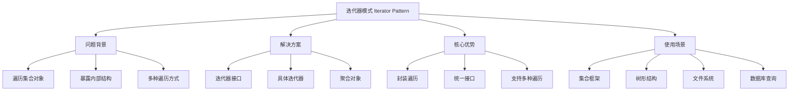
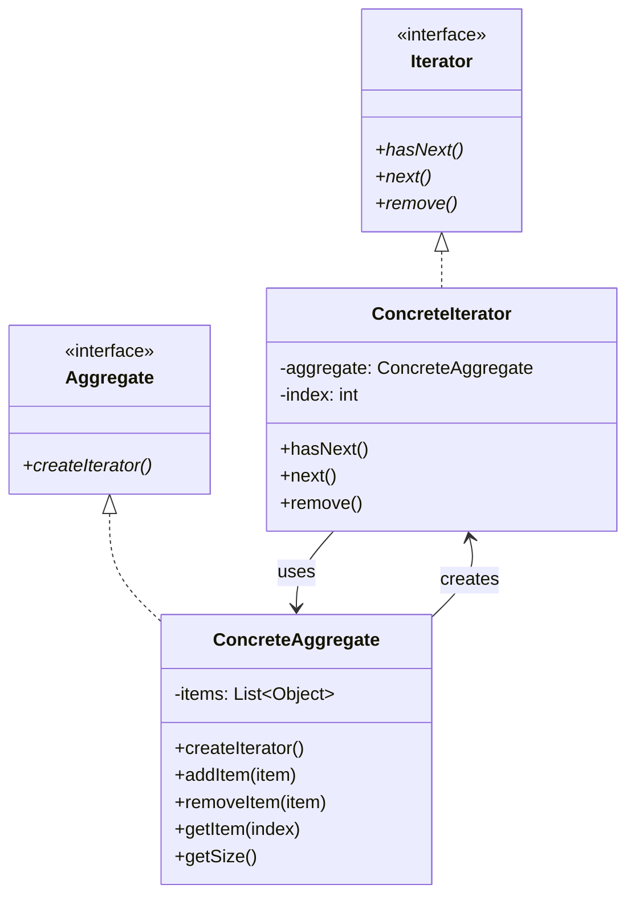

# 🔄 迭代器模式详解

[[05-行为型模式/04-解释器模式]] ← [[05-行为型模式/06-中介者模式]]
## 🎯 迭代器模式概览

### 📊 模式基本信息



### 🎯 **定义与意图**
迭代器模式提供一种方法顺序访问一个聚合对象中各个元素，而又无须暴露该对象的内部表示。

### 📋 **核心价值**
- **封装遍历**: 将遍历逻辑封装在迭代器中
- **统一接口**: 为不同的聚合对象提供统一的遍历接口
- **支持多种遍历**: 可以同时进行多种不同的遍历
- **解耦合**: 聚合对象和遍历逻辑分离

## 🏗️ 迭代器模式结构

### 📊 **类图结构**



### 🎯 **角色职责**

#### **Iterator (迭代器接口)**
- 定义遍历元素所需的接口
- 包含hasNext()、next()、remove()等方法

#### **ConcreteIterator (具体迭代器)**
- 实现Iterator接口
- 跟踪聚合对象中的当前位置
- 实现具体的遍历逻辑

#### **Aggregate (聚合接口)**
- 定义创建Iterator对象的接口

#### **ConcreteAggregate (具体聚合)**
- 实现Aggregate接口
- 返回ConcreteIterator的一个适当的实例

## 💻 迭代器模式实现

### 🎯 **经典实现：自定义集合类**

```java
// ✅ 迭代器接口
public interface Iterator<T> {
    boolean hasNext();
    T next();
    void remove();
    int getCurrentIndex();
    void reset();
}

// ✅ 具体迭代器实现
public class ListIterator<T> implements Iterator<T> {
    private final List<T> list;
    private int currentIndex;
    private int lastReturnedIndex;
    private boolean canRemove;
    
    public ListIterator(List<T> list) {
        this.list = list;
        this.currentIndex = 0;
        this.lastReturnedIndex = -1;
        this.canRemove = false;
    }
    
    @Override
    public boolean hasNext() {
        return currentIndex < list.size();
    }
    
    @Override
    public T next() {
        if (!hasNext()) {
            throw new NoSuchElementException("没有更多元素");
        }
        
        T element = list.get(currentIndex);
        lastReturnedIndex = currentIndex;
        currentIndex++;
        canRemove = true;
        
        return element;
    }
    
    @Override
    public void remove() {
        if (!canRemove) {
            throw new IllegalStateException("不能删除元素");
        }
        
        list.remove(lastReturnedIndex);
        currentIndex = lastReturnedIndex;
        lastReturnedIndex = -1;
        canRemove = false;
    }
    
    @Override
    public int getCurrentIndex() {
        return currentIndex;
    }
    
    @Override
    public void reset() {
        currentIndex = 0;
        lastReturnedIndex = -1;
        canRemove = false;
    }
}

// ✅ 聚合接口
public interface Aggregate<T> {
    Iterator<T> createIterator();
    Iterator<T> createReverseIterator();
    Iterator<T> createRandomIterator();
    int size();
    boolean isEmpty();
    void add(T element);
    void remove(T element);
    T get(int index);
}

// ✅ 具体聚合实现
public class CustomList<T> implements Aggregate<T> {
    private final List<T> elements;
    private final Random random;
    
    public CustomList() {
        this.elements = new ArrayList<>();
        this.random = new Random();
    }
    
    @Override
    public Iterator<T> createIterator() {
        return new ListIterator<>(elements);
    }
    
    @Override
    public Iterator<T> createReverseIterator() {
        return new ReverseIterator<>(elements);
    }
    
    @Override
    public Iterator<T> createRandomIterator() {
        return new RandomIterator<>(elements, random);
    }
    
    @Override
    public int size() {
        return elements.size();
    }
    
    @Override
    public boolean isEmpty() {
        return elements.isEmpty();
    }
    
    @Override
    public void add(T element) {
        elements.add(element);
    }
    
    @Override
    public void remove(T element) {
        elements.remove(element);
    }
    
    @Override
    public T get(int index) {
        if (index < 0 || index >= elements.size()) {
            throw new IndexOutOfBoundsException("索引超出范围: " + index);
        }
        return elements.get(index);
    }
    
    // ✅ 批量操作
    public void addAll(Collection<T> collection) {
        elements.addAll(collection);
    }
    
    public void clear() {
        elements.clear();
    }
    
    public boolean contains(T element) {
        return elements.contains(element);
    }
    
    public int indexOf(T element) {
        return elements.indexOf(element);
    }
    
    // ✅ 转换为数组
    public T[] toArray(T[] array) {
        return elements.toArray(array);
    }
    
    // ✅ 获取子列表
    public CustomList<T> subList(int fromIndex, int toIndex) {
        CustomList<T> subList = new CustomList<>();
        subList.elements.addAll(elements.subList(fromIndex, toIndex));
        return subList;
    }
}

// ✅ 反向迭代器
public class ReverseIterator<T> implements Iterator<T> {
    private final List<T> list;
    private int currentIndex;
    private int lastReturnedIndex;
    private boolean canRemove;
    
    public ReverseIterator(List<T> list) {
        this.list = list;
        this.currentIndex = list.size() - 1;
        this.lastReturnedIndex = -1;
        this.canRemove = false;
    }
    
    @Override
    public boolean hasNext() {
        return currentIndex >= 0;
    }
    
    @Override
    public T next() {
        if (!hasNext()) {
            throw new NoSuchElementException("没有更多元素");
        }
        
        T element = list.get(currentIndex);
        lastReturnedIndex = currentIndex;
        currentIndex--;
        canRemove = true;
        
        return element;
    }
    
    @Override
    public void remove() {
        if (!canRemove) {
            throw new IllegalStateException("不能删除元素");
        }
        
        list.remove(lastReturnedIndex);
        if (lastReturnedIndex <= currentIndex) {
            currentIndex++;
        }
        lastReturnedIndex = -1;
        canRemove = false;
    }
    
    @Override
    public int getCurrentIndex() {
        return currentIndex;
    }
    
    @Override
    public void reset() {
        currentIndex = list.size() - 1;
        lastReturnedIndex = -1;
        canRemove = false;
    }
}

// ✅ 随机迭代器
public class RandomIterator<T> implements Iterator<T> {
    private final List<T> list;
    private final List<Integer> indices;
    private int currentIndex;
    private int lastReturnedIndex;
    private boolean canRemove;
    
    public RandomIterator(List<T> list, Random random) {
        this.list = list;
        this.indices = new ArrayList<>();
        this.currentIndex = 0;
        this.lastReturnedIndex = -1;
        this.canRemove = false;
        
        // 生成随机索引序列
        for (int i = 0; i < list.size(); i++) {
            indices.add(i);
        }
        Collections.shuffle(indices, random);
    }
    
    @Override
    public boolean hasNext() {
        return currentIndex < indices.size();
    }
    
    @Override
    public T next() {
        if (!hasNext()) {
            throw new NoSuchElementException("没有更多元素");
        }
        
        int actualIndex = indices.get(currentIndex);
        T element = list.get(actualIndex);
        lastReturnedIndex = actualIndex;
        currentIndex++;
        canRemove = true;
        
        return element;
    }
    
    @Override
    public void remove() {
        if (!canRemove) {
            throw new IllegalStateException("不能删除元素");
        }
        
        list.remove(lastReturnedIndex);
        // 更新索引
        for (int i = 0; i < indices.size(); i++) {
            if (indices.get(i) > lastReturnedIndex) {
                indices.set(i, indices.get(i) - 1);
            }
        }
        indices.remove(currentIndex - 1);
        currentIndex--;
        lastReturnedIndex = -1;
        canRemove = false;
    }
    
    @Override
    public int getCurrentIndex() {
        return currentIndex;
    }
    
    @Override
    public void reset() {
        currentIndex = 0;
        lastReturnedIndex = -1;
        canRemove = false;
    }
}

// ✅ 过滤迭代器
public class FilterIterator<T> implements Iterator<T> {
    private final Iterator<T> iterator;
    private final Predicate<T> predicate;
    private T nextElement;
    private boolean hasNextElement;
    
    public FilterIterator(Iterator<T> iterator, Predicate<T> predicate) {
        this.iterator = iterator;
        this.predicate = predicate;
        this.hasNextElement = false;
        findNext();
    }
    
    @Override
    public boolean hasNext() {
        return hasNextElement;
    }
    
    @Override
    public T next() {
        if (!hasNext()) {
            throw new NoSuchElementException("没有更多元素");
        }
        
        T element = nextElement;
        findNext();
        return element;
    }
    
    @Override
    public void remove() {
        iterator.remove();
    }
    
    @Override
    public int getCurrentIndex() {
        throw new UnsupportedOperationException("过滤迭代器不支持索引操作");
    }
    
    @Override
    public void reset() {
        throw new UnsupportedOperationException("过滤迭代器不支持重置操作");
    }
    
    private void findNext() {
        hasNextElement = false;
        while (iterator.hasNext()) {
            T element = iterator.next();
            if (predicate.test(element)) {
                nextElement = element;
                hasNextElement = true;
                break;
            }
        }
    }
}

// ✅ 映射迭代器
public class MapIterator<T, R> implements Iterator<R> {
    private final Iterator<T> iterator;
    private final Function<T, R> mapper;
    
    public MapIterator(Iterator<T> iterator, Function<T, R> mapper) {
        this.iterator = iterator;
        this.mapper = mapper;
    }
    
    @Override
    public boolean hasNext() {
        return iterator.hasNext();
    }
    
    @Override
    public R next() {
        return mapper.apply(iterator.next());
    }
    
    @Override
    public void remove() {
        iterator.remove();
    }
    
    @Override
    public int getCurrentIndex() {
        throw new UnsupportedOperationException("映射迭代器不支持索引操作");
    }
    
    @Override
    public void reset() {
        throw new UnsupportedOperationException("映射迭代器不支持重置操作");
    }
}

// ✅ 迭代器工具类
public class IteratorUtils {
    
    // ✅ 转换为列表
    public static <T> List<T> toList(Iterator<T> iterator) {
        List<T> list = new ArrayList<>();
        while (iterator.hasNext()) {
            list.add(iterator.next());
        }
        return list;
    }
    
    // ✅ 计数
    public static <T> int count(Iterator<T> iterator) {
        int count = 0;
        while (iterator.hasNext()) {
            iterator.next();
            count++;
        }
        return count;
    }
    
    // ✅ 查找元素
    public static <T> Optional<T> find(Iterator<T> iterator, Predicate<T> predicate) {
        while (iterator.hasNext()) {
            T element = iterator.next();
            if (predicate.test(element)) {
                return Optional.of(element);
            }
        }
        return Optional.empty();
    }
    
    // ✅ 检查是否包含元素
    public static <T> boolean contains(Iterator<T> iterator, T element) {
        while (iterator.hasNext()) {
            if (Objects.equals(iterator.next(), element)) {
                return true;
            }
        }
        return false;
    }
    
    // ✅ 获取第一个元素
    public static <T> Optional<T> first(Iterator<T> iterator) {
        if (iterator.hasNext()) {
            return Optional.of(iterator.next());
        }
        return Optional.empty();
    }
    
    // ✅ 获取最后一个元素
    public static <T> Optional<T> last(Iterator<T> iterator) {
        T lastElement = null;
        while (iterator.hasNext()) {
            lastElement = iterator.next();
        }
        return Optional.ofNullable(lastElement);
    }
    
    // ✅ 跳过元素
    public static <T> Iterator<T> skip(Iterator<T> iterator, int count) {
        for (int i = 0; i < count && iterator.hasNext(); i++) {
            iterator.next();
        }
        return iterator;
    }
    
    // ✅ 限制元素数量
    public static <T> Iterator<T> limit(Iterator<T> iterator, int maxSize) {
        return new Iterator<T>() {
            private int count = 0;
            
            @Override
            public boolean hasNext() {
                return count < maxSize && iterator.hasNext();
            }
            
            @Override
            public T next() {
                if (!hasNext()) {
                    throw new NoSuchElementException();
                }
                count++;
                return iterator.next();
            }
            
            @Override
            public void remove() {
                iterator.remove();
            }
        };
    }
}

// ✅ 客户端使用示例
public class IteratorPatternDemo {
    public static void main(String[] args) {
        CustomList<String> list = new CustomList<>();
        
        // ✅ 添加元素
        list.add("Apple");
        list.add("Banana");
        list.add("Cherry");
        list.add("Date");
        list.add("Elderberry");
        
        System.out.println("=== 正向遍历 ===");
        Iterator<String> forwardIterator = list.createIterator();
        while (forwardIterator.hasNext()) {
            System.out.println(forwardIterator.next());
        }
        
        System.out.println("\n=== 反向遍历 ===");
        Iterator<String> reverseIterator = list.createReverseIterator();
        while (reverseIterator.hasNext()) {
            System.out.println(reverseIterator.next());
        }
        
        System.out.println("\n=== 随机遍历 ===");
        Iterator<String> randomIterator = list.createRandomIterator();
        while (randomIterator.hasNext()) {
            System.out.println(randomIterator.next());
        }
        
        // ✅ 过滤迭代器
        System.out.println("\n=== 过滤遍历（长度>5） ===");
        Iterator<String> filterIterator = new FilterIterator<>(
            list.createIterator(),
            s -> s.length() > 5
        );
        while (filterIterator.hasNext()) {
            System.out.println(filterIterator.next());
        }
        
        // ✅ 映射迭代器
        System.out.println("\n=== 映射遍历（转大写） ===");
        Iterator<String> mapIterator = new MapIterator<>(
            list.createIterator(),
            String::toUpperCase
        );
        while (mapIterator.hasNext()) {
            System.out.println(mapIterator.next());
        }
        
        // ✅ 迭代器工具类使用
        System.out.println("\n=== 迭代器工具类 ===");
        
        // 转换为列表
        List<String> upperCaseList = IteratorUtils.toList(new MapIterator<>(
            list.createIterator(),
            String::toUpperCase
        ));
        System.out.println("转大写列表: " + upperCaseList);
        
        // 计数
        int count = IteratorUtils.count(list.createIterator());
        System.out.println("元素数量: " + count);
        
        // 查找元素
        Optional<String> found = IteratorUtils.find(list.createIterator(), s -> s.startsWith("B"));
        System.out.println("以B开头的元素: " + found.orElse("未找到"));
        
        // 检查包含
        boolean contains = IteratorUtils.contains(list.createIterator(), "Apple");
        System.out.println("包含Apple: " + contains);
        
        // ✅ 演示迭代器模式的优势
        System.out.println("\n=== 迭代器模式优势演示 ===");
        
        // 多种遍历方式可以同时进行
        Iterator<String> iter1 = list.createIterator();
        Iterator<String> iter2 = list.createReverseIterator();
        
        System.out.println("正向: " + iter1.next() + ", 反向: " + iter2.next());
        System.out.println("正向: " + iter1.next() + ", 反向: " + iter2.next());
        
        // 遍历过程中可以修改集合
        Iterator<String> modifiableIterator = list.createIterator();
        while (modifiableIterator.hasNext()) {
            String element = modifiableIterator.next();
            if (element.equals("Cherry")) {
                modifiableIterator.remove();
                System.out.println("删除了: " + element);
            }
        }
        
        System.out.println("删除后的列表:");
        Iterator<String> finalIterator = list.createIterator();
        while (finalIterator.hasNext()) {
            System.out.println(finalIterator.next());
        }
    }
}
```

### 🚀 **现代企业级实现：树形结构遍历**

```java
// ✅ 树节点接口
public interface TreeNode<T> {
    T getData();
    List<TreeNode<T>> getChildren();
    TreeNode<T> getParent();
    boolean isLeaf();
    boolean isRoot();
    int getDepth();
    int getChildCount();
    void addChild(TreeNode<T> child);
    void removeChild(TreeNode<T> child);
}

// ✅ 具体树节点实现
public class SimpleTreeNode<T> implements TreeNode<T> {
    private final T data;
    private final List<TreeNode<T>> children;
    private TreeNode<T> parent;
    
    public SimpleTreeNode(T data) {
        this.data = data;
        this.children = new ArrayList<>();
    }
    
    @Override
    public T getData() {
        return data;
    }
    
    @Override
    public List<TreeNode<T>> getChildren() {
        return new ArrayList<>(children);
    }
    
    @Override
    public TreeNode<T> getParent() {
        return parent;
    }
    
    @Override
    public boolean isLeaf() {
        return children.isEmpty();
    }
    
    @Override
    public boolean isRoot() {
        return parent == null;
    }
    
    @Override
    public int getDepth() {
        int depth = 0;
        TreeNode<T> current = parent;
        while (current != null) {
            depth++;
            current = current.getParent();
        }
        return depth;
    }
    
    @Override
    public int getChildCount() {
        return children.size();
    }
    
    @Override
    public void addChild(TreeNode<T> child) {
        if (child instanceof SimpleTreeNode) {
            SimpleTreeNode<T> simpleChild = (SimpleTreeNode<T>) child;
            simpleChild.parent = this;
        }
        children.add(child);
    }
    
    @Override
    public void removeChild(TreeNode<T> child) {
        if (child instanceof SimpleTreeNode) {
            SimpleTreeNode<T> simpleChild = (SimpleTreeNode<T>) child;
            simpleChild.parent = null;
        }
        children.remove(child);
    }
}

// ✅ 树迭代器接口
public interface TreeIterator<T> extends Iterator<TreeNode<T>> {
    void reset();
    TreeNode<T> getCurrentNode();
    int getCurrentDepth();
    List<TreeNode<T>> getPath();
}

// ✅ 深度优先遍历迭代器
public class DepthFirstIterator<T> implements TreeIterator<T> {
    private final TreeNode<T> root;
    private final Stack<TreeNode<T>> stack;
    private TreeNode<T> currentNode;
    private final List<TreeNode<T>> path;
    
    public DepthFirstIterator(TreeNode<T> root) {
        this.root = root;
        this.stack = new Stack<>();
        this.path = new ArrayList<>();
        
        if (root != null) {
            stack.push(root);
        }
    }
    
    @Override
    public boolean hasNext() {
        return !stack.isEmpty();
    }
    
    @Override
    public TreeNode<T> next() {
        if (!hasNext()) {
            throw new NoSuchElementException("没有更多节点");
        }
        
        currentNode = stack.pop();
        
        // 更新路径
        updatePath();
        
        // 将子节点按相反顺序压入栈（保持从左到右的顺序）
        List<TreeNode<T>> children = currentNode.getChildren();
        for (int i = children.size() - 1; i >= 0; i--) {
            stack.push(children.get(i));
        }
        
        return currentNode;
    }
    
    @Override
    public void remove() {
        throw new UnsupportedOperationException("树迭代器不支持删除操作");
    }
    
    @Override
    public void reset() {
        stack.clear();
        path.clear();
        currentNode = null;
        
        if (root != null) {
            stack.push(root);
        }
    }
    
    @Override
    public TreeNode<T> getCurrentNode() {
        return currentNode;
    }
    
    @Override
    public int getCurrentDepth() {
        return currentNode != null ? currentNode.getDepth() : 0;
    }
    
    @Override
    public List<TreeNode<T>> getPath() {
        return new ArrayList<>(path);
    }
    
    private void updatePath() {
        if (currentNode == null) return;
        
        // 重建路径
        path.clear();
        TreeNode<T> node = currentNode;
        while (node != null) {
            path.add(0, node);
            node = node.getParent();
        }
    }
}

// ✅ 广度优先遍历迭代器
public class BreadthFirstIterator<T> implements TreeIterator<T> {
    private final TreeNode<T> root;
    private final Queue<TreeNode<T>> queue;
    private TreeNode<T> currentNode;
    private final List<TreeNode<T>> path;
    
    public BreadthFirstIterator(TreeNode<T> root) {
        this.root = root;
        this.queue = new LinkedList<>();
        this.path = new ArrayList<>();
        
        if (root != null) {
            queue.offer(root);
        }
    }
    
    @Override
    public boolean hasNext() {
        return !queue.isEmpty();
    }
    
    @Override
    public TreeNode<T> next() {
        if (!hasNext()) {
            throw new NoSuchElementException("没有更多节点");
        }
        
        currentNode = queue.poll();
        
        // 更新路径
        updatePath();
        
        // 将子节点加入队列
        queue.addAll(currentNode.getChildren());
        
        return currentNode;
    }
    
    @Override
    public void remove() {
        throw new UnsupportedOperationException("树迭代器不支持删除操作");
    }
    
    @Override
    public void reset() {
        queue.clear();
        path.clear();
        currentNode = null;
        
        if (root != null) {
            queue.offer(root);
        }
    }
    
    @Override
    public TreeNode<T> getCurrentNode() {
        return currentNode;
    }
    
    @Override
    public int getCurrentDepth() {
        return currentNode != null ? currentNode.getDepth() : 0;
    }
    
    @Override
    public List<TreeNode<T>> getPath() {
        return new ArrayList<>(path);
    }
    
    private void updatePath() {
        if (currentNode == null) return;
        
        // 重建路径
        path.clear();
        TreeNode<T> node = currentNode;
        while (node != null) {
            path.add(0, node);
            node = node.getParent();
        }
    }
}

// ✅ 前序遍历迭代器
public class PreOrderIterator<T> implements TreeIterator<T> {
    private final TreeNode<T> root;
    private final Stack<TreeNode<T>> stack;
    private TreeNode<T> currentNode;
    private final List<TreeNode<T>> path;
    
    public PreOrderIterator(TreeNode<T> root) {
        this.root = root;
        this.stack = new Stack<>();
        this.path = new ArrayList<>();
        
        if (root != null) {
            stack.push(root);
        }
    }
    
    @Override
    public boolean hasNext() {
        return !stack.isEmpty();
    }
    
    @Override
    public TreeNode<T> next() {
        if (!hasNext()) {
            throw new NoSuchElementException("没有更多节点");
        }
        
        currentNode = stack.pop();
        
        // 更新路径
        updatePath();
        
        // 将子节点按相反顺序压入栈
        List<TreeNode<T>> children = currentNode.getChildren();
        for (int i = children.size() - 1; i >= 0; i--) {
            stack.push(children.get(i));
        }
        
        return currentNode;
    }
    
    @Override
    public void remove() {
        throw new UnsupportedOperationException("树迭代器不支持删除操作");
    }
    
    @Override
    public void reset() {
        stack.clear();
        path.clear();
        currentNode = null;
        
        if (root != null) {
            stack.push(root);
        }
    }
    
    @Override
    public TreeNode<T> getCurrentNode() {
        return currentNode;
    }
    
    @Override
    public int getCurrentDepth() {
        return currentNode != null ? currentNode.getDepth() : 0;
    }
    
    @Override
    public List<TreeNode<T>> getPath() {
        return new ArrayList<>(path);
    }
    
    private void updatePath() {
        if (currentNode == null) return;
        
        path.clear();
        TreeNode<T> node = currentNode;
        while (node != null) {
            path.add(0, node);
            node = node.getParent();
        }
    }
}

// ✅ 树结构类
public class Tree<T> {
    private TreeNode<T> root;
    
    public Tree(TreeNode<T> root) {
        this.root = root;
    }
    
    public Tree(T rootData) {
        this.root = new SimpleTreeNode<>(rootData);
    }
    
    // ✅ 创建不同类型的迭代器
    public TreeIterator<T> createDepthFirstIterator() {
        return new DepthFirstIterator<>(root);
    }
    
    public TreeIterator<T> createBreadthFirstIterator() {
        return new BreadthFirstIterator<>(root);
    }
    
    public TreeIterator<T> createPreOrderIterator() {
        return new PreOrderIterator<>(root);
    }
    
    // ✅ 查找节点
    public Optional<TreeNode<T>> findNode(T data) {
        TreeIterator<T> iterator = createDepthFirstIterator();
        while (iterator.hasNext()) {
            TreeNode<T> node = iterator.next();
            if (Objects.equals(node.getData(), data)) {
                return Optional.of(node);
            }
        }
        return Optional.empty();
    }
    
    // ✅ 获取所有叶子节点
    public List<TreeNode<T>> getLeafNodes() {
        List<TreeNode<T>> leafNodes = new ArrayList<>();
        TreeIterator<T> iterator = createDepthFirstIterator();
        
        while (iterator.hasNext()) {
            TreeNode<T> node = iterator.next();
            if (node.isLeaf()) {
                leafNodes.add(node);
            }
        }
        
        return leafNodes;
    }
    
    // ✅ 获取指定深度的节点
    public List<TreeNode<T>> getNodesAtDepth(int depth) {
        List<TreeNode<T>> nodes = new ArrayList<>();
        TreeIterator<T> iterator = createBreadthFirstIterator();
        
        while (iterator.hasNext()) {
            TreeNode<T> node = iterator.next();
            if (node.getDepth() == depth) {
                nodes.add(node);
            }
        }
        
        return nodes;
    }
    
    // ✅ 计算树的高度
    public int getHeight() {
        int maxDepth = 0;
        TreeIterator<T> iterator = createDepthFirstIterator();
        
        while (iterator.hasNext()) {
            TreeNode<T> node = iterator.next();
            maxDepth = Math.max(maxDepth, node.getDepth());
        }
        
        return maxDepth;
    }
    
    // ✅ 打印树结构
    public void printTree() {
        System.out.println("=== 树结构 ===");
        TreeIterator<T> iterator = createPreOrderIterator();
        
        while (iterator.hasNext()) {
            TreeNode<T> node = iterator.next();
            int depth = node.getDepth();
            String indent = "  ".repeat(depth);
            System.out.println(indent + node.getData());
        }
        
        System.out.println("=============");
    }
    
    // Getters
    public TreeNode<T> getRoot() {
        return root;
    }
}

// ✅ 客户端使用示例
public class TreeIteratorDemo {
    public static void main(String[] args) {
        // ✅ 创建树结构
        Tree<String> tree = new Tree<>("Root");
        
        TreeNode<String> root = tree.getRoot();
        TreeNode<String> child1 = new SimpleTreeNode<>("Child1");
        TreeNode<String> child2 = new SimpleTreeNode<>("Child2");
        TreeNode<String> child3 = new SimpleTreeNode<>("Child3");
        
        root.addChild(child1);
        root.addChild(child2);
        root.addChild(child3);
        
        TreeNode<String> grandchild1 = new SimpleTreeNode<>("Grandchild1");
        TreeNode<String> grandchild2 = new SimpleTreeNode<>("Grandchild2");
        
        child1.addChild(grandchild1);
        child2.addChild(grandchild2);
        
        // ✅ 打印树结构
        tree.printTree();
        
        // ✅ 深度优先遍历
        System.out.println("=== 深度优先遍历 ===");
        TreeIterator<String> dfIterator = tree.createDepthFirstIterator();
        while (dfIterator.hasNext()) {
            TreeNode<String> node = dfIterator.next();
            System.out.println("节点: " + node.getData() + ", 深度: " + node.getDepth());
        }
        
        // ✅ 广度优先遍历
        System.out.println("\n=== 广度优先遍历 ===");
        TreeIterator<String> bfIterator = tree.createBreadthFirstIterator();
        while (bfIterator.hasNext()) {
            TreeNode<String> node = bfIterator.next();
            System.out.println("节点: " + node.getData() + ", 深度: " + node.getDepth());
        }
        
        // ✅ 前序遍历
        System.out.println("\n=== 前序遍历 ===");
        TreeIterator<String> preOrderIterator = tree.createPreOrderIterator();
        while (preOrderIterator.hasNext()) {
            TreeNode<String> node = preOrderIterator.next();
            System.out.println("节点: " + node.getData() + ", 路径: " + 
                             preOrderIterator.getPath().stream()
                             .map(TreeNode::getData)
                             .collect(Collectors.joining(" -> ")));
        }
        
        // ✅ 查找节点
        System.out.println("\n=== 查找节点 ===");
        Optional<TreeNode<String>> found = tree.findNode("Grandchild1");
        if (found.isPresent()) {
            System.out.println("找到节点: " + found.get().getData());
            System.out.println("父节点: " + (found.get().getParent() != null ? 
                                          found.get().getParent().getData() : "无"));
        }
        
        // ✅ 获取叶子节点
        System.out.println("\n=== 叶子节点 ===");
        List<TreeNode<String>> leafNodes = tree.getLeafNodes();
        leafNodes.forEach(node -> System.out.println("叶子节点: " + node.getData()));
        
        // ✅ 获取指定深度的节点
        System.out.println("\n=== 深度1的节点 ===");
        List<TreeNode<String>> depth1Nodes = tree.getNodesAtDepth(1);
        depth1Nodes.forEach(node -> System.out.println("深度1节点: " + node.getData()));
        
        // ✅ 计算树高度
        System.out.println("\n树高度: " + tree.getHeight());
        
        // ✅ 演示迭代器模式的优势
        System.out.println("\n=== 迭代器模式优势演示 ===");
        
        // 多种遍历方式可以同时进行
        TreeIterator<String> iter1 = tree.createDepthFirstIterator();
        TreeIterator<String> iter2 = tree.createBreadthFirstIterator();
        
        System.out.println("深度优先: " + iter1.next().getData() + 
                         ", 广度优先: " + iter2.next().getData());
        System.out.println("深度优先: " + iter1.next().getData() + 
                         ", 广度优先: " + iter2.next().getData());
    }
}
```

## 🔧 迭代器模式高级技巧

### 🎯 **并行迭代器**

```java
// ✅ 并行迭代器
public class ParallelIterator<T> implements Iterator<List<T>> {
    private final List<Iterator<T>> iterators;
    private final int batchSize;
    
    public ParallelIterator(List<Iterator<T>> iterators, int batchSize) {
        this.iterators = iterators;
        this.batchSize = batchSize;
    }
    
    @Override
    public boolean hasNext() {
        return iterators.stream().anyMatch(Iterator::hasNext);
    }
    
    @Override
    public List<T> next() {
        List<T> batch = new ArrayList<>();
        for (Iterator<T> iterator : iterators) {
            if (iterator.hasNext() && batch.size() < batchSize) {
                batch.add(iterator.next());
            }
        }
        return batch;
    }
    
    @Override
    public void remove() {
        throw new UnsupportedOperationException("并行迭代器不支持删除操作");
    }
}
```

## 🚀 迭代器模式最佳实践

### 📋 **使用指南**

1. **设计原则**:
   - 为聚合对象提供统一的遍历接口
   - 将遍历逻辑封装在迭代器中
   - 支持多种遍历方式

2. **实现技巧**:
   - 使用栈或队列实现不同的遍历策略
   - 提供迭代器的重置功能
   - 支持遍历过程中的修改操作

3. **性能考虑**:
   - 避免在迭代器中存储大量数据
   - 使用懒加载减少内存占用
   - 考虑并行遍历的可能性

### ⚠️ **注意事项**

1. **并发安全**: 在多线程环境下确保迭代器的线程安全
2. **状态管理**: 正确处理迭代器的状态变化
3. **内存泄漏**: 及时清理迭代器中的引用
4. **异常处理**: 提供完善的异常处理机制

## 📊 与其他模式的对比

| 对比维度 | 迭代器模式 | 访问者模式 | 组合模式 |
|----------|------------|------------|----------|
| **目的** | 遍历集合 | 操作对象 | 树形结构 |
| **结构** | 线性遍历 | 访问操作 | 递归结构 |
| **扩展** | 添加遍历方式 | 添加操作 | 添加节点 |
| **使用** | 顺序访问 | 批量操作 | 递归操作 |

## 🔗 学习衔接

- **上一模式** ← [[解释器模式]]
- **下一模式** → [[中介者模式]]
- **模式对比** → [[05-行为型模式/13-行为型模式对比表]]
- **集合框架** → [[设计模式最佳实践秘典]]

---
**💡 迭代器模式精髓**: 迭代器模式就像一个导游，它知道如何带领游客（客户端）有序地参观景点（集合元素），而不需要游客了解景点的内部布局。无论景点如何变化，导游都能提供一致的参观体验！
