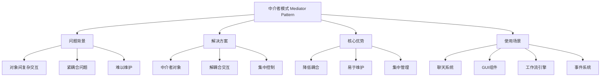
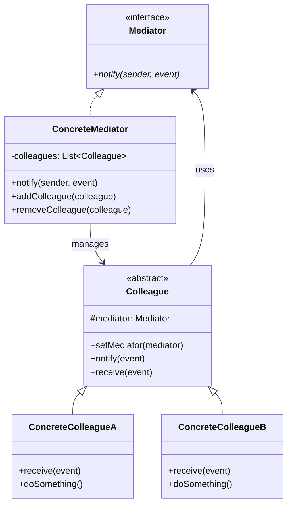

# 🏢 中介者模式详解

[[05-行为型模式/05-迭代器模式]] ← [[05-行为型模式/07-备忘录模式]]
## 🎯 中介者模式概览

### 📊 模式基本信息



### 🎯 **定义与意图**
中介者模式用一个中介对象来封装一系列的对象交互。中介者使各对象不需要显式地相互引用，从而使其耦合松散，而且可以独立地改变它们之间的交互。

### 📋 **核心价值**
- **解耦合**: 对象之间不直接相互引用
- **集中控制**: 所有交互通过中介者进行
- **易于维护**: 交互逻辑集中管理
- **灵活扩展**: 可以轻松添加新的交互规则

## 🏗️ 中介者模式结构

### 📊 **类图结构**



### 🎯 **角色职责**

#### **Mediator (中介者接口)**
- 定义同事对象到中介者对象的接口

#### **ConcreteMediator (具体中介者)**
- 实现协调各同事对象的交互行为
- 了解并维护它的各个同事

#### **Colleague (同事类)**
- 知道它的中介者对象
- 当需要与其他同事通信时，与中介者通信

#### **ConcreteColleague (具体同事类)**
- 实现自己的行为
- 当需要与其他同事通信时，与中介者通信

## 💻 中介者模式实现

### 🎯 **经典实现：聊天室系统**

```java
// ✅ 中介者接口
public interface ChatMediator {
    void sendMessage(String message, User sender);
    void addUser(User user);
    void removeUser(User user);
    void broadcastMessage(String message, User sender);
    void sendPrivateMessage(String message, User sender, User recipient);
    List<User> getOnlineUsers();
    boolean isUserOnline(User user);
}

// ✅ 具体中介者实现
public class ChatRoom implements ChatMediator {
    private final List<User> users;
    private final Map<String, List<String>> messageHistory;
    private final Map<String, Set<String>> privateMessages;
    
    public ChatRoom() {
        this.users = new ArrayList<>();
        this.messageHistory = new HashMap<>();
        this.privateMessages = new HashMap<>();
    }
    
    @Override
    public void sendMessage(String message, User sender) {
        if (!isUserOnline(sender)) {
            System.out.println("用户 " + sender.getName() + " 不在线，无法发送消息");
            return;
        }
        
        // 记录消息历史
        messageHistory.computeIfAbsent(sender.getName(), k -> new ArrayList<>()).add(message);
        
        // 广播消息给所有在线用户
        System.out.println("[" + sender.getName() + "]: " + message);
        
        // 通知其他用户
        for (User user : users) {
            if (!user.equals(sender) && user.isOnline()) {
                user.receiveMessage(message, sender);
            }
        }
    }
    
    @Override
    public void addUser(User user) {
        if (!users.contains(user)) {
            users.add(user);
            user.setMediator(this);
            System.out.println("用户 " + user.getName() + " 加入聊天室");
            
            // 通知其他用户有新用户加入
            broadcastMessage(user.getName() + " 加入了聊天室", null);
        }
    }
    
    @Override
    public void removeUser(User user) {
        if (users.remove(user)) {
            user.setMediator(null);
            System.out.println("用户 " + user.getName() + " 离开聊天室");
            
            // 通知其他用户有用户离开
            broadcastMessage(user.getName() + " 离开了聊天室", null);
        }
    }
    
    @Override
    public void broadcastMessage(String message, User sender) {
        System.out.println("[系统广播]: " + message);
        
        for (User user : users) {
            if (user.isOnline() && !user.equals(sender)) {
                user.receiveMessage(message, sender);
            }
        }
    }
    
    @Override
    public void sendPrivateMessage(String message, User sender, User recipient) {
        if (!isUserOnline(sender)) {
            System.out.println("发送者 " + sender.getName() + " 不在线");
            return;
        }
        
        if (!isUserOnline(recipient)) {
            System.out.println("接收者 " + recipient.getName() + " 不在线");
            return;
        }
        
        // 记录私聊消息
        String key = sender.getName() + "_" + recipient.getName();
        privateMessages.computeIfAbsent(key, k -> new HashSet<>()).add(message);
        
        System.out.println("[私聊] " + sender.getName() + " -> " + recipient.getName() + ": " + message);
        
        // 发送给接收者
        recipient.receivePrivateMessage(message, sender);
    }
    
    @Override
    public List<User> getOnlineUsers() {
        return users.stream()
            .filter(User::isOnline)
            .collect(Collectors.toList());
    }
    
    @Override
    public boolean isUserOnline(User user) {
        return users.contains(user) && user.isOnline();
    }
    
    // ✅ 获取消息历史
    public List<String> getMessageHistory(String username) {
        return messageHistory.getOrDefault(username, Collections.emptyList());
    }
    
    // ✅ 获取私聊消息
    public Set<String> getPrivateMessages(String sender, String recipient) {
        String key = sender + "_" + recipient;
        return privateMessages.getOrDefault(key, Collections.emptySet());
    }
    
    // ✅ 清空消息历史
    public void clearMessageHistory() {
        messageHistory.clear();
        privateMessages.clear();
        System.out.println("消息历史已清空");
    }
    
    // ✅ 获取聊天室统计信息
    public ChatRoomStatistics getStatistics() {
        return new ChatRoomStatistics(
            users.size(),
            getOnlineUsers().size(),
            messageHistory.values().stream().mapToInt(List::size).sum(),
            privateMessages.size()
        );
    }
}

// ✅ 用户类（同事类）
public abstract class User {
    protected String name;
    protected ChatMediator mediator;
    protected boolean online;
    protected LocalDateTime lastActiveTime;
    
    public User(String name) {
        this.name = name;
        this.online = false;
        this.lastActiveTime = LocalDateTime.now();
    }
    
    // ✅ 发送消息
    public void sendMessage(String message) {
        if (mediator != null) {
            mediator.sendMessage(message, this);
            updateLastActiveTime();
        } else {
            System.out.println("用户 " + name + " 未连接到聊天室");
        }
    }
    
    // ✅ 发送私聊消息
    public void sendPrivateMessage(String message, User recipient) {
        if (mediator != null) {
            mediator.sendPrivateMessage(message, this, recipient);
            updateLastActiveTime();
        } else {
            System.out.println("用户 " + name + " 未连接到聊天室");
        }
    }
    
    // ✅ 接收消息
    public abstract void receiveMessage(String message, User sender);
    
    // ✅ 接收私聊消息
    public abstract void receivePrivateMessage(String message, User sender);
    
    // ✅ 上线
    public void goOnline() {
        this.online = true;
        this.lastActiveTime = LocalDateTime.now();
        System.out.println("用户 " + name + " 上线了");
    }
    
    // ✅ 下线
    public void goOffline() {
        this.online = false;
        this.lastActiveTime = LocalDateTime.now();
        System.out.println("用户 " + name + " 下线了");
    }
    
    // ✅ 设置中介者
    public void setMediator(ChatMediator mediator) {
        this.mediator = mediator;
    }
    
    // ✅ 更新最后活跃时间
    protected void updateLastActiveTime() {
        this.lastActiveTime = LocalDateTime.now();
    }
    
    // Getters
    public String getName() { return name; }
    public boolean isOnline() { return online; }
    public LocalDateTime getLastActiveTime() { return lastActiveTime; }
    
    @Override
    public boolean equals(Object obj) {
        if (this == obj) return true;
        if (obj == null || getClass() != obj.getClass()) return false;
        User user = (User) obj;
        return Objects.equals(name, user.name);
    }
    
    @Override
    public int hashCode() {
        return Objects.hash(name);
    }
}

// ✅ 普通用户
public class RegularUser extends User {
    private final List<String> receivedMessages;
    
    public RegularUser(String name) {
        super(name);
        this.receivedMessages = new ArrayList<>();
    }
    
    @Override
    public void receiveMessage(String message, User sender) {
        receivedMessages.add("[" + sender.getName() + "]: " + message);
        System.out.println("[" + name + "] 收到消息: " + message + " (来自: " + sender.getName() + ")");
    }
    
    @Override
    public void receivePrivateMessage(String message, User sender) {
        receivedMessages.add("[私聊] " + sender.getName() + ": " + message);
        System.out.println("[" + name + "] 收到私聊: " + message + " (来自: " + sender.getName() + ")");
    }
    
    // ✅ 获取接收的消息
    public List<String> getReceivedMessages() {
        return new ArrayList<>(receivedMessages);
    }
    
    // ✅ 清空消息
    public void clearMessages() {
        receivedMessages.clear();
    }
}

// ✅ 管理员用户
public class AdminUser extends User {
    private final ChatRoom chatRoom;
    private final List<String> adminActions;
    
    public AdminUser(String name, ChatRoom chatRoom) {
        super(name);
        this.chatRoom = chatRoom;
        this.adminActions = new ArrayList<>();
    }
    
    @Override
    public void receiveMessage(String message, User sender) {
        System.out.println("[" + name + "] 管理员收到消息: " + message + " (来自: " + sender.getName() + ")");
    }
    
    @Override
    public void receivePrivateMessage(String message, User sender) {
        System.out.println("[" + name + "] 管理员收到私聊: " + message + " (来自: " + sender.getName() + ")");
    }
    
    // ✅ 踢出用户
    public void kickUser(User user) {
        if (chatRoom.isUserOnline(user)) {
            chatRoom.removeUser(user);
            adminActions.add("踢出用户: " + user.getName());
            System.out.println("管理员 " + name + " 踢出了用户 " + user.getName());
        }
    }
    
    // ✅ 禁言用户
    public void muteUser(User user) {
        adminActions.add("禁言用户: " + user.getName());
        System.out.println("管理员 " + name + " 禁言了用户 " + user.getName());
    }
    
    // ✅ 清空聊天室
    public void clearChatRoom() {
        chatRoom.clearMessageHistory();
        adminActions.add("清空聊天室");
        System.out.println("管理员 " + name + " 清空了聊天室");
    }
    
    // ✅ 获取管理员操作记录
    public List<String> getAdminActions() {
        return new ArrayList<>(adminActions);
    }
}

// ✅ 聊天室统计信息
public class ChatRoomStatistics {
    private final int totalUsers;
    private final int onlineUsers;
    private final int totalMessages;
    private final int privateConversations;
    
    public ChatRoomStatistics(int totalUsers, int onlineUsers, int totalMessages, int privateConversations) {
        this.totalUsers = totalUsers;
        this.onlineUsers = onlineUsers;
        this.totalMessages = totalMessages;
        this.privateConversations = privateConversations;
    }
    
    // Getters
    public int getTotalUsers() { return totalUsers; }
    public int getOnlineUsers() { return onlineUsers; }
    public int getTotalMessages() { return totalMessages; }
    public int getPrivateConversations() { return privateConversations; }
    
    @Override
    public String toString() {
        return String.format("聊天室统计 - 总用户: %d, 在线用户: %d, 总消息: %d, 私聊会话: %d",
                           totalUsers, onlineUsers, totalMessages, privateConversations);
    }
}

// ✅ 聊天室管理器
public class ChatRoomManager {
    private final Map<String, ChatRoom> chatRooms;
    private final Map<String, User> users;
    
    public ChatRoomManager() {
        this.chatRooms = new HashMap<>();
        this.users = new HashMap<>();
    }
    
    // ✅ 创建聊天室
    public ChatRoom createChatRoom(String roomName) {
        ChatRoom chatRoom = new ChatRoom();
        chatRooms.put(roomName, chatRoom);
        System.out.println("创建聊天室: " + roomName);
        return chatRoom;
    }
    
    // ✅ 加入聊天室
    public void joinChatRoom(String roomName, User user) {
        ChatRoom chatRoom = chatRooms.get(roomName);
        if (chatRoom != null) {
            chatRoom.addUser(user);
            users.put(user.getName(), user);
        } else {
            System.out.println("聊天室不存在: " + roomName);
        }
    }
    
    // ✅ 离开聊天室
    public void leaveChatRoom(String roomName, User user) {
        ChatRoom chatRoom = chatRooms.get(roomName);
        if (chatRoom != null) {
            chatRoom.removeUser(user);
        }
    }
    
    // ✅ 获取聊天室
    public ChatRoom getChatRoom(String roomName) {
        return chatRooms.get(roomName);
    }
    
    // ✅ 获取用户
    public User getUser(String username) {
        return users.get(username);
    }
    
    // ✅ 获取所有聊天室
    public Map<String, ChatRoom> getAllChatRooms() {
        return new HashMap<>(chatRooms);
    }
    
    // ✅ 删除聊天室
    public void deleteChatRoom(String roomName) {
        ChatRoom chatRoom = chatRooms.remove(roomName);
        if (chatRoom != null) {
            System.out.println("删除聊天室: " + roomName);
        }
    }
}

// ✅ 客户端使用示例
public class MediatorPatternDemo {
    public static void main(String[] args) {
        ChatRoomManager manager = new ChatRoomManager();
        
        // ✅ 创建聊天室
        ChatRoom chatRoom = manager.createChatRoom("技术讨论");
        
        // ✅ 创建用户
        RegularUser user1 = new RegularUser("张三");
        RegularUser user2 = new RegularUser("李四");
        RegularUser user3 = new RegularUser("王五");
        AdminUser admin = new AdminUser("管理员", chatRoom);
        
        // ✅ 用户加入聊天室
        manager.joinChatRoom("技术讨论", user1);
        manager.joinChatRoom("技术讨论", user2);
        manager.joinChatRoom("技术讨论", user3);
        manager.joinChatRoom("技术讨论", admin);
        
        // ✅ 用户上线
        user1.goOnline();
        user2.goOnline();
        user3.goOnline();
        admin.goOnline();
        
        // ✅ 发送消息
        System.out.println("\n=== 聊天室对话 ===");
        user1.sendMessage("大家好，我是新来的");
        user2.sendMessage("欢迎欢迎！");
        user3.sendMessage("有什么技术问题可以讨论");
        
        // ✅ 私聊
        System.out.println("\n=== 私聊 ===");
        user1.sendPrivateMessage("你好，李四", user2);
        user2.sendPrivateMessage("你好，张三", user1);
        
        // ✅ 管理员操作
        System.out.println("\n=== 管理员操作 ===");
        admin.sendMessage("我是管理员，请大家遵守聊天室规则");
        admin.muteUser(user3);
        
        // ✅ 显示统计信息
        System.out.println("\n=== 聊天室统计 ===");
        ChatRoomStatistics stats = chatRoom.getStatistics();
        System.out.println(stats);
        
        // ✅ 用户下线
        user1.goOffline();
        user2.goOffline();
        
        // ✅ 再次显示统计
        System.out.println("\n=== 更新后的统计 ===");
        stats = chatRoom.getStatistics();
        System.out.println(stats);
        
        // ✅ 演示中介者模式的优势
        System.out.println("\n=== 中介者模式优势演示 ===");
        
        // 用户之间不直接通信，都通过中介者
        System.out.println("用户1发送消息给用户2:");
        user1.sendMessage("通过中介者发送的消息");
        
        // 中介者可以控制消息的传递
        System.out.println("管理员广播消息:");
        chatRoom.broadcastMessage("系统维护通知", admin);
        
        // 可以轻松添加新的交互规则
        System.out.println("添加新用户:");
        RegularUser newUser = new RegularUser("新用户");
        manager.joinChatRoom("技术讨论", newUser);
        newUser.goOnline();
        newUser.sendMessage("我是新用户，请多指教");
    }
}
```

### 🚀 **现代企业级实现：工作流引擎**

```java
// ✅ 工作流中介者接口
public interface WorkflowMediator {
    void executeTask(Task task, User executor);
    void completeTask(Task task, User executor);
    void assignTask(Task task, User assignee);
    void escalateTask(Task task, String reason);
    void notifyStakeholders(Task task, String message);
    void updateTaskStatus(Task task, TaskStatus status);
    List<Task> getTasksByUser(User user);
    List<Task> getTasksByStatus(TaskStatus status);
    WorkflowStatistics getWorkflowStatistics();
}

// ✅ 任务类
public class Task {
    private final String id;
    private final String title;
    private final String description;
    private final TaskType type;
    private final Priority priority;
    private TaskStatus status;
    private User assignee;
    private User creator;
    private LocalDateTime createdAt;
    private LocalDateTime updatedAt;
    private LocalDateTime dueDate;
    private final List<TaskComment> comments;
    private final List<TaskAttachment> attachments;
    
    public Task(String id, String title, String description, TaskType type, Priority priority, User creator) {
        this.id = id;
        this.title = title;
        this.description = description;
        this.type = type;
        this.priority = priority;
        this.status = TaskStatus.CREATED;
        this.creator = creator;
        this.createdAt = LocalDateTime.now();
        this.updatedAt = LocalDateTime.now();
        this.comments = new ArrayList<>();
        this.attachments = new ArrayList<>();
    }
    
    // ✅ 添加评论
    public void addComment(String comment, User user) {
        comments.add(new TaskComment(comment, user, LocalDateTime.now()));
        this.updatedAt = LocalDateTime.now();
    }
    
    // ✅ 添加附件
    public void addAttachment(String fileName, String filePath, User user) {
        attachments.add(new TaskAttachment(fileName, filePath, user, LocalDateTime.now()));
        this.updatedAt = LocalDateTime.now();
    }
    
    // ✅ 更新状态
    public void updateStatus(TaskStatus status) {
        this.status = status;
        this.updatedAt = LocalDateTime.now();
    }
    
    // ✅ 分配任务
    public void assignTo(User assignee) {
        this.assignee = assignee;
        this.updatedAt = LocalDateTime.now();
    }
    
    // Getters
    public String getId() { return id; }
    public String getTitle() { return title; }
    public String getDescription() { return description; }
    public TaskType getType() { return type; }
    public Priority getPriority() { return priority; }
    public TaskStatus getStatus() { return status; }
    public User getAssignee() { return assignee; }
    public User getCreator() { return creator; }
    public LocalDateTime getCreatedAt() { return createdAt; }
    public LocalDateTime getUpdatedAt() { return updatedAt; }
    public LocalDateTime getDueDate() { return dueDate; }
    public List<TaskComment> getComments() { return new ArrayList<>(comments); }
    public List<TaskAttachment> getAttachments() { return new ArrayList<>(attachments); }
    
    public void setDueDate(LocalDateTime dueDate) { this.dueDate = dueDate; }
}

// ✅ 任务状态枚举
public enum TaskStatus {
    CREATED, ASSIGNED, IN_PROGRESS, REVIEW, COMPLETED, CANCELLED, ESCALATED
}

// ✅ 任务类型枚举
public enum TaskType {
    BUG_FIX, FEATURE_REQUEST, DOCUMENTATION, TESTING, CODE_REVIEW, DEPLOYMENT
}

// ✅ 优先级枚举
public enum Priority {
    LOW, MEDIUM, HIGH, URGENT
}

// ✅ 任务评论
public class TaskComment {
    private final String comment;
    private final User author;
    private final LocalDateTime timestamp;
    
    public TaskComment(String comment, User author, LocalDateTime timestamp) {
        this.comment = comment;
        this.author = author;
        this.timestamp = timestamp;
    }
    
    // Getters
    public String getComment() { return comment; }
    public User getAuthor() { return author; }
    public LocalDateTime getTimestamp() { return timestamp; }
}

// ✅ 任务附件
public class TaskAttachment {
    private final String fileName;
    private final String filePath;
    private final User uploadedBy;
    private final LocalDateTime uploadedAt;
    
    public TaskAttachment(String fileName, String filePath, User uploadedBy, LocalDateTime uploadedAt) {
        this.fileName = fileName;
        this.filePath = filePath;
        this.uploadedBy = uploadedBy;
        this.uploadedAt = uploadedAt;
    }
    
    // Getters
    public String getFileName() { return fileName; }
    public String getFilePath() { return filePath; }
    public User getUploadedBy() { return uploadedBy; }
    public LocalDateTime getUploadedAt() { return uploadedAt; }
}

// ✅ 工作流中介者实现
public class WorkflowEngine implements WorkflowMediator {
    private final Map<String, Task> tasks;
    private final Map<String, User> users;
    private final Map<String, List<Task>> userTasks;
    private final Map<TaskStatus, List<Task>> statusTasks;
    private final List<WorkflowEventListener> eventListeners;
    
    public WorkflowEngine() {
        this.tasks = new HashMap<>();
        this.users = new HashMap<>();
        this.userTasks = new HashMap<>();
        this.statusTasks = new HashMap<>();
        this.eventListeners = new ArrayList<>();
        
        // 初始化状态任务映射
        for (TaskStatus status : TaskStatus.values()) {
            statusTasks.put(status, new ArrayList<>());
        }
    }
    
    @Override
    public void executeTask(Task task, User executor) {
        if (!task.getAssignee().equals(executor)) {
            throw new IllegalStateException("只有任务分配者可以执行任务");
        }
        
        task.updateStatus(TaskStatus.IN_PROGRESS);
        updateTaskMappings(task);
        
        System.out.println("用户 " + executor.getName() + " 开始执行任务: " + task.getTitle());
        
        // 通知相关方
        notifyStakeholders(task, "任务开始执行");
        
        // 触发事件
        fireEvent(new TaskExecutedEvent(task, executor));
    }
    
    @Override
    public void completeTask(Task task, User executor) {
        if (!task.getAssignee().equals(executor)) {
            throw new IllegalStateException("只有任务分配者可以完成任务");
        }
        
        task.updateStatus(TaskStatus.COMPLETED);
        updateTaskMappings(task);
        
        System.out.println("用户 " + executor.getName() + " 完成任务: " + task.getTitle());
        
        // 通知相关方
        notifyStakeholders(task, "任务已完成");
        
        // 触发事件
        fireEvent(new TaskCompletedEvent(task, executor));
    }
    
    @Override
    public void assignTask(Task task, User assignee) {
        task.assignTo(assignee);
        task.updateStatus(TaskStatus.ASSIGNED);
        updateTaskMappings(task);
        
        System.out.println("任务 " + task.getTitle() + " 分配给用户 " + assignee.getName());
        
        // 通知分配者
        notifyStakeholders(task, "任务已分配给您");
        
        // 触发事件
        fireEvent(new TaskAssignedEvent(task, assignee));
    }
    
    @Override
    public void escalateTask(Task task, String reason) {
        task.updateStatus(TaskStatus.ESCALATED);
        updateTaskMappings(task);
        
        System.out.println("任务 " + task.getTitle() + " 已升级，原因: " + reason);
        
        // 通知管理员
        notifyStakeholders(task, "任务已升级: " + reason);
        
        // 触发事件
        fireEvent(new TaskEscalatedEvent(task, reason));
    }
    
    @Override
    public void notifyStakeholders(Task task, String message) {
        // 通知任务创建者
        if (task.getCreator() != null) {
            System.out.println("通知 " + task.getCreator().getName() + ": " + message);
        }
        
        // 通知任务分配者
        if (task.getAssignee() != null) {
            System.out.println("通知 " + task.getAssignee().getName() + ": " + message);
        }
        
        // 通知其他相关方
        for (User user : users.values()) {
            if (!user.equals(task.getCreator()) && !user.equals(task.getAssignee())) {
                System.out.println("通知 " + user.getName() + ": " + message);
            }
        }
    }
    
    @Override
    public void updateTaskStatus(Task task, TaskStatus status) {
        TaskStatus oldStatus = task.getStatus();
        task.updateStatus(status);
        updateTaskMappings(task);
        
        System.out.println("任务 " + task.getTitle() + " 状态从 " + oldStatus + " 更新为 " + status);
        
        // 触发事件
        fireEvent(new TaskStatusChangedEvent(task, oldStatus, status));
    }
    
    @Override
    public List<Task> getTasksByUser(User user) {
        return userTasks.getOrDefault(user.getName(), Collections.emptyList());
    }
    
    @Override
    public List<Task> getTasksByStatus(TaskStatus status) {
        return statusTasks.getOrDefault(status, Collections.emptyList());
    }
    
    @Override
    public WorkflowStatistics getWorkflowStatistics() {
        return new WorkflowStatistics(
            tasks.size(),
            users.size(),
            statusTasks.get(TaskStatus.COMPLETED).size(),
            statusTasks.get(TaskStatus.IN_PROGRESS).size(),
            statusTasks.get(TaskStatus.ESCALATED).size()
        );
    }
    
    // ✅ 创建任务
    public Task createTask(String title, String description, TaskType type, Priority priority, User creator) {
        String taskId = "TASK_" + System.currentTimeMillis();
        Task task = new Task(taskId, title, description, type, priority, creator);
        
        tasks.put(taskId, task);
        updateTaskMappings(task);
        
        System.out.println("创建任务: " + title + " (ID: " + taskId + ")");
        
        // 触发事件
        fireEvent(new TaskCreatedEvent(task));
        
        return task;
    }
    
    // ✅ 注册用户
    public void registerUser(User user) {
        users.put(user.getName(), user);
        userTasks.put(user.getName(), new ArrayList<>());
        System.out.println("注册用户: " + user.getName());
    }
    
    // ✅ 添加事件监听器
    public void addEventListener(WorkflowEventListener listener) {
        eventListeners.add(listener);
    }
    
    // ✅ 移除事件监听器
    public void removeEventListener(WorkflowEventListener listener) {
        eventListeners.remove(listener);
    }
    
    // ✅ 更新任务映射
    private void updateTaskMappings(Task task) {
        // 更新用户任务映射
        if (task.getAssignee() != null) {
            userTasks.computeIfAbsent(task.getAssignee().getName(), k -> new ArrayList<>()).add(task);
        }
        
        // 更新状态任务映射
        statusTasks.get(task.getStatus()).add(task);
    }
    
    // ✅ 触发事件
    private void fireEvent(WorkflowEvent event) {
        for (WorkflowEventListener listener : eventListeners) {
            listener.onEvent(event);
        }
    }
}

// ✅ 工作流事件接口
public interface WorkflowEvent {
    String getEventType();
    LocalDateTime getTimestamp();
}

// ✅ 任务创建事件
public class TaskCreatedEvent implements WorkflowEvent {
    private final Task task;
    private final LocalDateTime timestamp;
    
    public TaskCreatedEvent(Task task) {
        this.task = task;
        this.timestamp = LocalDateTime.now();
    }
    
    @Override
    public String getEventType() {
        return "TASK_CREATED";
    }
    
    @Override
    public LocalDateTime getTimestamp() {
        return timestamp;
    }
    
    public Task getTask() {
        return task;
    }
}

// ✅ 任务分配事件
public class TaskAssignedEvent implements WorkflowEvent {
    private final Task task;
    private final User assignee;
    private final LocalDateTime timestamp;
    
    public TaskAssignedEvent(Task task, User assignee) {
        this.task = task;
        this.assignee = assignee;
        this.timestamp = LocalDateTime.now();
    }
    
    @Override
    public String getEventType() {
        return "TASK_ASSIGNED";
    }
    
    @Override
    public LocalDateTime getTimestamp() {
        return timestamp;
    }
    
    public Task getTask() {
        return task;
    }
    
    public User getAssignee() {
        return assignee;
    }
}

// ✅ 任务执行事件
public class TaskExecutedEvent implements WorkflowEvent {
    private final Task task;
    private final User executor;
    private final LocalDateTime timestamp;
    
    public TaskExecutedEvent(Task task, User executor) {
        this.task = task;
        this.executor = executor;
        this.timestamp = LocalDateTime.now();
    }
    
    @Override
    public String getEventType() {
        return "TASK_EXECUTED";
    }
    
    @Override
    public LocalDateTime getTimestamp() {
        return timestamp;
    }
    
    public Task getTask() {
        return task;
    }
    
    public User getExecutor() {
        return executor;
    }
}

// ✅ 任务完成事件
public class TaskCompletedEvent implements WorkflowEvent {
    private final Task task;
    private final User executor;
    private final LocalDateTime timestamp;
    
    public TaskCompletedEvent(Task task, User executor) {
        this.task = task;
        this.executor = executor;
        this.timestamp = LocalDateTime.now();
    }
    
    @Override
    public String getEventType() {
        return "TASK_COMPLETED";
    }
    
    @Override
    public LocalDateTime getTimestamp() {
        return timestamp;
    }
    
    public Task getTask() {
        return task;
    }
    
    public User getExecutor() {
        return executor;
    }
}

// ✅ 任务升级事件
public class TaskEscalatedEvent implements WorkflowEvent {
    private final Task task;
    private final String reason;
    private final LocalDateTime timestamp;
    
    public TaskEscalatedEvent(Task task, String reason) {
        this.task = task;
        this.reason = reason;
        this.timestamp = LocalDateTime.now();
    }
    
    @Override
    public String getEventType() {
        return "TASK_ESCALATED";
    }
    
    @Override
    public LocalDateTime getTimestamp() {
        return timestamp;
    }
    
    public Task getTask() {
        return task;
    }
    
    public String getReason() {
        return reason;
    }
}

// ✅ 任务状态变更事件
public class TaskStatusChangedEvent implements WorkflowEvent {
    private final Task task;
    private final TaskStatus oldStatus;
    private final TaskStatus newStatus;
    private final LocalDateTime timestamp;
    
    public TaskStatusChangedEvent(Task task, TaskStatus oldStatus, TaskStatus newStatus) {
        this.task = task;
        this.oldStatus = oldStatus;
        this.newStatus = newStatus;
        this.timestamp = LocalDateTime.now();
    }
    
    @Override
    public String getEventType() {
        return "TASK_STATUS_CHANGED";
    }
    
    @Override
    public LocalDateTime getTimestamp() {
        return timestamp;
    }
    
    public Task getTask() {
        return task;
    }
    
    public TaskStatus getOldStatus() {
        return oldStatus;
    }
    
    public TaskStatus getNewStatus() {
        return newStatus;
    }
}

// ✅ 工作流事件监听器
public interface WorkflowEventListener {
    void onEvent(WorkflowEvent event);
}

// ✅ 工作流统计信息
public class WorkflowStatistics {
    private final int totalTasks;
    private final int totalUsers;
    private final int completedTasks;
    private final int inProgressTasks;
    private final int escalatedTasks;
    
    public WorkflowStatistics(int totalTasks, int totalUsers, int completedTasks, 
                            int inProgressTasks, int escalatedTasks) {
        this.totalTasks = totalTasks;
        this.totalUsers = totalUsers;
        this.completedTasks = completedTasks;
        this.inProgressTasks = inProgressTasks;
        this.escalatedTasks = escalatedTasks;
    }
    
    // Getters
    public int getTotalTasks() { return totalTasks; }
    public int getTotalUsers() { return totalUsers; }
    public int getCompletedTasks() { return completedTasks; }
    public int getInProgressTasks() { return inProgressTasks; }
    public int getEscalatedTasks() { return escalatedTasks; }
    
    @Override
    public String toString() {
        return String.format("工作流统计 - 总任务: %d, 总用户: %d, 已完成: %d, 进行中: %d, 已升级: %d",
                           totalTasks, totalUsers, completedTasks, inProgressTasks, escalatedTasks);
    }
}

// ✅ 工作流事件监听器实现
public class WorkflowEventListenerImpl implements WorkflowEventListener {
    private final List<WorkflowEvent> eventHistory;
    
    public WorkflowEventListenerImpl() {
        this.eventHistory = new ArrayList<>();
    }
    
    @Override
    public void onEvent(WorkflowEvent event) {
        eventHistory.add(event);
        System.out.println("事件触发: " + event.getEventType() + " 在 " + event.getTimestamp());
    }
    
    public List<WorkflowEvent> getEventHistory() {
        return new ArrayList<>(eventHistory);
    }
    
    public void clearEventHistory() {
        eventHistory.clear();
    }
}

// ✅ 客户端使用示例
public class WorkflowEngineDemo {
    public static void main(String[] args) {
        WorkflowEngine engine = new WorkflowEngine();
        
        // ✅ 注册用户
        User developer1 = new RegularUser("开发者1");
        User developer2 = new RegularUser("开发者2");
        User manager = new RegularUser("项目经理");
        
        engine.registerUser(developer1);
        engine.registerUser(developer2);
        engine.registerUser(manager);
        
        // ✅ 添加事件监听器
        WorkflowEventListenerImpl eventListener = new WorkflowEventListenerImpl();
        engine.addEventListener(eventListener);
        
        // ✅ 创建任务
        Task task1 = engine.createTask("修复登录Bug", "用户无法正常登录", TaskType.BUG_FIX, Priority.HIGH, manager);
        Task task2 = engine.createTask("添加新功能", "实现用户头像上传", TaskType.FEATURE_REQUEST, Priority.MEDIUM, manager);
        
        // ✅ 分配任务
        engine.assignTask(task1, developer1);
        engine.assignTask(task2, developer2);
        
        // ✅ 执行任务
        engine.executeTask(task1, developer1);
        engine.executeTask(task2, developer2);
        
        // ✅ 完成任务
        engine.completeTask(task1, developer1);
        
        // ✅ 升级任务
        engine.escalateTask(task2, "技术难度超出预期");
        
        // ✅ 显示统计信息
        System.out.println("\n=== 工作流统计 ===");
        WorkflowStatistics stats = engine.getWorkflowStatistics();
        System.out.println(stats);
        
        // ✅ 显示事件历史
        System.out.println("\n=== 事件历史 ===");
        List<WorkflowEvent> events = eventListener.getEventHistory();
        events.forEach(event -> System.out.println("事件: " + event.getEventType() + " - " + event.getTimestamp()));
        
        // ✅ 演示中介者模式的优势
        System.out.println("\n=== 中介者模式优势演示 ===");
        
        // 任务和用户之间不直接交互，都通过中介者
        System.out.println("通过中介者管理任务状态:");
        engine.updateTaskStatus(task2, TaskStatus.REVIEW);
        
        // 中介者可以集中处理复杂的业务逻辑
        System.out.println("通过中介者通知相关方:");
        engine.notifyStakeholders(task2, "任务需要代码审查");
        
        // 可以轻松添加新的交互规则
        System.out.println("添加新的事件监听器:");
        WorkflowEventListenerImpl newListener = new WorkflowEventListenerImpl();
        engine.addEventListener(newListener);
        
        // 触发新事件
        engine.updateTaskStatus(task2, TaskStatus.COMPLETED);
        
        System.out.println("新监听器收到的事件数量: " + newListener.getEventHistory().size());
    }
}
```

## 🔧 中介者模式高级技巧

### 🎯 **事件驱动架构**

```java
// ✅ 事件总线
public class EventBus {
    private final Map<Class<?>, List<EventHandler>> handlers;
    private final ExecutorService executor;
    
    public EventBus() {
        this.handlers = new ConcurrentHashMap<>();
        this.executor = Executors.newCachedThreadPool();
    }
    
    public <T> void subscribe(Class<T> eventType, EventHandler<T> handler) {
        handlers.computeIfAbsent(eventType, k -> new ArrayList<>()).add(handler);
    }
    
    public <T> void publish(T event) {
        List<EventHandler> eventHandlers = handlers.get(event.getClass());
        if (eventHandlers != null) {
            eventHandlers.forEach(handler -> 
                executor.submit(() -> handler.handle(event)));
        }
    }
}
```

## 🚀 中介者模式最佳实践

### 📋 **使用指南**

1. **设计原则**:
   - 将复杂的交互逻辑集中在中介者中
   - 确保同事对象之间不直接通信
   - 提供清晰的交互接口

2. **实现技巧**:
   - 使用事件驱动架构
   - 实现观察者模式支持
   - 提供状态管理功能

3. **性能考虑**:
   - 避免中介者成为性能瓶颈
   - 使用异步处理提高响应性
   - 实现缓存机制减少重复计算

### ⚠️ **注意事项**

1. **复杂性**: 中介者可能变得过于复杂
2. **单点故障**: 中介者成为系统的单点故障
3. **性能**: 所有交互都通过中介者可能影响性能
4. **维护性**: 确保中介者的职责清晰

## 📊 与其他模式的对比

| 对比维度 | 中介者模式 | 观察者模式 | 命令模式 |
|----------|------------|------------|----------|
| **目的** | 对象间通信 | 状态通知 | 请求封装 |
| **结构** | 一对多 | 一对多 | 一对一 |
| **耦合** | 低耦合 | 松耦合 | 解耦合 |
| **使用** | 复杂交互 | 状态变化 | 请求处理 |

## 🔗 学习衔接

- **上一模式** ← [[迭代器模式]]
- **下一模式** → [[备忘录模式]]
- **模式对比** → [[05-行为型模式/13-行为型模式对比表]]
- **工作流设计** → [[设计模式最佳实践秘典]]

---
**💡 中介者模式精髓**: 中介者模式就像一个交通指挥员，它协调各个车辆（对象）的行驶，确保它们不会相互碰撞。车辆之间不需要直接沟通，只需要听从指挥员的指示，这样既保证了交通秩序，又提高了效率！
