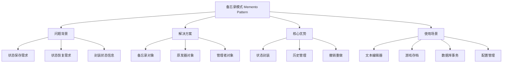
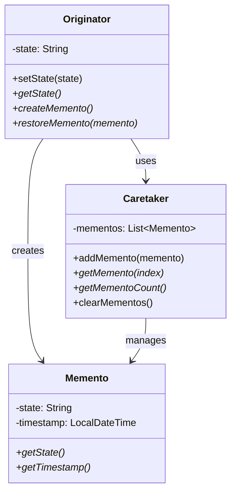

# 💾 备忘录模式详解

[[05-行为型模式/06-中介者模式]] ← [[05-行为型模式/08-观察者模式]]
## 🎯 备忘录模式概览

### 📊 模式基本信息



### 🎯 **定义与意图**
备忘录模式在不破坏封装性的前提下，捕获一个对象的内部状态，并在该对象之外保存这个状态。这样以后就可以将该对象恢复到原先保存的状态。

### 📋 **核心价值**
- **状态封装**: 将对象状态封装在备忘录中
- **历史管理**: 支持多个历史状态的保存
- **撤销重做**: 实现撤销和重做功能
- **不破坏封装**: 不暴露对象的内部结构

## 🏗️ 备忘录模式结构

### 📊 **类图结构**



### 🎯 **角色职责**

#### **Originator (原发器)**
- 创建一个包含其当前内部状态的备忘录
- 使用备忘录恢复其内部状态

#### **Memento (备忘录)**
- 存储原发器的内部状态
- 防止原发器以外的其他对象访问备忘录

#### **Caretaker (管理者)**
- 负责保存备忘录
- 不能对备忘录的内容进行操作或检查

## 💻 备忘录模式实现

### 🎯 **经典实现：文本编辑器**

```java
// ✅ 备忘录接口
public interface Memento {
    String getState();
    LocalDateTime getTimestamp();
    String getDescription();
}

// ✅ 文本备忘录
public class TextMemento implements Memento {
    private final String state;
    private final LocalDateTime timestamp;
    private final String description;
    
    public TextMemento(String state, String description) {
        this.state = state;
        this.timestamp = LocalDateTime.now();
        this.description = description;
    }
    
    @Override
    public String getState() {
        return state;
    }
    
    @Override
    public LocalDateTime getTimestamp() {
        return timestamp;
    }
    
    @Override
    public String getDescription() {
        return description;
    }
    
    @Override
    public String toString() {
        return String.format("备忘录: %s (时间: %s)", 
                           description, 
                           timestamp.format(DateTimeFormatter.ofPattern("yyyy-MM-dd HH:mm:ss")));
    }
}

// ✅ 文本编辑器（原发器）
public class TextEditor {
    private String content;
    private String fileName;
    private LocalDateTime lastModified;
    private final List<String> undoStack;
    private final List<String> redoStack;
    
    public TextEditor(String fileName) {
        this.fileName = fileName;
        this.content = "";
        this.lastModified = LocalDateTime.now();
        this.undoStack = new ArrayList<>();
        this.redoStack = new ArrayList<>();
    }
    
    // ✅ 设置内容
    public void setContent(String content) {
        // 保存当前状态到撤销栈
        if (!this.content.equals(content)) {
            undoStack.add(this.content);
            redoStack.clear(); // 清空重做栈
        }
        
        this.content = content;
        this.lastModified = LocalDateTime.now();
    }
    
    // ✅ 追加内容
    public void appendContent(String text) {
        String oldContent = this.content;
        this.content += text;
        this.lastModified = LocalDateTime.now();
        
        // 保存到撤销栈
        undoStack.add(oldContent);
        redoStack.clear();
    }
    
    // ✅ 插入内容
    public void insertContent(int position, String text) {
        if (position < 0 || position > content.length()) {
            throw new IllegalArgumentException("插入位置超出范围");
        }
        
        String oldContent = this.content;
        this.content = content.substring(0, position) + text + content.substring(position);
        this.lastModified = LocalDateTime.now();
        
        // 保存到撤销栈
        undoStack.add(oldContent);
        redoStack.clear();
    }
    
    // ✅ 删除内容
    public void deleteContent(int start, int end) {
        if (start < 0 || end > content.length() || start >= end) {
            throw new IllegalArgumentException("删除范围无效");
        }
        
        String oldContent = this.content;
        this.content = content.substring(0, start) + content.substring(end);
        this.lastModified = LocalDateTime.now();
        
        // 保存到撤销栈
        undoStack.add(oldContent);
        redoStack.clear();
    }
    
    // ✅ 创建备忘录
    public Memento createMemento(String description) {
        return new TextMemento(content, description);
    }
    
    // ✅ 恢复备忘录
    public void restoreMemento(Memento memento) {
        if (memento instanceof TextMemento) {
            TextMemento textMemento = (TextMemento) memento;
            this.content = textMemento.getState();
            this.lastModified = LocalDateTime.now();
            
            // 清空撤销和重做栈
            undoStack.clear();
            redoStack.clear();
        }
    }
    
    // ✅ 撤销操作
    public boolean undo() {
        if (undoStack.isEmpty()) {
            return false;
        }
        
        String currentContent = this.content;
        this.content = undoStack.remove(undoStack.size() - 1);
        redoStack.add(currentContent);
        this.lastModified = LocalDateTime.now();
        
        return true;
    }
    
    // ✅ 重做操作
    public boolean redo() {
        if (redoStack.isEmpty()) {
            return false;
        }
        
        String currentContent = this.content;
        this.content = redoStack.remove(redoStack.size() - 1);
        undoStack.add(currentContent);
        this.lastModified = LocalDateTime.now();
        
        return true;
    }
    
    // ✅ 获取内容
    public String getContent() {
        return content;
    }
    
    // ✅ 获取文件信息
    public String getFileName() {
        return fileName;
    }
    
    public LocalDateTime getLastModified() {
        return lastModified;
    }
    
    // ✅ 获取统计信息
    public TextEditorStatistics getStatistics() {
        return new TextEditorStatistics(
            content.length(),
            content.split("\\s+").length,
            content.split("\\n").length,
            undoStack.size(),
            redoStack.size()
        );
    }
    
    // ✅ 清空内容
    public void clear() {
        String oldContent = this.content;
        this.content = "";
        this.lastModified = LocalDateTime.now();
        
        undoStack.add(oldContent);
        redoStack.clear();
    }
    
    // ✅ 保存到文件
    public void saveToFile(String filePath) {
        try {
            Files.write(Paths.get(filePath), content.getBytes());
            System.out.println("内容已保存到文件: " + filePath);
        } catch (IOException e) {
            System.err.println("保存文件失败: " + e.getMessage());
        }
    }
    
    // ✅ 从文件加载
    public void loadFromFile(String filePath) {
        try {
            String fileContent = Files.readString(Paths.get(filePath));
            setContent(fileContent);
            System.out.println("从文件加载内容: " + filePath);
        } catch (IOException e) {
            System.err.println("加载文件失败: " + e.getMessage());
        }
    }
}

// ✅ 文本编辑器统计信息
public class TextEditorStatistics {
    private final int characterCount;
    private final int wordCount;
    private final int lineCount;
    private final int undoStackSize;
    private final int redoStackSize;
    
    public TextEditorStatistics(int characterCount, int wordCount, int lineCount, 
                               int undoStackSize, int redoStackSize) {
        this.characterCount = characterCount;
        this.wordCount = wordCount;
        this.lineCount = lineCount;
        this.undoStackSize = undoStackSize;
        this.redoStackSize = redoStackSize;
    }
    
    // Getters
    public int getCharacterCount() { return characterCount; }
    public int getWordCount() { return wordCount; }
    public int getLineCount() { return lineCount; }
    public int getUndoStackSize() { return undoStackSize; }
    public int getRedoStackSize() { return redoStackSize; }
    
    @Override
    public String toString() {
        return String.format("文本统计 - 字符数: %d, 单词数: %d, 行数: %d, 撤销栈: %d, 重做栈: %d",
                           characterCount, wordCount, lineCount, undoStackSize, redoStackSize);
    }
}

// ✅ 备忘录管理者
public class MementoCaretaker {
    private final List<Memento> mementos;
    private final Map<String, List<Memento>> namedMementos;
    private final int maxMementos;
    
    public MementoCaretaker() {
        this(100); // 默认最多保存100个备忘录
    }
    
    public MementoCaretaker(int maxMementos) {
        this.mementos = new ArrayList<>();
        this.namedMementos = new HashMap<>();
        this.maxMementos = maxMementos;
    }
    
    // ✅ 添加备忘录
    public void addMemento(Memento memento) {
        mementos.add(memento);
        
        // 限制备忘录数量
        if (mementos.size() > maxMementos) {
            mementos.remove(0); // 移除最旧的备忘录
        }
        
        System.out.println("添加备忘录: " + memento.getDescription());
    }
    
    // ✅ 添加命名备忘录
    public void addNamedMemento(String name, Memento memento) {
        namedMementos.computeIfAbsent(name, k -> new ArrayList<>()).add(memento);
        System.out.println("添加命名备忘录: " + name + " - " + memento.getDescription());
    }
    
    // ✅ 获取备忘录
    public Memento getMemento(int index) {
        if (index < 0 || index >= mementos.size()) {
            throw new IndexOutOfBoundsException("备忘录索引超出范围: " + index);
        }
        return mementos.get(index);
    }
    
    // ✅ 获取命名备忘录
    public Memento getNamedMemento(String name, int index) {
        List<Memento> namedList = namedMementos.get(name);
        if (namedList == null || index < 0 || index >= namedList.size()) {
            throw new IndexOutOfBoundsException("命名备忘录不存在: " + name + "[" + index + "]");
        }
        return namedList.get(index);
    }
    
    // ✅ 获取最新备忘录
    public Memento getLatestMemento() {
        if (mementos.isEmpty()) {
            return null;
        }
        return mementos.get(mementos.size() - 1);
    }
    
    // ✅ 获取指定名称的最新备忘录
    public Memento getLatestNamedMemento(String name) {
        List<Memento> namedList = namedMementos.get(name);
        if (namedList == null || namedList.isEmpty()) {
            return null;
        }
        return namedList.get(namedList.size() - 1);
    }
    
    // ✅ 获取备忘录数量
    public int getMementoCount() {
        return mementos.size();
    }
    
    // ✅ 获取命名备忘录数量
    public int getNamedMementoCount(String name) {
        List<Memento> namedList = namedMementos.get(name);
        return namedList != null ? namedList.size() : 0;
    }
    
    // ✅ 清空备忘录
    public void clearMementos() {
        mementos.clear();
        namedMementos.clear();
        System.out.println("清空所有备忘录");
    }
    
    // ✅ 清空命名备忘录
    public void clearNamedMementos(String name) {
        namedMementos.remove(name);
        System.out.println("清空命名备忘录: " + name);
    }
    
    // ✅ 获取所有备忘录
    public List<Memento> getAllMementos() {
        return new ArrayList<>(mementos);
    }
    
    // ✅ 获取所有命名备忘录
    public Map<String, List<Memento>> getAllNamedMementos() {
        return new HashMap<>(namedMementos);
    }
    
    // ✅ 搜索备忘录
    public List<Memento> searchMementos(String keyword) {
        return mementos.stream()
            .filter(memento -> memento.getDescription().toLowerCase().contains(keyword.toLowerCase()))
            .collect(Collectors.toList());
    }
    
    // ✅ 获取备忘录统计信息
    public MementoStatistics getStatistics() {
        return new MementoStatistics(
            mementos.size(),
            namedMementos.size(),
            namedMementos.values().stream().mapToInt(List::size).sum(),
            maxMementos
        );
    }
}

// ✅ 备忘录统计信息
public class MementoStatistics {
    private final int totalMementos;
    private final int namedMementoGroups;
    private final int totalNamedMementos;
    private final int maxMementos;
    
    public MementoStatistics(int totalMementos, int namedMementoGroups, 
                           int totalNamedMementos, int maxMementos) {
        this.totalMementos = totalMementos;
        this.namedMementoGroups = namedMementoGroups;
        this.totalNamedMementos = totalNamedMementos;
        this.maxMementos = maxMementos;
    }
    
    // Getters
    public int getTotalMementos() { return totalMementos; }
    public int getNamedMementoGroups() { return namedMementoGroups; }
    public int getTotalNamedMementos() { return totalNamedMementos; }
    public int getMaxMementos() { return maxMementos; }
    
    @Override
    public String toString() {
        return String.format("备忘录统计 - 总备忘录: %d, 命名组: %d, 命名备忘录: %d, 最大容量: %d",
                           totalMementos, namedMementoGroups, totalNamedMementos, maxMementos);
    }
}

// ✅ 文本编辑器管理器
public class TextEditorManager {
    private final Map<String, TextEditor> editors;
    private final Map<String, MementoCaretaker> caretakers;
    private final Map<String, List<Memento>> snapshots;
    
    public TextEditorManager() {
        this.editors = new HashMap<>();
        this.caretakers = new HashMap<>();
        this.snapshots = new HashMap<>();
    }
    
    // ✅ 创建编辑器
    public TextEditor createEditor(String fileName) {
        TextEditor editor = new TextEditor(fileName);
        editors.put(fileName, editor);
        caretakers.put(fileName, new MementoCaretaker());
        snapshots.put(fileName, new ArrayList<>());
        
        System.out.println("创建文本编辑器: " + fileName);
        return editor;
    }
    
    // ✅ 获取编辑器
    public TextEditor getEditor(String fileName) {
        return editors.get(fileName);
    }
    
    // ✅ 保存快照
    public void saveSnapshot(String fileName, String description) {
        TextEditor editor = editors.get(fileName);
        MementoCaretaker caretaker = caretakers.get(fileName);
        
        if (editor != null && caretaker != null) {
            Memento memento = editor.createMemento(description);
            caretaker.addMemento(memento);
            snapshots.get(fileName).add(memento);
        }
    }
    
    // ✅ 恢复快照
    public void restoreSnapshot(String fileName, int index) {
        TextEditor editor = editors.get(fileName);
        MementoCaretaker caretaker = caretakers.get(fileName);
        
        if (editor != null && caretaker != null) {
            Memento memento = caretaker.getMemento(index);
            editor.restoreMemento(memento);
            System.out.println("恢复快照: " + memento.getDescription());
        }
    }
    
    // ✅ 恢复最新快照
    public void restoreLatestSnapshot(String fileName) {
        TextEditor editor = editors.get(fileName);
        MementoCaretaker caretaker = caretakers.get(fileName);
        
        if (editor != null && caretaker != null) {
            Memento memento = caretaker.getLatestMemento();
            if (memento != null) {
                editor.restoreMemento(memento);
                System.out.println("恢复最新快照: " + memento.getDescription());
            }
        }
    }
    
    // ✅ 获取编辑器列表
    public List<String> getEditorNames() {
        return new ArrayList<>(editors.keySet());
    }
    
    // ✅ 关闭编辑器
    public void closeEditor(String fileName) {
        editors.remove(fileName);
        caretakers.remove(fileName);
        snapshots.remove(fileName);
        System.out.println("关闭编辑器: " + fileName);
    }
    
    // ✅ 获取统计信息
    public void printStatistics() {
        System.out.println("=== 文本编辑器管理器统计 ===");
        System.out.println("打开的编辑器数量: " + editors.size());
        
        for (Map.Entry<String, TextEditor> entry : editors.entrySet()) {
            String fileName = entry.getKey();
            TextEditor editor = entry.getValue();
            MementoCaretaker caretaker = caretakers.get(fileName);
            
            System.out.println("编辑器: " + fileName);
            System.out.println("  " + editor.getStatistics());
            System.out.println("  " + caretaker.getStatistics());
        }
        
        System.out.println("==================");
    }
}

// ✅ 客户端使用示例
public class MementoPatternDemo {
    public static void main(String[] args) {
        TextEditorManager manager = new TextEditorManager();
        
        // ✅ 创建编辑器
        TextEditor editor = manager.createEditor("demo.txt");
        
        // ✅ 编辑内容
        editor.setContent("Hello, World!");
        manager.saveSnapshot("demo.txt", "初始内容");
        
        editor.appendContent(" This is a demo.");
        manager.saveSnapshot("demo.txt", "追加内容");
        
        editor.insertContent(13, " beautiful");
        manager.saveSnapshot("demo.txt", "插入内容");
        
        editor.deleteContent(13, 23);
        manager.saveSnapshot("demo.txt", "删除内容");
        
        // ✅ 显示当前内容
        System.out.println("当前内容: " + editor.getContent());
        
        // ✅ 显示统计信息
        System.out.println("\n=== 编辑器统计 ===");
        System.out.println(editor.getStatistics());
        
        // ✅ 显示备忘录统计
        MementoCaretaker caretaker = manager.caretakers.get("demo.txt");
        System.out.println("\n=== 备忘录统计 ===");
        System.out.println(caretaker.getStatistics());
        
        // ✅ 显示所有备忘录
        System.out.println("\n=== 所有备忘录 ===");
        List<Memento> mementos = caretaker.getAllMementos();
        for (int i = 0; i < mementos.size(); i++) {
            System.out.println(i + ": " + mementos.get(i));
        }
        
        // ✅ 恢复快照
        System.out.println("\n=== 恢复快照 ===");
        manager.restoreSnapshot("demo.txt", 0);
        System.out.println("恢复后内容: " + editor.getContent());
        
        manager.restoreSnapshot("demo.txt", 2);
        System.out.println("恢复后内容: " + editor.getContent());
        
        // ✅ 撤销和重做
        System.out.println("\n=== 撤销和重做 ===");
        editor.setContent("New content");
        System.out.println("设置新内容: " + editor.getContent());
        
        editor.undo();
        System.out.println("撤销后: " + editor.getContent());
        
        editor.redo();
        System.out.println("重做后: " + editor.getContent());
        
        // ✅ 演示备忘录模式的优势
        System.out.println("\n=== 备忘录模式优势演示 ===");
        
        // 可以保存多个历史状态
        editor.setContent("State 1");
        manager.saveSnapshot("demo.txt", "状态1");
        
        editor.setContent("State 2");
        manager.saveSnapshot("demo.txt", "状态2");
        
        editor.setContent("State 3");
        manager.saveSnapshot("demo.txt", "状态3");
        
        // 可以随时恢复到任意历史状态
        manager.restoreSnapshot("demo.txt", 0);
        System.out.println("恢复到状态1: " + editor.getContent());
        
        manager.restoreSnapshot("demo.txt", 2);
        System.out.println("恢复到状态3: " + editor.getContent());
        
        // 可以搜索备忘录
        List<Memento> searchResults = caretaker.searchMementos("状态");
        System.out.println("搜索'状态'的结果: " + searchResults.size() + " 个");
        
        // 显示管理器统计
        manager.printStatistics();
    }
}
```

### 🚀 **现代企业级实现：游戏存档系统**

```java
// ✅ 游戏状态备忘录
public class GameStateMemento implements Memento {
    private final String playerName;
    private final int level;
    private final int experience;
    private final int health;
    private final int mana;
    private final Map<String, Object> inventory;
    private final Map<String, Object> gameSettings;
    private final LocalDateTime timestamp;
    private final String description;
    
    public GameStateMemento(String playerName, int level, int experience, int health, int mana,
                          Map<String, Object> inventory, Map<String, Object> gameSettings, String description) {
        this.playerName = playerName;
        this.level = level;
        this.experience = experience;
        this.health = health;
        this.mana = mana;
        this.inventory = new HashMap<>(inventory);
        this.gameSettings = new HashMap<>(gameSettings);
        this.timestamp = LocalDateTime.now();
        this.description = description;
    }
    
    @Override
    public String getState() {
        return String.format("玩家: %s, 等级: %d, 经验: %d, 生命值: %d, 魔法值: %d", 
                           playerName, level, experience, health, mana);
    }
    
    @Override
    public LocalDateTime getTimestamp() {
        return timestamp;
    }
    
    @Override
    public String getDescription() {
        return description;
    }
    
    // Getters
    public String getPlayerName() { return playerName; }
    public int getLevel() { return level; }
    public int getExperience() { return experience; }
    public int getHealth() { return health; }
    public int getMana() { return mana; }
    public Map<String, Object> getInventory() { return new HashMap<>(inventory); }
    public Map<String, Object> getGameSettings() { return new HashMap<>(gameSettings); }
}

// ✅ 游戏角色（原发器）
public class GameCharacter {
    private String playerName;
    private int level;
    private int experience;
    private int health;
    private int mana;
    private Map<String, Object> inventory;
    private Map<String, Object> gameSettings;
    
    public GameCharacter(String playerName) {
        this.playerName = playerName;
        this.level = 1;
        this.experience = 0;
        this.health = 100;
        this.mana = 50;
        this.inventory = new HashMap<>();
        this.gameSettings = new HashMap<>();
        
        // 初始化游戏设置
        gameSettings.put("difficulty", "normal");
        gameSettings.put("sound", true);
        gameSettings.put("music", true);
    }
    
    // ✅ 升级
    public void levelUp() {
        level++;
        experience = 0;
        health = 100;
        mana = 50;
        System.out.println("角色升级到 " + level + " 级！");
    }
    
    // ✅ 获得经验
    public void gainExperience(int exp) {
        experience += exp;
        System.out.println("获得经验: " + exp + ", 当前经验: " + experience);
        
        // 检查是否升级
        if (experience >= level * 100) {
            levelUp();
        }
    }
    
    // ✅ 受到伤害
    public void takeDamage(int damage) {
        health = Math.max(0, health - damage);
        System.out.println("受到伤害: " + damage + ", 当前生命值: " + health);
        
        if (health <= 0) {
            System.out.println("角色死亡！");
        }
    }
    
    // ✅ 恢复生命值
    public void heal(int amount) {
        health = Math.min(100, health + amount);
        System.out.println("恢复生命值: " + amount + ", 当前生命值: " + health);
    }
    
    // ✅ 消耗魔法值
    public void consumeMana(int amount) {
        mana = Math.max(0, mana - amount);
        System.out.println("消耗魔法值: " + amount + ", 当前魔法值: " + mana);
    }
    
    // ✅ 恢复魔法值
    public void restoreMana(int amount) {
        mana = Math.min(100, mana + amount);
        System.out.println("恢复魔法值: " + amount + ", 当前魔法值: " + mana);
    }
    
    // ✅ 添加物品
    public void addItem(String itemName, Object item) {
        inventory.put(itemName, item);
        System.out.println("获得物品: " + itemName);
    }
    
    // ✅ 移除物品
    public void removeItem(String itemName) {
        if (inventory.remove(itemName) != null) {
            System.out.println("移除物品: " + itemName);
        }
    }
    
    // ✅ 更新游戏设置
    public void updateSetting(String key, Object value) {
        gameSettings.put(key, value);
        System.out.println("更新设置: " + key + " = " + value);
    }
    
    // ✅ 创建备忘录
    public Memento createMemento(String description) {
        return new GameStateMemento(playerName, level, experience, health, mana, 
                                  inventory, gameSettings, description);
    }
    
    // ✅ 恢复备忘录
    public void restoreMemento(Memento memento) {
        if (memento instanceof GameStateMemento) {
            GameStateMemento gameMemento = (GameStateMemento) memento;
            
            this.playerName = gameMemento.getPlayerName();
            this.level = gameMemento.getLevel();
            this.experience = gameMemento.getExperience();
            this.health = gameMemento.getHealth();
            this.mana = gameMemento.getMana();
            this.inventory = gameMemento.getInventory();
            this.gameSettings = gameMemento.getGameSettings();
            
            System.out.println("恢复游戏状态: " + gameMemento.getDescription());
        }
    }
    
    // Getters
    public String getPlayerName() { return playerName; }
    public int getLevel() { return level; }
    public int getExperience() { return experience; }
    public int getHealth() { return health; }
    public int getMana() { return mana; }
    public Map<String, Object> getInventory() { return new HashMap<>(inventory); }
    public Map<String, Object> getGameSettings() { return new HashMap<>(gameSettings); }
    
    // ✅ 获取角色信息
    public String getCharacterInfo() {
        return String.format("角色信息 - 姓名: %s, 等级: %d, 经验: %d, 生命值: %d, 魔法值: %d", 
                           playerName, level, experience, health, mana);
    }
    
    // ✅ 获取背包信息
    public String getInventoryInfo() {
        if (inventory.isEmpty()) {
            return "背包为空";
        }
        
        StringBuilder sb = new StringBuilder("背包内容:\n");
        inventory.forEach((name, item) -> 
            sb.append("  ").append(name).append(": ").append(item).append("\n"));
        
        return sb.toString();
    }
}

// ✅ 游戏存档管理器
public class GameSaveManager {
    private final Map<String, MementoCaretaker> saveSlots;
    private final Map<String, GameCharacter> characters;
    private final String saveDirectory;
    
    public GameSaveManager(String saveDirectory) {
        this.saveSlots = new HashMap<>();
        this.characters = new HashMap<>();
        this.saveDirectory = saveDirectory;
        
        // 初始化存档槽位
        for (int i = 1; i <= 10; i++) {
            saveSlots.put("slot" + i, new MementoCaretaker(50));
        }
    }
    
    // ✅ 创建角色
    public GameCharacter createCharacter(String playerName) {
        GameCharacter character = new GameCharacter(playerName);
        characters.put(playerName, character);
        System.out.println("创建角色: " + playerName);
        return character;
    }
    
    // ✅ 保存游戏
    public void saveGame(String playerName, String slotName, String description) {
        GameCharacter character = characters.get(playerName);
        MementoCaretaker caretaker = saveSlots.get(slotName);
        
        if (character != null && caretaker != null) {
            Memento memento = character.createMemento(description);
            caretaker.addMemento(memento);
            System.out.println("保存游戏到槽位 " + slotName + ": " + description);
        } else {
            System.out.println("保存失败: 角色或槽位不存在");
        }
    }
    
    // ✅ 加载游戏
    public void loadGame(String playerName, String slotName, int saveIndex) {
        GameCharacter character = characters.get(playerName);
        MementoCaretaker caretaker = saveSlots.get(slotName);
        
        if (character != null && caretaker != null) {
            try {
                Memento memento = caretaker.getMemento(saveIndex);
                character.restoreMemento(memento);
                System.out.println("从槽位 " + slotName + " 加载游戏: " + memento.getDescription());
            } catch (IndexOutOfBoundsException e) {
                System.out.println("加载失败: 存档索引超出范围");
            }
        } else {
            System.out.println("加载失败: 角色或槽位不存在");
        }
    }
    
    // ✅ 加载最新存档
    public void loadLatestSave(String playerName, String slotName) {
        GameCharacter character = characters.get(playerName);
        MementoCaretaker caretaker = saveSlots.get(slotName);
        
        if (character != null && caretaker != null) {
            Memento memento = caretaker.getLatestMemento();
            if (memento != null) {
                character.restoreMemento(memento);
                System.out.println("加载最新存档: " + memento.getDescription());
            } else {
                System.out.println("槽位 " + slotName + " 没有存档");
            }
        }
    }
    
    // ✅ 获取存档列表
    public List<String> getSaveList(String slotName) {
        MementoCaretaker caretaker = saveSlots.get(slotName);
        if (caretaker != null) {
            return caretaker.getAllMementos().stream()
                .map(Memento::getDescription)
                .collect(Collectors.toList());
        }
        return Collections.emptyList();
    }
    
    // ✅ 删除存档
    public void deleteSave(String slotName, int saveIndex) {
        MementoCaretaker caretaker = saveSlots.get(slotName);
        if (caretaker != null) {
            try {
                Memento memento = caretaker.getMemento(saveIndex);
                caretaker.clearMementos();
                System.out.println("删除存档: " + memento.getDescription());
            } catch (IndexOutOfBoundsException e) {
                System.out.println("删除失败: 存档索引超出范围");
            }
        }
    }
    
    // ✅ 获取角色
    public GameCharacter getCharacter(String playerName) {
        return characters.get(playerName);
    }
    
    // ✅ 获取所有角色
    public List<String> getAllCharacterNames() {
        return new ArrayList<>(characters.keySet());
    }
    
    // ✅ 获取存档统计
    public void printSaveStatistics() {
        System.out.println("=== 游戏存档统计 ===");
        System.out.println("角色数量: " + characters.size());
        
        for (Map.Entry<String, MementoCaretaker> entry : saveSlots.entrySet()) {
            String slotName = entry.getKey();
            MementoCaretaker caretaker = entry.getValue();
            
            System.out.println("槽位 " + slotName + ": " + caretaker.getMementoCount() + " 个存档");
        }
        
        System.out.println("==================");
    }
    
    // ✅ 自动保存
    public void autoSave(String playerName) {
        GameCharacter character = characters.get(playerName);
        if (character != null) {
            String description = "自动保存 - " + LocalDateTime.now().format(DateTimeFormatter.ofPattern("yyyy-MM-dd HH:mm:ss"));
            saveGame(playerName, "slot1", description);
        }
    }
    
    // ✅ 快速保存
    public void quickSave(String playerName) {
        saveGame(playerName, "slot1", "快速保存");
    }
    
    // ✅ 快速加载
    public void quickLoad(String playerName) {
        loadLatestSave(playerName, "slot1");
    }
}

// ✅ 客户端使用示例
public class GameSaveDemo {
    public static void main(String[] args) {
        GameSaveManager saveManager = new GameSaveManager("./saves");
        
        // ✅ 创建角色
        GameCharacter character = saveManager.createCharacter("勇者");
        
        // ✅ 游戏进行
        System.out.println("=== 游戏开始 ===");
        System.out.println(character.getCharacterInfo());
        
        // 获得经验
        character.gainExperience(50);
        character.addItem("剑", "铁剑");
        character.addItem("盾", "木盾");
        
        // 保存游戏
        saveManager.saveGame("勇者", "slot1", "游戏开始");
        
        // 继续游戏
        character.gainExperience(100);
        character.levelUp();
        character.addItem("药水", "生命药水");
        
        // 保存游戏
        saveManager.saveGame("勇者", "slot1", "第一次升级");
        
        // 战斗
        character.takeDamage(30);
        character.consumeMana(20);
        
        // 保存游戏
        saveManager.saveGame("勇者", "slot1", "战斗后");
        
        // 显示当前状态
        System.out.println("\n=== 当前状态 ===");
        System.out.println(character.getCharacterInfo());
        System.out.println(character.getInventoryInfo());
        
        // 显示存档列表
        System.out.println("\n=== 存档列表 ===");
        List<String> saves = saveManager.getSaveList("slot1");
        for (int i = 0; i < saves.size(); i++) {
            System.out.println(i + ": " + saves.get(i));
        }
        
        // 加载存档
        System.out.println("\n=== 加载存档 ===");
        saveManager.loadGame("勇者", "slot1", 0);
        System.out.println("加载后状态: " + character.getCharacterInfo());
        
        saveManager.loadGame("勇者", "slot1", 1);
        System.out.println("加载后状态: " + character.getCharacterInfo());
        
        // 自动保存
        System.out.println("\n=== 自动保存 ===");
        saveManager.autoSave("勇者");
        
        // 快速保存和加载
        System.out.println("\n=== 快速保存和加载 ===");
        character.gainExperience(200);
        saveManager.quickSave("勇者");
        
        character.takeDamage(50);
        System.out.println("受伤后: " + character.getCharacterInfo());
        
        saveManager.quickLoad("勇者");
        System.out.println("快速加载后: " + character.getCharacterInfo());
        
        // 显示存档统计
        saveManager.printSaveStatistics();
        
        // ✅ 演示备忘录模式的优势
        System.out.println("\n=== 备忘录模式优势演示 ===");
        
        // 可以保存多个不同的游戏状态
        character.setContent("新内容");
        saveManager.saveGame("勇者", "slot2", "备用存档");
        
        character.setContent("另一个内容");
        saveManager.saveGame("勇者", "slot3", "另一个备用存档");
        
        // 可以随时恢复到任意历史状态
        saveManager.loadGame("勇者", "slot2", 0);
        System.out.println("恢复到备用存档: " + character.getContent());
        
        // 可以管理多个存档槽位
        System.out.println("槽位2存档数量: " + saveManager.getSaveList("slot2").size());
        System.out.println("槽位3存档数量: " + saveManager.getSaveList("slot3").size());
    }
}
```

## 🔧 备忘录模式高级技巧

### 🎯 **增量备忘录**

```java
// ✅ 增量备忘录
public class IncrementalMemento implements Memento {
    private final String baseState;
    private final Map<String, Object> changes;
    private final LocalDateTime timestamp;
    private final String description;
    
    public IncrementalMemento(String baseState, Map<String, Object> changes, String description) {
        this.baseState = baseState;
        this.changes = new HashMap<>(changes);
        this.timestamp = LocalDateTime.now();
        this.description = description;
    }
    
    @Override
    public String getState() {
        return baseState + " + " + changes.toString();
    }
    
    @Override
    public LocalDateTime getTimestamp() {
        return timestamp;
    }
    
    @Override
    public String getDescription() {
        return description;
    }
    
    public String getBaseState() {
        return baseState;
    }
    
    public Map<String, Object> getChanges() {
        return new HashMap<>(changes);
    }
}
```

## 🚀 备忘录模式最佳实践

### 📋 **使用指南**

1. **设计原则**:
   - 确保备忘录的封装性
   - 提供清晰的保存和恢复接口
   - 支持多个历史状态的管理

2. **实现技巧**:
   - 使用深拷贝避免状态污染
   - 实现增量保存减少内存占用
   - 提供状态压缩和序列化功能

3. **性能考虑**:
   - 限制备忘录数量避免内存泄漏
   - 使用懒加载减少初始化开销
   - 实现备忘录的清理策略

### ⚠️ **注意事项**

1. **内存管理**: 及时清理不需要的备忘录
2. **状态一致性**: 确保备忘录状态的完整性
3. **性能影响**: 大量备忘录可能影响性能
4. **并发安全**: 在多线程环境下确保状态安全

## 📊 与其他模式的对比

| 对比维度 | 备忘录模式 | 命令模式 | 状态模式 |
|----------|------------|----------|----------|
| **目的** | 状态保存 | 请求封装 | 状态转换 |
| **结构** | 三对象 | 四对象 | 三对象 |
| **使用** | 历史恢复 | 撤销重做 | 状态管理 |
| **扩展** | 添加状态 | 添加命令 | 添加状态 |

## 🔗 学习衔接

- **上一模式** ← [[中介者模式]]
- **下一模式** → [[观察者模式]]
- **模式对比** → [[05-行为型模式/13-行为型模式对比表]]
- **游戏开发** → [[设计模式最佳实践秘典]]

---
**💡 备忘录模式精髓**: 备忘录模式就像一个时光机，它能够保存你现在的状态，然后在需要的时候带你回到过去。就像游戏中的存档系统，你可以随时保存进度，也可以随时回到之前的某个时刻，重新开始你的冒险！
