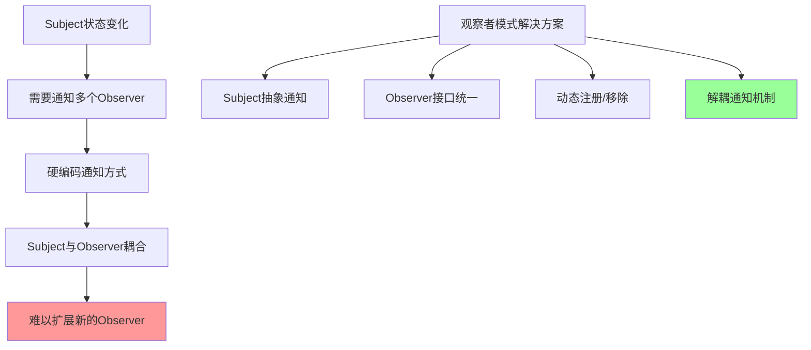
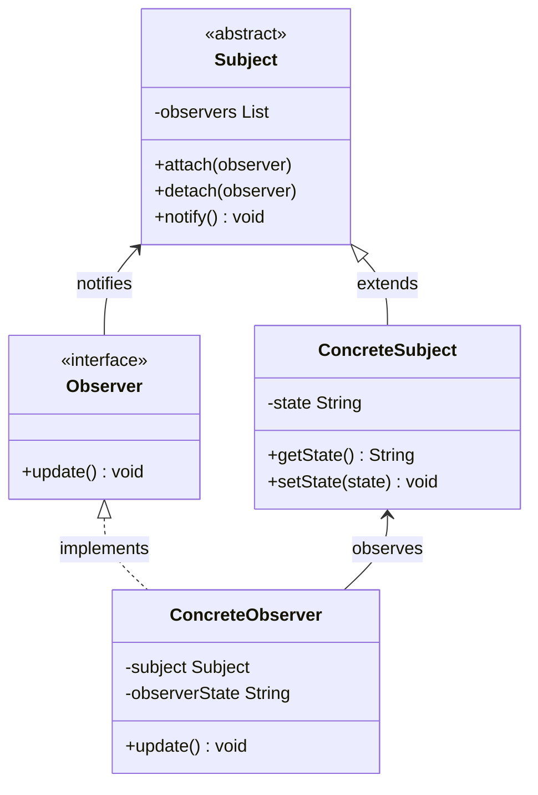
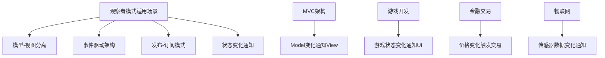

# 观察者模式 Observer Pattern

[[04-结构型模式/01-结构型模式概述]] → [[09-状态模式]]
## 🎯 模式定义与意图

### 📖 官方定义
> **定义对象间的一种一对多依赖关系，当一个对象的状态发生改变时，所有依赖于它的对象都得到通知并被自动更新。**

### 🤔 核心问题


## 🏗️ 结构图与参与者

### 📊 UML类图


### 👥 参与者职责

| 参与者 | 职责描述 | 示例角色 |
|--------|----------|----------|
| **Subject** | 抽象被观察者 | NewsAgency |
| **ConcreteSubject** | 具体被观察者 | StockMarket |
| **Observer** | 抽象观察者 | NewsSubscriber |
| **ConcreteObserver** | 具体观察者 | EmailSubscriber |

## 💡 经典实现示例

### 🎯 股票价格监控系统

```java
// Subject: 抽象主题类
abstract class StockSubject {
    protected List<StockObserver> observers = new ArrayList<>();
    protected String stockSymbol;
    protected double stockPrice;
    
    public StockSubject(String stockSymbol, double initialPrice) {
        this.stockSymbol = stockSymbol;
        this.stockPrice = initialPrice;
    }
    
    public void attach(StockObserver observer) {
        observers.add(observer);
        System.out.println("Observer added: " + observer.getClass().getSimpleName());
    }
    
    public void detach(StockObserver observer) {
        observers.remove(observer);
        System.out.println("Observer removed: " + observer.getClass().getSimpleName());
    }
    
    protected void notifyObservers() {
        for (StockObserver observer : observers) {
            observer.update(this);
        }
    }
    
    public void setPrice(double newPrice) {
        if (newPrice != stockPrice) {
            double oldPrice = stockPrice;
            stockPrice = newPrice;
            System.out.println(stockSymbol + " price changed from $" + 
                String.format("%.2f", oldPrice) + " to $" + 
                String.format("%.2f", newPrice));
            notifyObservers();
        }
    }
    
    public String getSymbol() { return stockSymbol; }
    public double getPrice() { return stockPrice; }
}

// Concrete Subject: 具体股票
class Stock extends StockSubject {
    public Stock(String symbol, double price) {
        super(symbol, price);
    }
}

// Observer: 抽象观察者
interface StockObserver {
    void update(StockSubject stock);
}

// Concrete Observer: 电子邮件通知
class EmailNotification implements StockObserver {
    private String recipient;
    private double threshold;
    
    public EmailNotification(String recipient, double threshold) {
        this.recipient = recipient;
        this.threshold = threshold;
    }
    
    public void update(StockSubject stock) {
        if (stock.getPrice() >= threshold) {
            System.out.println("Email to " + recipient + ": " + 
                stock.getSymbol() + " reached $" + 
                String.format("%.2f", stock.getPrice()));
        }
    }
}

// Concrete Observer: 短信通知
class SMSNotification implements StockObserver {
    private String phoneNumber;
    private double threshold;
    
    public SMSNotification(String phoneNumber, double threshold) {
        this.phoneNumber = phoneNumber;
        this.threshold = threshold;
    }
    
    public void update(StockSubject stock) {
        if (stock.getPrice() <= threshold) {
            System.out.println("SMS to " + phoneNumber + ": " + 
                stock.getSymbol() + " dropped to $" + 
                String.format("%.2f", stock.getPrice()));
        }
    }
}

// Concrete Observer: 交易执行器
class TradingBot implements StockObserver {
    private String botName;
    private double sellThreshold;
    private double buyThreshold;
    
    public TradingBot(String botName, double sellThreshold, double buyThreshold) {
        this.botName = botName;
        this.sellThreshold = sellThreshold;
        this.buyThreshold = buyThreshold;
    }
    
    public void update(StockSubject stock) {
        String symbol = stock.getSymbol();
        double price = stock.getPrice();
        
        if (price >= sellThreshold) {
            System.out.println("TradingBot " + botName + ": SELL signal for " + 
                symbol + " at $" + String.format("%.2f", price));
        } else if (price <= buyThreshold) {
            System.out.println("TradingBot " + botName + ": BUY signal for " + 
                symbol + " at $" + String.format("%.2f", price));
        }
    }
}

// 客户端演示
public class ObserverPatternDemo {
    public static void main(String[] args) {
        // 创建股票
        Stock appleStock = new Stock("AAPL", 150.0);
        
        // 创建观察者
        EmailNotification emailAlert = new EmailNotification("trader@example.com", 160.0);
        SMSNotification smsAlert = new SMSNotification("+1234567890", 140.0);
        TradingBot aggressiveBot = new TradingBot("AggressiveBot", 160.0, 140.0);
        
        // 注册观察者
        appleStock.attach(emailAlert);
        appleStock.attach(smsAlert);
        appleStock.attach(aggressiveBot);
        
        // 模拟股价变化
        appleStock.setPrice(145.0);  // 触发卖出信号
        appleStock.setPrice(165.0);  // 触发买入信号和邮件通知
        appleStock.setPrice(155.0);  // 无触发条件
    }
}
```

## 🔥 现代实现：事件驱动系统

### 🎯 企业级应用示例

```java
// 现代事件系统
interface Event {
    String getEventType();
    Object getData();
}

class StockPriceChangedEvent implements Event {
    private String symbol;
    private double oldPrice;
    private double newPrice;
    private long timestamp;
    
    public StockPriceChangedEvent(String symbol, double oldPrice, double newPrice) {
        this.symbol = symbol;
        this.oldPrice = oldPrice;
        this.newPrice = newPrice;
        this.timestamp = System.currentTimeMillis();
    }
    
    @Override
    public String getEventType() {
        return "STOCK_PRICE_CHANGED";
    }
    
    @Override
    public Object getData() {
        return Map.of(
            "symbol", symbol,
            "oldPrice", oldPrice,
            "newPrice", newPrice,
            "timestamp", timestamp,
            "change", newPrice - oldPrice,
            "changePercent", ((newPrice - oldPrice) / oldPrice) * 100
        );
    }
    
    // Getters...
}

// 事件处理器接口
@FunctionalInterface
interface EventHandler<T extends Event> {
    void handle(T event);
}

// 现代观察者模式 - 事件总线
class EventBus {
    private final Map<Class<?>, List<EventHandler<?>>> handlers = new ConcurrentHashMap<>();
    private final Executor executor = ForkJoinPool.commonPool();
    
    @SuppressWarnings("unchecked")
    public <T extends Event> void subscribe(Class<T> eventType, EventHandler<T> handler) {
        handlers.computeIfAbsent(eventType, k -> new CopyOnWriteArrayList<>()).add((EventHandler<?>) handler);
    }
    
    @SuppressWarnings("unchecked")
    public <T extends Event> void unsubscribe(Class<T> eventType, EventHandler<T> handler) {
        List<EventHandler<?>> eventHandlers = handlers.get(eventType);
        if (eventHandlers != null) {
            eventHandlers.remove(handler);
        }
    }
    
    @SuppressWarnings("unchecked")
    public <T extends Event> void publish(T event) {
        List<EventHandler<?>> eventHandlers = handlers.get(event.getClass());
        if (eventHandlers != null && !eventHandlers.isEmpty()) {
            executor.execute(() -> {
                for (EventHandler<?> handler : eventHandlers) {
                    ((EventHandler<T>) handler).handle(event);
                }
            });
        }
    }
    
    public void removeAllHandlers() {
        handlers.clear();
    }
    
    public int getHandlerCount(Class<?> eventType) {
        List<EventHandler<?>> eventHandlers = handlers.get(eventType);
        return eventHandlers != null ? eventHandlers.size() : 0;
    }
}

// 应用服务
class ModernStockService {
    private final EventBus eventBus;
    private final Map<String, Stock> stocks = new ConcurrentHashMap<>();
    
    public ModernStockService(EventBus eventBus) {
        this.eventBus = eventBus;
        setupEventHandlers();
    }
    
    private void setupEventHandlers() {
        // 注册不同的处理器
        eventBus.subscribe(StockPriceChangedEvent.class, new PortfolioManager());
        eventBus.subscribe(StockPriceChangedEvent.class, new RiskManager());
        eventBus.subscribe(StockPriceChangedEvent.class, new NotificationService());
        eventBus.subscribe(StockPriceChangedEvent.class, new AuditLogger());
    }
    
    public void updateStockPrice(String symbol, double newPrice) {
        Stock stock = stocks.get(symbol);
        if (stock != null) {
            double oldPrice = stock.getPrice();
            stock.setPrice(newPrice);
            
            // 发布事件
            eventBus.publish(new StockPriceChangedEvent(symbol, oldPrice, newPrice));
        }
    }
    
    public void addStock(String symbol, double initialPrice) {
        stocks.put(symbol, new Stock(symbol, initialPrice));
    }
    
    // 具体事件处理器
    private class PortfolioManager implements EventHandler<StockPriceChangedEvent> {
        @Override
        public void handle(StockPriceChangedEvent event) {
            Map<String, Object> data = (Map<String, Object>) event.getData();
            double changePercent = (Double) data.get("changePercent");
            
            if (changePercent > 5.0) {
                System.out.println("PortfolioManager: Significant price increase detected for " + 
                    data.get("symbol") + " (+" + String.format("%.2f", changePercent) + "%)");
            }
        }
    }
    
    private class RiskManager implements EventHandler<StockPriceChangedEvent> {
        @Override
        public void handle(StockPriceChangedEvent event) {
            Map<String, Object> data = (Map<String, Object>) event.getData();
            double changePercent = (Double) data.get("changePercent");
            
            if (Math.abs(changePercent) > 10.0) {
                System.out.println("RiskManager: HIGH VOLATILITY ALERT for " + 
                    data.get("symbol") + " (" + String.format("%.2f", changePercent) + "%)");
            }
        }
    }
    
    private class NotificationService implements EventHandler<StockPriceChangedEvent> {
        @Override
        public void handle(StockPriceChangedEvent event) {
            Map<String, Object> data = (Map<String, Object>) event.getData();
            System.out.println("NotificationService: Sending price update notifications for " + 
                data.get("symbol"));
        }
    }
    
    private class AuditLogger implements EventHandler<StockPriceChangedEvent> {
        @Override
        public void handle(StockPriceChangedEvent event) {
            Map<String, Object> data = (Map<String, Object>) event.getData();
            System.out.println("AuditLogger: Logging price change: " + data.get("symbol") + 
                " changed from " + data.get("oldPrice") + " to " + data.get("newPrice"));
        }
    }
}

// 客户端使用
public class ModernObserverDemo {
    public static void main(String[] args) {
        EventBus eventBus = new EventBus();
        ModernStockService stockService = new ModernStockService(eventBus);
        
        stockService.addStock("AAPL", 150.0);
        stockService.addStock("GOOGL", 2500.0);
        
        // 模拟价格变化
        stockService.updateStockPrice("AAPL", 165.0);
        stockService.updateStockPrice("AAPL", 110.0);  // 大幅下跌
        stockService.updateStockPrice("GOOGL", 2750.0);
    }
}
```

## 🎯 观察者模式变种

### 🔀 1. JDK内置观察者模式

```java
import java.util.Observable;
import java.util.Observer;

class StockObservable extends Observable {
    private String symbol;
    private double price;
    
    public StockObservable(String symbol, double initialPrice) {
        this.symbol = symbol;
        this.price = initialPrice;
    }
    
    public void setPrice(double newPrice) {
        if (newPrice != price) {
            double oldPrice = price;
            price = newPrice;
            setChanged();
            notifyObservers(Map.of("symbol", symbol, "oldPrice", oldPrice, "newPrice", newPrice));
        }
    }
    
    public String getSymbol() { return symbol; }
    public double getPrice() { return price; }
}

class StockObserverImpl implements Observer {
    private String name;
    
    public StockObserverImpl(String name) {
        this.name = name;
    }
    
    public void update(Observable observable, Object arg) {
        if (observable instanceof StockObservable) {
            StockObservable stock = (StockObservable) observable;
            Map<String, Object> data = (Map<String, Object>) arg;
            System.out.println(name + " received update: " + 
                data.get("symbol") + " changed to $" + data.get("newPrice"));
        }
    }
}
```

### 🔀 2. 推送模式 vs 拉取模式

#### 推送模式 (Pushing)
```java
interface PushObserver {
    void update(String stockSymbol, double price, double change);
}

class PushStockNotifier implements PushObserver {
    public void update(String stockSymbol, double price, double change) {
        System.out.println("Push Notification: " + stockSymbol + " is now $" + price + 
            " (Change: " + (change >= 0 ? "+" : "") + change + ")");
    }
}
```

#### 拉取模式 (Pulling)
```java
interface PullObserver {
    void update(StockSubject stock);
}

class PullStockNotifier implements PullObserver {
    public void update(StockSubject stock) {
        System.out.println("Pull Notification: " + stock.getSymbol() + 
            " is now $" + stock.getPrice());
    }
}
```

### 📊 推送vs拉取对比

| 特性 | 推送模式 | 拉取模式 |
|------|----------|----------|
| **数据控制** | Subject控制推送内容 | Observer控制拉取内容 |
| **网络效率** | 可能推送不必要数据 | Observer只获取需要数据 |
| **灵活性** | Observer无法选择数据 | Observer可以选择性获取 |
| **耦合度** | 较高（Subject知道Observer需要什么） | 较低（Observer主动拉取） |

## 🎯 应用场景

### ✅ 典型应用场景



#### 🌟 实际应用场景

| 应用领域 | 具体场景 | Subject | Observer |
|----------|----------|---------|----------|
| **GUI框架** | 按钮点击、窗口关闭 | Button, Window | ActionListener, WindowListener |
| **数据绑定** | 数据模型变化 | DataModel | View, Controller |
| **消息系统** | 消息发布订阅 | MessageBroker | Subscriber |
| **文件系统** | 文件变化监控 | FileSystem | FileWatcher |
| **缓存更新** | 缓存失效通知 | Cache | CacheUpdater |

### 🏗️ Spring框架中的应用

```java
// Spring事件机制
@Component
public class OrderService {
    
    private ApplicationEventPublisher eventPublisher;
    
    public OrderService(ApplicationEventPublisher eventPublisher) {
        this.eventPublisher = eventPublisher;
    }
    
    public void createOrder(Order order) {
        // 创建订单逻辑
        saveOrder(order);
        
        // 发布订单创建事件
        eventPublisher.publishEvent(new OrderCreatedEvent(order));
    }
}

// 事件
public class OrderCreatedEvent extends ApplicationEvent {
    private Order order;
    
    public OrderCreatedEvent(Order order) {
        super(order);
        this.order = order;
    }
    
    public Order getOrder() {
        return order;
    }
}

// 事件监听器
@Component
public class OrderEventListener {
    
    @EventListener
    public void handleOrderCreated(OrderCreatedEvent event) {
        Order order = event.getOrder();
        System.out.println("Order created: " + order.getId());
        
        // 发送确认邮件
        sendConfirmationEmail(order);
        
        // 更新库存
        updateInventory(order);
        
        // 记录审计日志
        auditOrderCreation(order);
    }
    
    private void sendConfirmationEmail(Order order) { /* 发送邮件逻辑 */ }
    private void updateInventory(Order order) { /* 更新库存逻辑 */ }
    private void auditOrderCreation(Order order) { /* 审计日志逻辑 */ }
}
```

### ❌ 不适用场景

| 场景 | 原因 | 替代方案 |
|------|------|----------|
| **Observer数量很少** | 过度设计 | 直接调用方法 |
| **通知顺序很重要** | 观察者模式保证不了顺序 | 责任链模式 |
| **Observer阻塞Subject** | 同步通知可能导致阻塞 | 异步观察者模式 |

## 💡 观察者模式优缺点

### ✅ 优点

| 优点 | 详细说明 |
|------|----------|
| **松耦合** | Subject不知道Observer的具体实现 |
| **动态关系** | 运行时可以添加/移除Observer |
| **广播通信** | 一键通知所有Observer |
| **符合开闭原则** | 易于添加新的Observer类型 |
| **抽象支持** | 可以定义抽象Subject和Observer |

### ❌ 难点

| 难点 | 详细说明 | 解决方案 |
|------|----------|----------|
| **内存泄漏** | Observer未及时移除会占用内存 | 及时调用detach |
| **链式触发** | 更新操作可能触发连锁反应 | 避免循环引用 |
| **更新顺序** | 无法保证Observer的更新顺序 | 明确依赖关系 |
| **异常处理** | 一个Observer异常影响其他 | 异常隔离处理 |

## 🔗 与其他模式的关系

### 🤝 模式对比

| 模式 | 与观察者的关系 | 主要区别 |
|------|----------------|----------|
| **发布-订阅模式** | 观察者的分布式版本 | 解耦程度更高 |
| **中介者模式** | 都是解耦对象间通信 | 中介者控制对象间交互 |
| **责任链模式** | 都是处理请求传递 | 责任链处理特定请求 |
| **命令模式** | 可以触发观察者模式 | 命令模式封装请求 |

### 📋 模式协同使用

```java
// 观察者 + 命令模式
public class NotificationCommand implements Command {
    private Observer observer;
    private Object data;
    
    public NotificationCommand(Observer observer, Object data) {
        this.observer = observer;
        this.data = data;
    }
    
    public void execute() {
        observer.update(data);
    }
}

// 观察者 + 单例模式
public class GlobalNotificationManager {
    private static volatile GlobalNotificationManager instance;
    private final EventBus eventBus = new EventBus();
    
    public static GlobalNotificationManager getInstance() {
        if (instance == null) {
            synchronized (GlobalNotificationManager.class) {
                if (instance == null) {
                    instance = new GlobalNotificationManager();
                }
            }
        }
        return instance;
    }
}
```

## 🎯 最佳实践

### 📚 设计指导原则

1. **避免循环引用**：Observer不应直接修改Subject状态
2. **异常隔离**：Observer异常不应影响其他Observer
3. **内存管理**：及时移除不需要的Observer
4. **避免深层调用链**：防止形成过深的调用链

### 🛠️ 使用建议

#### 代码质量检查
- [ ] Observer是否正确实现了接口？
- [ ] 是否有内存泄漏风险？
- [ ] 异常处理是否完善？
- [ ] 是否避免了循环引用？

## 🔗 学习衔接

- **前置基础** ← [[04-结构型模式/01-结构型模式概述]]
- **深化学习** → [[09-状态模式]]
- **对比总结** → [[05-行为型模式/13-行为型模式对比表]]

---
**💡 核心认知**：观察者模式是事件驱动编程的基础。关键是要理解"何时使用推送vs拉取"，以及如何在大型系统中安全地应用观察者模式。现代开发中，优先考虑框架的事件机制，而不是手动实现观察者模式。
