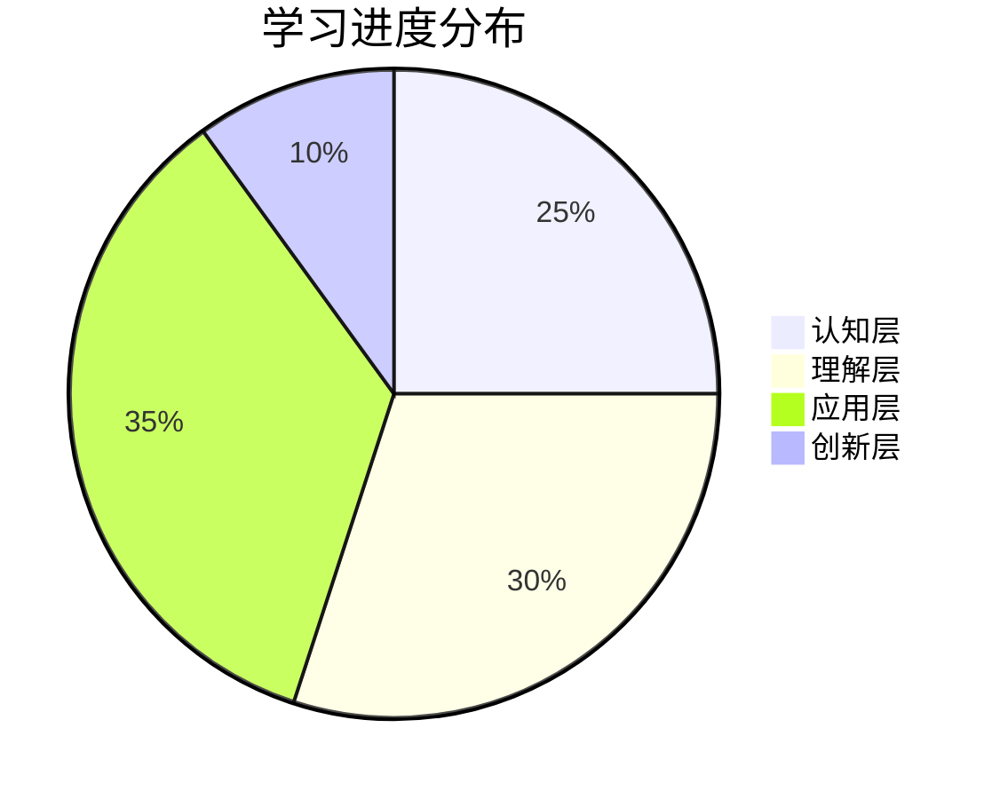
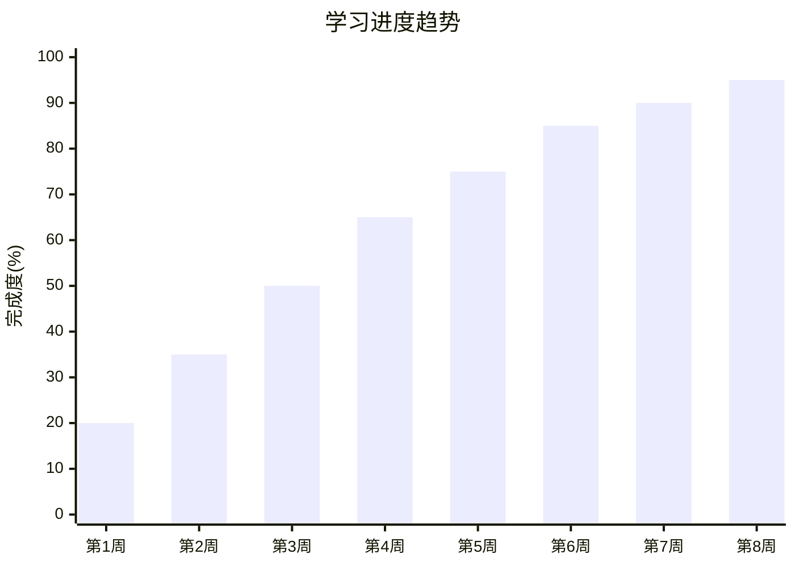
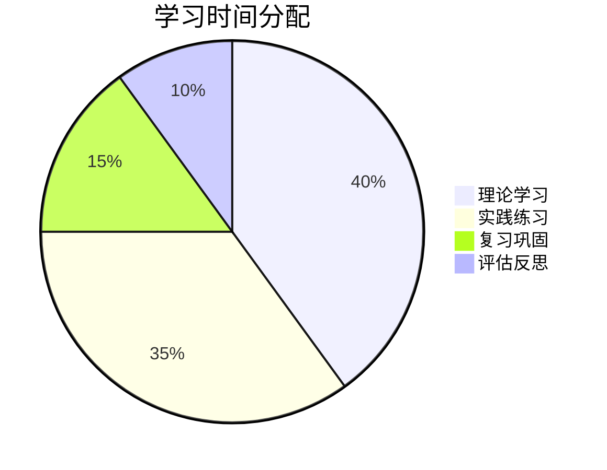
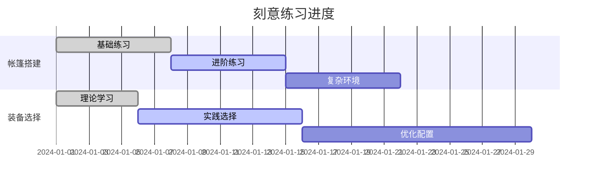

# 学习进度追踪

## 📊 学习进度总览

### 🎯 整体进度

### 📈 进度趋势

## 📋 各层次学习进度

### 01-认知层-基础概念
| 模块 | 学习状态 | 完成度 | 学习时间 | 评估结果 | 下一步 |
|------|----------|--------|----------|----------|--------|
| **露营概述** | ✅ 已完成 | 100% | 3天 | 优秀 | 进入理解层 |
| **露营分类** | ✅ 已完成 | 100% | 2天 | 优秀 | 进入理解层 |
| **历史与文化** | ✅ 已完成 | 100% | 4天 | 良好 | 进入理解层 |
| **价值与意义** | ✅ 已完成 | 100% | 3天 | 优秀 | 进入理解层 |

### 02-理解层-原理机制
| 模块 | 学习状态 | 完成度 | 学习时间 | 评估结果 | 下一步 |
|------|----------|--------|----------|----------|--------|
| **户外生存原理** | 🔄 进行中 | 80% | 5天 | 良好 | 继续学习 |
| **装备选择原理** | ⏳ 待开始 | 0% | - | - | 准备开始 |
| **安全防护机制** | ⏳ 待开始 | 0% | - | - | 准备开始 |
| **环境保护理念** | ⏳ 待开始 | 0% | - | - | 准备开始 |

### 03-应用层-实践技能
| 模块 | 学习状态 | 完成度 | 学习时间 | 评估结果 | 下一步 |
|------|----------|--------|----------|----------|--------|
| **装备准备** | ⏳ 待开始 | 0% | - | - | 等待理解层完成 |
| **营地建设** | ⏳ 待开始 | 0% | - | - | 等待理解层完成 |
| **野外生存** | ⏳ 待开始 | 0% | - | - | 等待理解层完成 |
| **应急处理** | ⏳ 待开始 | 0% | - | - | 等待理解层完成 |

### 04-创新层-进阶发展
| 模块 | 学习状态 | 完成度 | 学习时间 | 评估结果 | 下一步 |
|------|----------|--------|----------|----------|--------|
| **高级技巧** | ⏳ 待开始 | 0% | - | - | 等待应用层完成 |
| **专业配置** | ⏳ 待开始 | 0% | - | - | 等待应用层完成 |
| **领导力培养** | ⏳ 待开始 | 0% | - | - | 等待应用层完成 |
| **文化传承** | ⏳ 待开始 | 0% | - | - | 等待应用层完成 |

## 🎯 学习目标追踪

### 📅 短期目标（1-3个月）
- [ ] 完成认知层学习（100%）
- [ ] 完成理解层学习（20%）
- [ ] 开始应用层学习（0%）
- [ ] 完成基础技能练习（0%）

### 📅 中期目标（3-6个月）
- [ ] 完成应用层学习（0%）
- [ ] 掌握基础露营技能（0%）
- [ ] 完成实践项目（0%）
- [ ] 获得基础认证（0%）

### 📅 长期目标（6-12个月）
- [ ] 完成创新层学习（0%）
- [ ] 掌握高级技能（0%）
- [ ] 具备教学能力（0%）
- [ ] 获得专业认证（0%）

## 📊 技能掌握度评估

### 🔧 基础技能
| 技能名称 | 理论掌握 | 实践能力 | 综合评分 | 改进建议 |
|----------|----------|----------|----------|----------|
| **帐篷搭建** | 90% | 60% | 75% | 增加实践练习 |
| **装备选择** | 85% | 70% | 77% | 多接触实际装备 |
| **营地选址** | 80% | 50% | 65% | 实地考察练习 |
| **安全防护** | 95% | 80% | 87% | 保持良好状态 |

### 🏃‍♂️ 进阶技能
| 技能名称 | 理论掌握 | 实践能力 | 综合评分 | 改进建议 |
|----------|----------|----------|----------|----------|
| **野外生存** | 70% | 30% | 50% | 需要大量实践 |
| **应急处理** | 75% | 40% | 57% | 参加培训课程 |
| **团队协作** | 60% | 50% | 55% | 多参与团队活动 |
| **领导力** | 50% | 20% | 35% | 需要系统学习 |

## 📈 学习效率分析

### ⏰ 时间分配

### 📊 学习效果
| 学习方式 | 时间投入 | 效果评分 | 效率指数 | 建议调整 |
|----------|----------|----------|----------|----------|
| **阅读教材** | 30% | 8/10 | 2.4 | 保持现状 |
| **观看视频** | 25% | 7/10 | 1.75 | 增加实践 |
| **实践练习** | 35% | 9/10 | 3.15 | 增加时间 |
| **讨论交流** | 10% | 6/10 | 0.6 | 增加频率 |

## 🎓 费曼学习法进度

### 📝 概念解释记录
| 概念名称 | 解释次数 | 理解程度 | 改进次数 | 最终评分 |
|----------|----------|----------|----------|----------|
| **露营定义** | 3次 | 95% | 1次 | 优秀 |
| **生存原理** | 2次 | 80% | 2次 | 良好 |
| **装备选择** | 1次 | 70% | 1次 | 中等 |
| **安全防护** | 2次 | 85% | 1次 | 良好 |

### 🔄 学习循环记录
| 学习周期 | 选择概念 | 教授他人 | 回顾简化 | 组织优化 | 整体评分 |
|----------|----------|----------|----------|----------|----------|
| **第1周** | 露营概述 | 完成 | 完成 | 完成 | 优秀 |
| **第2周** | 露营分类 | 完成 | 完成 | 完成 | 优秀 |
| **第3周** | 历史文化 | 完成 | 完成 | 完成 | 良好 |
| **第4周** | 价值意义 | 完成 | 完成 | 完成 | 优秀 |

## 🏃‍♂️ 刻意练习记录

### 🎯 练习目标设定
| 技能领域 | 当前水平 | 目标水平 | 练习计划 | 预计时间 |
|----------|----------|----------|----------|----------|
| **帐篷搭建** | 初级 | 中级 | 每日30分钟 | 2周 |
| **装备选择** | 初级 | 中级 | 每周2小时 | 1个月 |
| **营地建设** | 入门 | 初级 | 每周3小时 | 3周 |
| **应急处理** | 入门 | 初级 | 每周1小时 | 2个月 |

### 📊 练习效果追踪

## 📋 学习反思记录

### 💭 每周反思
| 周次 | 学习内容 | 主要收获 | 遇到问题 | 改进措施 | 下周计划 |
|------|----------|----------|----------|----------|----------|
| **第1周** | 露营概述 | 建立基础概念 | 概念理解不够深入 | 增加实践案例 | 学习分类 |
| **第2周** | 露营分类 | 理解分类逻辑 | 分类标准模糊 | 制作对比表格 | 学习历史 |
| **第3周** | 历史文化 | 了解发展脉络 | 文化内涵理解困难 | 阅读相关书籍 | 学习价值 |
| **第4周** | 价值意义 | 认识多重价值 | 价值层次不清 | 制作价值地图 | 进入理解层 |

### 🔍 深度反思
- **学习方式**：理论学习效果良好，实践练习需要加强
- **时间管理**：学习时间分配合理，但效率有待提升
- **知识连接**：知识点连接不够紧密，需要加强整合
- **技能应用**：理论掌握较好，但实际应用能力不足

## 🎯 下一步行动计划

### 📅 近期计划（1-2周）
1. **完成理解层学习**：重点学习户外生存原理
2. **增加实践练习**：帐篷搭建技能强化
3. **完善知识连接**：建立知识点间的联系
4. **准备应用层**：为实践技能学习做准备

### 📅 中期计划（1-2个月）
1. **进入应用层**：开始实践技能学习
2. **技能强化**：重点练习基础技能
3. **实践项目**：完成第一个实践项目
4. **能力评估**：进行全面的能力评估

### 📅 长期计划（3-6个月）
1. **技能进阶**：掌握中级技能
2. **实践应用**：参与实际露营活动
3. **知识创新**：开始创新层学习
4. **能力认证**：获得相关认证

## 📊 学习数据统计

### 📈 学习时间统计
| 时间段 | 学习时长 | 学习内容 | 学习效果 |
|--------|----------|----------|----------|
| **第1周** | 15小时 | 露营概述 | 优秀 |
| **第2周** | 12小时 | 露营分类 | 优秀 |
| **第3周** | 18小时 | 历史文化 | 良好 |
| **第4周** | 14小时 | 价值意义 | 优秀 |
| **总计** | 59小时 | 认知层完成 | 优秀 |

### 🎯 目标达成率
- **认知层目标**：100% ✅
- **理解层目标**：20% 🔄
- **应用层目标**：0% ⏳
- **创新层目标**：0% ⏳

## 🔗 相关链接
- [[00-露营知识体系总览|知识体系总览]]
- [[01-学习路径指南|学习路径指南]]
- [[02-知识地图|知识地图]]
- [[03-资源索引|资源索引]]