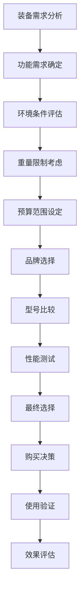

# 功能分类与选择

## 🎯 装备功能分类

### 1. 庇护所装备
- **帐篷**：主要庇护所、防风防雨、隐私保护
- **天幕**：辅助庇护、遮阳遮雨、活动空间
- **吊床**：轻便住宿、离地防潮、舒适体验
- **地布**：地面保护、防潮防污、延长寿命
- **睡袋**：保暖睡眠、温度调节、舒适度
- **防潮垫**：地面隔离、保温隔热、舒适缓冲

### 2. 炊事装备
- **炉具**：烹饪加热、燃料效率、便携性
- **锅具**：食物烹饪、容量选择、材质性能
- **餐具**：用餐工具、清洁卫生、便携性
- **水具**：储水容器、保温性能、容量选择
- **燃料**：能源供应、燃烧效率、储存安全
- **清洁用品**：清洁工具、卫生维护、环保考虑

### 3. 照明装备
- **头灯**：双手自由、定向照明、电池续航
- **手电筒**：便携照明、远距离照明、应急备用
- **营地灯**：环境照明、氛围营造、长时间使用
- **信号灯**：应急信号、位置标识、安全警示
- **电池**：能源供应、续航能力、环保处理
- **充电设备**：能源补充、便携充电、太阳能利用

### 4. 导航装备
- **地图**：路线规划、地形识别、纸质备份
- **指南针**：方向识别、磁偏角、可靠性
- **GPS设备**：精确定位、轨迹记录、数据存储
- **手机应用**：多功能导航、实时更新、社交功能
- **对讲机**：团队通讯、距离限制、电池续航
- **卫星电话**：远程通讯、应急联系、覆盖范围

## 🔧 装备选择原则

### 1. 功能优先原则
- **核心功能**：满足基本需求、功能可靠、性能稳定
- **辅助功能**：增强体验、提高效率、增加便利
- **多功能性**：一物多用、减少重量、节省空间
- **功能平衡**：功能与重量的平衡、性能与价格的平衡

### 2. 环境适应原则
- **温度适应**：保暖性能、散热性能、温度范围
- **湿度适应**：防潮性能、透气性能、干燥能力
- **风力适应**：抗风性能、稳定性、安全性
- **地形适应**：适应性、耐用性、稳定性

### 3. 重量优化原则
- **轻量化**：减少重量、提高便携性、降低疲劳
- **重量分布**：合理分配、平衡负载、舒适性
- **重量与性能**：性能不降低、重量最小化、性价比
- **重量管理**：总重量控制、个人承受能力、团队协调

### 4. 耐用性原则
- **材质选择**：强度、韧性、耐候性、使用寿命
- **工艺质量**：制作工艺、细节处理、质量控制
- **维护保养**：易维护、易修复、维护成本
- **品牌信誉**：品牌历史、用户评价、售后服务

## 📊 装备选择决策矩阵

| 装备类型 | 功能重要性 | 重量影响 | 价格范围 | 使用频率 | 推荐优先级 |
|----------|------------|----------|----------|----------|------------|
| **帐篷** | ⭐⭐⭐⭐⭐ | ⭐⭐⭐⭐ | 中-高 | 高 | 最高 |
| **睡袋** | ⭐⭐⭐⭐⭐ | ⭐⭐⭐ | 中-高 | 高 | 最高 |
| **炉具** | ⭐⭐⭐⭐ | ⭐⭐ | 中 | 高 | 高 |
| **头灯** | ⭐⭐⭐⭐ | ⭐ | 低-中 | 高 | 高 |
| **地图** | ⭐⭐⭐⭐⭐ | ⭐ | 低 | 中 | 高 |
| **天幕** | ⭐⭐⭐ | ⭐⭐ | 中 | 中 | 中 |

## 🎯 装备选择流程

## 🎓 费曼学习法应用

### 第一步：选择概念
选择"功能分类与选择"作为学习概念

### 第二步：教授他人
用简单语言解释：
> "装备选择要考虑功能需求：庇护所装备提供住宿，炊事装备提供食物，照明装备提供光线，导航装备提供方向。选择时要平衡功能、重量、价格和耐用性。"

### 第三步：回顾简化
- **功能分类**：庇护所、炊事、照明、导航
- **选择原则**：功能优先、环境适应、重量优化、耐用性
- **决策流程**：需求分析、条件评估、比较选择、验证评估

### 第四步：组织优化
建立装备与技能的关系：
- 庇护所装备 → [[03-应用层-实践技能/02-营地建设/02-帐篷搭建技术|帐篷搭建]]
- 炊事装备 → [[03-应用层-实践技能/02-营地建设/03-篝火建设与管理|篝火管理]]
- 照明装备 → [[03-应用层-实践技能/01-装备准备|装备准备]]
- 导航装备 → [[03-应用层-实践技能/03-野外生存/01-方向识别技能|方向识别]]

## 🏃‍♂️ 刻意练习要点

### 装备选择练习
1. **需求分析**：分析具体装备需求
2. **市场调研**：调研装备市场信息
3. **性能比较**：比较不同装备性能
4. **实际测试**：实际测试装备性能

### 实践验证
- **装备使用**：实际使用装备
- **性能评估**：评估装备性能
- **问题识别**：识别装备问题
- **改进建议**：提出改进建议

## 🔗 装备与技能的关系

### 庇护所装备技能
- **帐篷选择**：[[03-应用层-实践技能/01-装备准备/03-帐篷搭建技巧|帐篷搭建]]
- **睡袋选择**：[[03-应用层-实践技能/01-装备准备/02-服装选择与搭配|服装选择]]
- **地布使用**：[[03-应用层-实践技能/02-营地建设/01-营地选址原则|营地选址]]
- **防潮垫**：[[03-应用层-实践技能/02-营地建设/04-营地布局与规划|营地布局]]

### 炊事装备技能
- **炉具使用**：[[03-应用层-实践技能/02-营地建设/03-篝火建设与管理|篝火管理]]
- **锅具选择**：[[03-应用层-实践技能/03-野外生存/03-食物获取技能|食物获取]]
- **燃料管理**：[[03-应用层-实践技能/01-装备准备/05-燃料与能源|燃料管理]]
- **清洁维护**：[[04-创新层-进阶发展/02-专业配置/04-维护保养体系|维护保养]]

### 照明装备技能
- **头灯使用**：[[03-应用层-实践技能/01-装备准备|装备准备]]
- **电池管理**：[[03-应用层-实践技能/01-装备准备/05-燃料与能源|能源管理]]
- **照明策略**：[[03-应用层-实践技能/02-营地建设/04-营地布局与规划|营地布局]]
- **应急照明**：[[03-应用层-实践技能/04-应急处理|应急处理]]

### 导航装备技能
- **地图使用**：[[03-应用层-实践技能/03-野外生存/01-方向识别技能|方向识别]]
- **GPS操作**：[[04-创新层-进阶发展/02-专业配置/03-技术装备集成|技术集成]]
- **通讯技能**：[[03-应用层-实践技能/03-野外生存/06-信号与求救|信号求救]]
- **应急通讯**：[[03-应用层-实践技能/04-应急处理|应急处理]]

## 📋 装备选择检查清单

### 需求分析
- [ ] 确定装备功能需求
- [ ] 评估环境使用条件
- [ ] 考虑重量限制
- [ ] 设定预算范围

### 市场调研
- [ ] 调研品牌信息
- [ ] 比较型号性能
- [ ] 查看用户评价
- [ ] 了解售后服务

### 性能测试
- [ ] 测试基本功能
- [ ] 评估性能表现
- [ ] 检查质量工艺
- [ ] 验证耐用性

### 使用验证
- [ ] 实际使用测试
- [ ] 性能效果评估
- [ ] 问题识别记录
- [ ] 改进建议提出

## 🎯 装备选择策略

### 系统性选择
1. **整体规划**：制定装备整体规划
2. **分类选择**：按功能分类选择
3. **协调搭配**：装备间协调搭配
4. **持续优化**：持续优化装备配置

### 个性化选择
- **个人需求**：根据个人需求选择
- **使用习惯**：考虑使用习惯
- **技能水平**：匹配技能水平
- **预算限制**：考虑预算限制

## 🔗 相关链接
- [[02-材质与性能|材质与性能]]
- [[03-重量与便携性|重量与便携性]]
- [[04-性价比分析|性价比分析]]
- [[03-应用层-实践技能/01-装备准备|装备准备]]
