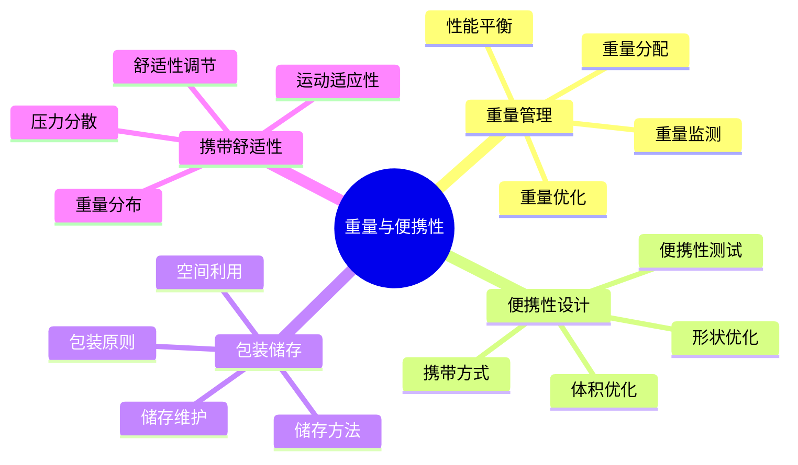

# 重量与便携性

## ⚖️ 重量管理原理

### 1. 重量分配原则
- **核心装备**：帐篷、睡袋、背包等核心装备重量控制
- **辅助装备**：炊具、照明、工具等辅助装备轻量化
- **消耗品**：食物、燃料、水等消耗品重量管理
- **个人物品**：服装、个人用品等个人物品精简

### 2. 重量优化策略
- **多功能装备**：一物多用，减少装备数量
- **轻量化材质**：选择轻量化材质，降低装备重量
- **模块化设计**：模块化装备，按需携带
- **精简原则**：只带必需品，去除非必需品

### 3. 重量与性能平衡
- **性能不降低**：轻量化不能以牺牲性能为代价
- **安全性保证**：轻量化不能影响安全性
- **耐用性考虑**：轻量化不能影响耐用性
- **成本控制**：轻量化不能过度增加成本

### 4. 重量监测方法
- **装备称重**：精确称量每件装备重量
- **总重控制**：控制总重量在合理范围内
- **重量记录**：记录装备重量变化
- **优化调整**：根据使用情况优化重量

## 🎒 便携性设计

### 1. 体积优化
- **折叠设计**：可折叠装备，减少占用空间
- **压缩设计**：可压缩装备，提高空间利用率
- **嵌套设计**：装备嵌套，减少空间浪费
- **模块化**：模块化设计，灵活组合

### 2. 形状优化
- **流线型设计**：减少空气阻力，提高携带效率
- **人体工学**：符合人体工学，提高舒适性
- **紧凑型设计**：紧凑型设计，减少空间占用
- **多功能形状**：多功能形状，一物多用

### 3. 携带方式
- **背包携带**：主要携带方式，重量分布合理
- **腰包携带**：小件物品携带，方便取用
- **外挂携带**：大件物品外挂，减少背包负担
- **分散携带**：团队分散携带，减轻个人负担

### 4. 便携性测试
- **体积测试**：测试装备体积大小
- **重量测试**：测试装备重量
- **携带测试**：测试携带舒适性
- **使用测试**：测试使用便利性

## 📦 包装与储存

### 1. 包装原则
- **防水包装**：重要装备防水包装
- **防震包装**：易碎装备防震包装
- **分类包装**：按功能分类包装
- **标识包装**：清晰标识包装内容

### 2. 储存方法
- **干燥储存**：保持干燥环境储存
- **通风储存**：保持通风环境储存
- **避光储存**：避免阳光直射储存
- **定期检查**：定期检查储存状态

### 3. 空间利用
- **立体利用**：充分利用立体空间
- **空隙填充**：填充装备间空隙
- **分层储存**：分层储存不同类型装备
- **动态调整**：根据使用情况动态调整

### 4. 储存维护
- **定期清洁**：定期清洁储存环境
- **防虫防鼠**：防止虫鼠侵害
- **温度控制**：控制储存温度
- **湿度控制**：控制储存湿度

## 🚶‍♂️ 携带舒适性

### 1. 重量分布
- **重心位置**：合理控制重心位置
- **重量平衡**：左右重量平衡
- **前后平衡**：前后重量平衡
- **动态平衡**：运动时保持平衡

### 2. 压力分散
- **肩部压力**：分散肩部压力
- **腰部压力**：分散腰部压力
- **背部压力**：分散背部压力
- **压力点**：避免压力集中点

### 3. 运动适应性
- **活动自由度**：保证活动自由度
- **呼吸顺畅**：保证呼吸顺畅
- **血液循环**：保证血液循环
- **肌肉疲劳**：减少肌肉疲劳

### 4. 舒适性调节
- **长度调节**：调节背带长度
- **松紧调节**：调节背带松紧
- **位置调节**：调节装备位置
- **角度调节**：调节装备角度

## 📊 重量便携性对比

| 装备类型 | 重量等级 | 便携性 | 舒适性 | 适用场景 | 推荐指数 |
|----------|----------|--------|--------|----------|----------|
| **超轻装备** | 极轻 | 极高 | 中 | 长距离徒步 | ⭐⭐⭐⭐⭐ |
| **轻量装备** | 轻 | 高 | 高 | 中距离徒步 | ⭐⭐⭐⭐ |
| **标准装备** | 中 | 中 | 高 | 短距离徒步 | ⭐⭐⭐ |
| **重型装备** | 重 | 低 | 中 | 基地露营 | ⭐⭐ |

## 🎯 重量便携性优化

## 🎓 费曼学习法应用

### 第一步：选择概念
选择"重量与便携性"作为学习概念

### 第二步：教授他人
用简单语言解释：
> "装备重量影响携带舒适性：重量要合理分配，便携性要优化设计，包装要便于储存，携带要舒适。轻量化不能牺牲性能和安全性。"

### 第三步：回顾简化
- **重量管理**：重量分配、优化策略、性能平衡
- **便携性设计**：体积优化、形状优化、携带方式
- **包装储存**：包装原则、储存方法、空间利用
- **携带舒适性**：重量分布、压力分散、运动适应

### 第四步：组织优化
建立重量与技能的关系：
- 重量管理 → [[03-应用层-实践技能/01-装备准备|装备准备]]
- 便携性设计 → [[04-创新层-进阶发展/02-专业配置/02-定制化配置|定制配置]]
- 包装储存 → [[04-创新层-进阶发展/02-专业配置/04-维护保养体系|维护保养]]
- 携带舒适性 → [[03-应用层-实践技能/03-野外生存|野外生存]]

## 🏃‍♂️ 刻意练习要点

### 重量管理练习
1. **重量测量**：精确测量装备重量
2. **重量分配**：合理分配装备重量
3. **重量优化**：优化装备重量配置
4. **重量监测**：监测重量变化

### 实践验证
- **携带测试**：测试携带舒适性
- **使用体验**：体验使用便利性
- **性能评估**：评估性能影响
- **优化调整**：根据体验优化

## 🔗 重量与技能的关系

### 重量管理技能
- **装备选择**：[[03-应用层-实践技能/01-装备准备|装备准备]]
- **重量控制**：[[04-创新层-进阶发展/02-专业配置/02-定制化配置|定制配置]]
- **性能平衡**：[[04-创新层-进阶发展/02-专业配置/01-专业装备推荐|专业装备]]
- **成本控制**：[[04-创新层-进阶发展/02-专业配置/06-成本效益分析|成本分析]]

### 便携性技能
- **空间利用**：[[03-应用层-实践技能/01-装备准备|装备准备]]
- **包装技巧**：[[04-创新层-进阶发展/02-专业配置/04-维护保养体系|维护保养]]
- **携带技巧**：[[03-应用层-实践技能/03-野外生存|野外生存]]
- **储存技巧**：[[04-创新层-进阶发展/02-专业配置/04-维护保养体系|维护保养]]

### 舒适性技能
- **重量分布**：[[03-应用层-实践技能/03-野外生存|野外生存]]
- **压力分散**：[[03-应用层-实践技能/03-野外生存|野外生存]]
- **运动适应**：[[02-理解层-原理机制/01-户外生存原理/01-人体生理适应|人体适应]]
- **舒适调节**：[[03-应用层-实践技能/03-野外生存|野外生存]]

### 优化技能
- **性能优化**：[[04-创新层-进阶发展/02-专业配置/05-升级优化策略|升级优化]]
- **成本优化**：[[04-创新层-进阶发展/02-专业配置/06-成本效益分析|成本分析]]
- **空间优化**：[[03-应用层-实践技能/01-装备准备|装备准备]]
- **时间优化**：[[04-创新层-进阶发展/03-领导力培养/02-时间管理技能|时间管理]]

## 📋 重量便携性检查清单

### 重量管理
- [ ] 测量装备重量
- [ ] 合理分配重量
- [ ] 优化重量配置
- [ ] 监测重量变化

### 便携性设计
- [ ] 优化装备体积
- [ ] 改进装备形状
- [ ] 选择携带方式
- [ ] 测试便携性

### 包装储存
- [ ] 合理包装装备
- [ ] 优化储存方法
- [ ] 提高空间利用率
- [ ] 维护储存环境

### 携带舒适性
- [ ] 合理分布重量
- [ ] 分散压力点
- [ ] 保证运动自由
- [ ] 调节舒适性

## 🎯 重量便携性策略

### 渐进式优化
1. **基础优化**：从基础装备开始优化
2. **逐步改进**：逐步改进装备配置
3. **持续优化**：持续优化重量便携性
4. **全面评估**：全面评估优化效果

### 系统化优化
- **重量优化**：系统性重量优化
- **便携性优化**：系统性便携性优化
- **舒适性优化**：系统性舒适性优化
- **性能优化**：系统性性能优化

## 🔗 相关链接
- [[01-功能分类与选择|功能分类与选择]]
- [[02-材质与性能|材质与性能]]
- [[04-性价比分析|性价比分析]]
- [[03-应用层-实践技能/01-装备准备|装备准备]]