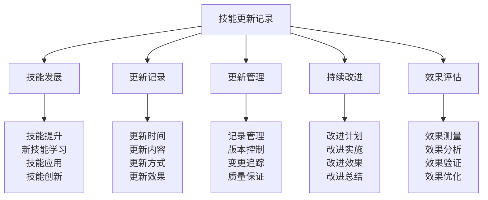

# 技能更新记录

## 📈 技能更新记录核心框架

### 技能更新金字塔

## 🚀 技能发展体系

### 技能提升发展
| 提升要素 | 提升内容 | 提升方法 | 提升标准 | 提升效果 |
|----------|----------|----------|----------|----------|
| **基础技能** | 基础技能提升 | 基础训练 | 技能熟练 | 提升有效 |
| **专业技能** | 专业技能提升 | 专业训练 | 技能精通 | 提升有效 |
| **高级技能** | 高级技能提升 | 高级训练 | 技能专家 | 提升有效 |
| **综合技能** | 综合技能提升 | 综合训练 | 技能全面 | 提升有效 |
| **创新技能** | 创新技能提升 | 创新训练 | 技能创新 | 提升有效 |

### 新技能学习发展
| 学习要素 | 学习内容 | 学习方法 | 学习标准 | 学习效果 |
|----------|----------|----------|----------|----------|
| **理论学习** | 新技能理论学习 | 理论学习 | 理论掌握 | 学习有效 |
| **实践学习** | 新技能实践学习 | 实践学习 | 实践掌握 | 学习有效 |
| **案例学习** | 新技能案例学习 | 案例学习 | 案例掌握 | 学习有效 |
| **经验学习** | 新技能经验学习 | 经验学习 | 经验掌握 | 学习有效 |
| **创新学习** | 新技能创新学习 | 创新学习 | 创新掌握 | 学习有效 |

### 技能应用发展
| 应用要素 | 应用内容 | 应用方法 | 应用标准 | 应用效果 |
|----------|----------|----------|----------|----------|
| **实际应用** | 技能实际应用 | 实际应用 | 应用有效 | 应用成功 |
| **创新应用** | 技能创新应用 | 创新应用 | 应用创新 | 应用成功 |
| **综合应用** | 技能综合应用 | 综合应用 | 应用综合 | 应用成功 |
| **团队应用** | 技能团队应用 | 团队应用 | 应用协作 | 应用成功 |
| **社会应用** | 技能社会应用 | 社会应用 | 应用价值 | 应用成功 |

### 技能创新发展
| 创新要素 | 创新内容 | 创新方法 | 创新标准 | 创新效果 |
|----------|----------|----------|----------|----------|
| **方法创新** | 技能方法创新 | 方法创新 | 创新有效 | 创新成功 |
| **工具创新** | 技能工具创新 | 工具创新 | 创新有效 | 创新成功 |
| **应用创新** | 技能应用创新 | 应用创新 | 创新有效 | 创新成功 |
| **理论创新** | 技能理论创新 | 理论创新 | 创新有效 | 创新成功 |
| **文化创新** | 技能文化创新 | 文化创新 | 创新有效 | 创新成功 |

## 📝 更新记录体系

### 更新时间记录
| 时间要素 | 时间内容 | 时间特点 | 时间标准 | 时间效果 |
|----------|----------|----------|----------|----------|
| **学习时间** | 技能学习时间 | 时间充分 | 时间合理 | 学习有效 |
| **练习时间** | 技能练习时间 | 时间充分 | 时间合理 | 练习有效 |
| **应用时间** | 技能应用时间 | 时间充分 | 时间合理 | 应用有效 |
| **创新时间** | 技能创新时间 | 时间充分 | 时间合理 | 创新有效 |
| **总结时间** | 技能总结时间 | 时间充分 | 时间合理 | 总结有效 |

### 更新内容记录
| 内容要素 | 内容详情 | 内容特点 | 内容标准 | 内容效果 |
|----------|----------|----------|----------|----------|
| **技能内容** | 具体技能内容 | 内容详细 | 内容准确 | 记录有效 |
| **方法内容** | 技能方法内容 | 内容详细 | 内容准确 | 记录有效 |
| **工具内容** | 技能工具内容 | 内容详细 | 内容准确 | 记录有效 |
| **经验内容** | 技能经验内容 | 内容详细 | 内容准确 | 记录有效 |
| **创新内容** | 技能创新内容 | 内容详细 | 内容准确 | 记录有效 |

### 更新方式记录
| 方式要素 | 方式内容 | 方式特点 | 方式标准 | 方式效果 |
|----------|----------|----------|----------|----------|
| **学习方式** | 技能学习方式 | 方式有效 | 方式科学 | 更新有效 |
| **练习方式** | 技能练习方式 | 方式有效 | 方式科学 | 更新有效 |
| **应用方式** | 技能应用方式 | 方式有效 | 方式科学 | 更新有效 |
| **创新方式** | 技能创新方式 | 方式有效 | 方式科学 | 更新有效 |
| **总结方式** | 技能总结方式 | 方式有效 | 方式科学 | 更新有效 |

### 更新效果记录
| 效果要素 | 效果内容 | 效果特点 | 效果标准 | 效果价值 |
|----------|----------|----------|----------|----------|
| **学习效果** | 技能学习效果 | 效果良好 | 效果达标 | 价值很高 |
| **练习效果** | 技能练习效果 | 效果良好 | 效果达标 | 价值很高 |
| **应用效果** | 技能应用效果 | 效果良好 | 效果达标 | 价值很高 |
| **创新效果** | 技能创新效果 | 效果良好 | 效果达标 | 价值较高 |
| **总结效果** | 技能总结效果 | 效果良好 | 效果达标 | 价值很高 |

## 🛠️ 更新管理体系

### 记录管理方式
| 管理要素 | 管理内容 | 管理方法 | 管理标准 | 管理效果 |
|----------|----------|----------|----------|----------|
| **记录规范** | 记录规范管理 | 规范制定 | 规范完善 | 管理有效 |
| **记录质量** | 记录质量管理 | 质量控制 | 质量保证 | 管理有效 |
| **记录完整** | 记录完整管理 | 完整性检查 | 记录完整 | 管理有效 |
| **记录及时** | 记录及时管理 | 及时性检查 | 记录及时 | 管理有效 |
| **记录准确** | 记录准确管理 | 准确性检查 | 记录准确 | 管理有效 |

### 版本控制管理
| 控制要素 | 控制内容 | 控制方法 | 控制标准 | 控制效果 |
|----------|----------|----------|----------|----------|
| **版本标识** | 版本标识控制 | 标识规范 | 标识清晰 | 控制有效 |
| **版本历史** | 版本历史控制 | 历史记录 | 历史完整 | 控制有效 |
| **版本比较** | 版本比较控制 | 比较分析 | 比较准确 | 控制有效 |
| **版本回滚** | 版本回滚控制 | 回滚机制 | 回滚可靠 | 控制有效 |
| **版本合并** | 版本合并控制 | 合并机制 | 合并有效 | 控制有效 |

### 变更追踪管理
| 追踪要素 | 追踪内容 | 追踪方法 | 追踪标准 | 追踪效果 |
|----------|----------|----------|----------|----------|
| **变更记录** | 变更记录追踪 | 记录追踪 | 记录完整 | 追踪有效 |
| **变更原因** | 变更原因追踪 | 原因分析 | 原因明确 | 追踪有效 |
| **变更影响** | 变更影响追踪 | 影响分析 | 影响明确 | 追踪有效 |
| **变更效果** | 变更效果追踪 | 效果评估 | 效果明确 | 追踪有效 |
| **变更优化** | 变更优化追踪 | 优化分析 | 优化有效 | 追踪有效 |

### 质量保证管理
| 保证要素 | 保证内容 | 保证方法 | 保证标准 | 保证效果 |
|----------|----------|----------|----------|----------|
| **内容质量** | 内容质量保证 | 质量检查 | 质量达标 | 保证有效 |
| **格式质量** | 格式质量保证 | 格式检查 | 格式规范 | 保证有效 |
| **逻辑质量** | 逻辑质量保证 | 逻辑检查 | 逻辑清晰 | 保证有效 |
| **实用质量** | 实用质量保证 | 实用检查 | 实用有效 | 保证有效 |
| **创新质量** | 创新质量保证 | 创新检查 | 创新有效 | 保证有效 |

## 🔄 持续改进体系

### 改进计划制定
| 计划要素 | 计划内容 | 计划方法 | 计划标准 | 计划效果 |
|----------|----------|----------|----------|----------|
| **改进目标** | 改进目标制定 | 目标设定 | 目标明确 | 计划有效 |
| **改进策略** | 改进策略制定 | 策略设计 | 策略合理 | 计划有效 |
| **改进步骤** | 改进步骤制定 | 步骤规划 | 步骤清晰 | 计划有效 |
| **改进资源** | 改进资源制定 | 资源配置 | 资源充足 | 计划有效 |
| **改进时间** | 改进时间制定 | 时间规划 | 时间合理 | 计划有效 |

### 改进实施管理
| 实施要素 | 实施内容 | 实施方法 | 实施标准 | 实施效果 |
|----------|----------|----------|----------|----------|
| **实施执行** | 改进实施执行 | 执行管理 | 执行到位 | 实施有效 |
| **实施监控** | 改进实施监控 | 监控管理 | 监控有效 | 实施有效 |
| **实施调整** | 改进实施调整 | 调整管理 | 调整及时 | 实施有效 |
| **实施协调** | 改进实施协调 | 协调管理 | 协调有效 | 实施有效 |
| **实施支持** | 改进实施支持 | 支持管理 | 支持充分 | 实施有效 |

### 改进效果评估
| 评估要素 | 评估内容 | 评估方法 | 评估标准 | 评估效果 |
|----------|----------|----------|----------|----------|
| **效果测量** | 改进效果测量 | 测量方法 | 测量准确 | 评估有效 |
| **效果分析** | 改进效果分析 | 分析方法 | 分析深入 | 评估有效 |
| **效果对比** | 改进效果对比 | 对比方法 | 对比客观 | 评估有效 |
| **效果验证** | 改进效果验证 | 验证方法 | 验证可靠 | 评估有效 |
| **效果优化** | 改进效果优化 | 优化方法 | 优化有效 | 评估有效 |

### 改进总结反思
| 总结要素 | 总结内容 | 总结方法 | 总结标准 | 总结效果 |
|----------|----------|----------|----------|----------|
| **经验总结** | 改进经验总结 | 经验分析 | 总结深入 | 总结有效 |
| **教训总结** | 改进教训总结 | 教训分析 | 总结深刻 | 总结有效 |
| **方法总结** | 改进方法总结 | 方法分析 | 总结实用 | 总结有效 |
| **创新总结** | 改进创新总结 | 创新分析 | 总结创新 | 总结有效 |
| **持续总结** | 持续改进总结 | 持续分析 | 总结持续 | 总结有效 |

## 📊 效果评估体系

### 效果测量方法
| 测量要素 | 测量内容 | 测量方法 | 测量标准 | 测量效果 |
|----------|----------|----------|----------|----------|
| **技能水平** | 技能水平测量 | 水平测试 | 测量准确 | 测量有效 |
| **应用能力** | 应用能力测量 | 能力测试 | 测量准确 | 测量有效 |
| **创新程度** | 创新程度测量 | 创新评估 | 测量准确 | 测量有效 |
| **综合能力** | 综合能力测量 | 综合测试 | 测量准确 | 测量有效 |
| **发展速度** | 发展速度测量 | 速度分析 | 测量准确 | 测量有效 |

### 效果分析方法
| 分析要素 | 分析内容 | 分析方法 | 分析标准 | 分析效果 |
|----------|----------|----------|----------|----------|
| **定量分析** | 效果定量分析 | 数据分析 | 分析准确 | 分析有效 |
| **定性分析** | 效果定性分析 | 质性分析 | 分析深入 | 分析有效 |
| **对比分析** | 效果对比分析 | 对比研究 | 分析客观 | 分析有效 |
| **趋势分析** | 效果趋势分析 | 趋势研究 | 分析准确 | 分析有效 |
| **因果分析** | 效果因果分析 | 因果研究 | 分析深入 | 分析有效 |

### 效果验证方法
| 验证要素 | 验证内容 | 验证方法 | 验证标准 | 验证效果 |
|----------|----------|----------|----------|----------|
| **自我验证** | 自我效果验证 | 自我评估 | 验证客观 | 验证有效 |
| **他人验证** | 他人效果验证 | 他人评估 | 验证客观 | 验证有效 |
| **实践验证** | 实践效果验证 | 实践测试 | 验证可靠 | 验证有效 |
| **时间验证** | 时间效果验证 | 时间测试 | 验证可靠 | 验证有效 |
| **环境验证** | 环境效果验证 | 环境测试 | 验证可靠 | 验证有效 |

### 效果优化方法
| 优化要素 | 优化内容 | 优化方法 | 优化标准 | 优化效果 |
|----------|----------|----------|----------|----------|
| **方法优化** | 技能方法优化 | 方法改进 | 优化有效 | 优化成功 |
| **工具优化** | 技能工具优化 | 工具改进 | 优化有效 | 优化成功 |
| **流程优化** | 技能流程优化 | 流程改进 | 优化有效 | 优化成功 |
| **环境优化** | 技能环境优化 | 环境改进 | 优化有效 | 优化成功 |
| **系统优化** | 技能系统优化 | 系统改进 | 优化有效 | 优化成功 |

## 🎓 费曼学习法应用

### 第一步：选择概念
选择"技能更新记录"作为学习概念

### 第二步：教授他人
用简单语言解释：
> "技能更新记录就是记录技能发展变化的过程，包括技能提升、新技能学习、技能应用、技能创新。关键是记录技能变化，管理技能更新，持续改进技能。"

### 第三步：回顾简化
- **技能发展**：技能提升、新技能学习、技能应用、技能创新
- **更新记录**：更新时间、更新内容、更新方式、更新效果
- **更新管理**：记录管理、版本控制、变更追踪、质量保证
- **持续改进**：改进计划、改进实施、改进效果、改进总结
- **效果评估**：效果测量、效果分析、效果验证、效果优化

### 第四步：组织优化
建立技能更新与技能的关系：
- 技能发展 → [[05-实践与评估/01-技能评估体系|技能评估]]
- 更新记录 → [[05-实践与评估/03-持续改进/01-学习反思模板|学习反思]]
- 更新管理 → [[05-实践与评估/03-持续改进/04-知识体系维护|体系维护]]
- 持续改进 → [[05-实践与评估/03-持续改进/03-经验总结方法|经验总结]]
- 效果评估 → [[05-实践与评估/01-技能评估体系/02-技能等级标准|技能等级]]

## 🏃‍♂️ 刻意练习要点

### 技能更新练习
1. **记录练习**：练习技能更新记录
2. **管理练习**：练习技能更新管理
3. **改进练习**：练习技能持续改进
4. **评估练习**：练习技能效果评估

### 练习方法
- **理论学习**：学习技能更新理论
- **实践记录**：实际记录技能更新
- **管理实践**：实践技能更新管理
- **效果评估**：评估技能更新效果

### 实践验证
- **记录测试**：测试技能记录能力
- **管理验证**：验证技能管理效果
- **改进评估**：评估技能改进效果
- **持续优化**：持续优化技能更新

## 📋 技能更新检查清单

### 技能发展检查
- [ ] 技能提升是否记录完整
- [ ] 新技能学习是否记录详细
- [ ] 技能应用是否记录准确
- [ ] 技能创新是否记录创新

### 更新记录检查
- [ ] 更新时间是否记录及时
- [ ] 更新内容是否记录详细
- [ ] 更新方式是否记录清楚
- [ ] 更新效果是否记录客观

### 更新管理检查
- [ ] 记录管理是否管理有效
- [ ] 版本控制是否控制有效
- [ ] 变更追踪是否追踪有效
- [ ] 质量保证是否保证有效

### 持续改进检查
- [ ] 改进计划是否计划合理
- [ ] 改进实施是否实施到位
- [ ] 改进效果是否效果良好
- [ ] 改进总结是否总结深入

### 效果评估检查
- [ ] 效果测量是否测量准确
- [ ] 效果分析是否分析深入
- [ ] 效果验证是否验证可靠
- [ ] 效果优化是否优化有效

## 🎯 技能更新策略

### 更新策略
1. **系统记录**：系统记录技能更新
2. **有效管理**：有效管理技能更新
3. **持续改进**：持续改进技能更新
4. **效果导向**：以效果为导向更新

### 发展策略
- **记录发展**：持续发展记录能力
- **管理发展**：持续发展管理能力
- **改进发展**：持续发展改进能力
- **评估发展**：持续发展评估能力

## 🔗 相关链接
- [[01-学习反思模板|学习反思模板]]
- [[03-经验总结方法|经验总结方法]]
- [[04-知识体系维护|知识体系维护]]
- [[01-技能评估体系/01-自我评估清单|自我评估清单]]
- [[01-技能评估体系/02-技能等级标准|技能等级标准]]