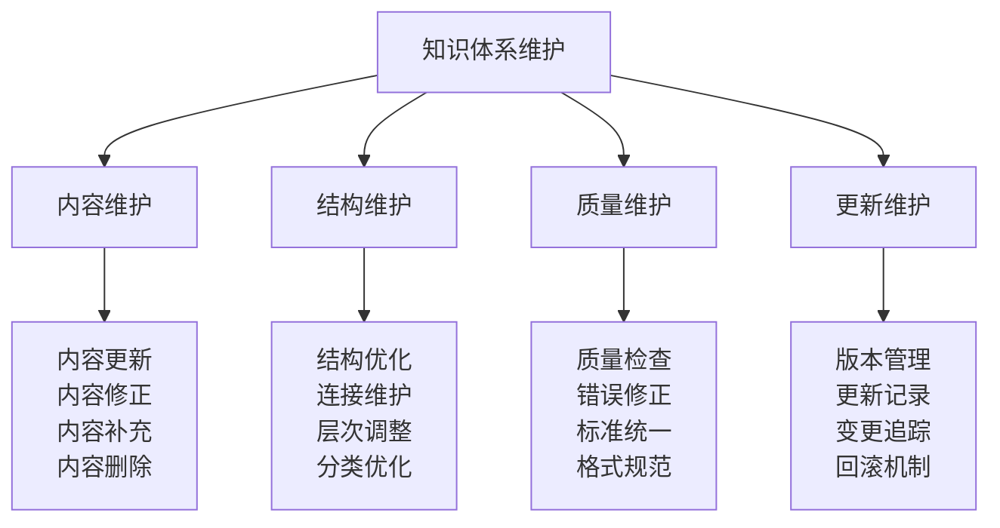
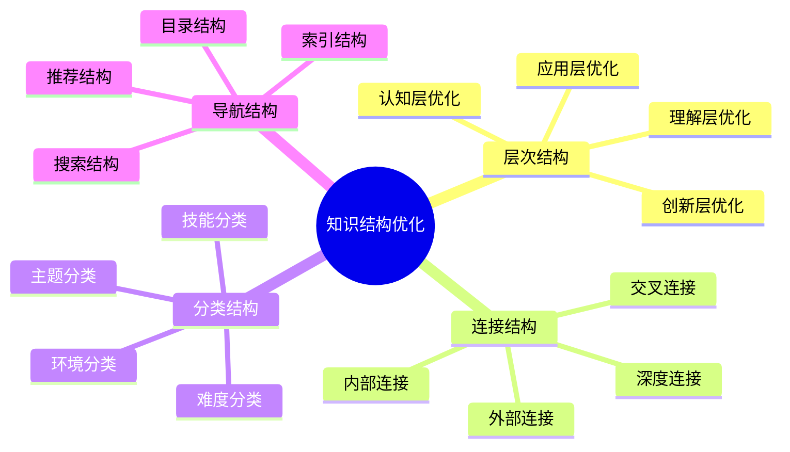
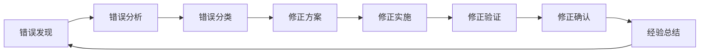

# 知识体系维护

## 🔧 知识体系维护框架

### 维护体系结构

## 📊 内容维护管理

### 内容更新策略
| 更新类型 | 更新频率 | 更新内容 | 更新标准 | 更新流程 |
|----------|----------|----------|----------|----------|
| **知识内容** | 每月 | 新知识、新技能 | 准确性、时效性 | 收集→验证→更新→审核 |
| **实践案例** | 每季度 | 新案例、新经验 | 真实性、实用性 | 收集→分析→整理→更新 |
| **技术标准** | 每年 | 新标准、新规范 | 权威性、适用性 | 研究→对比→更新→发布 |
| **文化理念** | 持续 | 新理念、新价值 | 时代性、传承性 | 研究→讨论→更新→传播 |

### 内容质量检查
| 检查维度 | 检查标准 | 检查方法 | 检查频率 | 改进措施 |
|----------|----------|----------|----------|----------|
| **准确性** | 信息准确无误 | 事实核查 | 每月 | 错误修正 |
| **完整性** | 内容完整全面 | 内容审查 | 每季度 | 内容补充 |
| **时效性** | 内容及时更新 | 时间检查 | 每月 | 内容更新 |
| **一致性** | 内容逻辑一致 | 逻辑检查 | 每季度 | 逻辑修正 |
| **实用性** | 内容实用有效 | 实践验证 | 每半年 | 实用性提升 |

## 🏗️ 结构维护管理

### 知识结构优化

### 连接维护策略
| 连接类型 | 维护内容 | 维护方法 | 维护频率 | 质量标准 |
|----------|----------|----------|----------|----------|
| **内部连接** | 知识点间连接 | 链接检查 | 每月 | 连接有效 |
| **外部连接** | 外部资源连接 | 链接验证 | 每季度 | 链接可用 |
| **交叉连接** | 跨层连接 | 连接分析 | 每季度 | 连接合理 |
| **深度连接** | 深度关联 | 关联分析 | 每半年 | 关联深入 |

### 层次结构调整
| 调整类型 | 调整内容 | 调整标准 | 调整流程 | 调整评估 |
|----------|----------|----------|----------|----------|
| **层次优化** | 层次结构优化 | 逻辑清晰 | 分析→设计→实施→评估 | 效果评估 |
| **内容迁移** | 内容层次调整 | 合理归属 | 分析→迁移→验证→确认 | 迁移效果 |
| **新增层次** | 新增知识层次 | 必要合理 | 需求分析→设计→实施 | 新增效果 |
| **层次合并** | 层次合并优化 | 避免重复 | 分析→合并→优化→验证 | 合并效果 |

## 🔍 质量维护管理

### 质量标准体系
| 质量维度 | 质量标准 | 检查方法 | 改进措施 | 持续监控 |
|----------|----------|----------|----------|----------|
| **内容质量** | 准确、完整、及时 | 内容审查 | 内容修正 | 定期检查 |
| **结构质量** | 清晰、合理、完整 | 结构分析 | 结构优化 | 持续优化 |
| **格式质量** | 统一、规范、美观 | 格式检查 | 格式统一 | 标准执行 |
| **语言质量** | 准确、清晰、易懂 | 语言检查 | 语言优化 | 语言规范 |

### 错误修正机制

### 标准统一管理
| 标准类型 | 标准内容 | 执行方法 | 检查频率 | 改进措施 |
|----------|----------|----------|----------|----------|
| **格式标准** | 文档格式统一 | 模板应用 | 每次更新 | 格式规范 |
| **语言标准** | 语言表达统一 | 语言规范 | 每次检查 | 语言优化 |
| **结构标准** | 结构层次统一 | 结构规范 | 每次调整 | 结构优化 |
| **质量标准** | 质量标准统一 | 质量检查 | 定期检查 | 质量提升 |

## 🔄 更新维护管理

### 版本控制系统
| 版本类型 | 版本号 | 更新内容 | 更新时间 | 更新原因 |
|----------|--------|----------|----------|----------|
| **主版本** | V1.0 | 初始版本 | 2024-01-01 | 体系建立 |
| **次版本** | V1.1 | 内容完善 | 2024-02-01 | 内容补充 |
| **修订版** | V1.1.1 | 错误修正 | 2024-02-15 | 错误修正 |
| **更新版** | V1.2 | 功能更新 | 2024-03-01 | 功能增强 |

### 更新记录管理
| 记录项目 | 记录内容 | 记录格式 | 记录频率 | 记录保存 |
|----------|----------|----------|----------|----------|
| **更新日志** | 更新内容记录 | 结构化记录 | 每次更新 | 永久保存 |
| **变更记录** | 变更内容记录 | 详细记录 | 每次变更 | 版本保存 |
| **回滚记录** | 回滚操作记录 | 操作记录 | 每次回滚 | 操作保存 |
| **备份记录** | 备份操作记录 | 备份记录 | 每次备份 | 备份保存 |

### 变更追踪机制

## 📈 维护效果评估

### 维护质量评估
| 评估维度 | 评估指标 | 评估方法 | 评估频率 | 改进措施 |
|----------|----------|----------|----------|----------|
| **内容质量** | 准确性、完整性 | 内容检查 | 每月 | 质量提升 |
| **结构质量** | 清晰性、合理性 | 结构分析 | 每季度 | 结构优化 |
| **更新质量** | 及时性、有效性 | 更新检查 | 每月 | 更新优化 |
| **维护效率** | 效率、效果 | 效率分析 | 每季度 | 效率提升 |

### 维护成本分析
| 成本类型 | 成本内容 | 成本计算 | 成本控制 | 成本优化 |
|----------|----------|----------|----------|----------|
| **时间成本** | 维护时间投入 | 时间统计 | 时间管理 | 效率提升 |
| **人力成本** | 维护人员投入 | 人力统计 | 人力优化 | 技能提升 |
| **技术成本** | 技术工具投入 | 技术统计 | 技术优化 | 工具升级 |
| **资源成本** | 资源消耗投入 | 资源统计 | 资源控制 | 资源优化 |

## 🎯 维护策略优化

### 预防性维护
| 维护类型 | 维护内容 | 维护方法 | 维护频率 | 维护效果 |
|----------|----------|----------|----------|----------|
| **内容预防** | 内容质量预防 | 质量检查 | 定期检查 | 质量保证 |
| **结构预防** | 结构问题预防 | 结构分析 | 定期分析 | 结构稳定 |
| **技术预防** | 技术问题预防 | 技术检查 | 定期检查 | 技术稳定 |
| **流程预防** | 流程问题预防 | 流程检查 | 定期检查 | 流程优化 |

### 响应性维护
| 维护类型 | 维护内容 | 维护方法 | 响应时间 | 维护效果 |
|----------|----------|----------|----------|----------|
| **问题响应** | 问题快速响应 | 问题处理 | 24小时内 | 问题解决 |
| **错误响应** | 错误快速修正 | 错误修正 | 48小时内 | 错误修正 |
| **更新响应** | 更新快速实施 | 更新实施 | 72小时内 | 更新完成 |
| **优化响应** | 优化快速实施 | 优化实施 | 1周内 | 优化完成 |

## 🎓 费曼学习法应用

### 第一步：选择概念
选择"知识体系维护"作为学习概念

### 第二步：教授他人
用简单语言解释：
> "知识体系维护就是定期检查知识库，更新过时的内容，修正错误的信息，优化知识结构，确保知识体系始终保持准确、完整、及时、有用的状态。"

### 第三步：回顾简化
- **内容维护**：内容更新、内容修正、内容补充、内容删除
- **结构维护**：结构优化、连接维护、层次调整、分类优化
- **质量维护**：质量检查、错误修正、标准统一、格式规范
- **更新维护**：版本管理、更新记录、变更追踪、回滚机制

### 第四步：组织优化
建立维护与学习的关系：
- 内容维护 → [[01-学习反思模板|学习反思]]
- 结构维护 → [[02-技能更新记录|技能更新]]
- 质量维护 → [[03-经验总结方法|经验总结]]
- 更新维护 → [[01-学习路径指南|学习路径]]

## 🏃‍♂️ 刻意练习要点

### 维护技能练习
1. **内容检查**：练习检查内容质量
2. **结构分析**：练习分析知识结构
3. **质量评估**：练习评估维护质量
4. **更新管理**：练习管理更新过程

### 实践验证
- **定期维护**：定期进行体系维护
- **质量检查**：检查维护质量
- **效果评估**：评估维护效果
- **持续改进**：持续改进维护方法

## 📋 维护检查清单

### 内容维护检查
- [ ] 内容是否准确无误
- [ ] 内容是否完整全面
- [ ] 内容是否及时更新
- [ ] 内容是否逻辑一致

### 结构维护检查
- [ ] 结构是否清晰合理
- [ ] 连接是否有效可用
- [ ] 层次是否逻辑清晰
- [ ] 分类是否科学合理

### 质量维护检查
- [ ] 质量是否达到标准
- [ ] 错误是否及时修正
- [ ] 标准是否统一执行
- [ ] 格式是否规范统一

### 更新维护检查
- [ ] 版本是否有效管理
- [ ] 更新是否及时记录
- [ ] 变更是否有效追踪
- [ ] 回滚是否有效执行

## 🔗 相关链接
- [[01-学习反思模板|学习反思模板]]
- [[02-技能更新记录|技能更新记录]]
- [[03-经验总结方法|经验总结方法]]
- [[01-学习路径指南|学习路径指南]]